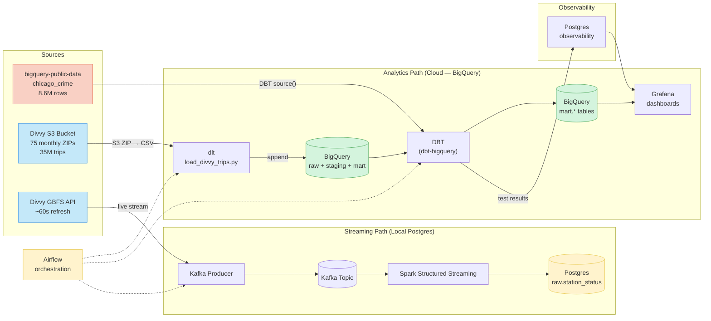
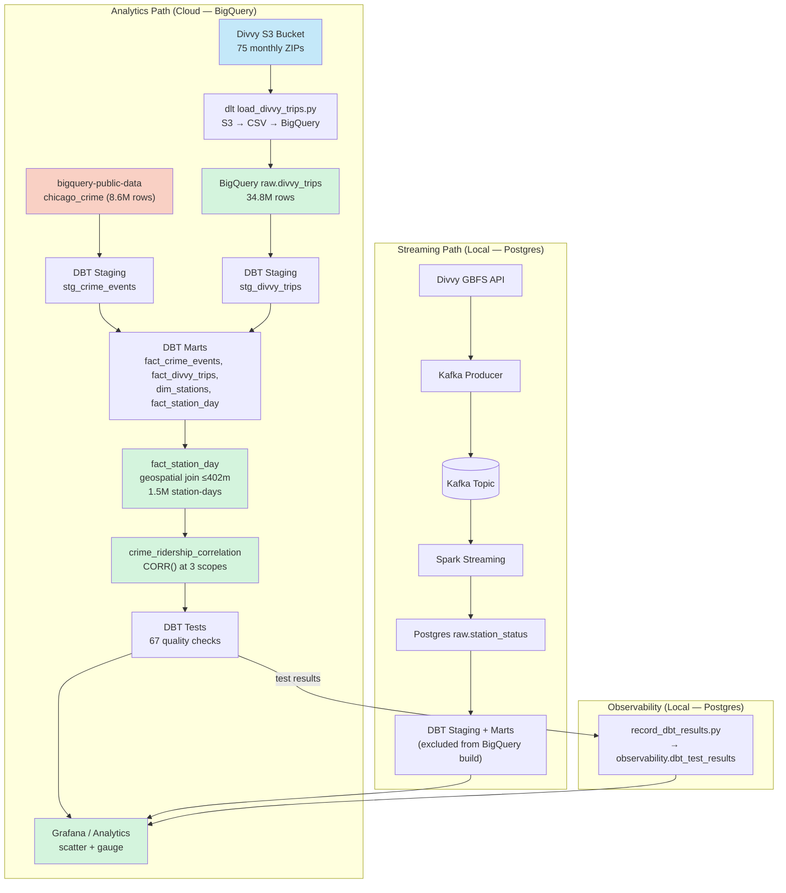

# Chicago Crime + Divvy Bike-Share Pipeline

A data engineering learning project that answers: **Does crime near a Divvy bike-share station affect ridership?**

## Stack

| Layer | Tool | Phase |
|---|---|---|
| Warehouse | Postgres (local, streaming + observability) + BigQuery (cloud, analytics) | 1 → 4 ✅ |
| Batch processing | Spark DataFrames | 1 ✅ |
| Streaming | Kafka + Spark Structured Streaming | 2 ✅ |
| Transformation | DBT (dbt-bigquery for analytics, dbt-postgres for stream) | 1+ ✅ |
| Orchestration | Airflow | 1+ ✅ |
| Observability | Grafana | 3 ✅ |
| Ingestion (cloud) | dlt (data load tool) | 4 ✅ (4.4) |
| Infra (cloud) | Terraform | 4 ✅ (4.2) |
| Containerization | Docker + Docker Compose | 1+ |
| CI/CD | GitHub Actions + GHCR | 5 |

## Data Sources

- **Chicago Crime** — `bigquery-public-data.chicago_crime.crime` (8.6M rows, 2001–present). Referenced directly in DBT — no ingestion needed. Filtered to 2018+ for Divvy overlap.
- **Divvy Trip History** — AWS S3 (`divvy-tripdata.s3.amazonaws.com`), monthly CSV ZIPs, 2020–present (~35M rows). Ingested via dlt into BigQuery `raw.divvy_trips`.
- **Divvy GBFS Live** — GBFS API, station status every ~60s ([feed](https://gbfs.divvybikes.com/gbfs.json)). Streamed via Kafka → Spark → local Postgres.

## Architecture




## Roadmap

```mermaid
graph LR
    P1["Phase 1<br/>Batch Foundation<br/>Postgres + Spark + DBT + Airflow"]
    P2["Phase 2<br/>Live Stream<br/>Kafka + Spark Streaming"]
    P3["Phase 3<br/>Observability<br/>Grafana + DBT Tests + SLAs"]
    P4["Phase 4<br/>Cloud Migration<br/>Terraform + BigQuery + dlt"]
    P5["Phase 5<br/>CI/CD Integration<br/>GitHub Actions + GHCR"]

    P1 -->|"✅ DONE: docker compose up<br/>DAG runs, marts queryable"| P2
    P2 -->|"✅ DONE: live Divvy data<br/>in Postgres via Kafka"| P3
    P3 -->|"✅ DONE: Grafana + DBT tests<br/>+ Airflow robustness verified"| P4
    P4 -->|"✅ DONE: GCP + Terraform + BigQuery<br/>+ dlt + correlation analysis<br/>Driving question answered"| P5

    style P1 fill:#d4f4dd,stroke:#4ca85a
    style P2 fill:#d4f4dd,stroke:#4ca85a
    style P3 fill:#d4f4dd,stroke:#4ca85a
    style P4 fill:#d4f4dd,stroke:#4ca85a
    style P5 fill:#f0f0f0,stroke:#999
```



## Progress

### Phase 1 — Batch Foundation

| Sub-Phase | Status | What was built |
|---|---|---|
| **1.1 Docker Compose** | **Complete** | 7 services: Postgres, Spark (master+worker), Airflow 3.0 (init+webserver+scheduler+dag-processor). All running and verified healthy. |
| **1.2 Ingestion** | **Complete** | Socrata API script downloads 2023 crime data (263K rows) to Parquet. Spark can read it from containers. |
| **1.3 Spark batch** | **Complete** | `crime_batch.py` — Parquet → clean → Postgres `raw.crime_events` (263K rows, 21 cols). Idempotent via `mode("overwrite")`. |
| **1.4 DBT models** | **Complete** | Staging view + 4 marts (dim_date, dim_community_area, dim_crime_type, fact_crime_events). 37/37 tests pass (20 standard + 11 dbt-expectations). |
| **1.5 Airflow DAG** | **Complete** | `crime_batch_dag.py` — download → clear_dbt_schemas → spark → dbt_build. All 4 tasks succeed (163s total). Separate dbt Docker image (protobuf conflict with Airflow). |
| **1.6 Phase 1 verification** | **Complete** | Cold start → DAG run → 4 tasks succeed → marts queryable (263,394 fact rows). **Phase 1 gate passed.** |

**Phase 1: DONE.** `docker compose up` → trigger DAG → 4 tasks succeed → DBT marts queryable. Verified 2026-07-13.

### Phase 2 — Live Stream

| Sub-Phase | Status | What was built |
|---|---|---|
| **2.1 GBFS data source** | **Complete** | Explored Divvy GBFS feeds. 4 design-changing findings: station_id is mixed UUID+numeric (must stay string), is_* fields are int 0/1 (not bool), scooter fields optional, dead station filtering needed. |
| **2.2 Kafka + Zookeeper** | **Complete** | Confluent Platform 7.6.0. Zookeeper mode (not KRaft). Two listeners: kafka:9092 (Docker) + localhost:29092 (host). 3 partitions for station_status topic. |
| **2.3 Kafka producer** | **Complete** | `divvy_producer.py` — polls GBFS every 60s, publishes ~2,016 station statuses as JSON to Kafka. `--once` mode for testing. kafka-python 3.0.8. |
| **2.4 Spark streaming** | **Complete** | `divvy_stream.py` — Structured Streaming: readStream Kafka → from_json → cast types → filter stale (44%) → foreachBatch → Postgres `raw.station_status`. 4 Kafka connector JARs baked into Spark image. Checkpoint volume for offset persistence. |
| **2.5 DBT stream models** | **Complete** | `stg_station_status` (dedup on Kafka partition+offset) + `fact_station_reads` (one row per station poll, date_key FK, derived total_vehicles_available). `dim_date` expanded to span both crime (2023) + station (2026) dates. 59/59 tests pass. |
| **2.6 Airflow stream DAG** | **Complete** | `divvy_stream_dag.py` — 7-task lifecycle: create_topic → start_producer (--once) → start_stream → wait_for_data → dbt_build → stop_stream → stop_producer. All tasks succeed. 2,001 rows in fact_station_reads. |

**Phase 2: DONE.** `docker compose up` → trigger divvy_stream DAG → Kafka → Spark streaming → Postgres → DBT marts queryable. Verified 2026-07-16.

See `docs/phases/` for phase-completion documents with architecture diagrams, errors hit, and verification.

### Phase 3 — Observability

| Sub-Phase | Status | What was built |
|---|---|---|
| **3.1 Grafana** | **Complete** | `grafana/grafana:12.4.0` service (port 3000, anonymous Viewer). Two Postgres datasources provisioned via YAML (`chicago-analytics` + `airflow-metadata`). Two dashboards provisioned via JSON: Pipeline Health (11 panels — row counts, stream freshness, DBT test outcomes, failed tasks, Airflow DAG runs) + Crime + Divvy Analysis (6 panels — top crime areas, crime types, station availability heatmap, crime-vs-ridership proxy). All 16 panel queries verified against live data. 4 errors hit: Go-template env var syntax, env vars not in container after restart, cross-database query failure, `jsonData.database` missing (browser panels showed "No data"). |
| **3.2 DBT tests** | **Complete** | Singular bounds test `assert_crime_in_chicago_bounds.sql` (lat 41.64–42.03, lon -87.95–-87.52). `record_dbt_results.py` recorder parses `run_results.json`, upserts into `observability.dbt_test_results` (new schema). `record_dbt_results` task added to both DAGs. Grafana DBT panel (id 8) rewired from static `SELECT 59` to live query (passing/failing/warnings). 52 tests, all pass. 2 errors: dbt 1.11 has no `resource_type` field (identify tests by `unique_id` prefix), Grafana JSON malformed from incremental edits. |
| **3.3 Airflow robustness** | **Complete** | `SqlSensor` (`wait_for_stream_data`) in crime_batch — gates `dbt_build` on `raw.station_status` existing (fixes race condition with divvy_stream). `on_failure_callback` (shared `callbacks.py`) logs structured failure context. `retries=3` + `retry_delay=5min` on all non-cleanup tasks. `execution_timeout=30min` on `dbt_build` (Airflow 3.0 removed SLA feature — `sla=` is a no-op). `retries=0` on cleanup tasks. `AIRFLOW_CONN_POSTGRES_DEFAULT` env var for sensor's Postgres connection. Grafana "Failed tasks" panel (id 11). 3 errors: SqlSensor success callback receives row not cursor, SLA removed in 3.0, stuck DAG run blocked new runs. |
| **3.4 Verification** | **Complete** | Broke pipeline 3 ways, confirmed observability catches all: (1) stopped producer → Grafana freshness panel red at 1195s > 900s threshold; (2) injected bad crime row (lat=45, lon=-100) → 2 DBT bounds tests failed → Grafana DBT panel red (failing=2); (3) throwaway DAG with `exit 1` → 4 attempts (1+3 retries) → on_failure_callback logged → Grafana failed-tasks panel red. Pipeline restored after each test. **Phase 3 gate passed.** |

**Phase 3: DONE.** Grafana dashboards + DBT tests + Airflow robustness all verified. Phase 3 gate met (break pipeline → observability catches it). Verified 2026-07-20.

### Phase 4 — Cloud Migration

| Sub-Phase | Status | What was built |
|---|---|---|
| **4.1 GCP Project Setup** | **Complete** | Chose BigQuery (free tier, serverless, DBT first-class). Created GCP project `chicago-divvy-pipeline` (ID `480666653891`), linked billing, enabled APIs (BigQuery, Storage, Resource Manager). Created service account `terraform-runner` with 4 scoped roles (NOT owner). Downloaded key to `~/chicago-divvy-pipeline-credentials.json` (gitignored, chmod 644). 3 errors: gcloud doesn't expand `~`, PowerShell line continuation differs, beta components not installed. |
| **4.2 Terraform** | **Complete** | `terraform/` with providers.tf (Google provider v7.40.0), variables.tf, main.tf (3 resources: `google_bigquery_dataset.raw`, `google_bigquery_dataset.mart`, `google_storage_bucket.data_lake`). `terraform init`/`plan`/`apply` successful. Verified: `bq ls` → raw+mart, `gsutil ls` → bucket. 3 errors: WSL gcloud separate auth state, `~` not expanded (again), least-privilege SA can't list APIs (expected). |
| **4.3 Architecture Change** | **Complete** | Rewired batch pipeline from Postgres to GCS/BigQuery. Spark writes Parquet to GCS (was Postgres JDBC). New `bq_load_crime` Airflow task (GCS → BigQuery via `bq load`). DBT switched to `dbt-bigquery==1.12.0` with SQL dialect fixes (`DISTINCT ON`→`QUALIFY`, `generate_series`→`GENERATE_DATE_ARRAY`, `::type`→`SAFE_CAST`). `dim_date` now crime-only (dropped station_status UNION). Streaming stays on Postgres (`--exclude stg_station_status fact_station_reads`). Full DAG run: all 5 tasks succeed, 263,403 rows in BigQuery, 38/38 DBT tests pass. 6 errors: Docker credential helper, stale Airflow image, bq CLI auth, credentials file permissions, DBT `--exclude` parsing, Socrata timeout. |
| **4.4 Divvy Trip History + Correlation** | **Complete** | Ingested 34.8M Divvy trips from S3 into BigQuery via **dlt** (replaced Airbyte — lightweight Python library, no extra containers). Switched crime source to `bigquery-public-data.chicago_crime` (8.6M rows, 2018+). Built 5 new DBT models: `stg_divvy_trips`, `dim_stations` (ST_GEOGPOINT), `fact_divvy_trips` (partitioned), `fact_station_day` (geospatial join ≤402m, 1.5M rows), `crime_ridership_correlation` (CORR() at 3 scopes). Partition pruning verified: 97.8% bytes saved. Grafana scatter plot + correlation gauge. **67/67 DBT tests pass.** 7 errors: stale Airflow image, Missouri/Montreal coordinate data errors, missing `primary_type` in cluster_by, missing FROM clause, CTE column name mismatch, stale dim_date. |

**Phase 4: DONE.** The driving question is answered: overall Pearson correlation = **+0.20** (weak positive — both crime and ridership are higher in busy areas). See [Findings](#findings) below. Verified 2026-07-22.

## Phased Build

1. **Batch foundation** — Postgres + Spark batch + DBT marts + Airflow DAG ✅
2. **Live stream** — Divvy GBFS → Kafka → Spark Structured Streaming → Postgres ✅
3. **Observability** — Grafana dashboards, DBT tests, Airflow robustness ✅
4. **Cloud migration** — Terraform → BigQuery + GCS + dlt ingestion + correlation analysis ✅
5. **CI/CD integration** — GitHub Actions, branch protection, PR checks, versioned releases

Each phase is a working system before the next begins. See `AGENTS.md` for phase gates.

## Findings — Does Crime Near a Divvy Station Affect Ridership?

**Overall Pearson correlation: r = +0.20** (n = 1,463,049 station-days)

The correlation is **weakly positive** — stations with more crime nearby also tend to have more trips. This does **not** mean crime causes ridership. The confounding variable is **urban activity level**: busy areas have more people, more bikes, and more crime.

### What the data shows

| Scope | Correlation | Interpretation |
|---|---|---|
| **Overall** | r = +0.20 | Weak positive. Both crime and ridership are higher in dense, busy areas. |
| **Per-month range** | 0.08 – 0.31 | Lowest during COVID lockdown (Apr 2020: r=0.08). Trended upward to ~0.25–0.30 in 2024–2025 as the city normalized. |
| **Per-station range** | NaN – +0.85 | Most stations show weak positive correlation. A few show strong positive (busy downtown stations). NaN = zero variance in crime count (no crimes nearby on most days). |

### Methodology

- **Data:** 34.8M Divvy trips (2020-04 to 2026-06) + 8.6M crime events (2018+, from `bigquery-public-data.chicago_crime`)
- **Unit of analysis:** station-day (one row per station per day — 1.5M rows)
- **Crime proximity:** crimes within 402 meters (0.25 mile) of the station, counted per day via `ST_DISTANCE` geospatial join
- **Correlation:** `CORR(trip_count, crime_count_within_quarter_mile)` at overall, per-station (≥30 days), and per-month (≥30 station-days) scope
- **Limitations:** No control for confounding variables (population density, day of week, seasonality, weather). Pearson correlation measures linear relationship only. A proper causal analysis would require regression with controls or BigQuery ML.

### Grafana visualization

The `crime_divvy_analysis` dashboard has two new panels:
- **Panel 7 (scatter plot):** trip_count vs crime_count_within_quarter_mile for the last 30 days
- **Panel 8 (gauge):** overall Pearson correlation coefficient from `crime_ridership_correlation` mart

## Project Structure

```
chicago-data-pipeline/
├── .env.example              # env var template (copy to .env)
├── .gitignore
├── .vscode/
│   └── settings.json         # dbt Power User config (allowListFolders, Python path)
├── AGENTS.md                 # AI assistant rules + phase gates
├── README.md                 # this file
├── changelog.md              # errors, fixes, lessons (read before working)
├── chicago-pipeline-plan.md  # full phased design
├── docker-compose.yml        # 12 services: Postgres, Spark, Airflow, Kafka, Zookeeper, Grafana + GCP credentials + BigQuery plugin (Phase 4.4)
├── init.sql                  # Postgres init: 3 schemas + airflow DB
├── pyproject.toml            # uv project mode (host Python)
├── uv.lock                   # reproducible installs
├── terraform/                # Phase 4.2 — GCP infra as code
│   ├── providers.tf          # Google provider v7.40.0, auths via SA key
│   ├── variables.tf          # 4 inputs (project_id, region, location, credentials_path)
│   ├── main.tf               # 3 resources: 2 BigQuery datasets + 1 GCS bucket
│   ├── terraform.tfvars      # gitignored — actual values
│   └── terraform.tfvars.example  # template
├── airflow/
│   ├── Dockerfile            # Airflow 3.0 + Docker CLI + gcloud SDK (bq CLI) + pip install as airflow user
│   ├── passwords.json        # SimpleAuthManager passwords
│   ├── requirements.txt      # postgres + docker providers + kafka-python + google-cloud-bigquery + dlt[bigquery]
│   ├── dags/
│   │   ├── crime_batch_dag.py     # Phase 4.4 — simplified to 2 tasks: dbt_build → record_results (crime from public dataset)
│   │   ├── divvy_stream_dag.py    # Phase 2.6 — streaming lifecycle DAG
│   │   ├── divvy_trip_history_dag.py # Phase 4.4 — 3 tasks: load_divvy_trips → dbt_build → record_results
│   │   └── callbacks.py           # Phase 3.3 — shared on_failure_callback
│   ├── scripts/
│   │   └── record_dbt_results.py  # Phase 3.2 — parses dbt run_results.json → observability.dbt_test_results
│   └── dbt_profiles/profiles.yml  # Phase 4.3 — BigQuery adapter (service-account key auth)
├── spark/
│   ├── Dockerfile            # apache/spark:3.5.1 + JDBC + Kafka connector (4 JARs) + GCS connector + entrypoint
│   ├── entrypoint.sh         # chowns checkpoint volume, drops to spark via gosu
│   └── jobs/
│       ├── crime_batch.py    # Phase 4.3 — Spark batch: Parquet → clean → GCS Parquet (was Postgres)
├── ingestion/
│   ├── download_crime.py     # Socrata API → Parquet (Phase 1.2, legacy — crime now from public dataset)
│   └── load_divvy_trips.py   # Phase 4.4 — dlt S3→BigQuery ingestion (--month/--from/--to/--all/--dry-run)
├── kafka/                    # Phase 2.3
│   └── producers/
├── grafana/                  # Phase 3.1 + 4.4 — observability dashboards
│   ├── provisioning/
│   │   ├── datasources/postgres.yml  # 2 Postgres datasources (chicago-analytics + airflow-metadata)
│   │   ├── datasources/bigquery.yml  # Phase 4.4 — BigQuery datasource (bigquery-analytics)
│   │   └── dashboards/dashboards.yml # dashboard provider (scans every 30s)
│   └── dashboards/
│       ├── pipeline_health.json      # 11-panel pipeline health dashboard
│       └── crime_divvy_analysis.json # 8-panel crime + Divvy analysis dashboard (scatter + correlation gauge added Phase 4.4)
├── dbt/                      # DBT transformation project (Phase 4.3 — dbt-bigquery)
│   ├── Dockerfile             # dbt-bigquery==1.12.0 (was dbt-postgres==1.10.2)
│   ├── dbt_project.yml       # model config, materialization, schema mapping
│   ├── profiles.yml          # BigQuery connection (gitignored — has keyfile path)
│   ├── packages.yml          # dbt-expectations 0.10.10
│   ├── macros/
│   │   ├── try_cast.sql      # warehouse-portable cast macro (Postgres + BigQuery branches)
│   │   └── generate_schema_name.sql  # override schema concatenation
│   │   ├── staging/
│   │   │   ├── stg_crime_events.sql      # Phase 4.4 — reads from bigquery-public-data.chicago_crime (was raw.crime_events)
│   │   │   ├── stg_divvy_trips.sql       # Phase 4.4 — staging for Divvy trips from raw.divvy_trips
│   │   │   ├── stg_station_status.sql    # Phase 2.5 — excluded from BigQuery build (--exclude)
│   │   │   └── schema.yml
│   │   └── marts/
│   │       ├── dim_date.sql              # Phase 4.4 — spans crime + Divvy dates (2018–2026)
│   │       ├── dim_community_area.sql    # Phase 4.3 — CAST AS INT64/STRING
│   │       ├── dim_crime_type.sql
│   │       ├── dim_stations.sql          # Phase 4.4 — station dimension with ST_GEOGPOINT
│   │       ├── fact_crime_events.sql     # Phase 4.4 — partitioned by date_key, clustered by community_area_id + primary_type
│   │       ├── fact_divvy_trips.sql      # Phase 4.4 — partitioned by started_at, clustered by start_station_id
│   │       ├── fact_station_day.sql      # Phase 4.4 — THE analytics mart: geospatial join ≤402m, 1.5M rows
│   │       ├── fact_station_reads.sql    # Phase 2.5 — excluded from BigQuery build (--exclude)
│   │       ├── crime_ridership_correlation.sql # Phase 4.4 — CORR() at overall/per_station/per_month scope
│   │       └── schema.yml
│   ├── tests/
│   │   └── assert_crime_in_chicago_bounds.sql  # Phase 3.2 — singular bounds test
│   └── seeds/
│       └── community_areas.csv  # 77 community areas from Chicago Data Portal
├── data/                     # Parquet output (gitignored)
│   └── raw/crime/crime_2023.parquet  # 263K rows, 11.5 MB
├── chat-history/             # conversation reference (read current-state.md first)
│   ├── README.md
│   ├── current-state.md      # handoff doc for new sessions
│   └── 2026-07-*/            # date-sorted topic chunks
└── docs/
    ├── knowledge/               # reference: one file per topic (index.md for directory)
    │   ├── gcp.md              # Phase 4.1+4.3 — GCP auth, bq CLI vs Python, BigQuery SQL dialect
    │   ├── terraform.md        # Phase 4.2 — Terraform concepts, workflow, errors
    │   ├── dlt.md              # Phase 4.4 — dlt reference + why we switched from Airbyte
    │   ├── data-sources.md     # Chicago Crime, Divvy GBFS, Divvy S3 trip history
    │   └── ...                 # wsl, uv, docker-compose, postgres, dbt, spark, kafka, airflow, git, grafana, architecture
    ├── learning-protocol.md       # Socratic mode rules
    ├── operations-performed.md    # audit trail of what was built
    ├── phases/                    # phase-completion docs (one per sub-phase)
    │   ├── README.md
    │   ├── TEMPLATE.md
    │   ├── phase-1.1-docker.md through phase-1.6-verification.md
    │   ├── phase-2.1-gbfs-data-source.md through phase-2.6-airflow-stream-dag.md
    │   ├── phase-3.1-grafana.md through phase-3.4-verification.md
    │   └── phase-4.1-gcp-setup.md through phase-4.4-divvy-trip-history.md  # Phase 4 completion docs
    └── conventions/
        ├── airflow.md
        ├── dbt.md
        ├── docker.md
        └── spark.md

## Getting Started

### Prerequisites

- Docker Desktop with WSL2 backend
- WSL2 (Ubuntu) — project lives on the WSL filesystem (`~/chicago-data-pipeline/`)
- [uv](https://docs.astral.sh/uv/) installed on host
- **GCP account** (Phase 4+) — service account key at `~/chicago-divvy-pipeline-credentials.json`. See `docs/knowledge/gcp.md` for setup. Required for BigQuery + GCS access.

### First run

```bash
# 1. Clone and enter
git clone <repo-url> && cd chicago-data-pipeline

# 2. Copy env template and fill in values
cp .env.example .env

# 3. Set passwords.json permissions (SimpleAuthManager needs write access)
chmod 666 airflow/passwords.json

# 4. Build custom images (Airflow + Spark)
docker compose build

# 5. Start all services
docker compose up -d

# 6. Verify all services are healthy
docker compose ps -a
```

### Accessing services

| Service | URL | Login |
|---|---|---|
| Airflow UI | http://localhost:8080 | admin / admin |
| Spark Master UI | http://localhost:8180 | — |
| Spark Worker UI | http://localhost:8081 | — |
| Postgres | localhost:5432 | chicago / (from .env) |
| Kafka (host) | localhost:29092 | — |
| Grafana UI | http://localhost:3000 | admin / admin (anonymous Viewer enabled) |

### Host Python (for dev scripts)

```bash
source .venv/bin/activate    # activate uv venv
uv sync                      # install deps from lockfile
```

### Useful commands

```bash
docker compose logs -f airflow-webserver   # tail logs
docker compose exec postgres psql -U chicago -d chicago_analytics  # psql shell
docker compose down                        # stop (preserves data)
docker compose down -v                     # stop + WIPE all data
```
### Running the pipeline (via Airflow)

**Phase 4.4 change:** The `crime_batch` DAG was simplified to 2 tasks: `dbt_build` → `record_dbt_results` (crime now sourced from `bigquery-public-data.chicago_crime` directly — no download/spark/bq_load needed). The `divvy_trip_history` DAG runs 3 tasks: `load_divvy_trips` (dlt S3→BigQuery) → `dbt_build_divvy` → `record_dbt_results`. The `divvy_stream` DAG runs independently against local Postgres.

**Prerequisites:** GCP credentials at `~/chicago-divvy-pipeline-credentials.json` (chmod 644), `.env` with GCP vars (`GCP_CREDENTIALS_PATH`, `GCP_PROJECT_ID`, `GCS_BUCKET`, `BIGQUERY_LOCATION`).

```bash
# 1. Start all services
docker compose up -d

# 2. Wait for services to be healthy (~90s)
docker compose ps -a

# 3. Trigger crime_batch DAG (DBT build against BigQuery public crime + raw.divvy_trips)
docker exec chicago-data-pipeline-airflow-scheduler-1 airflow dags trigger crime_batch

# 4. Trigger divvy_trip_history DAG (dlt S3 → BigQuery → DBT)
docker exec chicago-data-pipeline-airflow-scheduler-1 airflow dags trigger divvy_trip_history

# 5. (Optional) Trigger divvy_stream DAG (streaming pipeline → local Postgres)
docker exec chicago-data-pipeline-airflow-scheduler-1 airflow dags trigger divvy_stream

# 6. Query BigQuery correlation results
bq query --use_legacy_sql=false "SELECT * FROM \`chicago-divvy-pipeline.mart.crime_ridership_correlation\` WHERE scope='overall'"

# 7. Query local Postgres marts (streaming)
docker compose exec postgres psql -U chicago -d chicago_analytics -c "SELECT COUNT(*) FROM mart.fact_station_reads;"
```

The crime_batch DAG runs 2 tasks: dbt_build → record_dbt_results (~2 min total).
The divvy_trip_history DAG runs 3 tasks: load_divvy_trips → dbt_build_divvy → record_dbt_results (varies by months loaded).
The divvy_stream DAG runs 8 tasks: create_topic → start_producer → start_stream → wait_for_data → dbt_build → record_dbt_results → stop_stream → stop_producer (~60s total).

### Running pipeline steps manually (for debugging)

# 1. Load Divvy trips from S3 → BigQuery via dlt (single month or all)
docker exec chicago-data-pipeline-airflow-scheduler-1 python /opt/airflow/ingestion/load_divvy_trips.py --month 202306
docker exec chicago-data-pipeline-airflow-scheduler-1 python /opt/airflow/ingestion/load_divvy_trips.py --all

# 2. Run DBT: seed + staging + marts + tests (against BigQuery)
#    Crime comes from bigquery-public-data.chicago_crime (no ingestion needed)
cd dbt && dbt build --profiles-dir . --exclude stg_station_status fact_station_reads

# 3. Query the correlation result
bq query --use_legacy_sql=false "SELECT * FROM \`chicago-divvy-pipeline.mart.crime_ridership_correlation\` WHERE scope='overall'"
```

## Documentation

| Doc | What it covers |
|---|---|
| `AGENTS.md` | AI assistant rules, phase gates, tech stack |
| `changelog.md` | Every error hit, root cause, and fix |
| `docs/knowledge/` | Reference: one file per topic — commands, syntax, architecture diagrams, Airflow 2.x vs 3.x comparison. See `index.md` for directory. |
| `docs/operations-performed.md` | Audit trail: what files were created and why |
| `docs/learning-protocol.md` | How the AI assistant interacts with you (Socratic mode) |
| `docs/phases/` | Phase-completion docs with architecture, errors, and verification |
| `chat-history/current-state.md` | Handoff doc — read first in a new session |
| `chicago-pipeline-plan.md` | Full phased design and plan |
# Phase 5 CI/CD
