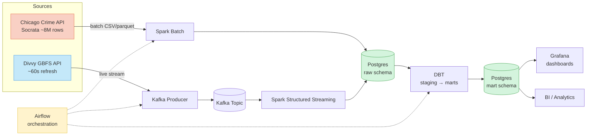
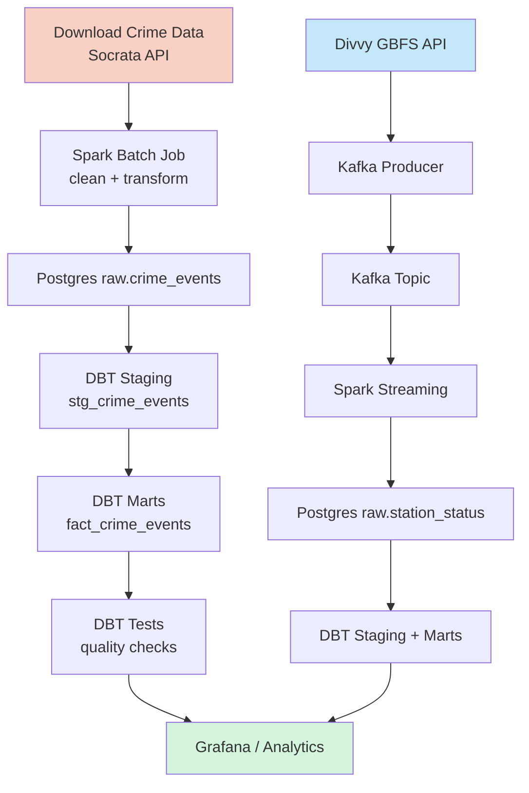
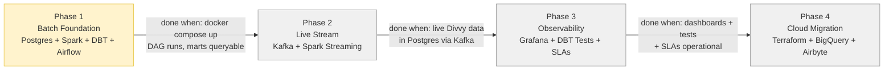

# Chicago Crime + Divvy Bike-Share Pipeline

A data engineering learning project that answers: **Does crime near a Divvy bike-share station affect ridership?**

## Stack

| Layer | Tool | Phase |
|---|---|---|
| Warehouse | Postgres (local) → BigQuery (cloud) | 1 → 4 |
| Batch processing | Spark DataFrames | 1 |
| Streaming | Kafka + Spark Structured Streaming | 2 |
| Transformation | DBT | 1+ |
| Orchestration | Airflow | 1+ |
| Observability | Grafana | 3 |
| Ingestion (cloud) | Airbyte | 4 |
| Infra (cloud) | Terraform | 4 |
| Containerization | Docker + Docker Compose | 1+ |

## Data Sources

- **Chicago Crime** — Socrata API, ~8M rows, daily batch drops ([data portal](https://data.cityofchicago.org/Public-Safety/Crimes-2001-to-Present/ijzp-q4t2))
- **Divvy Bike Share** — GBFS live API, station status every ~60s ([feed](https://gbfs.divvybikes.com/gbfs/gbfs.json))

## Architecture



## Pipeline Flow



## Roadmap



> **Status:** Phase 1 — planning complete, implementation not started

## Phased Build

1. **Batch foundation** — Postgres + Spark batch + DBT marts + Airflow DAG
2. **Live stream** — Divvy GBFS → Kafka → Spark Structured Streaming → Postgres
3. **Observability** — Grafana dashboards, DBT tests, Airflow SLAs
4. **Cloud migration** — Terraform → BigQuery + GCS, Airbyte ingestion

Each phase is a working system before the next begins.

## Project Structure

```
chicago-data-pipeline/
├── docker-compose.yml
├── ingestion/          # Socrata + GBFS data pull
├── spark/              # batch + streaming jobs
├── kafka/              # Divvy producer
├── airflow/            # DAGs
├── dbt/                # staging → intermediate → marts
├── grafana/            # dashboards (Phase 3)
├── terraform/          # cloud infra (Phase 4)
└── docs/               # conventions + learning protocol
```

## Getting Started

```bash
cp .env.example .env    # fill in credentials
docker compose up -d    # start all services
```

See `chicago-pipeline-plan.md` for the full design and `docs/` for engineering conventions.
