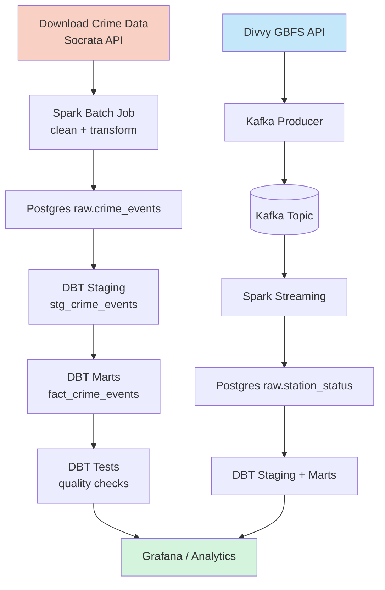

# Chicago Crime + Divvy Bike-Share Pipeline

A data engineering learning project that answers: **Does crime near a Divvy bike-share station affect ridership?**

## Stack

| Layer | Tool | Phase |
|---|---|---|
| Warehouse | Postgres (local) → BigQuery (cloud) | 1 → 4 |
| Batch processing | Spark DataFrames | 1 ✅ |
| Streaming | Kafka + Spark Structured Streaming | 2 ✅ |
| Transformation | DBT | 1+ |
| Orchestration | Airflow | 1+ |
| Observability | Grafana | 3 |
| Ingestion (cloud) | Airbyte | 4 |
| Infra (cloud) | Terraform | 4 |
| Containerization | Docker + Docker Compose | 1+ |
| CI/CD | GitHub Actions + GHCR | 5 |

## Data Sources

- **Chicago Crime** — Socrata API, ~8M rows, daily batch drops ([data portal](https://data.cityofchicago.org/Public-Safety/Crimes-2001-to-Present/ijzp-q8t2))
- **Divvy Bike Share** — GBFS live API, station status every ~60s ([feed](https://gbfs.divvybikes.com/gbfs.json))

## Architecture


## Pipeline Flow



## Roadmap

```mermaid
graph LR
    P1["Phase 1<br/>Batch Foundation<br/>Postgres + Spark + DBT + Airflow"]
    P2["Phase 2<br/>Live Stream<br/>Kafka + Spark Streaming"]
    P3["Phase 3<br/>Observability<br/>Grafana + DBT Tests + SLAs"]
    P4["Phase 4<br/>Cloud Migration<br/>Terraform + BigQuery + Airbyte"]
    P5["Phase 5<br/>CI/CD Integration<br/>GitHub Actions + GHCR"]

    P1 -->|"✅ DONE: docker compose up<br/>DAG runs, marts queryable"| P2
    P2 -->|"✅ DONE: live Divvy data<br/>in Postgres via Kafka"| P3
    P3 -->|"done when: dashboards + tests<br>+ SLAs operational"| P4
    P4 -->|"done when: Terraform + BigQuery<br>+ Airbyte operational"| P5

    style P1 fill:#d4f4dd,stroke:#4ca85a
    style P2 fill:#d4f4dd,stroke:#4ca85a
    style P3 fill:#f0f0f0,stroke:#999
    style P4 fill:#f0f0f0,stroke:#999
    style P5 fill:#f0f0f0,stroke:#999
```



## Progress

### Phase 1 — Batch Foundation

| Sub-Phase | Status | What was built |
|---|---|---|
| **1.1 Docker Compose** | **Complete** | 7 services: Postgres, Spark (master+worker), Airflow 3.0 (init+webserver+scheduler+dag-processor). All running and verified healthy. |
| **1.2 Ingestion** | **Complete** | Socrata API script downloads 2023 crime data (263K rows) to Parquet. Spark can read it from containers. |
| **1.3 Spark batch** | **Complete** | `crime_batch.py` — Parquet → clean → Postgres `raw.crime_events` (263K rows, 21 cols). Idempotent via `mode("overwrite")`. |
| **1.4 DBT models** | **Complete** | Staging view + 4 marts (dim_date, dim_community_area, dim_crime_type, fact_crime_events). 37/37 tests pass (20 standard + 11 dbt-expectations). |
| **1.5 Airflow DAG** | **Complete** | `crime_batch_dag.py` — download → clear_dbt_schemas → spark → dbt_build. All 4 tasks succeed (163s total). Separate dbt Docker image (protobuf conflict with Airflow). |
| **1.6 Phase 1 verification** | **Complete** | Cold start → DAG run → 4 tasks succeed → marts queryable (263,394 fact rows). **Phase 1 gate passed.** |

**Phase 1: DONE.** `docker compose up` → trigger DAG → 4 tasks succeed → DBT marts queryable. Verified 2026-07-13.

### Phase 2 — Live Stream

| Sub-Phase | Status | What was built |
|---|---|---|
| **2.1 GBFS data source** | **Complete** | Explored Divvy GBFS feeds. 4 design-changing findings: station_id is mixed UUID+numeric (must stay string), is_* fields are int 0/1 (not bool), scooter fields optional, dead station filtering needed. |
| **2.2 Kafka + Zookeeper** | **Complete** | Confluent Platform 7.6.0. Zookeeper mode (not KRaft). Two listeners: kafka:9092 (Docker) + localhost:29092 (host). 3 partitions for station_status topic. |
| **2.3 Kafka producer** | **Complete** | `divvy_producer.py` — polls GBFS every 60s, publishes ~2,016 station statuses as JSON to Kafka. `--once` mode for testing. kafka-python 3.0.8. |
| **2.4 Spark streaming** | **Complete** | `divvy_stream.py` — Structured Streaming: readStream Kafka → from_json → cast types → filter stale (44%) → foreachBatch → Postgres `raw.station_status`. 4 Kafka connector JARs baked into Spark image. Checkpoint volume for offset persistence. |
| **2.5 DBT stream models** | **Complete** | `stg_station_status` (dedup on Kafka partition+offset) + `fact_station_reads` (one row per station poll, date_key FK, derived total_vehicles_available). `dim_date` expanded to span both crime (2023) + station (2026) dates. 59/59 tests pass. |
| **2.6 Airflow stream DAG** | **Complete** | `divvy_stream_dag.py` — 7-task lifecycle: create_topic → start_producer (--once) → start_stream → wait_for_data → dbt_build → stop_stream → stop_producer. All tasks succeed. 2,001 rows in fact_station_reads. |

**Phase 2: DONE.** `docker compose up` → trigger divvy_stream DAG → Kafka → Spark streaming → Postgres → DBT marts queryable. Verified 2026-07-16.

See `docs/phases/` for phase-completion documents with architecture diagrams, errors hit, and verification.

### Phase 3 — Observability

| Sub-Phase | Status | What was built |
|---|---|---|
| **3.1 Grafana** | **Complete** | `grafana/grafana:12.4.0` service (port 3000, anonymous Viewer). Two Postgres datasources provisioned via YAML (`chicago-analytics` + `airflow-metadata`). Two dashboards provisioned via JSON: Pipeline Health (10 panels — row counts, stream freshness, Airflow DAG runs) + Crime + Divvy Analysis (6 panels — top crime areas, crime types, station availability heatmap, crime-vs-ridership proxy). All 16 panel queries verified against live data. 4 errors hit: Go-template env var syntax, env vars not in container after restart, cross-database query failure, `jsonData.database` missing (browser panels showed "No data"). |

**Phase 3: IN PROGRESS.** 3.1 Grafana done. 3.2 DBT tests next. See `docs/phases/phase-3.1-grafana.md`.

## Phased Build

1. **Batch foundation** — Postgres + Spark batch + DBT marts + Airflow DAG
2. **Live stream** — Divvy GBFS → Kafka → Spark Structured Streaming → Postgres
3. **Observability** — Grafana dashboards, DBT tests, Airflow SLAs
4. **Cloud migration** — Terraform → BigQuery + GCS, Airbyte ingestion
5. **CI/CD integration** — GitHub Actions, branch protection, PR checks, versioned releases

Each phase is a working system before the next begins. See `AGENTS.md` for phase gates.

## Project Structure

```
chicago-data-pipeline/
├── .env.example              # env var template (copy to .env)
├── .gitignore
├── .vscode/
│   └── settings.json         # dbt Power User config (allowListFolders, Python path)
├── AGENTS.md                 # AI assistant rules + phase gates
├── README.md                 # this file
├── changelog.md              # errors, fixes, lessons (read before working)
├── chicago-pipeline-plan.md  # full phased design
├── docker-compose.yml        # 11 services: Postgres, Spark, Airflow, Kafka, Zookeeper, Grafana + spark_checkpoints + grafana_data volumes
├── init.sql                  # Postgres init: 3 schemas + airflow DB
├── pyproject.toml            # uv project mode (host Python)
├── uv.lock                   # reproducible installs
├── airflow/
│   ├── Dockerfile            # Airflow 3.0 + Docker CLI + pip install as airflow user (kafka-python)
│   ├── passwords.json        # SimpleAuthManager passwords
│   ├── requirements.txt      # postgres + docker providers + ingestion deps + kafka-python
│   ├── dags/
│   │   ├── crime_batch_dag.py     # Phase 1.5 — batch pipeline DAG
│   │   └── divvy_stream_dag.py    # Phase 2.6 — streaming lifecycle DAG
│   └── dbt_profiles/profiles.yml
├── spark/
│   ├── Dockerfile            # apache/spark:3.5.1 + JDBC + Kafka connector (4 JARs) + entrypoint
│   ├── entrypoint.sh         # chowns checkpoint volume, drops to spark via gosu
│   └── jobs/
│       ├── crime_batch.py    # Spark batch ETL: Parquet → clean → Postgres (Phase 1.3)
│       └── divvy_stream.py   # Spark Structured Streaming: Kafka → Postgres (Phase 2.4)
├── ingestion/
│   └── download_crime.py     # Socrata API → Parquet (Phase 1.2)
├── kafka/                    # Phase 2.3
│   └── producers/
│       └── divvy_producer.py # GBFS → Kafka producer (--once mode for Airflow)
├── grafana/                  # Phase 3.1 — observability dashboards
│   ├── provisioning/
│   │   ├── datasources/postgres.yml  # 2 Postgres datasources (chicago-analytics + airflow-metadata)
│   │   └── dashboards/dashboards.yml # dashboard provider (scans every 30s)
│   └── dashboards/
│       ├── pipeline_health.json      # 10-panel pipeline health dashboard
│       └── crime_divvy_analysis.json # 6-panel crime + Divvy analysis dashboard
├── dbt/                      # DBT transformation project
│   ├── Dockerfile             # separate dbt image (protobuf conflict with Airflow 3.0)
│   ├── dbt_project.yml       # model config, materialization, schema mapping
│   ├── profiles.yml          # Postgres connection (gitignored — has password)
│   ├── packages.yml          # dbt-expectations 0.10.10
│   ├── macros/
│   │   ├── try_cast.sql      # warehouse-portable cast macro
│   │   └── generate_schema_name.sql  # override schema concatenation
│   ├── models/
│   │   ├── staging/
│   │   │   ├── stg_crime_events.sql      # view: rename, cast, dedup
│   │   │   ├── stg_station_status.sql    # Phase 2.5 — dedup on Kafka coordinates
│   │   │   └── schema.yml
│   │   └── marts/
│   │       ├── dim_date.sql              # spans both crime (2023) + station (2026) dates
│   │       ├── dim_community_area.sql
│   │       ├── dim_crime_type.sql
│   │       ├── fact_crime_events.sql
│   │       ├── fact_station_reads.sql    # Phase 2.5 — one row per station poll
│   │       └── schema.yml
│   └── seeds/
│       └── community_areas.csv  # 77 community areas from Chicago Data Portal
├── data/                     # Parquet output (gitignored)
│   └── raw/crime/crime_2023.parquet  # 263K rows, 11.5 MB
├── chat-history/             # conversation reference (read current-state.md first)
│   ├── README.md
│   ├── current-state.md      # handoff doc for new sessions
│   └── 2026-07-*/            # date-sorted topic chunks
└── docs/
    ├── knowledge/               # reference: one file per topic (index.md for directory)
    ├── learning-protocol.md       # Socratic mode rules
    ├── operations-performed.md    # audit trail of what was built
    ├── phases/                    # phase-completion docs (one per sub-phase)
    │   ├── README.md
    │   ├── TEMPLATE.md
    │   ├── phase-1.1-docker.md through phase-1.6-verification.md
    │   ├── phase-2.1-gbfs-data-source.md through phase-2.5-dbt-stream-models.md
    │   └── phase-2.6-airflow-stream-dag.md
    └── conventions/
        ├── airflow.md
        ├── dbt.md
        ├── docker.md
        └── spark.md

## Getting Started

### Prerequisites

- Docker Desktop with WSL2 backend
- WSL2 (Ubuntu) — project lives on the WSL filesystem (`~/chicago-data-pipeline/`)
- [uv](https://docs.astral.sh/uv/) installed on host

### First run

```bash
# 1. Clone and enter
git clone <repo-url> && cd chicago-data-pipeline

# 2. Copy env template and fill in values
cp .env.example .env

# 3. Set passwords.json permissions (SimpleAuthManager needs write access)
chmod 666 airflow/passwords.json

# 4. Build custom images (Airflow + Spark)
docker compose build

# 5. Start all services
docker compose up -d

# 6. Verify all services are healthy
docker compose ps -a
```

### Accessing services

| Service | URL | Login |
|---|---|---|
| Airflow UI | http://localhost:8080 | admin / admin |
| Spark Master UI | http://localhost:8180 | — |
| Spark Worker UI | http://localhost:8081 | — |
| Postgres | localhost:5432 | chicago / (from .env) |
| Kafka (host) | localhost:29092 | — |
| Grafana UI | http://localhost:3000 | admin / admin (anonymous Viewer enabled) |

### Host Python (for dev scripts)

```bash
source .venv/bin/activate    # activate uv venv
uv sync                      # install deps from lockfile
```

### Useful commands

```bash
docker compose logs -f airflow-webserver   # tail logs
docker compose exec postgres psql -U chicago -d chicago_analytics  # psql shell
docker compose down                        # stop (preserves data)
docker compose down -v                     # stop + WIPE all data
```
### Running the pipeline (via Airflow)

**Important:** On a cold start, run `divvy_stream` **first**, then `crime_batch`. The `crime_batch` DAG's `dbt_build` task runs `dbt build` which builds **ALL** models, including `stg_station_status` (the stream staging model) which depends on `raw.station_status`. That table is created by the `divvy_stream` DAG. If `divvy_stream` hasn't run yet, `crime_batch`'s `dbt_build` fails on try 1 (succeeds on retry after `divvy_stream` completes — a race condition). Running `divvy_stream` first eliminates the race: `raw.station_status` exists before `crime_batch`'s `dbt_build` runs.

```bash
# 1. Start all services
docker compose up -d

# 2. Wait for services to be healthy (~90s)
docker compose ps -a

# 3. Trigger divvy_stream DAG FIRST (streaming pipeline creates raw.station_status)
docker exec chicago-data-pipeline-airflow-scheduler-1 airflow dags trigger divvy_stream

# 4. Wait for it to finish, then trigger crime_batch DAG (batch pipeline)
docker exec chicago-data-pipeline-airflow-scheduler-1 airflow dags trigger crime_batch

# 5. Query marts
docker compose exec postgres psql -U chicago -d chicago_analytics -c "SELECT COUNT(*) FROM mart.fact_crime_events;"
docker compose exec postgres psql -U chicago -d chicago_analytics -c "SELECT COUNT(*) FROM mart.fact_station_reads;"
```

The divvy_stream DAG runs 7 tasks: create_topic → start_producer → start_stream → wait_for_data → dbt_build → stop_stream → stop_producer (~60s total).
The crime_batch DAG runs 4 tasks: download_crime → clear_dbt_schemas → spark_crime_batch → dbt_build (~163s total).

### Running pipeline steps manually (for debugging)

```bash
# 1. Download crime data from Socrata API → Parquet (host Python)
source .venv/bin/activate
python ingestion/download_crime.py --year 2023

# 2. Run Spark batch job: Parquet → clean → Postgres raw.crime_events
docker compose exec spark-master /opt/spark/bin/spark-submit --master local[*] /opt/spark/jobs/crime_batch.py

# 3. Run DBT: seed + staging + marts + tests (from inside dbt/ dir)
cd dbt && dbt build --profiles-dir .
```

## Documentation

| Doc | What it covers |
|---|---|
| `AGENTS.md` | AI assistant rules, phase gates, tech stack |
| `changelog.md` | Every error hit, root cause, and fix |
| `docs/knowledge/` | Reference: one file per topic — commands, syntax, architecture diagrams, Airflow 2.x vs 3.x comparison. See `index.md` for directory. |
| `docs/operations-performed.md` | Audit trail: what files were created and why |
| `docs/learning-protocol.md` | How the AI assistant interacts with you (Socratic mode) |
| `docs/phases/` | Phase-completion docs with architecture, errors, and verification |
| `chat-history/current-state.md` | Handoff doc — read first in a new session |
| `chicago-pipeline-plan.md` | Full phased design and plan |
