# Chicago Crime + Divvy Bike-Share Pipeline


A data engineering learning project that answers: **Does crime near a Divvy bike-share station affect ridership?**

## Answer

**Overall Pearson correlation: r = +0.20** (n = 1,463,049 station-days)

The correlation is **weakly positive** — stations with more crime nearby also tend to have more trips. This does **not** mean crime causes ridership. The confounding variable is **urban activity level**: busy areas have more people, more bikes, and more crime.

A BigQuery ML linear regression controlling for station, day of week, and month confirms this: the crime coefficient is **+1.45** (positive), with in-sample R² = 0.434.

## Tech Stack

| Layer | Tool | Phase |
|---|---|---|
| Warehouse | Postgres (local: streaming + observability) + BigQuery (cloud: analytics) | 1 → 4 |
| Batch processing | Spark DataFrames | 1 |
| Streaming | Kafka + Spark Structured Streaming | 2 |
| Transformation | DBT (dbt-bigquery for analytics, dbt-postgres for stream) | 1+ |
| Orchestration | Airflow 3.0 | 1+ |
| Observability | Grafana | 3 |
| Ingestion (cloud) | dlt (data load tool) | 4 |
| Infra (cloud) | Terraform | 4 |
| Containerization | Docker + Docker Compose | 1+ |
| CI/CD | GitHub Actions + GHCR | 5 |

## Data Sources

- **Chicago Crime** — `bigquery-public-data.chicago_crime.crime` (8.6M rows, 2001–present). Referenced directly in DBT. Filtered to 2018+ for Divvy overlap.
- **Divvy Trip History** — AWS S3 (`divvy-tripdata.s3.amazonaws.com`), monthly CSV ZIPs, 2020–present (~35M rows). Ingested via dlt into BigQuery `raw.divvy_trips`.
- **Divvy GBFS Live** — GBFS API, station status every ~60s. Streamed via Kafka → Spark → local Postgres.

## Architecture

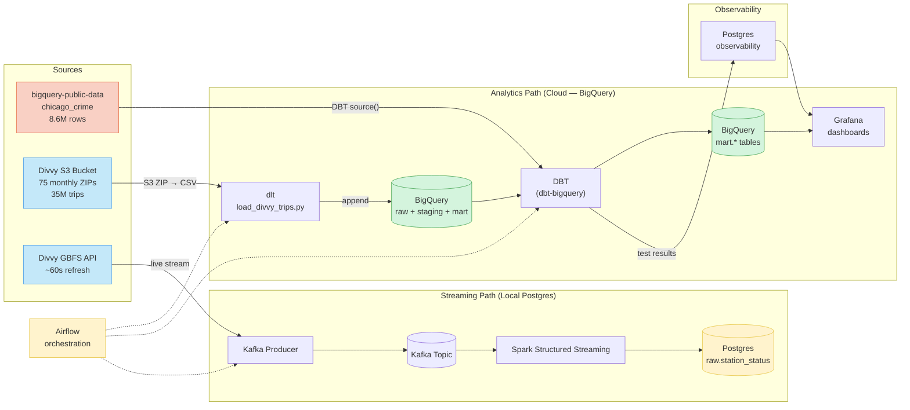

## Pipeline Screenshots

### Airflow — DAG Orchestration

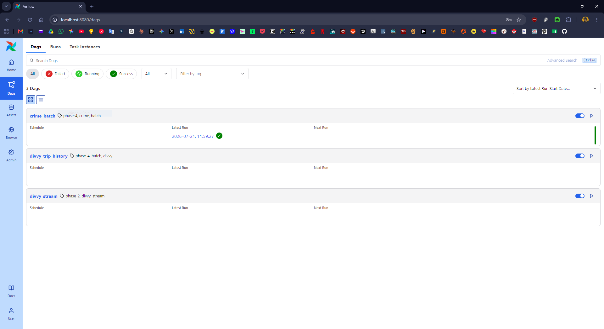

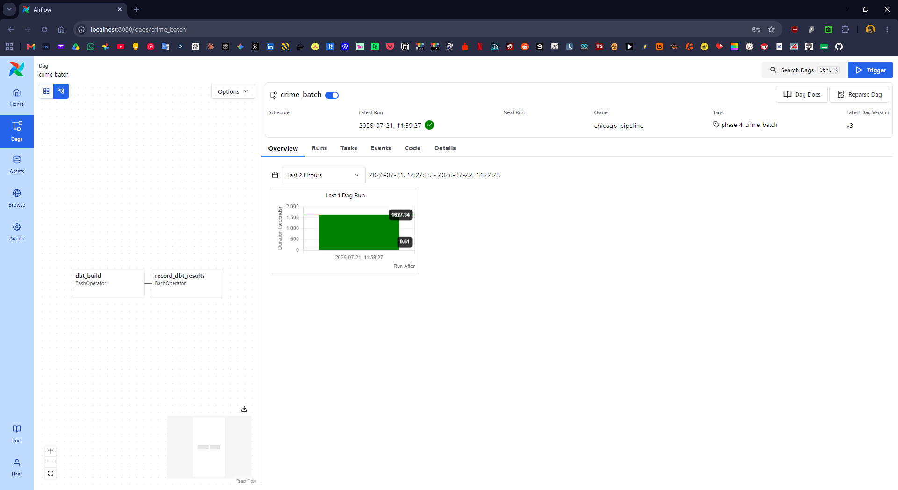

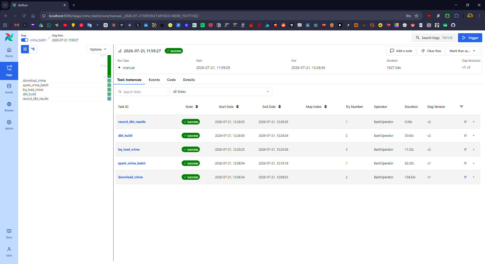

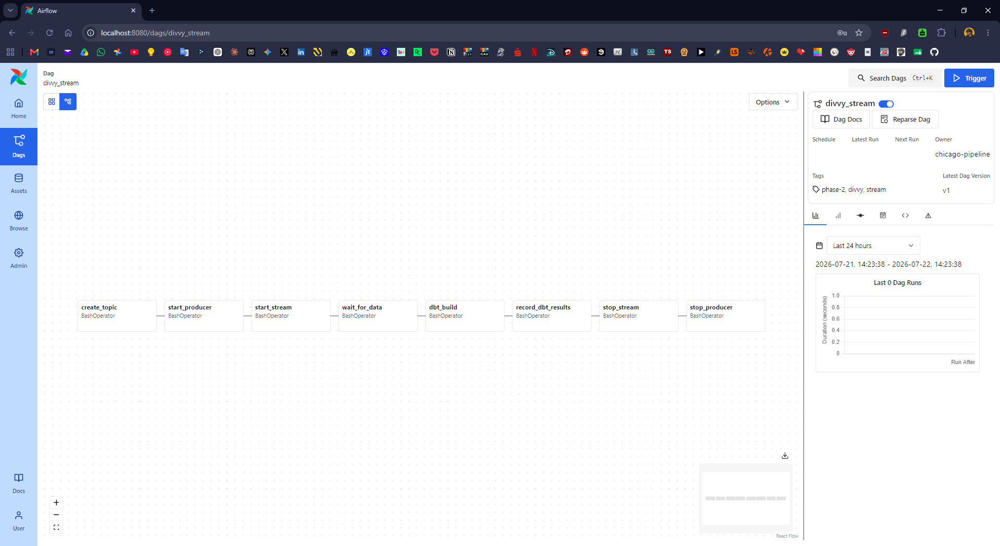

### Spark — Batch Processing

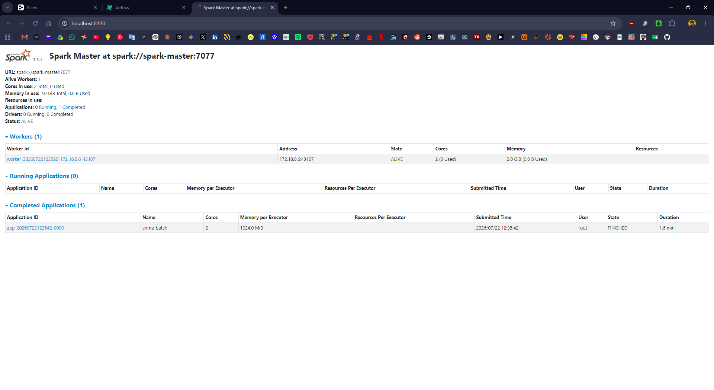

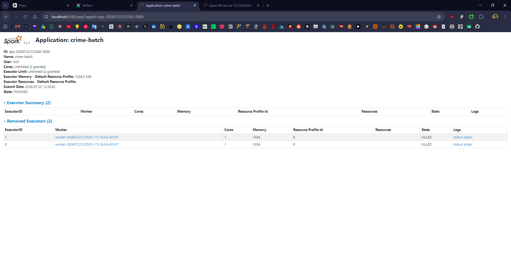

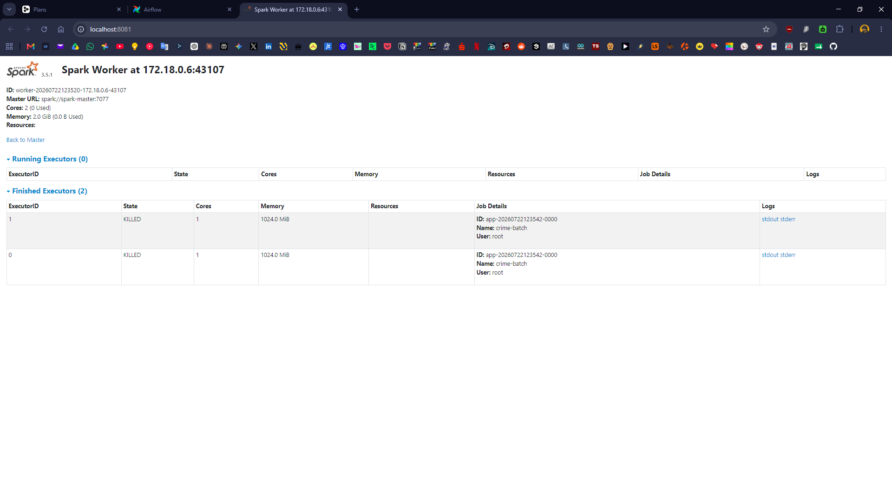

### DBT — Model Lineage

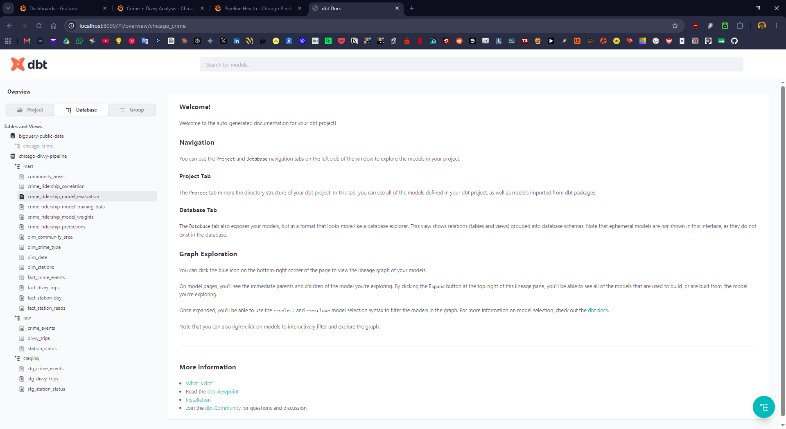

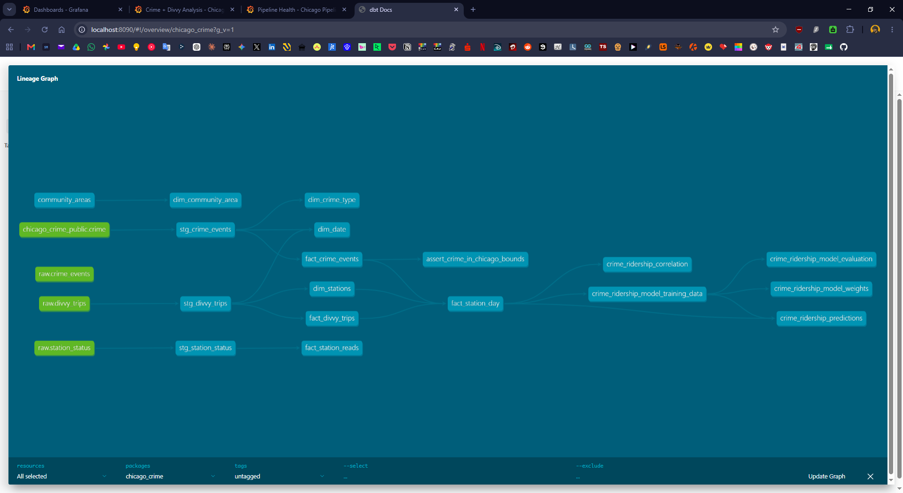

### Grafana — Observability Dashboards

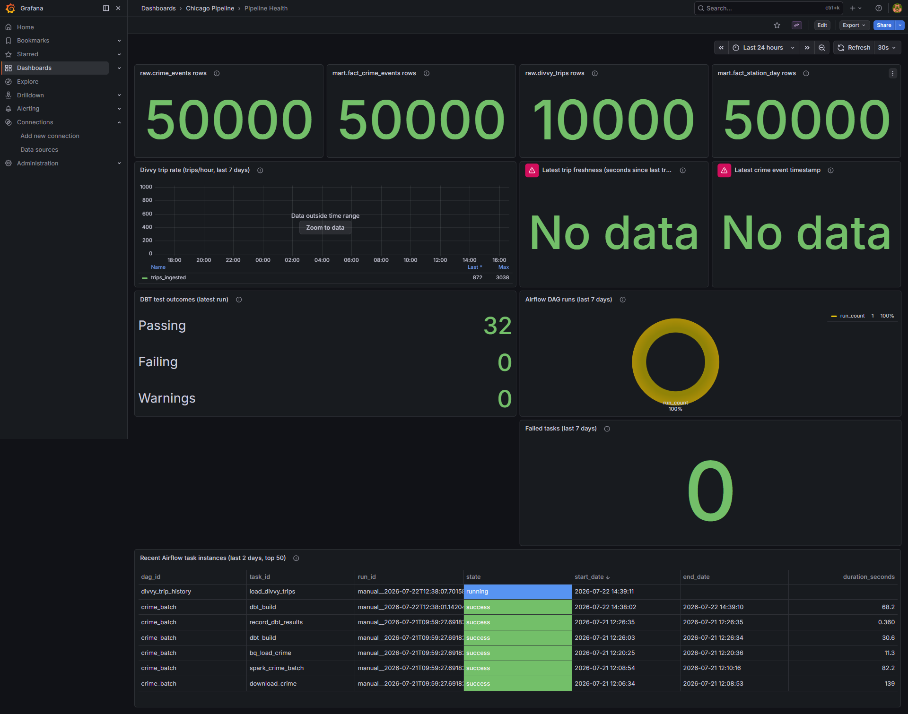

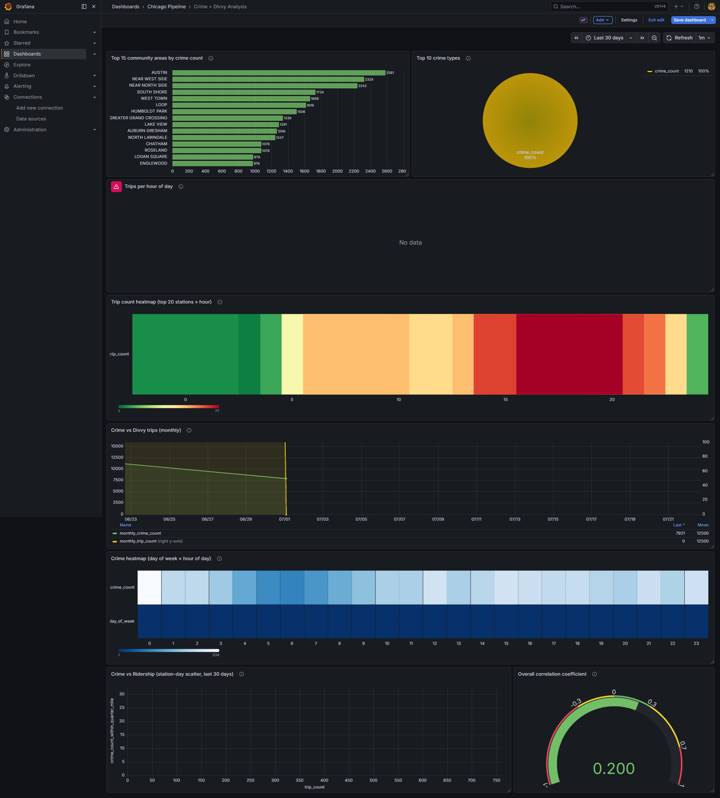

### BigQuery — Analytics + BQML

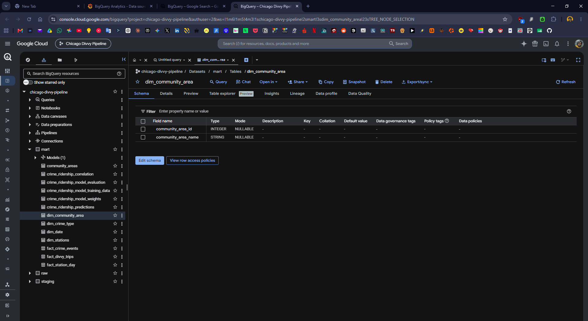

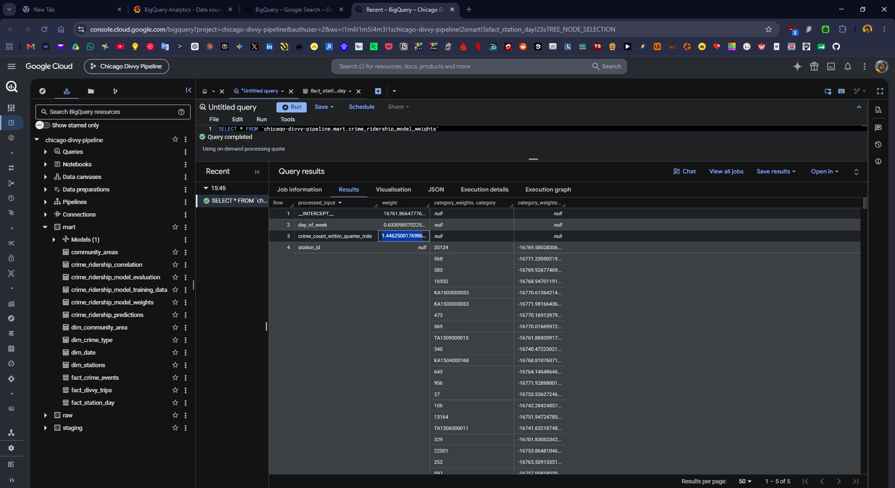

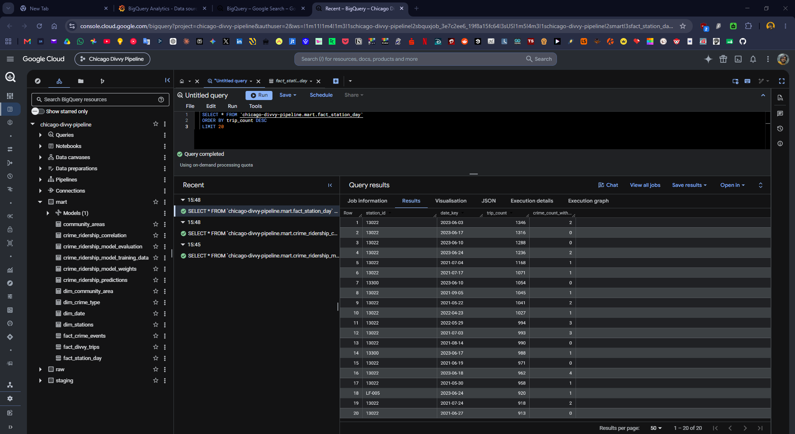

### GitHub — CI/CD

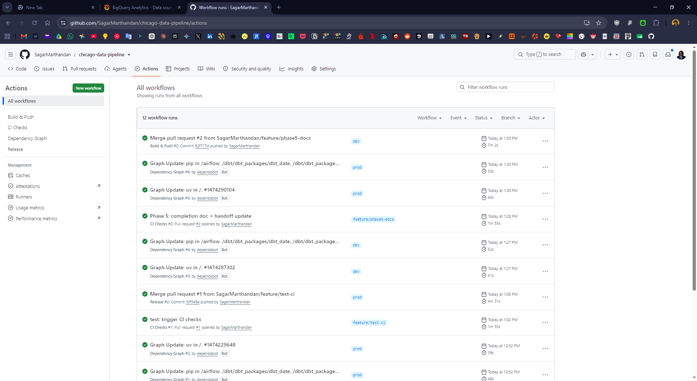

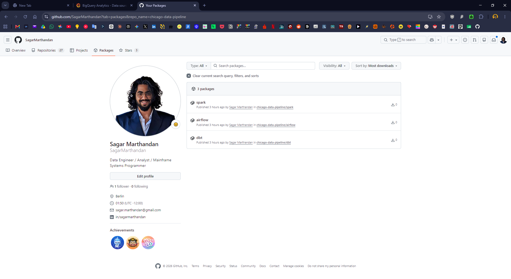

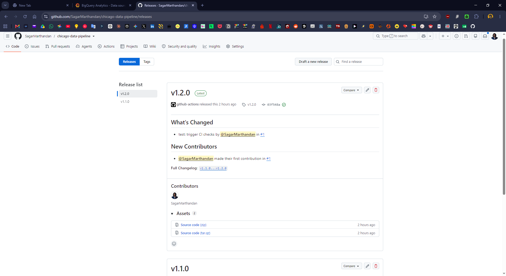

## Project Structure

```
chicago-data-pipeline/
├── .env.example              # env var template (copy to .env)
├── .github/                  # Phase 5 — CI/CD workflows
│   ├── workflows/
│   │   ├── ci.yml            # PR checks: ruff, dbt parse, compose validate, build
│   │   ├── build.yml         # dev push → build + push images to GHCR
│   │   └── release.yml       # prod push → semantic version tag + GitHub Release
│   └── ci/
│       └── profiles.yml      # CI-safe dbt profiles (dummy keyfile for dbt parse)
├── AGENTS.md                 # AI assistant rules + phase gates
├── CHANGELOG.md              # errors, fixes, lessons (read before working)
├── README.md                 # this file
├── docker-compose.yml        # 12 services: Postgres, Spark, Airflow, Kafka, Zookeeper, Grafana
├── init.sql                  # Postgres init: 3 schemas + airflow DB
├── pyproject.toml            # uv project mode + ruff config
├── uv.lock                   # reproducible installs
├── terraform/                # Phase 4.2 — GCP infra as code
│   ├── providers.tf          # Google provider v7.40.0
│   ├── variables.tf          # 4 inputs (project_id, region, location, credentials_path)
│   ├── main.tf               # 3 resources: 2 BigQuery datasets + 1 GCS bucket
│   └── terraform.tfvars.example
├── airflow/
│   ├── Dockerfile            # Airflow 3.0 + Docker CLI + gcloud SDK + pip install as airflow user
│   ├── passwords.json        # SimpleAuthManager passwords
│   ├── requirements.txt      # postgres + docker providers + kafka-python + google-cloud-bigquery + dlt[bigquery]
│   ├── dags/
│   │   ├── crime_batch_dag.py     # dbt_build → record_results (crime from public dataset)
│   │   ├── divvy_stream_dag.py    # streaming lifecycle DAG (7 tasks)
│   │   ├── divvy_trip_history_dag.py # load_divvy_trips → dbt_build → record_results
│   │   └── callbacks.py           # shared on_failure_callback
│   ├── scripts/
│   │   └── record_dbt_results.py  # parses dbt run_results.json → observability.dbt_test_results
│   └── dbt_profiles/profiles.yml  # BigQuery adapter (service-account key auth)
├── spark/
│   ├── Dockerfile            # apache/spark:3.5.1 + JDBC + Kafka connector (4 JARs) + GCS connector
│   ├── entrypoint.sh         # chowns checkpoint volume, drops to spark via gosu
│   └── jobs/
│       ├── crime_batch.py    # Spark batch: Parquet → clean → GCS Parquet
│       └── divvy_stream.py   # Spark Structured Streaming: Kafka → Postgres
├── ingestion/
│   ├── download_crime.py     # Socrata API → Parquet (legacy — crime now from public dataset)
│   └── load_divvy_trips.py   # dlt S3→BigQuery ingestion (--month/--from/--to/--all/--dry-run)
├── kafka/
│   └── producers/
│       └── divvy_producer.py # polls GBFS every 60s, publishes to Kafka topic
├── grafana/                  # observability dashboards
│   ├── provisioning/
│   │   ├── datasources/      # 2 Postgres datasources (analytics + airflow metadata)
│   │   └── dashboards/       # dashboard provider config
│   └── dashboards/
│       ├── pipeline_health.json      # 11-panel pipeline health dashboard
│       └── crime_divvy_analysis.json # 8-panel crime + Divvy analysis dashboard
├── dbt/                      # DBT transformation project (dbt-bigquery)
│   ├── Dockerfile            # dbt-bigquery==1.12.0
│   ├── dbt_project.yml       # model config, materialization, schema mapping
│   ├── profiles.yml          # BigQuery connection (gitignored)
│   ├── packages.yml          # dbt-expectations 0.10.10
│   ├── macros/
│   │   ├── try_cast.sql      # warehouse-portable cast macro
│   │   └── generate_schema_name.sql
│   ├── models/
│   │   ├── staging/          # stg_crime_events, stg_divvy_trips, stg_station_status
│   │   └── marts/            # dim_date, dim_community_area, dim_crime_type, dim_stations,
│   │                        # fact_crime_events, fact_divvy_trips, fact_station_day,
│   │                        # fact_station_reads, crime_ridership_correlation,
│   │                        # crime_ridership_model_* (BQML)
│   ├── tests/
│   │   └── assert_crime_in_chicago_bounds.sql
│   └── seeds/
│       └── community_areas.csv
└── docs/
    ├── index.md              # navigation entry point
    ├── chicago-pipeline-plan.md  # full phased design
    ├── learning-protocol.md  # AI assistant interaction rules
    ├── phase/                # consolidated phase docs (phase-1.md through phase-5.md)
    ├── wiki/                 # technology reference + commands + conventions
    └── chat-history/         # daily conversation logs + current-state.md handoff
```

## Getting Started

### Prerequisites

- Docker Desktop with WSL2 backend
- WSL2 (Ubuntu) — project lives on the WSL filesystem
- [uv](https://docs.astral.sh/uv/) installed on host
- GCP account with service account key (for BigQuery + GCS access)

### First run

```bash
# 1. Clone and enter
git clone <repo-url> && cd chicago-data-pipeline

# 2. Copy env template and fill in values
cp .env.example .env

# 3. Set passwords.json permissions
chmod 666 airflow/passwords.json

# 4. Build custom images (Airflow + Spark + dbt)
docker compose build

# 5. Start all services
docker compose up -d

# 6. Verify all services are healthy
docker compose ps -a
```

### Accessing services

| Service | URL | Login |
|---|---|---|
| Airflow UI | http://localhost:8080 | admin / admin |
| Spark Master UI | http://localhost:8180 | — |
| Spark Worker UI | http://localhost:8081 | — |
| Postgres | localhost:5432 | chicago / (from .env) |
| Kafka (host) | localhost:29092 | — |
| Grafana UI | http://localhost:3000 | admin / admin |

### Running the pipeline

```bash
# Start all services
docker compose up -d

# Trigger DAGs via Airflow
docker exec chicago-data-pipeline-airflow-scheduler-1 airflow dags trigger crime_batch
docker exec chicago-data-pipeline-airflow-scheduler-1 airflow dags trigger divvy_trip_history
docker exec chicago-data-pipeline-airflow-scheduler-1 airflow dags trigger divvy_stream

# Query BigQuery correlation results
bq query --use_legacy_sql=false "SELECT * FROM \`chicago-divvy-pipeline.mart.crime_ridership_correlation\` WHERE scope='overall'"
```

## Documentation

| Doc | What it covers |
|---|---|
| [docs/phase/](docs/phase/) | Consolidated phase docs (1–5): what was built, scripts, errors, fixes, mermaid diagrams |
| [docs/wiki/](docs/wiki/) | Technology reference: commands, syntax, architecture diagrams, conventions |
| [docs/chat-history/](docs/chat-history/) | Daily conversation logs + `current-state.md` handoff doc |
| [docs/chicago-pipeline-plan.md](docs/chicago-pipeline-plan.md) | Full phased design and plan |
| [CHANGELOG.md](CHANGELOG.md) | Every error hit, root cause, and fix |
| [AGENTS.md](AGENTS.md) | AI assistant rules, phase gates, tech stack |
