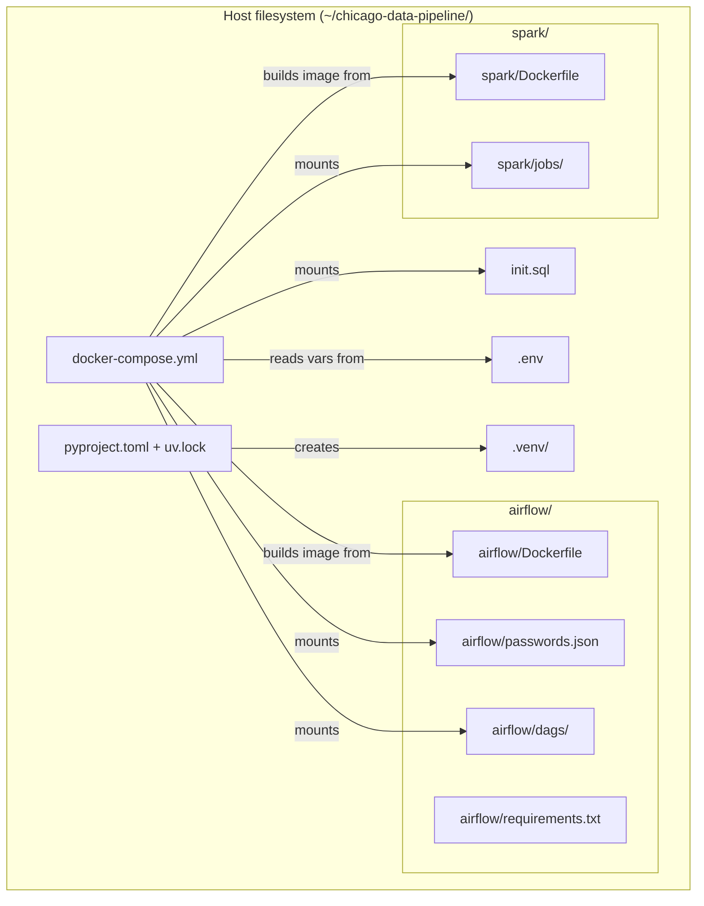
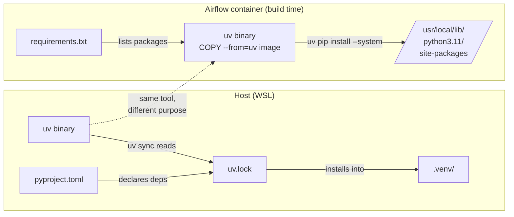
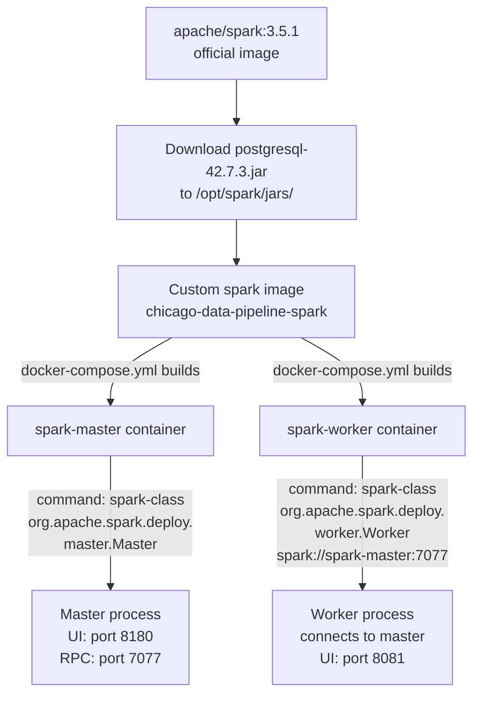
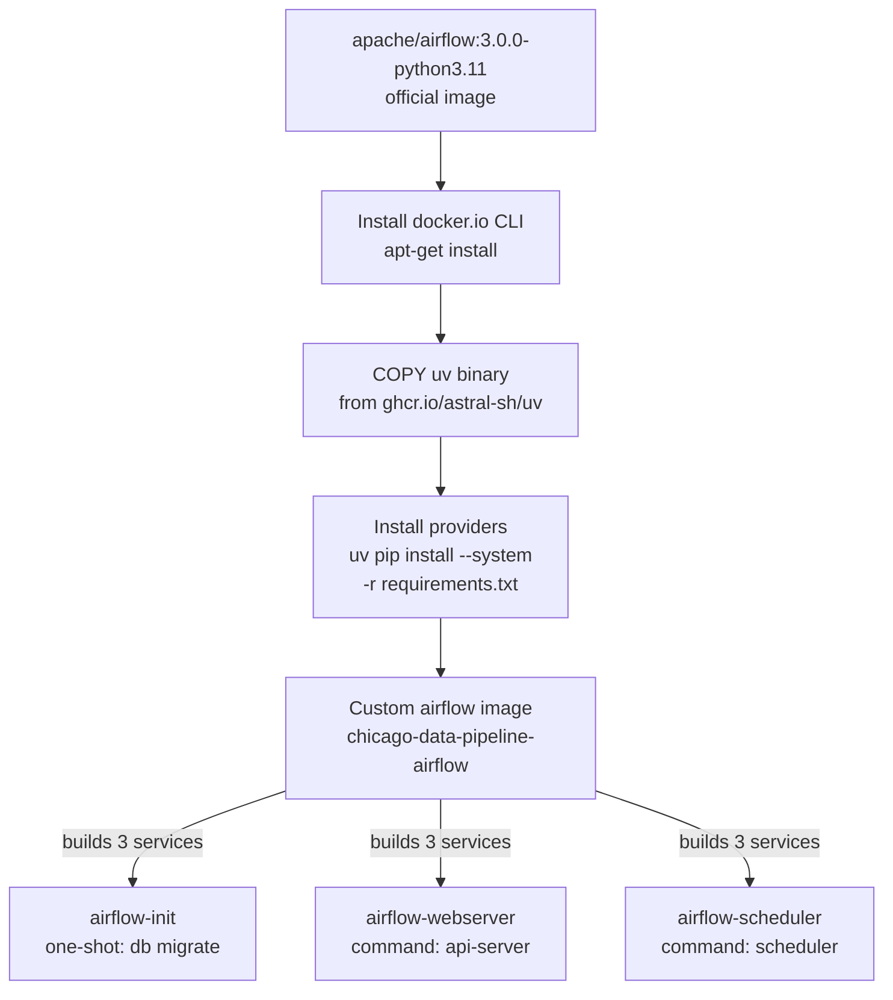
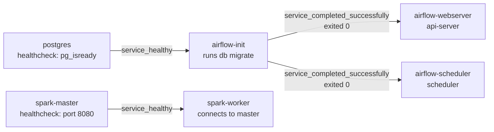

# Knowledge Base

Reference material, useful commands, and explanations accumulated throughout the project. Not a tutorial — a quick lookup for things you've already learned but might forget.

---

## WSL

### Useful Commands
```bash
# Check WSL version
wsl -l -v

# Access Windows files from WSL
ls /mnt/c/Users/sagar/

# Keep projects on WSL filesystem for performance (not /mnt/c/)
# Good:  ~/chicago-data-pipeline/
# Bad:   /mnt/c/Users/sagar/chicago-data-pipeline/
```

### Why WSL filesystem is faster
Cross-filesystem mounts (`/mnt/c/...`) go through the 9P protocol between WSL and Windows. File-heavy operations (Spark, Parquet I/O, git) are significantly slower. Keep the repo inside `~/` (WSL ext4 filesystem).

### Devin IDE + OMP sync
Devin IDE caches the file tree on open and doesn't watch for external changes. If you edit files via OMP, close and reopen Devin (or the affected file tabs) to see updates.

---

## uv (Python Package Manager)

### What is uv?
`uv` is a fast Python package manager by Astral. It handles virtual environment creation, dependency resolution, and package installation — 10-100x faster than pip. It's written in Rust.

### Host vs Container Python
This project has TWO Python environments:

| Where | Environment | Managed by | Purpose |
|---|---|---|---|
| Host (WSL) | `.venv/` (uv) | `pyproject.toml` + `uv.lock` | Running ingestion scripts, DBT dev, ad-hoc queries |
| Containers | Container Python | `airflow/requirements.txt`, `spark/Dockerfile` | Running services inside Docker |

The host venv is for **development and testing**. Containers have their own isolated Python.

### Docker + uv Relationship
uv manages host Python. Docker images have their own Python inside the container. They're independent — but we use uv **inside** Docker too, for faster builds.

```
Host (WSL)                    Containers
┌──────────────┐              ┌──────────────────────┐
│ uv + .venv   │              │ Container Python     │
│ pyproject.toml│   independent│ + uv (for fast pip)  │
│ uv.lock      │              │ + requirements.txt   │
└──────────────┘              └──────────────────────┘
```

**How uv is used in Docker:**
- `COPY --from=ghcr.io/astral-sh/uv:latest /uv /usr/local/bin/uv` — copies the uv binary from the official image (multi-stage copy, no install script needed)
- `uv pip install --system --no-cache-dir -r requirements.txt` — installs into the container's system Python

**Why `uv pip install --system` and NOT `uv sync`:**
- The host and containers need DIFFERENT packages. `uv sync` reads the root `uv.lock` which has host deps (dbt-core, sodapy, etc.) — not what the Airflow container needs.
- `uv pip install --system -r airflow/requirements.txt` installs only container-specific deps, using uv's fast resolver.
- `--system` installs into the container's system Python (no venv needed inside containers).

### Setup (uv init — project mode)
```bash
# One-time: initialize project (creates pyproject.toml)
uv init --bare --name chicago-data-pipeline

# Add dependencies (updates pyproject.toml + uv.lock + installs)
uv add requests sodapy dbt-core dbt-postgres python-dotenv psycopg2-binary

# Each new terminal: activate the venv
source .venv/bin/activate

# Recreate venv from lockfile (e.g., after cloning on a new machine)
uv sync
```

### Common Commands
```bash
uv add <package>              # add a dependency (updates pyproject.toml + uv.lock)
uv remove <package>           # remove a dependency
uv sync                       # install exact versions from uv.lock (reproducible)
uv pip list                   # list installed packages
uv lock --upgrade             # update all packages to latest compatible versions
deactivate                    # exit venv
```

### Key Files
| File | Committed? | Purpose |
|---|---|---|
| `pyproject.toml` | Yes | Project metadata + dependency declarations (human-edited) |
| `uv.lock` | Yes | Exact versions + hashes for reproducible installs (machine-generated) |
| `.venv/` | No (gitignored) | The actual virtual environment with installed packages |

### uv venv vs uv init
| | `uv venv` (simple) | `uv init` (project mode) |
|---|---|---|
| Config file | `requirements.txt` | `pyproject.toml` |
| Lockfile | None | `uv.lock` (exact versions pinned) |
| Add dependency | Edit `requirements.txt` manually | `uv add <package>` (auto-updates toml + lock) |
| Reproducibility | Versions resolve at install time (can vary) | Lockfile guarantees identical installs |
| Install command | `uv pip install -r requirements.txt` | `uv sync` (reads lockfile) |
| Standard | Legacy (pip-compatible) | Modern Python standard (PEP 621) |

This project uses `uv init` (project mode) for reproducibility and modern tooling.

---

## Docker Compose

### Project Names
Compose derives the project name from the directory name by default. This affects:
- Network name: `<project>_default`
- Volume names: `<project>_<volume>`
- Container names: `<project>-<service>-1`

Set it explicitly in `.env`:
```bash
COMPOSE_PROJECT_NAME=chicago-data-pipeline
```

### Common Commands
```bash
docker compose up -d              # start all services (detached)
docker compose down               # stop and remove containers
docker compose down -v            # stop and remove containers + volumes (DESTRUCTIVE)
docker compose logs -f <service>  # tail logs for a service
docker compose exec <service> bash  # shell into a running container
docker compose ps                 # list running services
docker compose build              # rebuild images
```

### Networking Between Containers
- Use **service names** as hostnames, never `localhost`
- Spark → Postgres: `jdbc:postgresql://postgres:5432/chicago_analytics`
- Airflow → Postgres: `postgres:5432`
- Kafka producer → Kafka: `kafka:9092`
- From host (DBeaver, psql): `localhost:<published_port>`

### YAML Anchors
Share config across multiple services using `x-` extension fields:
```yaml
x-airflow-common: &airflow-common
  build: ./airflow
  environment:
    AIRFLOW__CORE__EXECUTOR: LocalExecutor
  volumes:
    - ./dags:/opt/airflow/dags

services:
  airflow-webserver:
    <<: *airflow-common    # merges the anchor
    ports:
      - "8080:8080"
  airflow-scheduler:
    <<: *airflow-common    # same config, no repetition
```
- `&name` creates the anchor, `<<: *name` merges it into a service
- The `x-` prefix tells Compose this is an extension field, not a service

### `depends_on` Conditions
```yaml
depends_on:
  postgres:
    condition: service_healthy          # waits until healthcheck passes
  airflow-init:
    condition: service_completed_successfully  # waits for one-shot init to exit 0
```
- `service_healthy` — for long-running services with healthchecks
- `service_completed_successfully` — for one-shot init/migration containers
- Without a condition, `depends_on` only waits for the container to start (not ready)

### `$$` vs `$` in Compose
- `$VAR` — Compose interpolates from `.env` at compose time
- `$$VAR` — escapes to literal `$VAR`, so the container's shell expands it at runtime
- Use `$$` when you need bash to read an env var that was set via the `environment:` block

### DockerOperator + docker.sock
Airflow's DockerOperator creates containers from inside the Airflow container. To do this, it needs:
1. **Docker CLI** installed in the Airflow image (official image doesn't include it)
2. **docker.sock mounted** — `/var/run/docker.sock:/var/run/docker.sock` bridges the Airflow container to the host's Docker daemon
3. **Network access** — `network_mode: "chicago-data-pipeline_default"` so the spawned container can reach Postgres

---

## How Everything Connects — Architecture Walkthrough

This section explains how every file in the repo connects to Docker, how uv links to containers, how Spark and Airflow images are built, and how docker-compose.yml ties it all together. Each subsection has its own focused diagram.

### The Big Picture (file → container mapping)



### 1. How uv Links to Docker

uv exists in **two places** — the host and inside the Airflow container — for different reasons:



**Host uv** manages your development Python:
- `pyproject.toml` declares what packages you need (sodapy, dbt-core, etc.)
- `uv.lock` pins exact versions for reproducibility
- `uv sync` reads the lockfile and installs into `.venv/`
- You use this for running ingestion scripts, DBT dev, ad-hoc queries

**Container uv** is used only at **build time** (in the Dockerfile), not at runtime:
- `COPY --from=ghcr.io/astral-sh/uv:latest /uv /usr/local/bin/uv` — copies just the uv binary into the image (multi-stage copy, no install script)
- `uv pip install --system -r requirements.txt` — installs Airflow providers into the container's system Python
- `--system` means "install into the container's Python, not a venv" — containers don't need venvs because they're already isolated

**Why not `uv sync` inside Docker?** `uv sync` reads the root `uv.lock`, which has host packages (dbt-core, sodapy). The Airflow container needs different packages (airflow providers). Using `uv pip install -r requirements.txt` installs only what the container needs.

**Key point:** The two uv environments are completely independent. Host packages never enter containers, and container packages never enter the host.

### 2. How Spark Links to Docker

The Spark image is built from `spark/Dockerfile`. It starts from the official `apache/spark:3.5.1` image and adds the PostgreSQL JDBC driver:



**Why a custom image?** The official `apache/spark` image doesn't include the PostgreSQL JDBC driver. Without it, `df.write.format("jdbc")` throws `ClassNotFoundException`. Baking the JAR into the image means:
- Works offline (no Maven Central download at runtime)
- Faster startup (no download delay)
- More reliable (no network dependency)

**How docker-compose.yml uses it:**
- `build: ./spark` — tells Compose to build the image from `spark/Dockerfile`
- Both `spark-master` and `spark-worker` use the same image (same `build: ./spark`)
- The `command:` override differentiates them — same image, different process

**How spark/jobs/ is used:**
- `./spark/jobs:/opt/spark/jobs` — bind-mounted into both master and worker
- You write PySpark scripts here (e.g., `crime_batch.py`)
- Can run directly: `spark-submit --master local[*] jobs/crime_batch.py`
- Or Airflow's DockerOperator can submit them

### 3. How Airflow Links to Docker

The Airflow image is built from `airflow/Dockerfile`. It starts from `apache/airflow:3.0.0-python3.11` and adds Docker CLI + Airflow providers:



**Why a custom image?** The official Airflow image doesn't include:
1. **Docker CLI** — needed for DockerOperator (runs Spark jobs in isolated containers via docker.sock)
2. **Airflow providers** — the official image includes core only. We need:
   - `apache-airflow-providers-postgres` — PostgresHook, SqlSensor
   - `apache-airflow-providers-docker` — DockerOperator

**How docker-compose.yml uses it:**
- `build: ./airflow` in the YAML anchor `x-airflow-common` — all 3 Airflow services share this
- `<<: *airflow-common` merges the build config into each service
- The `command:` override differentiates the 3 services:
  - `airflow-init`: `bash -c "airflow db migrate"` (runs once, exits 0)
  - `airflow-webserver`: `command: api-server` (serves UI on port 8080)
  - `airflow-scheduler`: `command: scheduler` (runs task scheduler)

**How airflow/ files are used:**

| File | How it's used | Mount type |
|---|---|---|
| `airflow/Dockerfile` | Compose builds the image from this at `docker compose build` time | Build context |
| `airflow/requirements.txt` | Copied into image during build, installed by uv | Build context |
| `airflow/passwords.json` | Bind-mounted into container at `/opt/airflow/config/passwords.json` | Bind mount (runtime) |
| `airflow/dags/` | Bind-mounted into container at `/opt/airflow/dags/` | Bind mount (runtime) |

**Why dags/ is bind-mounted (not baked into image):** You edit DAGs frequently. A bind mount means changes on the host appear instantly in the container — no rebuild needed. If you baked DAGs into the image, you'd need to rebuild every time you change a DAG.

### 4. How docker-compose.yml Ties Everything Together

docker-compose.yml is the **orchestrator** — it defines all 6 services, their dependencies, and how files flow into containers:

```mermaid
graph TB
    ENV[.env file]
    DC[docker-compose.yml]
    ENV -->|$$VAR interpolated<br/>at compose time| DC

    DC -->|image: postgres:16-alpine| PG[postgres container]
    DC -->|build: ./spark| SP[spark-master + spark-worker]
    DC -->|build: ./airflow| AF[airflow-init + webserver + scheduler]

    INIT[init.sql] -->|bind mount: /docker-entrypoint-initdb.d/| PG
    SJOBS[spark/jobs/] -->|bind mount: /opt/spark/jobs| SP
    ADAGS[airflow/dags/] -->|bind mount: /opt/airflow/dags| AF
    APW[airflow/passwords.json] -->|bind mount: /opt/airflow/config/| AF
    DOCKSOCK[/var/run/docker.sock] -->|bind mount| AF

    PGDATA[(postgres_data<br/>named volume)] -->|persists data| PG
    AFLOGS[(airflow_logs<br/>named volume)] -->|persists logs| AF
```

**The two types of volume mounts:**

| Type | Syntax | When to use | Example in this project |
|---|---|---|---|
| **Bind mount** | `./host/path:/container/path` | When you want host edits to appear in container immediately | `./airflow/dags:/opt/airflow/dags` |
| **Named volume** | `volume_name:/container/path` | When you want data to persist but don't need host access | `postgres_data:/var/lib/postgresql/data` |

**The startup order (enforced by `depends_on`):**



This means:
1. Postgres starts first and must pass `pg_isready` healthcheck
2. `airflow-init` waits for Postgres to be healthy, then runs `airflow db migrate`, then exits 0
3. `airflow-webserver` and `airflow-scheduler` wait for `airflow-init` to exit 0, then start
4. `spark-master` starts independently (no dependency on Postgres or Airflow)
5. `spark-worker` waits for `spark-master` to be healthy, then connects

### 5. How init.sql Links to Postgres

```mermaid
graph LR
    INIT[init.sql on host] -->|docker-compose.yml<br/>bind mount| DIRENTRY[/docker-entrypoint-initdb.d/<br/>inside postgres container]
    DIRENTRY -->|Postgres runs scripts<br/>in this dir alphabetically<br/>on FIRST startup only| PG[(postgres_data<br/>volume empty?)]
    PG -->|yes: empty volume| RUN[Execute init.sql<br/>creates schemas + airflow DB]
    PG -->|no: volume has data| SKIP[Skip init.sql<br/>data already exists]
```

**How it works:**
- `./init.sql:/docker-entrypoint-initdb.d/init.sql` — Compose bind-mounts the file into Postgres's init directory
- The `postgres:16-alpine` image has an entrypoint script that checks: is the data volume empty?
- If empty (first run): runs all scripts in `/docker-entrypoint-initdb.d/` alphabetically, then starts Postgres
- If not empty (subsequent runs): skips init scripts entirely, starts Postgres with existing data

**What init.sql creates:**
- 3 schemas: `raw`, `staging`, `mart` in the `chicago_analytics` database
- `airflow` user with password `airflow_pass`
- `airflow_metadata` database owned by `airflow` user
- Grants: `chicago` user gets full access to all 3 schemas

**If you change init.sql after the first run:** You must destroy the volume and recreate:
```bash
docker compose down -v    # WARNING: destroys all data
docker compose up -d      # volume is empty again, init.sql runs
```

### 6. How .env Links to docker-compose.yml

```mermaid
graph LR
    ENV[.env file<br/>POSTGRES_USER=chicago<br/>AIRFLOW__API__PORT=8080<br/>...]
    DC[docker-compose.yml<br/>uses ${VAR} syntax]
    ENV -->|Compose reads .env<br/>and substitutes ${VAR}| DC
    DC -->|passes values as<br/>environment: block| C1[postgres container]
    DC -->|passes values as<br/>environment: block| C2[airflow containers]
```

**How it works:**
- Compose automatically reads `.env` from the same directory as `docker-compose.yml`
- Any `${VAR}` in docker-compose.yml is replaced with the value from `.env`
- Example: `POSTGRES_USER: ${POSTGRES_USER}` becomes `POSTGRES_USER: chicago`
- The `.env` file is gitignored (contains secrets). `.env.example` is committed as a template

**`$$` vs `$` in Compose commands:**
- `$VAR` — Compose interpolates from `.env` at compose time (before the container starts)
- `$$VAR` — escapes to literal `$VAR`, so the container's bash shell expands it at runtime
- Use `$$` when you need bash to read an env var that was set via the `environment:` block

### 7. How docker.sock Links Airflow to Spark (DockerOperator)

When an Airflow DAG needs to run a Spark job, it uses DockerOperator to spawn a new container:

```mermaid
graph TB
    subgraph "Airflow container"
        DAG[DAG task:<br/>DockerOperator]
        DOCKERCLI[docker CLI<br/>installed in image]
        DAG --> DOCKERCLI
    end

    DOCKSOCK[/var/run/docker.sock<br/>mounted from host]
    DOCKERCLI -->|talks via| DOCKSOCK

    DOCKSOCK -->|creates sibling container<br/>on host Docker daemon| SPARKJOB[Spark job container<br/>runs spark-submit<br/>on spark-master network]

    SPARKJOB -->|writes results via JDBC| PG[(postgres)]
```

**How it works:**
1. The Airflow Dockerfile installs `docker.io` (Docker CLI) into the Airflow image
2. docker-compose.yml mounts `/var/run/docker.sock` from the host into the Airflow container
3. When DockerOperator runs, it uses the Docker CLI to talk to the host's Docker daemon via the socket
4. The daemon creates a **sibling container** (not inside the Airflow container — on the host alongside it)
5. That sibling container runs the Spark job and writes results to Postgres via JDBC

**Why this pattern?** It keeps Spark jobs isolated — each job runs in a fresh container with clean state. The Airflow container doesn't need Spark installed; it just needs the Docker CLI to spawn containers that do have Spark.

### 8. Complete File → Container Reference

| Host file | Used by | How | When |
|---|---|---|---|
| `docker-compose.yml` | Docker Compose | Read by `docker compose up` | Every startup |
| `.env` | docker-compose.yml | `${VAR}` interpolation | Every startup |
| `init.sql` | postgres container | Bind mount to `/docker-entrypoint-initdb.d/` | First startup only (empty volume) |
| `airflow/Dockerfile` | Compose build | `build: ./airflow` | `docker compose build` |
| `airflow/requirements.txt` | Dockerfile | `COPY` + `uv pip install` | Build time |
| `airflow/passwords.json` | airflow containers | Bind mount to `/opt/airflow/config/` | Every startup (runtime) |
| `airflow/dags/*.py` | airflow containers | Bind mount to `/opt/airflow/dags/` | Every startup (runtime, live-edited) |
| `spark/Dockerfile` | Compose build | `build: ./spark` | `docker compose build` |
| `spark/jobs/*.py` | spark + airflow containers | Bind mount to `/opt/spark/jobs/` | Every startup (runtime) |
| `pyproject.toml` | uv (host only) | `uv sync` reads it | Host dev only |
| `uv.lock` | uv (host only) | `uv sync` reads it | Host dev only |
| `.venv/` | Host Python | Created by `uv sync` | Host dev only |

---

## Postgres

### Useful Commands
```bash
# Connect via psql
psql -h localhost -p 5432 -U chicago -d chicago_analytics

# Inside psql
\dt raw.*          # list tables in raw schema
\dt mart.*         # list tables in mart schema
\d raw.crime_events  # describe table structure
\dn                # list schemas
\q                 # quit
```

### Schemas
- `raw` — landing zone, untransformed data from Spark/Kafka
- `staging` — DBT staging layer: light cleaning, renaming, type casting (1:1 with source tables)
- `mart` — DBT final output: facts + dimensions, analytics-ready

### Schema vs DBT Layer
Postgres schemas are **physical namespaces** in the database. DBT layers are **logical transformation stages** (folders in your dbt project). They're different concepts:
- You can have 3 DBT model layers mapped to 3 Postgres schemas (this project's approach)
- Or all DBT output in one schema (simpler, less separation)
- Schema-per-layer gives clearer separation and finer-grained access control (e.g., grant analysts access to `mart` only)

### Init Scripts (`/docker-entrypoint-initdb.d/`)
- Scripts in this directory run **once** on first container startup (when the data volume is empty)
- Supported formats: `.sql` (run as SQL), `.sh` (run as shell script), `.sql.gz` (decompressed then run)
- Run in alphabetical order as the `POSTGRES_USER` connected to `POSTGRES_DB`
- **Changing init.sql after first run does nothing** — must destroy the volume: `docker compose down -v`
- SQL files **cannot read `.env` variables** — only `docker-compose.yml` can interpolate `${VAR}`. Use a `.sh` script if you need env vars in init logic.

### Postgres "If Not Exists" Workarounds
Postgres lacks `CREATE USER IF NOT EXISTS` and `CREATE DATABASE IF NOT EXISTS`. Workarounds:

```sql
-- User: use DO block with pg_roles check
DO $$
BEGIN
    IF NOT EXISTS (SELECT 1 FROM pg_roles WHERE rolname = 'myuser') THEN
        CREATE ROLE myuser WITH LOGIN PASSWORD 'mypass';
    END IF;
END
$$;

-- Database: use \gexec (psql meta-command)
-- CREATE DATABASE can't run inside a transaction, so IF NOT EXISTS patterns don't work
SELECT 'CREATE DATABASE mydb OWNER myuser'
WHERE NOT EXISTS (SELECT 1 FROM pg_database WHERE datname = 'mydb')\gexec
```

- `$$` are dollar quotes — tell Postgres "treat everything between as a string body"
- `\gexec` takes the query result (a SQL string) and executes it as a new command

### Cast Syntax
```sql
-- Postgres: use :: for casting
SELECT '2024-01-15'::date;
SELECT '123'::integer;

-- Postgres does NOT have TRY_CAST (that's Snowflake/DuckDB)
-- Use CASE/REGEXP guards or clean data upstream in Spark

-- EXTRACT fields: year, month, day, hour, minute, second, dow, epoch
-- 'date' is NOT a valid EXTRACT field
SELECT EXTRACT(year FROM occurred_at);  -- valid
SELECT occurred_at::date;               -- use this for date casting
```

---

## DBT

### Key Jinja Variables
| Variable | Purpose |
|---|---|
| `adapter.type()` | Check warehouse type for macro dispatch (`'postgres'`, `'bigquery'`) |
| `this` | Reference to the current model |
| `ref('model_name')` | Reference another model (builds dependency graph) |
| `source('schema', 'table')` | Reference a source table |

### Common Commands
```bash
dbt run                          # run all models
dbt run --select staging         # run only staging models
dbt run --select marts           # run only mart models
dbt test                         # run all tests
dbt test --select stg_crime_events  # test one model
dbt compile                      # compile SQL without running
dbt debug                        # check connection/config
dbt docs generate && dbt docs serve  # generate and view docs
```

### Model Layers
- **staging** — rename, type-cast, light cleaning (1:1 with source tables) → written to `staging` schema
- **marts** — final analytics tables (facts + dims) → written to `mart` schema
- **intermediate** (skipped for now) — joins, aggregations; can add `intermediate` schema later if needed

### Macro Dispatch Pattern
```sql

  
    {{ column }}::{{ target_type }}
  
    SAFE_CAST({{ column }} AS {{ target_type }})
  
    {{ column }}::{{ target_type }}
  

```

---

## Spark

### Docker Image: apache/spark (not bitnami)
We use the official `apache/spark:3.5.1` image. Bitnami moved their images behind a commercial subscription in 2026 — `docker.io/bitnami/*` is no longer free.

| Concept | bitnami/spark (old) | apache/spark (current) |
|---|---|---|
| Start master | `SPARK_MODE=master` env var | `spark-class org.apache.spark.deploy.master.Master` command |
| Start worker | `SPARK_MODE=worker` + `SPARK_MASTER_URL` env vars | `spark-class org.apache.spark.deploy.worker.Worker spark://master:7077` command |
| SPARK_HOME | `/opt/bitnami/spark` | `/opt/spark` |
| JDBC jar path | `/opt/bitnami/spark/jars/` | `/opt/spark/jars/` |
| Non-root user | UID 1001 | `spark` (UID 185) |

`SPARK_WORKER_CORES` and `SPARK_WORKER_MEMORY` env vars still work in the official image — `spark-class` reads them.

`SPARK_MASTER_HOST=spark-master` is needed in Docker Compose so the master advertises the Docker service name (not a random container hostname) to workers.

### Spark Master Healthcheck in Docker
Spark master binds ports differently:
- **RPC port 7077** → binds to the container's Docker network IP (e.g., `172.18.0.2`), NOT `127.0.0.1`
- **Web UI port 8080** → binds to `0.0.0.0` (all interfaces)

Healthchecks run inside the container. Checking port 7077 on `127.0.0.1` fails because Spark isn't listening there. Always check the Web UI port (8080 inside the container, remapped to 8180 on the host):
```yaml
healthcheck:
  test: ["CMD-SHELL", "python3 -c \"import socket; s=socket.socket(); s.settimeout(2); s.connect(('127.0.0.1', 8080)); s.close()\""]
```

### Useful Commands
```bash
# Submit a batch job
spark-submit --master local[*] jobs/crime_batch.py

# Submit with JDBC dependency
spark-submit --packages org.postgresql:postgresql:42.7.3 jobs/crime_batch.py

# Spark shell (PySpark)
pyspark --master local[*]
```

### JDBC Connection to Postgres
```python
(df.write
  .format("jdbc")
  .option("url", "jdbc:postgresql://postgres:5432/chicago_analytics")
  .option("dbtable", "raw.crime_events")
  .option("user", "chicago")
  .option("password", "changeme")
  .mode("overwrite")
  .save())
```

### Structured Streaming + Kafka
```python
stream = (spark
  .readStream
  .format("kafka")
  .option("kafka.bootstrap.servers", "kafka:9092")
  .option("subscribe", "divvy_station_status")
  .load())
```

### foreachBatch (streaming → JDBC bridge)
JDBC doesn't have a native streaming sink. Use `foreachBatch` to write each micro-batch:
```python
(df.writeStream
  .foreachBatch(lambda df, epoch: df.write.format("jdbc").option(...).save())
  .start())
```

---

## Kafka

### Useful Commands
```bash
# List topics
kafka-topics --list --bootstrap-server kafka:9092

# Consume from a topic (terminal)
kafka-console-consumer --bootstrap-server kafka:9092 --topic divvy_station_status --from-beginning

# Produce to a topic (terminal)
kafka-console-producer --bootstrap-server kafka:9092 --topic test

# Describe a topic
kafka-topics --describe --bootstrap-server kafka:9092 --topic divvy_station_status
```

### Key Concepts
- **Topic** — named stream/category (e.g., `divvy_station_status`)
- **Partition** — parallelism unit within a topic
- **Consumer Group** — group of consumers sharing partitions
- **Offset** — position within a partition; committed by consumer
- **Zookeeper** — coordination service (Kafka 3.x+ can run without it via KRaft, but learning ZK first is more educational)

---

## Airflow

### Useful Commands
```bash
# Start Airflow (via docker compose)
docker compose up airflow-webserver airflow-scheduler

# Run a DAG manually
airflow dags trigger crime_batch

# Check DAG state
airflow dags list
airflow dags state crime_batch <run_id>

# Test a single task
airflow tasks test crime_batch download_crime 2024-01-15
```

### Key Concepts
- **DAG** — Directed Acyclic Graph; defines task dependencies
- **Task** — a unit of work (operator instance)
- **Operator** — template for a task (BashOperator, DockerOperator, etc.)
- **XCom** — cross-task communication (small data only)
- **Sensor** — a special operator that waits for a condition
- **Idempotency** — re-running produces the same result; always design for this

### Executors
| Executor | What it is | When to use | Extra services |
|---|---|---|---|
| `SequentialExecutor` | One task at a time, single thread | Dev/testing only | None |
| `LocalExecutor` | Parallel tasks on one machine | Phase 1 — good fit | None (uses metadata DB) |
| `CeleryExecutor` | Distributes tasks across worker machines | Production / heavy workloads | Redis or RabbitMQ + Celery workers |

### Airflow 2.x vs 3.x — Comprehensive Comparison

Airflow 3.0 (April 2025) is a major breaking release. 2.x reached EOL in April 2026.
This table covers every difference that affects Docker setup, CLI commands, config, and daily use.

#### 1. Docker Compose — Service Commands

| Service | Airflow 2.x | Airflow 3.0 | Why it changed |
|---|---|---|---|
| Web UI | `command: webserver` | `command: api-server` | Web UI is now served by the API server. `airflow webserver` command is removed. |
| Scheduler | No command needed (image had default CMD) | `command: scheduler` (explicit) | 3.0 image has no default CMD — entrypoint runs `airflow` with no subcommand if not specified. |
| Init (migrations) | `bash -c "airflow db upgrade && airflow users create ..."` | `bash -c "airflow db migrate"` | `airflow db upgrade` → `airflow db migrate` (renamed). `airflow users create` removed (SimpleAuthManager). |

#### 2. Docker Compose — Healthcheck

| Aspect | Airflow 2.x | Airflow 3.0 |
|---|---|---|
| Health endpoint | `GET /health` | `GET /api/v2/monitor/health` |
| Response | JSON with status | JSON: `{"metadatabase": {...}, "scheduler": {...}, ...}` |
| Compose healthcheck | `curl --fail http://localhost:8080/health` | `curl --fail http://localhost:8080/api/v2/monitor/health` |

#### 3. Configuration — Environment Variables

| Config | Airflow 2.x env var | Airflow 3.0 env var | Notes |
|---|---|---|---|
| UI/API port | `AIRFLOW__WEBSERVER__WEB_SERVER_PORT` | `AIRFLOW__API__PORT` | Moved from `[webserver]` section to `[api]` section |
| DB connection | `AIRFLOW__DATABASE__SQL_ALCHEMY_CONN` | `AIRFLOW__DATABASE__SQL_ALCHEMY_CONN` | Unchanged |
| Executor | `AIRFLOW__CORE__EXECUTOR` | `AIRFLOW__CORE__EXECUTOR` | Unchanged |
| Load examples | `AIRFLOW__CORE__LOAD_EXAMPLES` | `AIRFLOW__CORE__LOAD_EXAMPLES` | Unchanged |
| DAGs paused at creation | `AIRFLOW__CORE__DAGS_ARE_PAUSED_AT_CREATION` | `AIRFLOW__CORE__DAGS_ARE_PAUSED_AT_CREATION` | Unchanged |

#### 4. Authentication

| Aspect | Airflow 2.x (FAB) | Airflow 3.0 (SimpleAuthManager) |
|---|---|---|
| Auth manager | Flask-AppBuilder (FAB) — default | SimpleAuthManager — new default |
| Create user | `airflow users create --username admin --password admin --role Admin --email ...` | **GONE** — no CLI user creation |
| Define users | Database-backed (created via CLI) | Env var: `AIRFLOW__CORE__SIMPLE_AUTH_MANAGER_USERS=admin:admin,viewer:user1` |
| Passwords | Database-backed | JSON file: `AIRFLOW__CORE__SIMPLE_AUTH_MANAGER_PASSWORDS_FILE=/path/to/passwords.json` |
| Passwords file format | N/A | `{"admin": "admin", "user1": "pass1"}` |
| Roles | Created via CLI (`Admin`, `User`, `Viewer`, `Op`) | Predefined: `viewer`, `user`, `op`, `admin` (assigned in env var) |
| File permissions | N/A | `chmod 666` — SimpleAuthManager opens with `a+` mode; airflow user (UID 50000) needs write access |
| Switch to FAB | N/A (already FAB) | Install `apache-airflow-providers-fab`, set `AIRFLOW__CORE__AUTH_MANAGER=airflow.providers.fab.auth_manager.fab_auth_manager.FabAuthManager` |

#### 5. CLI Commands

| Command | Airflow 2.x | Airflow 3.0 | Notes |
|---|---|---|---|
| Start web UI | `airflow webserver` | `airflow api-server` | `webserver` command removed |
| Start scheduler | `airflow scheduler` | `airflow scheduler` | Unchanged (but must be explicit in Docker) |
| DB migration | `airflow db upgrade` | `airflow db migrate` | Renamed; `db upgrade` shows deprecation warning |
| Create user | `airflow users create ...` | **REMOVED** | Use SimpleAuthManager env vars + passwords.json |
| List DAGs | `airflow dags list` | `airflow dags list` | Unchanged |
| Trigger DAG | `airflow dags trigger <dag_id>` | `airflow dags trigger <dag_id>` | Unchanged |
| Test task | `airflow tasks test <dag> <task> <date>` | `airflow tasks test <dag> <task> <date>` | Unchanged |
| Check version | `airflow version` | `airflow version` | Unchanged |

#### 6. Docker Image Behavior

| Aspect | Airflow 2.x image | Airflow 3.0 image |
|---|---|---|
| Default CMD | Had a default CMD (scheduler or webserver depending on image variant) | **No default CMD** — entrypoint runs `airflow` with no subcommand, crashes with "arguments required" |
| Entrypoint | `/usr/bin/dumb-init -- /entrypoint` | Same |
| User | `airflow` (UID 50000) | Same |
| Python | 3.11 available | Same |
| Image tag | `apache/airflow:2.x.x-python3.11` | `apache/airflow:3.0.0-python3.11` |

#### 7. Full Docker Compose Side-by-Side (Airflow services only)

```yaml
# ============ Airflow 2.x ============
airflow-init:
  command: >
    bash -c "
    airflow db upgrade
    airflow users create --username admin --password admin --role Admin --email admin@example.com --firstname Admin --lastname User || true
    "

airflow-webserver:
  command: webserver
  ports:
    - "8080:8080"
  healthcheck:
    test: ["CMD-SHELL", "curl --fail http://localhost:8080/health"]

airflow-scheduler:
  # No command needed — image has default CMD
  # (healthcheck optional)


# ============ Airflow 3.0 ============
airflow-init:
  command: >
    bash -c "
    airflow db migrate
    "
  # No user creation — SimpleAuthManager handles it via env vars

airflow-webserver:
  command: api-server
  ports:
    - "8080:8080"
  healthcheck:
    test: ["CMD-SHELL", "curl --fail http://localhost:8080/api/v2/monitor/health"]

airflow-scheduler:
  command: scheduler          # MUST be explicit — no default CMD in 3.0 image
```

#### 8. DAG Writing Changes

| Aspect | Airflow 2.x | Airflow 3.0 |
|---|---|---|
| DAG definition | `with DAG(...)` or `dag = DAG(...)` | Same — DAG API is backward compatible |
| `schedule` param | `schedule_interval="@daily"` | `schedule="@daily"` (`schedule_interval` deprecated, still works) |
| `start_date` | `datetime(2024, 1, 1)` | Same — always fixed past date, never `datetime.now()` |
| `catchup` | `catchup=False` | Same |
| Task dependencies | `task1 >> task2` | Same |
| `@dag` decorator | Available | Available (preferred in 3.0) |
| Asset-based scheduling | Not available | New in 3.0 — DAGs can trigger when assets (datasets) are updated |

#### 9. What Did NOT change

- `AIRFLOW__DATABASE__SQL_ALCHEMY_CONN` — same env var, same format
- `AIRFLOW__CORE__EXECUTOR` — same env var
- `AIRFLOW__CORE__LOAD_EXAMPLES` — same env var
- DAG Python API — backward compatible (old DAGs work in 3.0)
- `airflow dags list`, `airflow dags trigger`, `airflow tasks test` — same CLI
- Docker socket mount for DockerOperator — same pattern
- YAML anchors for sharing config — same pattern
- `depends_on: condition: service_completed_successfully` — same Compose feature

**Switching back to FAB auth** (if you need database-backed users):
```bash
# In airflow/requirements.txt:
apache-airflow-providers-fab

# In .env:
AIRFLOW__CORE__AUTH_MANAGER=airflow.providers.fab.auth_manager.fab_auth_manager.FabAuthManager
```

### Metadata Database
Airflow needs its OWN database to track DAG runs, task states, scheduling info, and logs. This is NOT your analytics data. If you point Airflow at your warehouse DB, it creates tables like `task_instance`, `dag_run`, `xcom` and pollutes your analytics schema. Always use a separate database (can be in the same Postgres instance, just a different DB + user).

### `.env` vs `.env.example`
- `.env.example` — committed to git, documents required variables with placeholder values
- `.env` — gitignored, contains real secrets. Compose reads it automatically at `docker compose up`
- Image names (e.g., `postgres:16-alpine`) go in `docker-compose.yml`, NOT `.env`. `.env` is for secrets and environment-specific config only.

### Scheduling
- `schedule="@daily"` — runs daily
- `schedule="@manual"` or `schedule=None` — trigger by hand (use while debugging)
- `catchup=False` — don't backfill historical runs on first deploy
- `start_date` — fixed past date, NEVER `datetime.now()`

---

## Git

### Useful Commands
```bash
git init                          # initialize repo
git branch -m main                # rename default branch to main
git add .                         # stage all changes
git commit -m "message"           # commit
git log --oneline                 # compact history
git status                        # see what changed
git remote add origin <url>       # add GitHub remote
git push -u origin main           # push to GitHub
```

---

## Data Sources Reference

### Chicago Crime (Socrata API)
- **Portal:** https://data.cityofchicago.org/Public-Safety/Crimes-2001-to-Present/ijzp-q4t2
- **API endpoint:** `https://data.cityofchicago.org/resource/ijzp-q4t2.json`
- **Auth:** Socrata App Token (free, register at https://data.cityofchicago.org/profile/edit/developer_settings)
- **Format:** JSON (convertible to CSV/Parquet)
- **Volume:** ~8M rows, decades of history
- **Update cadence:** daily/weekly drops (batch, not streaming)

### Divvy Bike Share (GBFS API)
- **Feed:** https://gbfs.divvybikes.com/gbfs/gbfs.json
- **Station status:** https://gbfs.divvybikes.com/gbfs/en/station_status.json
- **Station info:** https://gbfs.divvybikes.com/gbfs/en/station_information.json
- **Format:** JSON (GBFS — General Bikeshare Feed Specification)
- **Refresh:** ~60 seconds (genuine live stream)
- **No auth required**

---

<!-- Append new sections below as you learn new things. -->
