# How Everything Connects — Architecture Walkthrough

This section explains how every file in the repo connects to Docker, how uv links to containers, how Spark and Airflow images are built, and how docker-compose.yml ties it all together. Each subsection has its own focused diagram.

### The Big Picture (file → container mapping)

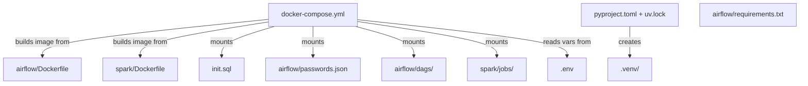

### 1. How uv Links to Docker

uv exists in **two places** — the host and inside the Airflow container — for different reasons:

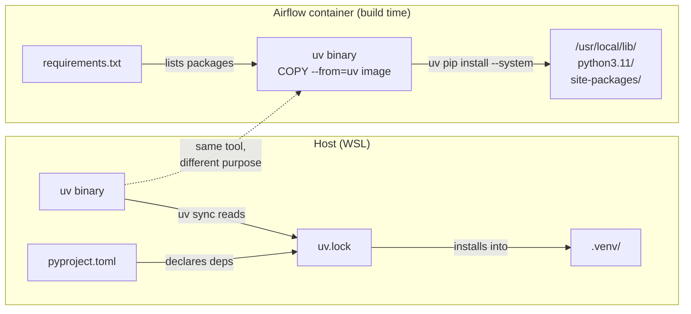

**Host uv** manages your development Python:
- `pyproject.toml` declares what packages you need (sodapy, dbt-core, etc.)
- `uv.lock` pins exact versions for reproducibility
- `uv sync` reads the lockfile and installs into `.venv/`
- You use this for running ingestion scripts, DBT dev, ad-hoc queries

**Container uv** is used only at **build time** (in the Dockerfile), not at runtime:
- `COPY --from=ghcr.io/astral-sh/uv:latest /uv /usr/local/bin/uv` — copies just the uv binary into the image (multi-stage copy, no install script)
- `uv pip install --system -r requirements.txt` — installs Airflow providers into the container's system Python
- `--system` means "install into the container's Python, not a venv" — containers don't need venvs because they're already isolated

**Why not `uv sync` inside Docker?** `uv sync` reads the root `uv.lock`, which has host packages (dbt-core, sodapy). The Airflow container needs different packages (airflow providers). Using `uv pip install -r requirements.txt` installs only what the container needs.

**Key point:** The two uv environments are completely independent. Host packages never enter containers, and container packages never enter the host.

### 2. How Spark Links to Docker

The Spark image is built from `spark/Dockerfile`. It starts from the official `apache/spark:3.5.1` image and adds the PostgreSQL JDBC driver:

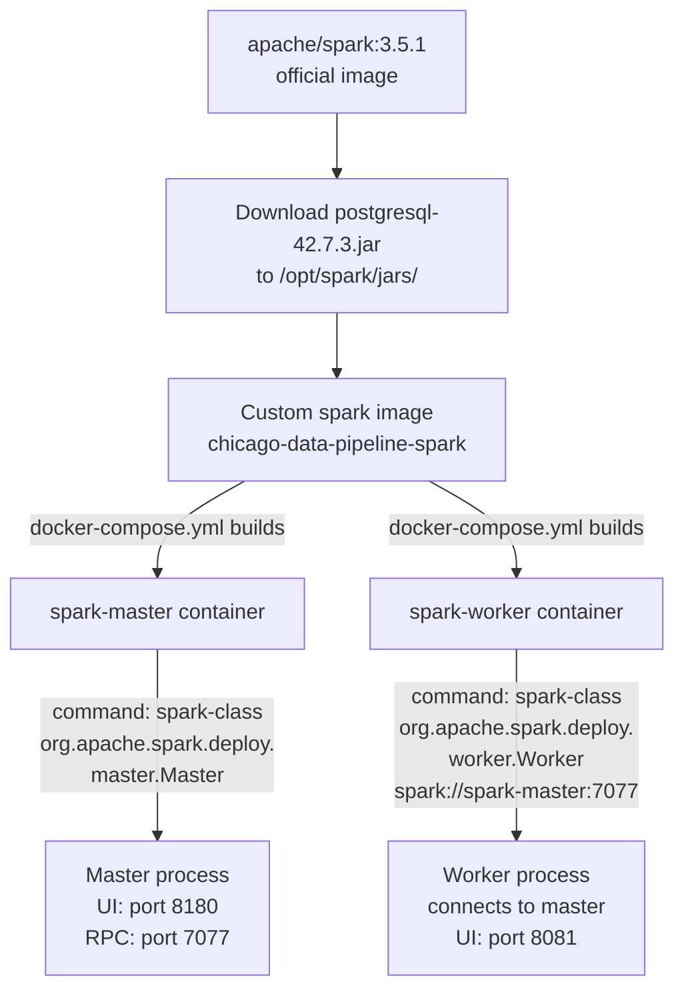

**Why a custom image?** The official `apache/spark` image doesn't include the PostgreSQL JDBC driver. Without it, `df.write.format("jdbc")` throws `ClassNotFoundException`. Baking the JAR into the image means:
- Works offline (no Maven Central download at runtime)
- Faster startup (no download delay)
- More reliable (no network dependency)

**How docker-compose.yml uses it:**
- `build: ./spark` — tells Compose to build the image from `spark/Dockerfile`
- Both `spark-master` and `spark-worker` use the same image (same `build: ./spark`)
- The `command:` override differentiates them — same image, different process

**How spark/jobs/ is used:**
- `./spark/jobs:/opt/spark/jobs` — bind-mounted into both master and worker
- You write PySpark scripts here (e.g., `crime_batch.py`)
- Can run directly: `spark-submit --master local[*] jobs/crime_batch.py`
- Or Airflow's DockerOperator can submit them

### 3. How Airflow Links to Docker

The Airflow image is built from `airflow/Dockerfile`. It starts from `apache/airflow:3.0.0-python3.11` and adds Docker CLI + Airflow providers:

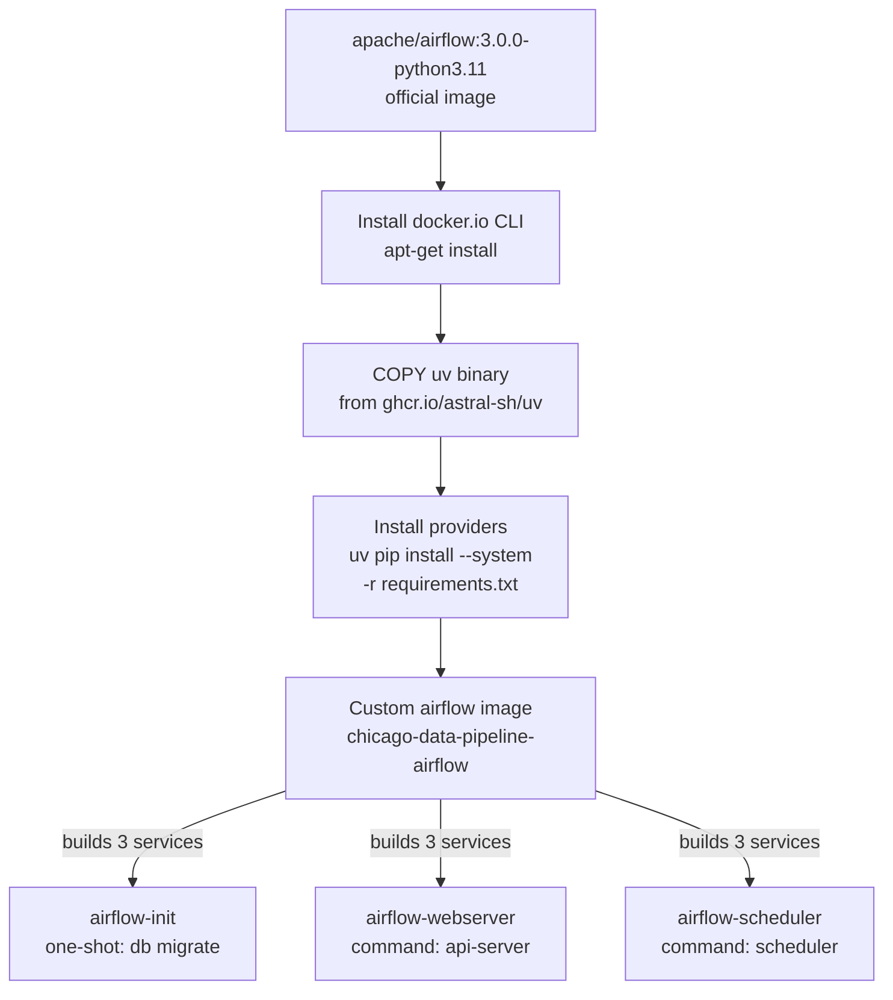

**Why a custom image?** The official Airflow image doesn't include:
1. **Docker CLI** — needed for DockerOperator (runs Spark jobs in isolated containers via docker.sock)
2. **Airflow providers** — the official image includes core only. We need:
   - `apache-airflow-providers-postgres` — PostgresHook, SqlSensor
   - `apache-airflow-providers-docker` — DockerOperator

**How docker-compose.yml uses it:**
- `build: ./airflow` in the YAML anchor `x-airflow-common` — all 3 Airflow services share this
- `<<: *airflow-common` merges the build config into each service
- The `command:` override differentiates the 3 services:
  - `airflow-init`: `bash -c "airflow db migrate"` (runs once, exits 0)
  - `airflow-webserver`: `command: api-server` (serves UI on port 8080)
  - `airflow-scheduler`: `command: scheduler` (runs task scheduler)

**How airflow/ files are used:**

| File | How it's used | Mount type |
|---|---|---|
| `airflow/Dockerfile` | Compose builds the image from this at `docker compose build` time | Build context |
| `airflow/requirements.txt` | Copied into image during build, installed by uv | Build context |
| `airflow/passwords.json` | Bind-mounted into container at `/opt/airflow/config/passwords.json` | Bind mount (runtime) |
| `airflow/dags/` | Bind-mounted into container at `/opt/airflow/dags/` | Bind mount (runtime) |

**Why dags/ is bind-mounted (not baked into image):** You edit DAGs frequently. A bind mount means changes on the host appear instantly in the container — no rebuild needed. If you baked DAGs into the image, you'd need to rebuild every time you change a DAG.

### 4. How docker-compose.yml Ties Everything Together

docker-compose.yml is the **orchestrator** — it defines all 6 services, their dependencies, and how files flow into containers:

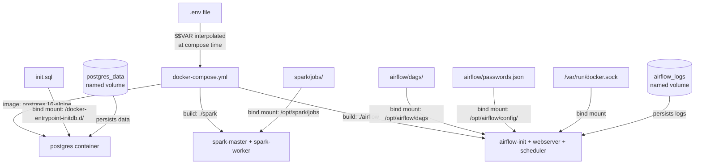

**The two types of volume mounts:**

| Type | Syntax | When to use | Example in this project |
|---|---|---|---|
| **Bind mount** | `./host/path:/container/path` | When you want host edits to appear in container immediately | `./airflow/dags:/opt/airflow/dags` |
| **Named volume** | `volume_name:/container/path` | When you want data to persist but don't need host access | `postgres_data:/var/lib/postgresql/data` |

**The startup order (enforced by `depends_on`):**

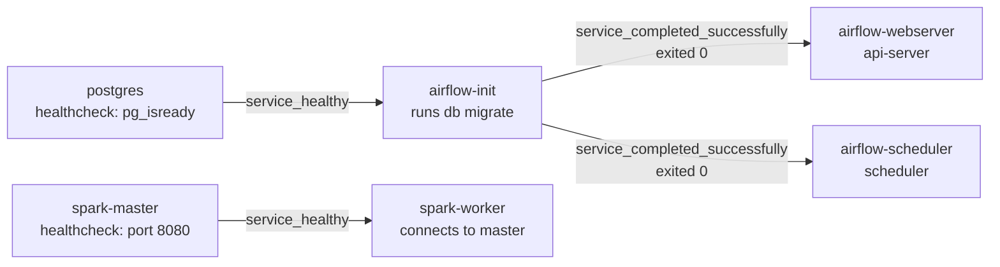

This means:
1. Postgres starts first and must pass `pg_isready` healthcheck
2. `airflow-init` waits for Postgres to be healthy, then runs `airflow db migrate`, then exits 0
3. `airflow-webserver` and `airflow-scheduler` wait for `airflow-init` to exit 0, then start
4. `spark-master` starts independently (no dependency on Postgres or Airflow)
5. `spark-worker` waits for `spark-master` to be healthy, then connects

### 5. How init.sql Links to Postgres

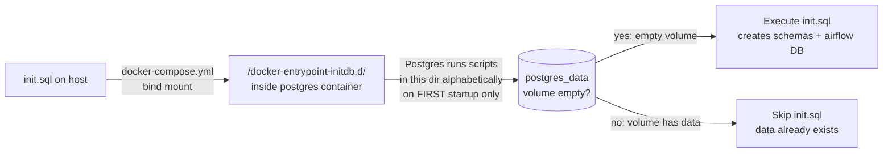

**How it works:**
- `./init.sql:/docker-entrypoint-initdb.d/init.sql` — Compose bind-mounts the file into Postgres's init directory
- The `postgres:16-alpine` image has an entrypoint script that checks: is the data volume empty?
- If empty (first run): runs all scripts in `/docker-entrypoint-initdb.d/` alphabetically, then starts Postgres
- If not empty (subsequent runs): skips init scripts entirely, starts Postgres with existing data

**What init.sql creates:**
- 3 schemas: `raw`, `staging`, `mart` in the `chicago_analytics` database
- `airflow` user with password `airflow_pass`
- `airflow_metadata` database owned by `airflow` user
- Grants: `chicago` user gets full access to all 3 schemas

**If you change init.sql after the first run:** You must destroy the volume and recreate:
```bash
docker compose down -v    # WARNING: destroys all data
docker compose up -d      # volume is empty again, init.sql runs
```

### 6. How .env Links to docker-compose.yml

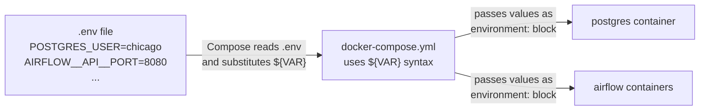

**How it works:**
- Compose automatically reads `.env` from the same directory as `docker-compose.yml`
- Any `${VAR}` in docker-compose.yml is replaced with the value from `.env`
- Example: `POSTGRES_USER: ${POSTGRES_USER}` becomes `POSTGRES_USER: chicago`
- The `.env` file is gitignored (contains secrets). `.env.example` is committed as a template

**`$$` vs `$` in Compose commands:**
- `$VAR` — Compose interpolates from `.env` at compose time (before the container starts)
- `$$VAR` — escapes to literal `$VAR`, so the container's bash shell expands it at runtime
- Use `$$` when you need bash to read an env var that was set via the `environment:` block

### 7. How docker.sock Links Airflow to Spark (DockerOperator)

When an Airflow DAG needs to run a Spark job, it uses DockerOperator to spawn a new container:

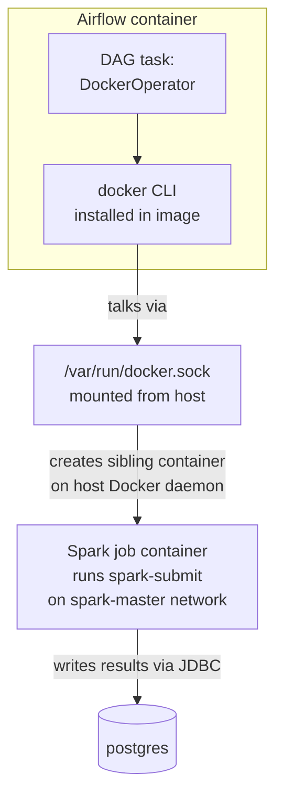

**How it works:**
1. The Airflow Dockerfile installs `docker.io` (Docker CLI) into the Airflow image
2. docker-compose.yml mounts `/var/run/docker.sock` from the host into the Airflow container
3. When DockerOperator runs, it uses the Docker CLI to talk to the host's Docker daemon via the socket
4. The daemon creates a **sibling container** (not inside the Airflow container — on the host alongside it)
5. That sibling container runs the Spark job and writes results to Postgres via JDBC

**Why this pattern?** It keeps Spark jobs isolated — each job runs in a fresh container with clean state. The Airflow container doesn't need Spark installed; it just needs the Docker CLI to spawn containers that do have Spark.

### 8. Complete File → Container Reference

| Host file | Used by | How | When |
|---|---|---|---|
| `docker-compose.yml` | Docker Compose | Read by `docker compose up` | Every startup |
| `.env` | docker-compose.yml | `${VAR}` interpolation | Every startup |
| `init.sql` | postgres container | Bind mount to `/docker-entrypoint-initdb.d/` | First startup only (empty volume) |
| `airflow/Dockerfile` | Compose build | `build: ./airflow` | `docker compose build` |
| `airflow/requirements.txt` | Dockerfile | `COPY` + `uv pip install` | Build time |
| `airflow/passwords.json` | airflow containers | Bind mount to `/opt/airflow/config/` | Every startup (runtime) |
| `airflow/dags/*.py` | airflow containers | Bind mount to `/opt/airflow/dags/` | Every startup (runtime, live-edited) |
| `spark/Dockerfile` | Compose build | `build: ./spark` | `docker compose build` |
| `spark/jobs/*.py` | spark + airflow containers | Bind mount to `/opt/spark/jobs/` | Every startup (runtime) |
| `pyproject.toml` | uv (host only) | `uv sync` reads it | Host dev only |
| `uv.lock` | uv (host only) | `uv sync` reads it | Host dev only |
| `.venv/` | Host Python | Created by `uv sync` | Host dev only |
| `kafka/producers/*.py` | kafka container (future) | Bind mount (Phase 2.3) | Every startup (runtime) |
| `spark/jobs/divvy_stream.py` | spark container (future) | Bind mount (Phase 2.4) | Every startup (runtime) |

---

### 9. How Kafka + Zookeeper Link to Docker (Phase 2.2)

Kafka and Zookeeper use pre-built Confluent images (no custom Dockerfile needed):

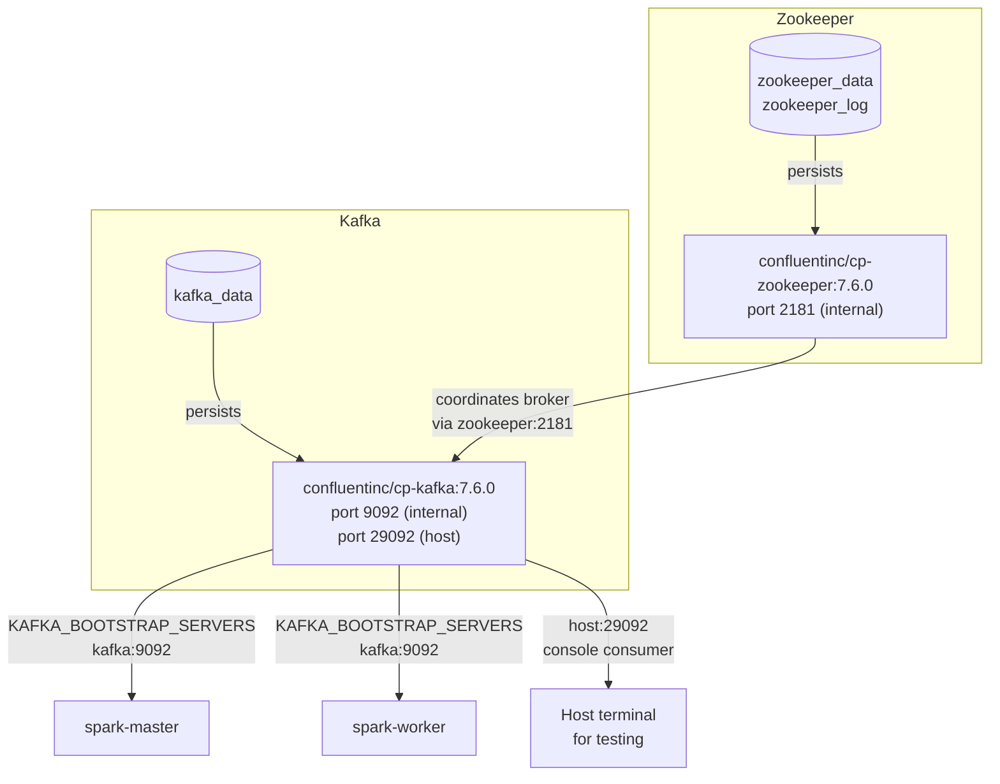

**Why no custom Dockerfile?** Confluent images are configured entirely via environment variables. No additional packages or JARs needed — unlike Spark (needs JDBC driver) or Airflow (needs Docker CLI + providers).

**Two listeners:**
- `PLAINTEXT://kafka:9092` — Docker network internal. Spark Structured Streaming and the producer connect here.
- `PLAINTEXT_HOST://localhost:29092` — host machine. For `kafka-console-consumer` testing from your terminal.

**Startup order:**
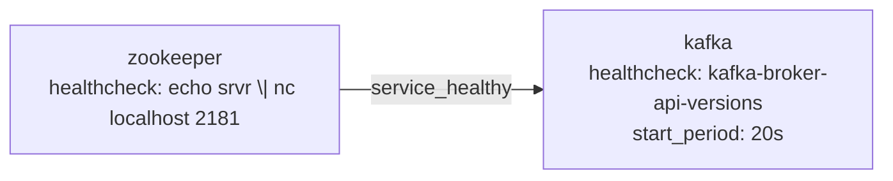

Zookeeper must be healthy before Kafka starts. Kafka takes ~30-40s to fully initialize (hence `start_period: 20s` on the healthcheck).

**Single-broker overrides (critical):**
Three Kafka settings default to 3 (for production clusters). With a single broker, they MUST be set to 1:
- `KAFKA_OFFSETS_TOPIC_REPLICATION_FACTOR: 1`
- `KAFKA_TRANSACTION_STATE_LOG_REPLICATION_FACTOR: 1`
- `KAFKA_TRANSACTION_STATE_LOG_MIN_ISR: 1`

Without these, Kafka can't create `__consumer_offsets` and consumers can't commit offsets.
