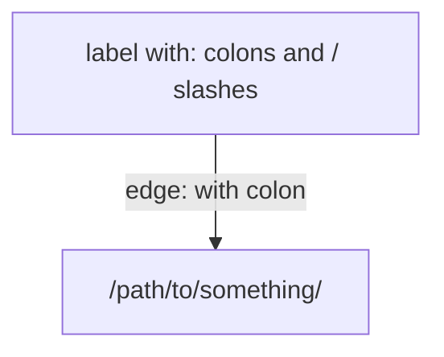

# Mermaid Diagram Syntax Rules

Mermaid diagrams break silently when node labels contain special characters without quotes. Follow these rules:

| Character | Why it breaks | Fix |
|---|---|---|
| `/` | `[/text/]` is parsed as a parallelogram shape | Quote: `NODE["text/path"]` |
| `:` | Colons confuse the label parser | Quote: `NODE["text:text"]` |
| `$` | `${VAR}` and `$$` are special syntax | Quote: `NODE["${VAR}"]` |
| `{` `}` | Curly braces are subgraph/syntax delimiters | Quote: `NODE["text {braces}"]` |

**Safe rule:** If a label contains anything other than letters, numbers, spaces, and `<br/>`, wrap it in double quotes.

**Edge labels too:** Use `-->|"label with : or /"|` not `-->|label with : or /|`

**Node shapes that need quoting:**


**Scanner:** Run this Python snippet to check all `.md` files for unquoted problematic patterns:
```python
import os, re, glob
root = '/home/sagar/chicago-data-pipeline'
for fp in glob.glob(f'{root}/**/*.md', recursive=True):
    lines = open(fp).readlines()
    in_mermaid = False
    for i, line in enumerate(lines, 1):
        s = line.strip()
        if s == '```mermaid': in_mermaid = True; continue
        if s == '```' and in_mermaid: in_mermaid = False; continue
        if not in_mermaid: continue
        if '/]' in s and '"' not in s: print(f'{os.path.relpath(fp, root)}:{i} /] unquoted')
        if '${' in s and '"' not in s: print(f'{os.path.relpath(fp, root)}:{i} ${{ unquoted')
        if '$$' in s and '"' not in s: print(f'{os.path.relpath(fp, root)}:{i} $$ unquoted')
        for m in re.findall(r'\[([^\]"]+)\]', s):
            if ':' in m and not s.startswith('style'): print(f'{os.path.relpath(fp, root)}:{i} colon unquoted: {s}')
```

---

<!-- Append new sections below as you learn new things. -->
