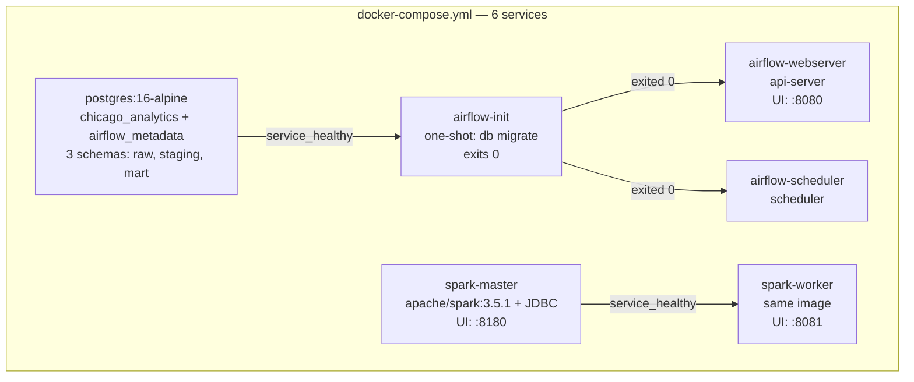
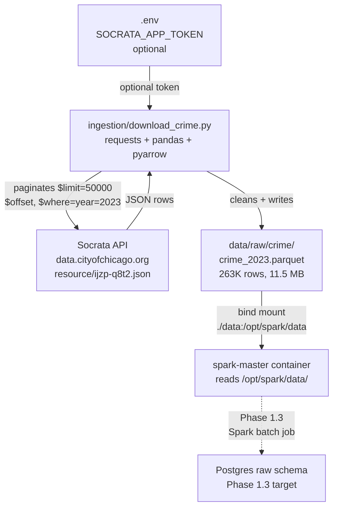
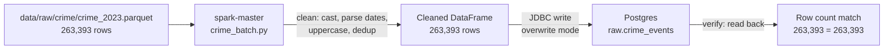
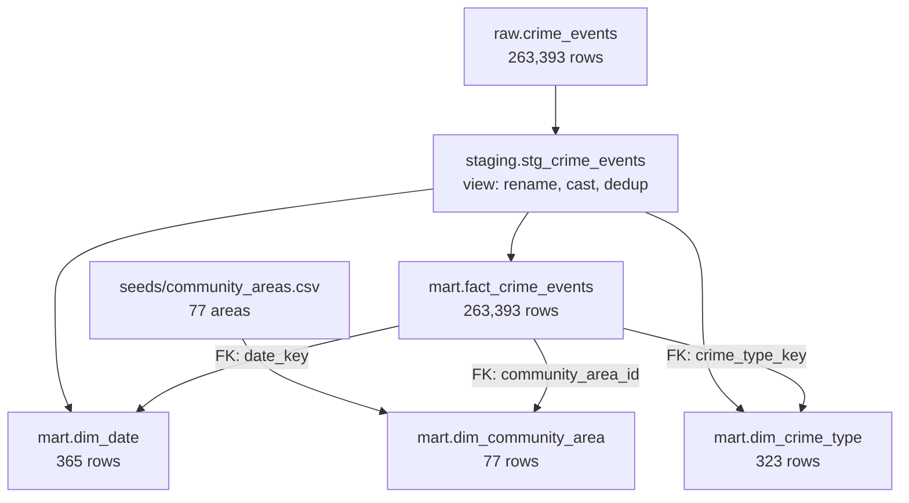
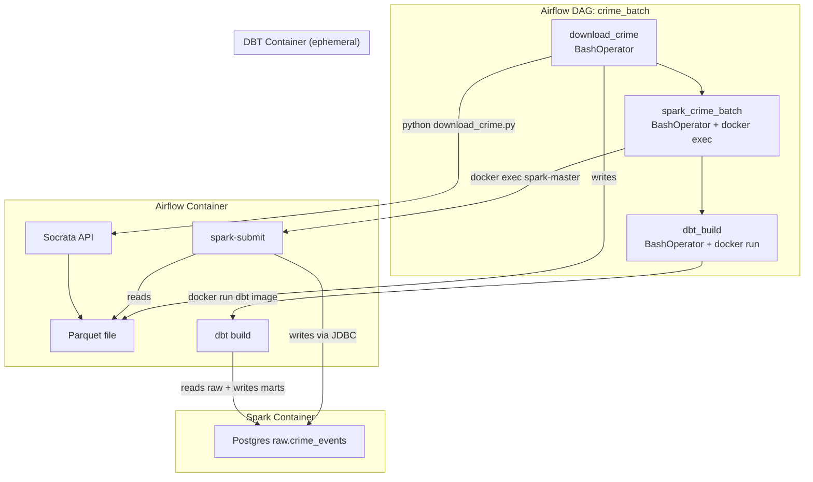
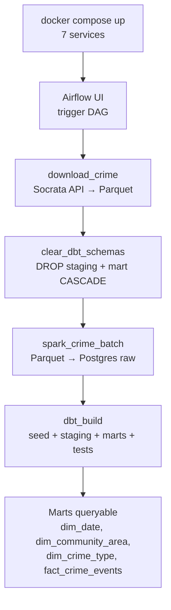

# Phase 1 — Batch Pipeline (Docker → Ingestion → Spark → DBT → Airflow → Verification)

> **Status:** Complete / Verified on 2026-07-13
> **Phase gate:** `docker compose up` → DAG runs → DBT marts queryable
> **Sub-phases:** 1.1 Docker (2026-07-09) · 1.2 Ingestion (2026-07-11) · 1.3 Spark Batch (2026-07-13) · 1.4 DBT Models (2026-07-13) · 1.5 Airflow DAG (2026-07-13) · 1.6 Verification (2026-07-13)

## Summary

Phase 1 builds the complete batch data pipeline for Chicago crime data, end to end. Starting from bare infrastructure, it stands up a Docker Compose stack (Postgres + Spark + Airflow 3.0), writes a Socrata API ingestion script that downloads 263,393 rows of 2023 crime data to Parquet, builds a Spark batch ETL job that cleans and loads the data into Postgres `raw.crime_events`, layers DBT staging + mart transformations (4 mart tables, 31 data tests), orchestrates the whole flow with an Airflow DAG, and finally verifies the pipeline cold-starts and produces queryable marts.

The phase gate — `docker compose up` → trigger DAG → all tasks succeed → marts queryable — passed on 2026-07-13. `fact_crime_events` (263,394 rows) matches `raw.crime_events` (263,394 rows): no data loss. Phase 2 (streaming) is unlocked.

**Key numbers:** 6 services (later 7 with dag-processor), 263,393 crime rows ingested, 4 mart tables, 31 DBT tests (all pass), 4 DAG tasks, ~163s end-to-end cold-start run.

---

## 1.1 — Docker Compose Services

> **Date:** 2026-07-09 · **Status:** Complete / Verified

Built the full Docker Compose stack: Postgres (warehouse + Airflow metadata), Spark (master + worker), and Airflow 3.0 (init + webserver + scheduler). All 6 services running and verified healthy. Postgres has 3 schemas (raw, staging, mart). Airflow UI and Spark UI accessible from the host.

### Files Created/Modified

| File | Action | Purpose |
|---|---|---|
| `.env.example` | Created | Environment variable template (Postgres creds, Airflow 3.0 config, Socrata token placeholder). Copy to `.env` (gitignored) and fill in real values. Contains `COMPOSE_PROJECT_NAME`, Postgres warehouse + Airflow metadata DB creds, `AIRFLOW__CORE__EXECUTOR=LocalExecutor`, SimpleAuthManager users + passwords file path, `SOCRATA_APP_TOKEN` placeholder |
| `init.sql` | Created | Postgres init script mounted into `/docker-entrypoint-initdb.d/`. Runs only on first startup (empty volume). Creates 3 schemas (`raw`, `staging`, `mart`) in `chicago_analytics`, `airflow` user via `DO $$ ... $$` block (no `CREATE USER IF NOT EXISTS`), `airflow_metadata` DB via `\gexec` trick (`CREATE DATABASE` can't run in a transaction). Grants `chicago` full privileges on the 3 schemas; `airflow` full privileges on `airflow_metadata`. Values hardcoded (SQL can't read `.env`) and match `.env.example` |
| `docker-compose.yml` | Created | 6 services with YAML anchor `x-airflow-common` (shares env vars + volumes across 3 Airflow services), healthchecks, `depends_on` conditions. All env vars interpolated from `.env`. Airflow 3.0 changes: SimpleAuthManager env vars, `passwords.json` mount, `airflow users create` removed from init |
| `airflow/Dockerfile` | Created | Custom Airflow 3.0 image: `apache/airflow:3.0.0-python3.11` + Docker CLI (`docker.io` for DockerOperator) + uv (multi-stage `COPY --from=ghcr.io/astral-sh/uv:latest`). Installs providers via `uv pip install --system` as root, then switches to `USER airflow` (UID 50000) |
| `airflow/requirements.txt` | Created | Airflow provider packages: `apache-airflow-providers-postgres` (PostgresHook, SqlSensor), `apache-airflow-providers-docker` (DockerOperator) |
| `airflow/passwords.json` | Created | SimpleAuthManager passwords file: `{"admin": "admin"}`. Mounted at `/opt/airflow/config/passwords.json`. Replaces Airflow 2.x's `airflow users create` CLI (removed in 3.0). `chmod 666` on host — SimpleAuthManager opens with `a+` mode, airflow user needs write |
| `airflow/dags/.gitkeep` | Created | Ensures dags/ directory exists in git |
| `spark/Dockerfile` | Created | Custom Spark image: `apache/spark:3.5.1` + PostgreSQL JDBC driver (`postgresql-42.7.3.jar`) baked into `/opt/spark/jars/`. Non-root user `spark` (UID 185) |
| `spark/jobs/.gitkeep` | Created | Ensures jobs/ directory exists in git |
| `pyproject.toml` | Created | uv project mode: host Python dependency declarations (requests, sodapy, dbt-core, dbt-postgres, python-dotenv, psycopg2-binary) |
| `uv.lock` | Created | Exact versions + hashes for reproducible host installs |

### Architecture



**For detailed architecture diagrams** (how uv links to Docker, how Spark/Airflow images are built, how init.sql runs, how docker.sock connects Airflow to Spark, file-to-container mapping), see `docs/wiki/architecture.md`. That file is the permanent reference; this doc is the phase snapshot.

### Errors Hit

| # | Error | Root Cause | Fix |
|---|---|---|---|
| 1 | `bitnami/spark:3.5: not found` | Bitnami moved images behind commercial subscription in 2026 | Switched to `apache/spark:3.5.1`, rewrote commands to use `spark-class` |
| 2 | Airflow Dockerfile: `Permission denied` during `uv pip install --system` | Running as airflow user (UID 50000) which can't write to `/usr/local/lib/python3.11/site-packages/` | Run `uv pip install` as root, then switch to `USER airflow` |
| 3 | Spark master healthcheck unhealthy | Healthcheck checked RPC port 7077 on 127.0.0.1, but Spark binds RPC to container's Docker network IP (172.18.0.x), not localhost | Changed healthcheck to check Web UI port 8080 (binds to 0.0.0.0) |
| 4 | Airflow webserver crashes: `airflow command error: arguments required` | Airflow 3.0 removed `airflow webserver` command | Changed to `command: api-server` |
| 5 | Airflow scheduler crashes: same error | Airflow 3.0 image has no default CMD — entrypoint runs `airflow` with no subcommand | Added explicit `command: scheduler` |
| 6 | Airflow webserver: `PermissionError: /opt/airflow/config/passwords.json` | SimpleAuthManager opens passwords.json with `a+` mode. File was root-owned, airflow user couldn't write | `chmod 666 airflow/passwords.json` on host |
| 7 | Healthcheck 404 on `/health` | Airflow 3.0 moved health endpoint to `/api/v2/monitor/health` | Updated healthcheck URL |
| 8 | `AIRFLOW__WEBSERVER__WEB_SERVER_PORT` deprecated | Airflow 3.0 moved port config from `[webserver]` to `[api]` section | Changed env var to `AIRFLOW__API__PORT` |

### Lessons

- **Airflow 3.0 is NOT a drop-in upgrade from 2.x** — beyond auth, the webserver command, health endpoint, config sections, and default CMD all changed. Always test with `docker compose up` after upgrading, not just build.
- **Spark master binds RPC to Docker network IP, not localhost** — the Web UI binds to 0.0.0.0 but the RPC port binds to the container's specific IP. Healthchecks inside the container should check the Web UI port.
- **Bind-mounted files need permissions for the container user** — when mounting a file from host into a container, the file's host permissions carry over. `chmod 666` on host = readable/writable by any UID in container.
- **Bitnami images are no longer free as of 2026** — always check image availability before committing to a base image. `docker.io/bitnami/*` returns "not found" now.
- **Init scripts run once** — only when the Postgres data volume is empty. Changing `init.sql` after first run requires `docker compose down -v` (destroys data).
- **Postgres has no `CREATE DATABASE IF NOT EXISTS`** — must use workarounds like `\gexec` or check `pg_database` manually. `CREATE DATABASE` can't run in a transaction.
- **`$$` vs `$` in Compose** — Compose interprets `$VAR` as variable interpolation from `.env`. To pass a literal `$` to the container's shell, use `$$VAR`.

### Decisions Made

| Decision | Choice | Why |
|---|---|---|
| Postgres schemas | `raw`, `staging`, `mart` (no `intermediate`) | Traditional DBT layering without extra complexity. Can add `intermediate` later if joins/aggregations need their own layer |
| Executor | LocalExecutor | Parallelism without Redis/RabbitMQ containers. SequentialExecutor too slow; CeleryExecutor overkill for Phase 1 |
| Databases | Two in one Postgres: `chicago_analytics` + `airflow_metadata` | Avoids second container, simpler ops. Airflow needs its own DB — pointing it at the analytics DB pollutes it with `task_instance`, `dag_run`, etc. |
| Airflow version | 3.0.0 (not 3.3.0) | 3.0.0 has 15 months of production hardening. 3.3.0 released July 6, 2026 — too new. Airflow 2.x is EOL since April 2026 |
| Spark image | `apache/spark:3.5.1` (not bitnami) | Bitnami moved behind commercial subscription in 2026. Official apache image is free, upstream, actively maintained |
| JDBC driver | Baked into Spark image (not `--packages` at runtime) | Works offline, faster startup, no Maven Central dependency |
| Spark UI port | 8180 (remapped from 8080) | Port 8080 conflicts with Airflow |
| Auth manager | SimpleAuthManager (Airflow 3.0 default) | No CLI user creation needed; users via env vars + passwords.json. Dev-oriented; can switch to FabAuthManager for production |
| uv in Docker | `uv pip install --system` (not `uv sync`) | Host and containers need different packages; `uv sync` reads root lockfile (host deps). `uv pip install -r requirements.txt` installs only container-specific deps |
| uv install as root | Run as root, then switch to airflow user | `--system` writes to root-owned site-packages; airflow user (UID 50000) can't write |
| Hardcoded values in init.sql | Hardcoded (not env vars) | SQL files can't read `.env`. Values match `.env.example`; init runs once |
| `DAGS_ARE_PAUSED_AT_CREATION=False` | New DAGs start unpaused | Convenient for dev. In production, set True to review before running |

### Verification

```bash
$ docker compose ps -a
NAME                                        STATUS
chicago-data-pipeline-postgres-1            Up (healthy)
chicago-data-pipeline-spark-master-1        Up (healthy)
chicago-data-pipeline-spark-worker-1        Up
chicago-data-pipeline-airflow-init-1        Exited (0)
chicago-data-pipeline-airflow-webserver-1   Up (healthy)
chicago-data-pipeline-airflow-scheduler-1   Up

$ docker compose exec postgres psql -U chicago -d chicago_analytics -c "\dn"
   Name   |  Owner
----------+----------
 mart     | chicago
 raw      | chicago
 staging  | chicago

$ curl -s http://localhost:8080/api/v2/monitor/health
{"metadatabase":{"status":"healthy"},"scheduler":{"status":"healthy","latest_scheduler_heartbeat":"2026-07-09T11:26:07.445632+00:00"},...}
```

- **Postgres:** healthy, 3 schemas confirmed (raw, staging, mart)
- **Spark master:** healthy, UI on http://localhost:8180
- **Spark worker:** running, UI on http://localhost:8081
- **Airflow init:** exited (0) — migrations complete
- **Airflow webserver:** healthy, UI on http://localhost:8080 (admin/admin)
- **Airflow scheduler:** running, heartbeat active

---

## 1.2 — Ingestion Script

> **Date:** 2026-07-11 · **Status:** Complete / Verified

Built a Python ingestion script that downloads Chicago crime data from the Socrata API, paginates through results, cleans API-level quirks, and writes to local Parquet. Successfully downloaded 263,393 rows of 2023 crime data (11.5 MB). Spark can read the Parquet file from inside the container.

### Files Created/Modified

| File | Action | Purpose |
|---|---|---|
| `ingestion/download_crime.py` | Created | Socrata API ingestion script. Uses `requests` (not `sodapy`) for direct, transparent HTTP calls. Paginates with `$limit=50000` + `$offset` + `$order=id` (max page size, stable sort for consistent pagination). Filters `$where=year=2023`. Cleans API quirks: drops nested `location` dict (duplicates lat/long) and `:@computed_region_*` columns (internal geocoding metadata). Writes Parquet via pandas + pyarrow. App token optional — 263K rows = 6 requests, well under 1,000/hr anonymous limit |
| `ingestion/.gitkeep` | Created | Ensures ingestion/ directory exists in git |
| `data/raw/crime/` | Created | Output directory for Parquet files (gitignored) |
| `data/raw/crime/crime_2023.parquet` | Created | 263,393 rows of 2023 crime data, 21 columns, 11.5 MB (gitignored) |
| `docker-compose.yml` | Modified | Added `./data:/opt/spark/data` mount to spark-master, spark-worker, and `./data:/opt/airflow/data` to airflow-common volumes. Parquet files written by the host need to be accessible inside containers |

### Architecture



**For detailed architecture diagrams** (how files connect to containers, how the ingestion script fits into the pipeline), see `docs/wiki/architecture.md`.

### Errors Hit

| # | Error | Root Cause | Fix |
|---|---|---|---|
| 1 | Socrata API 404: `dataset.missing` for `ijzp-q4t2` | Plan had a typo — correct resource ID is `ijzp-q8t2` (with an 8, not a 4). Dataset migrated to a new ID on the Chicago Data Portal | Queried Socrata catalog API, found correct ID `ijzp-q8t2`, updated `SOCRATA_URL` |
| 2 | `NameError: name 'time' is not defined` | `import time` consumed during an edit that replaced it with a misplaced `SOCRATA_URL` line | Re-added `import time` to the imports block |
| 3 | Spark can't read Parquet — `data/` not mounted | docker-compose.yml only mounted `./spark/jobs` into Spark containers | Added `./data:/opt/spark/data` to spark-master, spark-worker, and airflow-common volumes |

### Lessons

- **Always verify API endpoints before writing code** — the plan's resource ID was a typo. The Socrata catalog API (`api.us.socrata.com/api/catalog/v1?q=...`) can confirm the correct ID.
- **Socrata returns nested `location` dict and `:@computed_region_*` columns** — both should be dropped during cleaning. `location` duplicates `latitude`/`longitude`; computed region columns are internal geocoding metadata.
- **Data directory must be mounted into Spark containers** — Parquet files written by the host need to be accessible inside containers via a bind mount.

### Decisions Made

| Decision | Choice | Why |
|---|---|---|
| API library | `requests` (not `sodapy`) | Direct HTTP calls are simpler, more transparent, and easier to debug than the sodapy wrapper |
| Output format | Parquet (not CSV) | Columnar, preserves types, Spark-friendly, compressed (11.5 MB vs ~80 MB CSV) |
| Initial scope | Single year (2023) | Plan recommends starting small; 263K rows is enough to test the pipeline without waiting hours |
| App token | Optional — script works without it | 263K rows = 6 API requests, well under 1,000/hr anonymous limit |
| Cleaning scope | Light (API quirks only) | Full cleaning (type normalization, casing, null handling) happens in Spark (Phase 1.3) |
| Pagination | `$limit=50000` + `$offset` + `$order=id` | Max page size, stable sort for consistent pagination |

### Verification

```bash
$ python ingestion/download_crime.py --year 2023
  Page 1: fetched 50,000 rows (total: 50,000)
  Page 2: fetched 50,000 rows (total: 100,000)
  Page 3: fetched 50,000 rows (total: 150,000)
  Page 4: fetched 50,000 rows (total: 200,000)
  Page 5: fetched 50,000 rows (total: 250,000)
  Page 6: fetched 13,393 rows (total: 263,393)
  DONE — 263,393 rows written to data/raw/crime/crime_2023.parquet
```

**Parquet verification (Python):**
- Rows: 263,393
- Columns: 21 (after dropping `location` and `:@computed_region_*`)
- Data quality: 0.8% null lat/long, 0.6% null location_description, 31 unique primary_type values
- Dtypes: `arrest`/`domestic` as bool, `latitude`/`longitude`/`ward`/`community_area` as float, `district`/`year` as int

**Spark verification:**
- `spark.read.parquet("/opt/spark/data/raw/crime/crime_2023.parquet")` succeeded
- Schema matched, sample rows showed correct data (HOMICIDE incidents on 2023-01-01)

---

## 1.3 — Spark Batch Job

> **Date:** 2026-07-13 · **Status:** Complete / Verified

Built the Spark batch ETL job (`spark/jobs/crime_batch.py`) that reads Chicago crime data from Parquet, cleans it, and writes to Postgres `raw.crime_events` via JDBC. The job is idempotent (`overwrite` mode) and includes a built-in verification step. 263,393 rows successfully written and verified.

### Files Created/Modified

| File | Action | Purpose |
|---|---|---|
| `spark/jobs/crime_batch.py` | Created | Spark batch ETL job. Reads `data/raw/crime/crime_2023.parquet` (263,393 rows), cleans (cast `id` to long, parse `date`/`updated_on` to timestamp, uppercase `primary_type`, cast `community_area` to int, dedup on `id`, drop null ids), writes to Postgres `raw.crime_events` via JDBC with `overwrite` mode. JDBC credentials read from env vars (`POSTGRES_USER`, `POSTGRES_PASSWORD`, etc.) — never hardcoded. Uses `numPartitions=8` + `repartition(8)` for 8 parallel JDBC connections, batch size 10,000. AQE enabled (`spark.sql.adaptive.enabled=true`). Includes built-in verification: reads back from Postgres and compares row counts |
| `docker-compose.yml` | Modified | Added Postgres env vars (`POSTGRES_USER`, `POSTGRES_PASSWORD`, `POSTGRES_DB`, `POSTGRES_HOST=postgres`, `POSTGRES_PORT=5432`) to `spark-master` and `spark-worker` services. Read by `crime_batch.py` via `os.environ` for JDBC credentials. Passed through from `.env` via `${...}` interpolation. Both services need creds because Spark executors run on workers, not just master |

### Architecture



The Spark job runs inside the `spark-master` container, reads the Parquet file from the bind-mounted `./data` directory, and writes to Postgres over the Docker network using the `postgres` service name.

**For detailed architecture diagrams**, see `docs/wiki/architecture.md`.

### Errors Hit

| # | Error | Root Cause | Fix |
|---|---|---|---|
| 1 | `spark-submit: executable file not found in $PATH` | apache/spark image doesn't add `/opt/spark/bin` to PATH | Use full path: `/opt/spark/bin/spark-submit` |
| 2 | Duplicate `environment:` block for spark-worker | Edit tool left a stale duplicate | Deleted stale lines, merged under one `environment:` key |
| 3 | `spark-worker:` service key dropped during edit | SWAP operation consumed the service header | Re-inserted service header lines |
| 4 | `raw.crime_events` missing after WSL restart | Table is created by the job, not by `init.sql` | Re-ran the batch job (idempotent via `overwrite` mode) |

### Lessons

- **apache/spark PATH** — The official image doesn't put Spark binaries on PATH. Always use `/opt/spark/bin/spark-submit` when exec'ing into the container.
- **Idempotent batch jobs** — `mode("overwrite")` makes the job safe to re-run anytime. This is the Phase 1 pattern; Phase 2+ will use upserts.
- **Docker Compose env propagation** — Both `spark-master` and `spark-worker` need Postgres credentials for JDBC writes, since executors run on workers.
- **Data persistence** — Named volumes preserve `init.sql` output (schemas, users) but NOT Spark-written tables. Re-run the job if the volume is wiped.

### Decisions Made

| Decision | Choice | Why |
|---|---|---|
| JDBC credentials source | Environment variables (`POSTGRES_USER`, `POSTGRES_PASSWORD`) passed from `.env` via docker-compose | Never hardcode passwords in job scripts (convention: `docs/wiki/conventions/spark.md`) |
| Write mode | `overwrite` | Phase 1 simplicity — idempotent, replaces whole table each run. Switch to upsert in Phase 2+ |
| JDBC batch size | 10,000 | Default 1,000 is slow for 263K rows. 10K balances throughput vs memory |
| JDBC parallelism | `numPartitions=8` with `repartition(8)` | 8 parallel JDBC connections into Postgres — controlled parallelism |
| Cleaning approach | Casts as safety net, not primary conversion | Ingestion script already converts numeric/bool columns via pandas. Spark casts guarantee types downstream but don't assume string input |
| Null lat/long handling | Keep as null (don't drop) | Too many rows have null coordinates. Dropping would lose data. DBT/Spark can flag them later |
| AQE enabled | `spark.sql.adaptive.enabled=true` | Lets Spark auto-coalesce partitions — reduces manual tuning |

### Verification

```bash
# Run the batch job
$ docker compose exec spark-master /opt/spark/bin/spark-submit \
    --master local[*] /opt/spark/jobs/crime_batch.py

# Output (key lines):
#   Raw row count: 263,393
#   Cleaned row count: 263,393
#   Rows dropped (null id + duplicates): 0
#   Write complete.
#   Rows in Postgres raw.crime_events: 263,393
#   Row counts match.

# Verify table in Postgres
$ docker compose exec postgres psql -U chicago -d chicago_analytics \
    -c "SELECT count(*) FROM raw.crime_events;"
#  row_count
# -----------
#     263393

# Verify column types
$ docker compose exec postgres psql -U chicago -d chicago_analytics \
    -c "SELECT column_name, data_type FROM information_schema.columns
        WHERE table_schema='raw' AND table_name='crime_events'
        ORDER BY ordinal_position;"
#  id → bigint, date → timestamp, primary_type → text,
#  community_area → integer, latitude → double precision, etc.
```

- **Row count:** 263,393 in Parquet = 263,393 in Postgres (match)
- **Schema types:** `id` (bigint), `date` (timestamp), `community_area` (integer), `latitude`/`longitude` (double precision) — all casts correct
- **Idempotency:** Re-ran the job after WSL restart — same result, no errors

---

## 1.4 — DBT Models

> **Date:** 2026-07-13 · **Status:** Complete / Verified

Built the DBT transformation layer: staging view (`stg_crime_events`) on top of `raw.crime_events`, plus four mart tables (`dim_date`, `dim_community_area`, `dim_crime_type`, `fact_crime_events`). 31 data tests all pass (20 standard + 11 dbt-expectations). Analytical queries on the marts produce correct results (e.g. top community areas by crime count).

### Files Created/Modified

| File | Action | Purpose |
|---|---|---|
| `dbt/dbt_project.yml` | Created | DBT project config. Models: staging (view, `staging` schema) + marts (table, `mart` schema). Seeds: `mart` schema. Model paths, materialization defaults, schema mapping |
| `dbt/profiles.yml` | Created | Postgres connection config (host: localhost, user: chicago, db: chicago_analytics). NOT committed to git (contains hardcoded password). Copy also placed at `~/.dbt/profiles.yml` for dbt Power User extension |
| `dbt/macros/try_cast.sql` | Created | Warehouse-portable cast macro. Postgres: plain `::` cast (fails loudly — bad data should fail at DBT, not silently null). BigQuery: `SAFE_CAST` (returns null, BigQuery doesn't raise). Catches upstream bugs |
| `dbt/macros/generate_schema_name.sql` | Created | Overrides DBT's default schema concatenation. Returns custom schema name as-is (e.g. `mart`, not `staging_mart`). Without this, DBT concatenates profile schema + custom schema → `staging_mart` |
| `dbt/models/staging/stg_crime_events.sql` | Created | Staging view — 1:1 with `raw.crime_events`. Renames columns (id→crime_id, date→occurred_at, updated_on→updated_at), casts types, deduplicates on id via `DISTINCT ON (id) ... ORDER BY id, updated_at DESC` (keeps most recently updated row) |
| `dbt/models/staging/schema.yml` | Created | Source definition for `raw.crime_events` + staging model tests (unique, not_null, dbt-expectations range/bounds) |
| `dbt/models/marts/dim_date.sql` | Created | Date dimension. 365 rows (2023-01-01 to 2023-12-31). Columns: date_key, year, month, day, day_of_week, day_name, month_name, month_start, quarter_start |
| `dbt/models/marts/dim_community_area.sql` | Created | Chicago's 77 community areas. Sourced from seed `community_areas.csv` |
| `dbt/models/marts/dim_crime_type.sql` | Created | 323 distinct primary_type + description combinations. Surrogate key: `primary_type || '\|' \|\| description` |
| `dbt/models/marts/fact_crime_events.sql` | Created | Main fact table. 263,393 rows. FKs: date_key→dim_date, community_area_id→dim_community_area, crime_type_key→dim_crime_type |
| `dbt/models/marts/schema.yml` | Created | 20 standard + 11 dbt-expectations data tests (31 total). Standard: unique, not_null, relationships. dbt-expectations: range bounds on year, month, community_area_id, latitude, longitude |
| `dbt/seeds/community_areas.csv` | Created | 77 community areas from Chicago Data Portal (resource `igwz-8jzy`, Boundaries - Community Areas). Columns: community_area_id, community_area_name |
| `dbt/packages.yml` | Created | dbt-expectations package: `metaplane/dbt_expectations` 0.10.10 (Great Expectations macros for dbt). Installed via `dbt deps` |
| `dbt/package-lock.yml` | Created | Auto-generated by `dbt deps`, locks package versions for reproducible installs |
| `.vscode/settings.json` | Created | dbt Power User extension config: `dbt.allowListFolders: ["dbt"]` (find project in subdirectory), `python.defaultInterpreterPath` and `dbt.dbtPythonPathOverride` (use `.venv/bin/python` where dbt-core is installed) |
| `.gitignore` | Modified | Added exceptions: `!dbt/seeds/*.csv` (seed must be committable), `!.vscode/settings.json` (extension config must be shared). Added `dbt/profiles.yml` to ignore (contains hardcoded Postgres password) |

### Architecture



DBT reads from `raw.crime_events` (written by Spark in Phase 1.3), creates a staging view, and builds four mart tables. The fact table joins to all three dimensions via foreign keys.

**For detailed architecture diagrams**, see `docs/wiki/architecture.md`.

### Errors Hit

| # | Error | Root Cause | Fix |
|---|---|---|---|
| 1 | DBT created `staging_mart` and `staging_staging` schemas | Default `generate_schema_name` concatenates profile schema + custom schema | Created `generate_schema_name.sql` macro override that returns custom schema as-is |
| 2 | `where` config deprecation warning in DBT 1.11 | `where` as top-level property on tests is deprecated | Moved under `config:` |
| 3 | DBT not installed despite being in `pyproject.toml` | `uv sync` hadn't fully installed packages | Re-ran `uv sync` — resolved dbt-core 1.11.12 + dbt-postgres 1.10.2 |
| 4 | `expect_column_values_to_be_in_set` on BOOLEAN fails: `boolean = text` | dbt-expectations generates text comparison; Postgres can't compare to boolean | Replaced with `not_null` — BOOLEAN can't hold values outside {true, false, null} |
| 5 | `expect_column_values_to_be_between` on longitude failed (801 rows) | Bounds `[-87.9, -87.5]` too tight; actual data is `[-87.94, -87.52]` | Widened to `[-87.95, -87.52]` based on actual `min()/max()` |
| 6 | dbt Power User "language server not running" | Extension couldn't find `dbt_project.yml` in `dbt/` subdirectory | Created `.vscode/settings.json` with `dbt.allowListFolders: ["dbt"]`, copied `profiles.yml` to `~/.dbt/` |

### Lessons

- **DBT schema naming** — The default `generate_schema_name` concatenates; override it when you want specific schema names.
- **DBT 1.11 test config** — `where` on generic tests must be under `config:`, not top-level.
- **Staging dedup** — `DISTINCT ON (id) ... ORDER BY id, updated_at DESC` keeps the most recently updated row per id.
- **Community area 0** — Sentinel for "unassigned"; excluded from relationships test via `where: "community_area_id != 0"`. Not a real FK violation.
- **dbt-expectations on BOOLEAN** — `expect_column_values_to_be_in_set` fails on Postgres BOOLEAN due to type mismatch. Use `not_null` instead.
- **Data bounds** — Always check actual `min()/max()` before setting range test thresholds. Chicago's longitude ranges `[-87.94, -87.52]`, wider than commonly cited `[-87.9, -87.5]`.
- **dbt Power User** — Needs `dbt.allowListFolders` in `.vscode/settings.json` for subdirectory projects and `profiles.yml` in `~/.dbt/`.

### Decisions Made

| Decision | Choice | Why |
|---|---|---|
| Schema mapping | `generate_schema_name` macro override | DBT's default concatenation produces `staging_mart` instead of `mart`. Override returns custom schema as-is |
| Staging materialization | `view` | Cheap, always reflects latest raw data, no storage cost |
| Mart materialization | `table` | Query performance for dashboards and analytical queries |
| Deduplication method | `DISTINCT ON (id)` | Postgres-native, cleaner than `QUALIFY` (Snowflake syntax). Keeps most recently updated row |
| Community area 0 handling | `where` filter on relationships test | 0 is a valid sentinel for "unassigned" — not a real FK violation. Excluding it is cleaner than adding a fake dim row |
| Seed data source | Chicago Data Portal API (`igwz-8jzy`) | Official source for community area names. 77 rows, static reference data |
| `try_cast` macro | Plain cast on Postgres (fails loudly) | Bad data should fail at DBT, not silently null. Catches upstream bugs. BigQuery branch uses `SAFE_CAST` since BigQuery doesn't raise |

### Verification

```bash
# Verify DBT connection
$ dbt debug --profiles-dir .
# All checks passed!

# Build everything (seed + models + tests)
$ dbt build --profiles-dir .
# PASS=37 WARN=0 ERROR=0 SKIP=0 NO-OP=0 TOTAL=37

# Verify tables in Postgres
$ docker compose exec postgres psql -U chicago -d chicago_analytics -c "
SELECT 'staging.stg_crime_events' AS table_name, count(*) FROM staging.stg_crime_events
UNION ALL SELECT 'mart.dim_date', count(*) FROM mart.dim_date
UNION ALL SELECT 'mart.dim_community_area', count(*) FROM mart.dim_community_area
UNION ALL SELECT 'mart.dim_crime_type', count(*) FROM mart.dim_crime_type
UNION ALL SELECT 'mart.fact_crime_events', count(*) FROM mart.fact_crime_events;"
#  staging.stg_crime_events | 263393
#  mart.dim_date            |    365
#  mart.dim_community_area  |     77
#  mart.dim_crime_type      |    323
#  mart.fact_crime_events   | 263393

# Analytical query (proves marts work end-to-end)
SELECT ca.community_area_name, count(*) AS crime_count
FROM mart.fact_crime_events f
JOIN mart.dim_community_area ca ON f.community_area_id = ca.community_area_id
GROUP BY ca.community_area_name ORDER BY crime_count DESC LIMIT 10;
#  AUSTIN           | 12700
#  NEAR NORTH SIDE  | 11196
#  NEAR WEST SIDE   | 10423
#  LOOP             |  8808
#  ...
```

- **dbt debug:** Connection to Postgres verified
- **dbt build:** 37/37 PASS (1 seed + 5 models + 31 tests — 20 standard + 11 dbt-expectations)
- **Row counts:** All tables match expected counts
- **Analytical query:** Top 10 community areas by crime count returns correct results

---

## 1.5 — Airflow DAG

> **Date:** 2026-07-13 · **Status:** Complete / Verified

Built the Airflow DAG that orchestrates the full batch pipeline: download crime data from Socrata → Spark batch job → DBT build (seed + staging + marts + tests). The DAG runs with `schedule=None` (manual trigger), `max_active_runs=1`, and `retries=1`. All 3 tasks succeeded end-to-end in 137s, producing queryable marts (263,394 fact rows).

### Files Created/Modified

| File | Action | Purpose |
|---|---|---|
| `airflow/dags/crime_batch_dag.py` | Created | DAG with 3 tasks: `download_crime` (BashOperator → `python download_crime.py`) → `spark_crime_batch` (BashOperator → `docker exec spark-master spark-submit`) → `dbt_build` (BashOperator → `docker run --rm dbt image`). `schedule=None`, `max_active_runs=1`, `retries=1`. Spark container resolved at runtime via `docker ps -qf name=spark-master` (avoids hardcoding project prefix) |
| `dbt/Dockerfile` | Created | Separate dbt image (`python:3.11-slim` + dbt-core 1.11.12 + dbt-postgres 1.10.2). Needed because dbt-core 1.11's protobuf >=6.0 conflicts with Airflow 3.0's protobuf 4.x — can't coexist in same Python env |
| `airflow/dbt_profiles/profiles.yml` | Created | DBT profiles for Airflow container: `host: postgres` (Docker service name, not localhost), credentials via `env_var()`. Separate from host-side `dbt/profiles.yml` which uses `host: localhost` |
| `docker-compose.yml` | Modified | Added mounts (`./ingestion`, `./dbt`, `./airflow/dbt_profiles` into Airflow), Postgres env vars for Airflow, `AIRFLOW__CORE__EXECUTION_API_SERVER_URL=http://airflow-webserver:8080/execution/`, shared secrets (internal_api, JWT, webserver), `dbt-build` build-only service (never starts, exists so `docker compose build` builds the dbt image) |
| `airflow/Dockerfile` | Modified | Added docker group (GID 1001 via `groupdel docker; groupadd -g 1001 docker; usermod -aG docker airflow`) for docker.sock access, ingestion deps via requirements.txt |
| `airflow/requirements.txt` | Modified | Added ingestion deps: pandas, pyarrow, requests, python-dotenv. Removed dbt-core, dbt-postgres (moved to separate image) |
| `.env` / `.env.example` | Modified | Added `AIRFLOW__CORE__INTERNAL_API_SECRET_KEY`, `AIRFLOW__API_AUTH__JWT_SECRET`, `AIRFLOW__WEBSERVER__SECRET_KEY` (shared secrets for scheduler-webserver mutual auth) |
| `ingestion/download_crime.py` | Modified | Fixed docstring resource ID typo (ijzp-q4t2 → ijzp-q8t2), increased API timeout 60s → 120s (downloading 50K rows takes >60s from container) |

### Architecture



The DAG runs entirely via BashOperator — no DockerOperator needed. Spark runs via `docker exec` into the existing spark-master container. DBT runs via `docker run --rm` in a separate image (dbt-core 1.11's protobuf >=6.0 conflicts with Airflow 3.0's protobuf 4.x).

**For detailed architecture diagrams**, see `docs/wiki/architecture.md`.

### Errors Hit

| # | Error | Root Cause | Fix |
|---|---|---|---|
| 1 | `@manual` schedule rejected: "Exactly 5, 6 or 7 columns" | Airflow 3.0 doesn't accept `@manual` as a cron expression | Changed to `schedule=None` |
| 2 | `not found in serialized_dag table` + `Connection refused` | Scheduler couldn't reach API server — `execution_api_server_url` defaulted to `localhost:8080` | Set `AIRFLOW__CORE__EXECUTION_API_SERVER_URL=http://airflow-webserver:8080/execution/` |
| 3 | `Invalid auth token: Signature verification failed` | Scheduler and webserver generated different JWT secrets at startup | Set shared `AIRFLOW__API_AUTH__JWT_SECRET` and `AIRFLOW__WEBSERVER__SECRET_KEY` |
| 4 | `protobuf 4.25.6` vs dbt-core 1.11 requires `>=6.0` | Airflow 3.0 pins protobuf 4.x; incompatible with dbt | Built separate dbt Docker image, run via `docker run --rm` |
| 5 | `Permission denied: docker.sock` | Airflow user (UID 50000) not in docker group | `groupdel docker; groupadd -g 1001 docker; usermod -aG docker airflow` in Dockerfile |
| 6 | `PermissionError: Failed to open crime_2023.parquet` | Parquet owned by host user, Airflow runs as UID 50000 | `chmod 666` on file + `chmod 777` on directory |
| 7 | `Env var required but not provided: POSTGRES_USER` | `docker run --volumes-from` doesn't inherit env vars | Added `-e POSTGRES_USER -e POSTGRES_PASSWORD -e POSTGRES_DB` |
| 8 | `ReadTimeoutError` on Socrata API (60s) | Downloading 50K rows takes >60s from container | Increased timeout to 120s |
| 9 | `./dbt` and `./ingestion` not mounted into Airflow | docker-compose.yml only mounted dags, spark/jobs, data | Added ingestion, dbt, dbt_profiles volume mounts |
| 10 | Airflow image missing ingestion deps | requirements.txt only had provider packages | Added pandas, pyarrow, requests, python-dotenv |
| 11 | DBT profiles `host: localhost` fails in container | Container needs Docker service name, not localhost | Created separate `airflow/dbt_profiles/profiles.yml` with `host: postgres` |
| 12 | `groupadd -f -g 1001 docker` silently failed | `-f` flag = "success if group exists" — GID not changed | `groupdel docker; groupadd -g 1001 docker` — delete first |
| 13 | Socrata resource ID typo in docstring | Docstring said `ijzp-q4t2`, code had correct `ijzp-q8t2` | Fixed docstring |

### Lessons

- **Airflow 3.0 `@manual` is gone:** Use `schedule=None` for manual-trigger DAGs.
- **Execution API URL:** Scheduler needs `AIRFLOW__CORE__EXECUTION_API_SERVER_URL` pointing to the webserver's Docker service name, not localhost.
- **Shared secrets mandatory:** `JWT_SECRET` and `SECRET_KEY` must be set as env vars in both webserver and scheduler — otherwise each generates its own and JWT verification fails.
- **dbt + Airflow protobuf conflict:** dbt-core 1.11 (protobuf >=6.0) and Airflow 3.0 (protobuf 4.x) can't coexist. Run dbt in a separate container.
- **docker.sock GID:** Must match host GID (1001 on WSL2). The `docker.io` package creates GID 102 — must `groupdel` and `groupadd -g 1001`.
- **`--volumes-from` doesn't pass env vars:** Pass them explicitly with `-e VAR_NAME`.
- **Missing mounts are silent killers:** Always verify mounts with `docker exec ... ls /path` before triggering the DAG.
- **`groupadd -f` is a silent no-op:** The `-f` flag makes it succeed without changing the GID. Must `groupdel` first.
- **Separate profiles for container vs host:** Create a separate profiles.yml with `host: postgres` (Docker service name) and `env_var()` for credentials.
- **`max_active_runs=1`:** Prevents overlapping DAG runs — critical for resource-heavy tasks.

### Decisions Made

| Decision | Choice | Why |
|---|---|---|
| Operator type | BashOperator for all tasks | Simpler than DockerOperator; docker CLI + docker.sock already in Airflow image |
| dbt execution | Separate Docker image via `docker run --rm` | dbt-core 1.11 protobuf >=6.0 conflicts with Airflow 3.0 protobuf 4.x |
| Schedule | `schedule=None` | Manual trigger while debugging; switch to `@daily` after Phase 1.6 |
| `max_active_runs` | 1 | Prevents overlapping runs — resource-heavy tasks (Spark, Socrata) |
| Retries | 1 | Deterministic failures (permissions, missing data) don't benefit from many retries |
| Spark container resolution | `docker ps -qf name=spark-master` at runtime | Avoids hardcoding project prefix; immune to COMPOSE_PROJECT_NAME changes |

### Verification

```bash
$ docker exec chicago-data-pipeline-airflow-scheduler-1 airflow dags list
dag_id      | fileloc                              | owners           | is_paused
============+======================================+==================+===========
crime_batch | /opt/airflow/dags/crime_batch_dag.py | chicago-pipeline | False

$ docker exec chicago-data-pipeline-airflow-scheduler-1 airflow dags trigger crime_batch
# DAG run: manual__2026-07-13T12:55:11...tnc7INKH — state: queued

# After 137s:
# download_crime: success (117s)
# spark_crime_batch: success (32s)
# dbt_build: success (11s)
# DagRun Finished: state=success

$ docker exec chicago-data-pipeline-postgres-1 psql -U chicago -d chicago_analytics -c "..."
       table        |  rows
--------------------+--------
 dim_date           |    365
 dim_community_area |     77
 dim_crime_type     |    323
 fact_crime_events  | 263394
```

- **DAG parses:** No import errors, `crime_batch` appears in `airflow dags list`
- **All 3 tasks succeed:** download (117s) → spark (32s) → dbt (11s)
- **Marts queryable:** dim_date=365, dim_community_area=77, dim_crime_type=323, fact_crime_events=263,394

---

## 1.6 — Phase 1 Verification (Phase Gate)

> **Date:** 2026-07-13 · **Status:** Complete / Verified

Formal end-to-end verification of the Phase 1 batch pipeline. Cold-started all services from a clean state, triggered the `crime_batch` DAG, and confirmed all 4 tasks succeed and all mart tables are queryable with correct row counts. Two issues were discovered and fixed during verification: (1) DBT views from prior runs block Spark's `DROP TABLE` in overwrite mode, and (2) Airflow 3.0 requires a separate `dag-processor` service to serialize DAGs.

### Files Created/Modified

| File | Action | Purpose |
|---|---|---|
| `airflow/dags/crime_batch_dag.py` | Modified | Added `clear_dbt_schemas` task (4th task: drops staging + mart schemas CASCADE before Spark runs). Prevents `cannot drop table raw.crime_events because other objects depend on it` on re-runs |
| `docker-compose.yml` | Modified | Added `airflow-dag-processor` service (Airflow 3.0 separates DAG processing from scheduler). Uses same image and config as scheduler/webserver via `x-airflow-common` anchor. `command: dag-processor` |

### Architecture



The pipeline now has 4 tasks (was 3). The new `clear_dbt_schemas` task runs between download and Spark to drop DBT's derived schemas, preventing the `cannot drop table raw.crime_events because other objects depend on it` error on re-runs.

**For detailed architecture diagrams**, see `docs/wiki/architecture.md`.

### Errors Hit

| # | Error | Root Cause | Fix |
|---|---|---|---|
| 1 | `ERROR: cannot drop table raw.crime_events because other objects depend on it` | Spark's `mode("overwrite")` does `DROP TABLE raw.crime_events`, but DBT's `staging.stg_crime_events` view depends on it. On re-runs with preserved volumes, the views survive and block the drop | Added `clear_dbt_schemas` task: `DROP SCHEMA IF EXISTS staging CASCADE; DROP SCHEMA IF EXISTS mart CASCADE;` before Spark runs. DBT rebuilds them all in the next task |
| 2 | `DAG 'crime_batch' not found in serialized_dag table` — scheduler can't find DAGs after restart | Airflow 3.0 split DAG processing into a separate `dag-processor` component. The scheduler no longer parses/serializes DAG files. Without a dag-processor service, the serialized_dag table stays empty | Added `airflow-dag-processor` service to docker-compose.yml with `command: dag-processor` |

### Lessons

- **DBT views block Spark overwrite:** When Spark uses `mode("overwrite")` on a table that DBT views depend on, Postgres blocks the drop. Drop the dependent schemas first (DBT rebuilds them idempotently).
- **Airflow 3.0 requires a separate dag-processor:** Unlike Airflow 2.x where the scheduler parsed DAGs inline, Airflow 3.0 separates DAG processing into its own component. Without `airflow dag-processor` running, DAGs are never serialized and the scheduler can't find them. This is a breaking change from 2.x — existing docker-compose setups need the new service.

### Operational Mistakes (AI Assistant)

Not technical errors — process mistakes during verification. Documented to prevent repeating.

| # | Mistake | Impact | Lesson |
|---|---|---|---|
| 1 | Deleted working serialized_dag entry to "force" re-parse | Broke the DAG entirely — scheduler couldn't find it for 20+ minutes | Never delete working state. Diagnose first, touch second. |
| 2 | 4+ unnecessary `docker compose down/up` cycles | ~4 minutes of wasted time, no progress | Repeated restarts without new information is thrashing. |
| 3 | Manual Python scripts to mutate Airflow's internal tables | Failed multiple times — wrong API, wrong format, 0 tasks | Never manually mutate managed internal metadata tables. |

### Decisions Made

| Decision | Choice | Why |
|---|---|---|
| Where to drop DBT schemas | New Airflow task between download and Spark | Keeps the cleanup in the DAG (orchestrated, visible in UI, retried on failure). Alternative was a Spark pre-hook, but that mixes concerns |
| `DROP SCHEMA CASCADE` | Yes | DBT schemas are fully derived (views + tables built from raw). Dropping them is safe — dbt_build rebuilds everything. CASCADE handles any nested dependencies |
| dag-processor as separate service | Yes, in docker-compose.yml | Airflow 3.0 architecture requires it. The service uses the same image and config as scheduler/webserver (via `x-airflow-common` anchor) |

### Phase 1 Gate Verification

```bash
$ docker compose down && docker compose up -d
# All 7 services up: postgres (healthy), spark-master (healthy), spark-worker,
# airflow-webserver (healthy), airflow-scheduler, airflow-dag-processor, airflow-init (exited 0)

$ airflow dags trigger crime_batch
# DAG run: manual__2026-07-13T14:11:11.347711+00:00_9MkcEDt7

$ airflow dags state crime_batch "manual__2026-07-13T14:11:11.347711+00:00_9MkcEDt7"
success

$ airflow tasks states-for-dag-run crime_batch "manual__2026-07-13T14:11:11.347711+00:00_9MkcEDt7"
clear_dbt_schemas | success (0.3s)
download_crime    | success (119s)
spark_crime_batch | success (34s)
dbt_build         | success (9s)

$ psql -U chicago -d chicago_analytics -t -c "SELECT 'dim_date', COUNT(*) FROM mart.dim_date UNION ALL ..."
 dim_community_area |     77
 dim_crime_type     |    323
 dim_date           |    365
 fact_crime_events  | 263394
 raw.crime_events   | 263394
```

- **Cold start verified:** All 7 services came up healthy from `docker compose down` + `up`.
- **DAG run verified:** All 4 tasks succeeded, DagRun state=success (~163s total).
- **Marts verified:** All 4 mart tables populated. `fact_crime_events` (263,394) matches `raw.crime_events` (263,394) — no data loss.
- **Idempotency verified:** The `clear_dbt_schemas` task allows re-runs without the dependency conflict.

**Phase 1 gate: PASSED. Phase 2 (Streaming) unlocked.**

---

## Future Recommendations

- **Switch Spark write mode to upsert** — `mode("overwrite")` replaces the whole table each run. Fine for Phase 1's single-year batch, but Phase 2+ (streaming, incremental loads) needs upsert/merge to avoid re-writing 263K+ rows every run.
- **Schedule the DAG** — `schedule=None` (manual trigger) was right for debugging. Once stable, switch to `@daily` or a cron expression for automated runs.
- **Add more years of crime data** — Phase 1 ingested only 2023 (263,393 rows). Extending to multiple years tests pagination at scale and enables year-over-year analysis. The ingestion script already accepts `--year`.
- **Move to CeleryExecutor if workloads grow** — LocalExecutor provides parallelism without extra containers, but CeleryExecutor (with Redis/RabbitMQ) scales better for many concurrent DAGs.
- **Switch to FabAuthManager for production** — SimpleAuthManager is dev-oriented (static `admin/admin` password). For production, install `apache-airflow-providers-fab` and switch to FabAuthManager for database-backed auth.
- **Add `intermediate` schema if needed** — Skipped in Phase 1 to keep it simple. Add it if joins/aggregations between staging and marts need their own layer.
- **Make docker GID portable across hosts** — The GID 1001 is hardcoded for this WSL2 host. The `DOCKER_GID` build arg (added 2026-07-13) makes it configurable; document the host GID in setup instructions.
- **Add data quality alerts** — DBT tests pass silently. Wire test failures to an alerting channel (Slack, email) so failures surface immediately.
- **Partition `fact_crime_events` by date** — At 263K rows queries are fast, but partitioning by `date_key` (or month) will keep query performance stable as the fact table grows with multiple years.


## Screenshots


---

**← Previous:** None | **Next:** [Phase 2 — Live Stream](phase-2.md)
