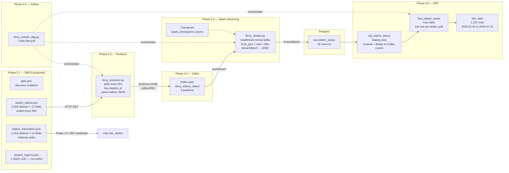
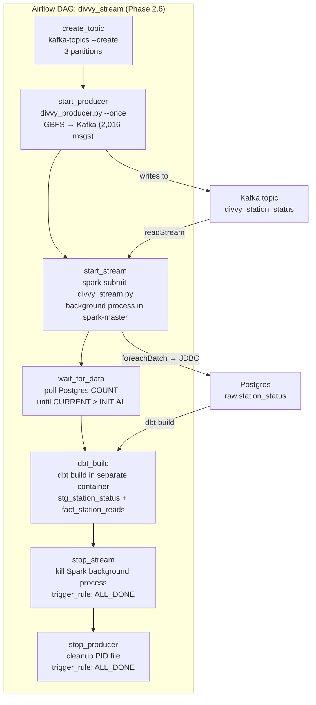
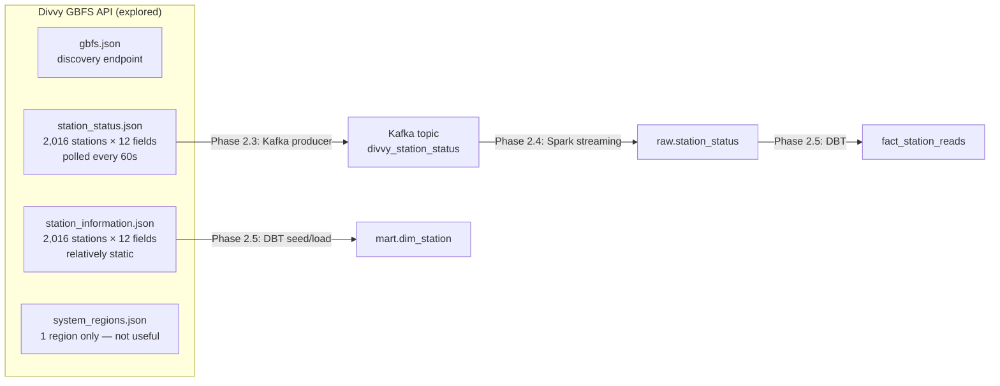
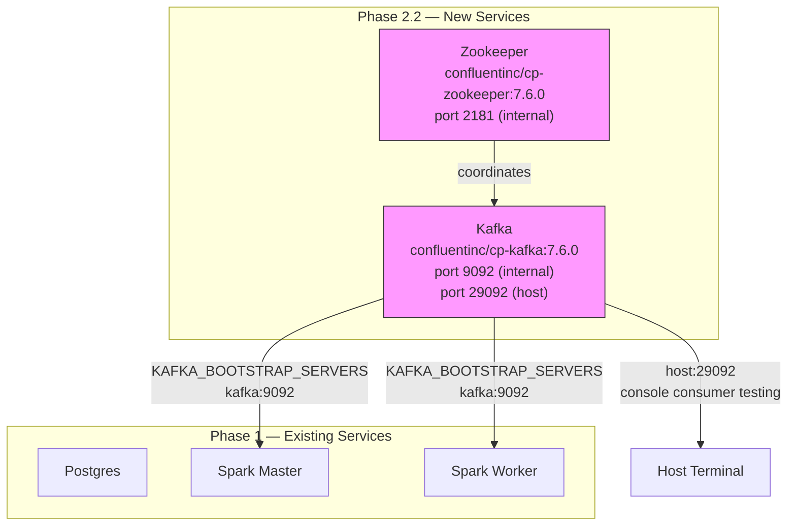
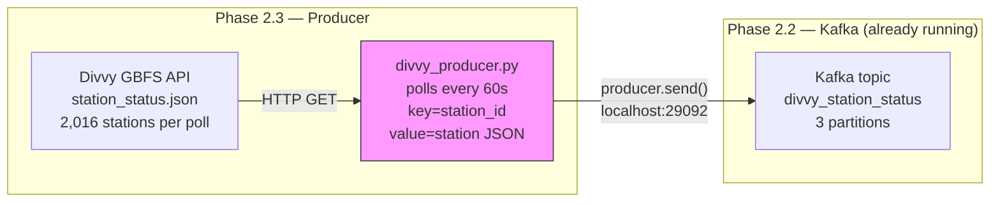
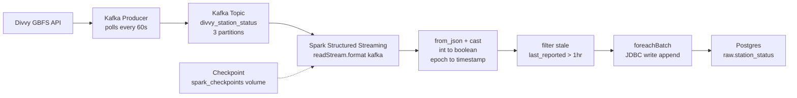
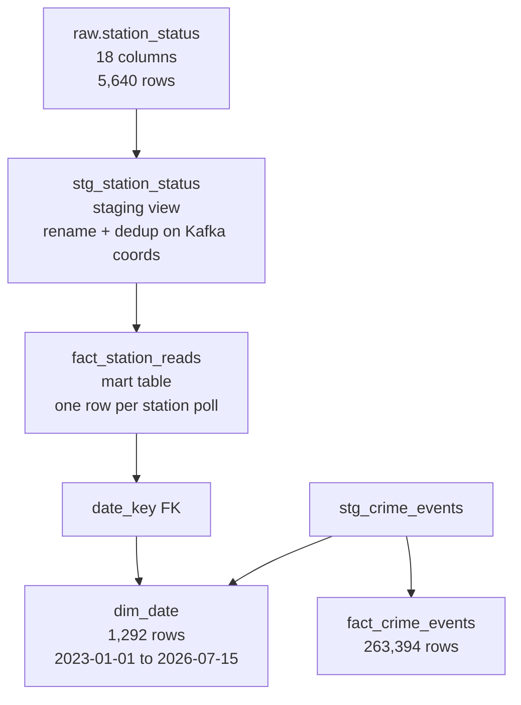
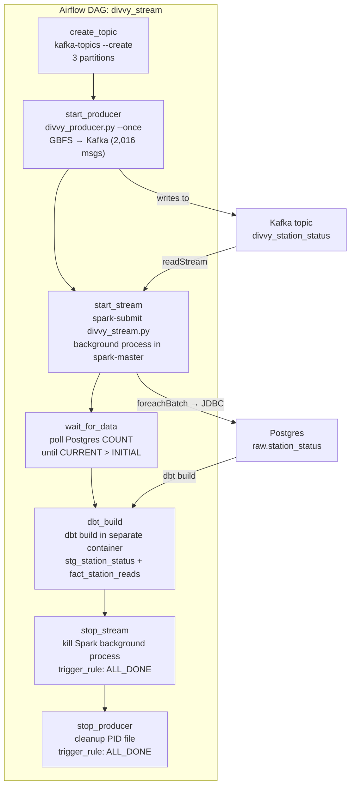

# Phase 2 — Streaming Pipeline (Divvy GBFS → Kafka → Spark → DBT)

> **Status:** Complete / Verified on 2026-07-16
> **Phase gate:** `docker compose up` includes Kafka + Zookeeper, producer running, Spark streaming writes to `raw.station_status`, DBT builds `fact_station_reads`, queryable analytics ("avg bikes available at station X over last hour").

## Summary

Phase 2 built the real-time streaming half of the pipeline: live Divvy bike-share station status is polled from the GBFS API, published to Kafka, consumed by Spark Structured Streaming, landed in Postgres, and modeled by DBT into an analytics-ready mart — all orchestrated by an Airflow DAG. The phase was executed in six sub-phases over two days (2026-07-15 and 2026-07-16):

- **2.1 (2026-07-15)** — Explored the Divvy GBFS live API, documented the schema of 2,016 stations, and surfaced 4 design-changing quirks (string station_id, integer booleans, optional scooter fields, stale-station filtering).
- **2.2 (2026-07-15)** — Added Kafka + Zookeeper to `docker-compose.yml` (Confluent Platform 7.6.0), created the `divvy_station_status` topic, verified message round-trip.
- **2.3 (2026-07-15)** — Built `kafka/producers/divvy_producer.py` polling GBFS every 60s, publishing 2,016 station readings per poll keyed by `station_id` across 3 partitions.
- **2.4 (2026-07-15)** — Built `spark/jobs/divvy_stream.py` Structured Streaming consumer: Kafka → `from_json` → cast/filter → `foreachBatch` JDBC → `raw.station_status`.
- **2.5 (2026-07-16)** — Built DBT staging (`stg_station_status`) + mart (`fact_station_reads`) models, expanded `dim_date` to span both crime + station dates. All 59 tests pass.
- **2.6 (2026-07-16)** — Built `airflow/dags/divvy_stream_dag.py` orchestrating the full streaming lifecycle in 7 tasks. End-to-end DAG run succeeds; Phase 2 gate met.

### Phase 2 Architecture (End-to-End)





**For detailed architecture diagrams** (how files connect to containers, how images are built, how services depend on each other), see `docs/wiki/architecture.md`. That file is the permanent reference; this doc is the phase snapshot.

## Files Created/Modified (Phase 2 Total)

| File | Action | Sub-phase | Purpose |
|---|---|---|---|
| `docs/wiki/data-sources.md` | Modified | 2.1 | Expanded Divvy GBFS section from 7-line summary to full schema: 12 feeds, station_status fields (12 mandatory + 2 optional), station_information fields, pipeline implications |
| `docker-compose.yml` | Modified | 2.2, 2.3, 2.4, 2.6 | Added zookeeper + kafka services, 3 named volumes, `KAFKA_BOOTSTRAP_SERVERS` env on Spark services, `spark_checkpoints` volume, `./kafka:/opt/airflow/kafka_scripts` mount (renamed from `kafka` to avoid package shadowing) |
| `docs/wiki/kafka.md` | Modified | 2.2 | Expanded from 25-line stub to full reference: setup table, Confluent vs Bitnami rationale, single-broker overrides, all commands, key concepts |
| `kafka/producers/divvy_producer.py` | Created | 2.3 | GBFS → Kafka producer: polls every 60s, key=station_id, value=full station JSON. Graceful shutdown, retry on connect, consistent poll cadence. Supports `--once`, `--interval`, `--bootstrap` |
| `pyproject.toml` / `uv.lock` | Modified | 2.3 | Added `kafka-python` 3.0.8 to host venv |
| `airflow/requirements.txt` | Modified | 2.3 | Added `kafka-python` for Phase 2.6 (DAG runs producer via Airflow) |
| `spark/jobs/divvy_stream.py` | Created | 2.4 | Structured Streaming consumer: `readStream.format("kafka")` → `from_json` typed schema → cast (int→boolean, epoch→timestamp) → filter stale → `foreachBatch` JDBC write to `raw.station_status`. Supports `--once`, `--bootstrap`. 60s trigger, checkpoint at `/opt/spark/checkpoints/divvy_stream` |
| `spark/Dockerfile` | Modified | 2.4, 2.6 | Added 4 Kafka connector JARs (spark-sql-kafka-0-10_2.12-3.5.1, spark-token-provider-kafka-0-10_2.12-3.5.1, kafka-clients-3.5.1, commons-pool2-2.11.1) + checkpoint directory with spark ownership; later added `COPY entrypoint.sh`, `USER root`, `ENTRYPOINT` for checkpoint chown on every start |
| `spark/entrypoint.sh` | Created | 2.6 | Chowns `/opt/spark/checkpoints` to spark:spark before dropping to spark user via gosu (named volumes mount as root) |
| `raw.station_status` (Postgres) | Created | 2.4 | 18-column table: 14 station fields + 3 Kafka metadata + 1 ingest timestamp |
| `dbt/models/staging/stg_station_status.sql` | Created | 2.5 | Staging view on `raw.station_status`: renames `last_reported`→`reported_at`, `ingest_timestamp`→`ingested_at`, deduplicates on Kafka coordinates (partition + offset), casts all types explicitly |
| `dbt/models/marts/fact_station_reads.sql` | Created | 2.5 | Mart table: one row per station poll, `date_key` FK to `dim_date`, all availability counts, boolean status flags, derived `total_vehicles_available` (bikes + ebikes + COALESCE(scooters, 0)), Kafka traceability columns. Filters null station_id/reported_at |
| `dbt/models/marts/dim_date.sql` | Modified | 2.5 | Now spans both crime + station dates via UNION ALL of min/max from `stg_crime_events` and `stg_station_status`, then `date_bounds` CTE. Generates 1,292 rows (2023-01-01 through 2026-07-15) |
| `dbt/models/staging/schema.yml` | Modified | 2.5 | Added `station_status` to `raw` source (with column documentation), added `stg_station_status` model with tests (not_null on station_id/reported_at/is_renting/is_returning, expect_between 0-100 on bikes/docks) |
| `dbt/models/marts/schema.yml` | Modified | 2.5 | Updated `dim_date` description ("spanning all fact tables") + year test bounds (2023–2026), added `fact_station_reads` model with tests (not_null, expect_between, relationships to dim_date) |
| `airflow/dags/divvy_stream_dag.py` | Created | 2.6 | Airflow DAG: 7-task streaming lifecycle (create_topic → start_producer → start_stream → wait_for_data → dbt_build → stop_stream → stop_producer) |
| `airflow/Dockerfile` | Modified | 2.6 | Switched from `uv pip install --system` to `pip install` as airflow user (uv couldn't create `kafka` directory in site-packages; apache/airflow image refuses pip as root) |

---

## Phase 2.1 — Divvy GBFS Data Source Exploration

> **Date:** 2026-07-15 · **Status:** Complete / Verified

### What Was Built

No infrastructure built in this phase. This was a read-only exploration of the Divvy GBFS (General Bikeshare Feed Specification) live API — the streaming data source that Phase 2.2–2.6 pipes through the pipeline. Fetched all relevant feeds, analyzed the schema of 2,016 stations, and identified 4 quirks that change the plan's downstream design.



### Files Created/Modified

| File | Action | Purpose |
|---|---|---|
| `docs/wiki/data-sources.md` | Modified | Expanded Divvy GBFS section from 7-line summary to full schema: 12 feeds, station_status fields (12 mandatory + 2 optional), station_information fields, pipeline implications |

### Key Findings (design-changing)

| # | Finding | Impact on Plan | Fix |
|---|---|---|---|
| 1 | `station_id` is mixed format: 667 UUIDs + 1,349 numeric strings | Plan's DBT model had `station_id::bigint` — will fail on UUID IDs | Keep `station_id` as string throughout the pipeline |
| 2 | `is_renting`/`is_returning`/`is_installed` are integers 0/1, not booleans | Plan assumed booleans; Spark/DBT needs explicit cast | `CAST(col AS BOOLEAN)` in Spark (0→false, 1→true) |
| 3 | `num_scooters_available`/`num_scooters_unavailable` are optional | Spark schema with strict mode will fail on missing fields | Use nullable schema fields, tolerate absence |
| 4 | One station had `last_reported: 86400` (Jan 2, 1970 — dead station) | Stale data pollutes fact table | Filter `last_reported` to recent threshold |

Additional findings: 2,016 stations in both status and information (perfect 1:1 match); `system_regions` has only 1 entry (Evanston) — not useful for community area mapping; no community area in GBFS — will need spatial join of station lat/lon to community area boundaries later; GBFS version 1.1, TTL 60s, timezone America/Chicago, no auth required.

### Errors Hit

No errors — this was a read-only exploration phase. The 4 findings above are design-changing discoveries, not runtime errors.

### Decisions Made

| Decision | Choice | Why |
|---|---|---|
| Which feeds to use | `station_status` (streaming) + `station_information` (dimension) | station_status has live bike/dock availability — the core signal. station_information has static metadata (name, lat/lon, capacity) — dimension table. Other feeds (free_bike_status, system_alerts, etc.) not needed for Phase 2. |
| station_id type | String (not bigint) | 667 UUIDs + 1,349 numeric strings — bigint cast would fail on UUIDs |
| Stale station handling | Filter by `last_reported` threshold | One station had epoch 86400 (1970) — clearly decommissioned. Will filter in Spark or DBT. |
| system_regions | Not used | Only 1 region (Evanston) — not useful for community area mapping. Will use spatial join on lat/lon instead. |

### Lessons

- **Always inspect live data before coding** — the plan assumed bigint station_id and boolean fields. Five minutes of API exploration saved hours of debugging downstream.
- **GBFS 1.1 uses integers for booleans** — `is_renting`, `is_returning`, `is_installed` are 0/1 integers, not JSON booleans. Always check actual API responses, not just spec docs.
- **Optional fields are common in GBFS** — not all stations report all fields. Spark's schema inference or strict schema will fail. Use nullable fields.

### Verification

Fetched all 4 GBFS endpoints live and analyzed response structure:

```
station_status: 2,016 stations
station_information: 2,016 stations
station_id formats: 667 UUIDs, 1,349 numeric strings
Fields in ALL stations: 12 (station_id, num_bikes_available, num_bikes_disabled,
  num_docks_available, num_docks_disabled, is_installed, is_renting, is_returning,
  last_reported, legacy_id, num_ebikes_available, eightd_has_available_keys)
Optional fields: num_scooters_available, num_scooters_unavailable
is_renting values: {0, 1}  (integers, not booleans)
is_returning values: {0, 1}
is_installed values: {0, 1}
last_reported range: 1970-01-02 to 2026-07-15 (one dead station at epoch 86400)
Status-only IDs (not in info): 0
Info-only IDs (not in status): 0
```

- **All feeds reachable:** 200 OK on all endpoints
- **Station count consistent:** 2,016 in both status and information (perfect 1:1)
- **Schema documented:** 12 mandatory + 2 optional fields identified for station_status
- **Quirks identified:** 4 design-changing findings documented in changelog + data-sources.md

---

## Phase 2.2 — Kafka + Zookeeper Docker Services

> **Date:** 2026-07-15 · **Status:** Complete / Verified

### What Was Built

Added Kafka and Zookeeper to `docker-compose.yml` as the streaming backbone for Phase 2. Both services running and healthy. Verified end-to-end: created the `divvy_station_status` topic, produced test JSON messages, consumed them back — round-trip works via both internal (Docker network) and external (host) listeners.



Kafka + Zookeeper are new. Spark services now have `KAFKA_BOOTSTRAP_SERVERS` env var ready for the Phase 2.4 streaming job. No other Phase 1 services were modified.

### Files Created/Modified

| File | Action | Purpose |
|---|---|---|
| `docker-compose.yml` | Modified | Added 2 new services (zookeeper, kafka) + 3 named volumes (kafka_data, zookeeper_data, zookeeper_log). Updated header comment. Added `KAFKA_BOOTSTRAP_SERVERS: kafka:9092` env var to both spark-master and spark-worker |
| `docs/wiki/kafka.md` | Modified | Expanded from 25-line stub to full reference: setup table, Confluent vs Bitnami rationale, single-broker overrides, all commands, key concepts |

### Services Added

| Service | Image | Ports | Healthcheck |
|---|---|---|---|
| `zookeeper` | `confluentinc/cp-zookeeper:7.6.0` | 2181 (internal only) | `echo srvr \| nc localhost 2181` |
| `kafka` | `confluentinc/cp-kafka:7.6.0` | 9092 (internal), 29092 (host) | `kafka-broker-api-versions --bootstrap-server localhost:9092` |

### Errors Hit

No errors. All services started cleanly on first attempt.

### Decisions Made

| Decision | Choice | Why |
|---|---|---|
| Kafka image | `confluentinc/cp-kafka:7.6.0` | Bitnami images no longer free (commercial subscription since 2026). Confluent is free, stable, production-hardened. Pinned for reproducibility. |
| Zookeeper vs KRaft | Zookeeper | KRaft is newer, but learning Zookeeper first is more educational — most existing Kafka deployments still use it. |
| Listeners | Two (internal + host) | Internal (`kafka:9092`) for Spark/producer inside Docker network. Host (`localhost:29092`) for `kafka-console-consumer` testing from terminal. |
| Partitions | 3 for `divvy_station_status` | Parallelism for Spark streaming. `station_id` as key → same station to same partition (ordered processing). |
| Auto-create topics | Enabled | Dev convenience — producer creates topic on first message. In production, disable and create explicitly. |
| Replication factor | 1 for all | Single broker — no redundancy. Production would use 3. |

### Lessons

- **Single-broker Kafka needs replication overrides** — `KAFKA_OFFSETS_TOPIC_REPLICATION_FACTOR`, `KAFKA_TRANSACTION_STATE_LOG_REPLICATION_FACTOR`, and `KAFKA_TRANSACTION_STATE_LOG_MIN_ISR` all default to 3. With a single broker, they must be set to 1 or Kafka silently fails to create internal topics.
- **Two listeners for dev Kafka** — internal (`kafka:9092`) for Docker-network services, external (`localhost:29092`) for host-side testing. Without the host listener, can't run console consumer from terminal.
- **Healthcheck needs `start_period: 20s`** — Kafka takes ~30-40s to fully start. Without the grace period, healthcheck fails before Kafka is ready. `kafka-broker-api-versions` is more reliable than a TCP port check.

### Verification

```bash
# YAML syntax valid
$ docker compose config --quiet
(no output = valid)

# Both services healthy
$ docker compose ps zookeeper kafka
chicago-data-pipeline-zookeeper-1   Up (healthy)
chicago-data-pipeline-kafka-1       Up (healthy)

# Created topic
$ docker compose exec kafka kafka-topics --create --topic divvy_station_status \
    --partitions 3 --replication-factor 1 --bootstrap-server localhost:9092
Created topic divvy_station_status.

# Produced test message
$ echo '{"station_id":"test-001","num_bikes_available":5,...}' | \
    docker compose exec -T kafka kafka-console-producer --topic divvy_station_status ...

# Consumed it back
$ docker compose exec kafka kafka-console-consumer --topic divvy_station_status \
    --from-beginning --max-messages 1 --bootstrap-server localhost:9092
{"station_id":"test-001","num_bikes_available":5,...}
Processed a total of 1 messages

# Host listener (port 29092) also works
$ echo '{"station_id":"test-002",...}' | \
    docker compose exec -T kafka kafka-console-producer --topic divvy_station_status \
    --bootstrap-server localhost:29092
# Consumed both messages successfully
```

- **Zookeeper healthy:** ~10s startup
- **Kafka healthy:** ~40s startup
- **Topic created:** 3 partitions, replication factor 1
- **Message round-trip:** produce → consume verified on both listeners
- **Test topic deleted:** clean slate for Phase 2.3 producer

---

## Phase 2.3 — Kafka Producer

> **Date:** 2026-07-15 · **Status:** Complete / Verified

### What Was Built

Created `kafka/producers/divvy_producer.py` — a Python script that polls the Divvy GBFS `station_status.json` feed every 60 seconds and publishes each station's status as a JSON message to the Kafka topic `divvy_station_status`. Verified end-to-end: 2,016 real station readings per poll, distributed across 3 partitions by station_id key, consumed back via console consumer. The producer runs on the host (connecting to `localhost:29092`). In Phase 2.6, it runs inside the Airflow container (connecting to `kafka:9092`).



### Files Created/Modified

| File | Action | Purpose |
|---|---|---|
| `kafka/producers/divvy_producer.py` | Created | GBFS → Kafka producer: polls every 60s, key=station_id, value=full station JSON. Graceful shutdown, retry on connect, consistent poll cadence. Supports `--once` (single poll + exit), `--interval` (custom cadence), `--bootstrap` (Kafka address) |
| `pyproject.toml` / `uv.lock` | Modified | Added `kafka-python` 3.0.8 to host venv |
| `airflow/requirements.txt` | Modified | Added `kafka-python` for Phase 2.6 (DAG will run producer via Airflow) |
| `docker-compose.yml` | Modified | Added `./kafka:/opt/airflow/kafka` volume mount to Airflow common config (renamed to `kafka_scripts` in Phase 2.6 to avoid package shadowing) |

### Errors Hit

| # | Error | Root Cause | Fix |
|---|---|---|---|
| 1 | `ImportError: cannot import name 'NoBrokersAvailable'` | Removed in kafka-python 3.0.x | Catch `KafkaError` (base class) instead |
| 2 | Auto-created topic had 1 partition (not 3) | `KAFKA_NUM_PARTITIONS` env var not applied by Confluent image — `server.properties` still showed `num.partitions=1` | Explicitly create topic with `kafka-topics --create --partitions 3`. Auto-create uses broker defaults; explicit creation is the correct approach for custom partition counts |

### Decisions Made

| Decision | Choice | Why |
|---|---|---|
| Message key | `station_id` (string) | Same station → same partition → chronological order per station. Critical for time-series analysis. |
| Delivery guarantee | `acks="all"` | Safest — waits for all in-sync replicas. For single broker, equivalent to acks=1. |
| Shutdown | SIGINT/SIGTERM → flag → flush → close | Graceful shutdown prevents message loss. Pending messages flushed before exit. |
| Poll cadence | `sleep = interval - elapsed` | Prevents drift — consistent intervals regardless of fetch time. |
| Topic creation | Explicit (3 partitions) | Auto-create defaults to 1 partition; explicit creation controls partition count. Auto-create still enabled as fallback. |
| `--once` flag | Single poll + exit | Testing without running infinite loop; later used by Airflow DAG (Phase 2.6). |

### Lessons

- **Auto-create uses broker defaults, not your desired config** — `KAFKA_NUM_PARTITIONS` env var didn't work with the Confluent image. For custom partition counts, create topics explicitly with `kafka-topics --create --partitions N`.
- **kafka-python 3.0.x removed `NoBrokersAvailable`** — the exception hierarchy changed. Use `KafkaError` (base class) for catch-all error handling. Always check the installed version's API.
- **Key-based partitioning distributes evenly** — with 3 partitions and station_id as key, messages split 720/661/635 (not exactly equal, but close). The hash of station_id determines the partition.

### Verification

```bash
# Single poll test
$ python kafka/producers/divvy_producer.py --once
Fetched 2016 stations (feed last_updated: 2026-07-15T15:46:58+00:00)
Poll #1: sent 2016 messages in 0.88s
Producer stopped after 1 polls.

# Topic with 3 partitions
$ docker compose exec kafka kafka-topics --describe --topic divvy_station_status
PartitionCount: 3  ReplicationFactor: 1
Partition: 0  Leader: 1001  Replicas: 1001  Isr: 1001
Partition: 1  Leader: 1001  Replicas: 1001  Isr: 1001
Partition: 2  Leader: 1001  Replicas: 1001  Isr: 1001

# Message distribution across partitions
$ docker compose exec kafka kafka-run-class kafka.tools.GetOffsetShell ...
divvy_station_status:0:720
divvy_station_status:1:661
divvy_station_status:2:635

# Real Divvy data verified
$ docker compose exec kafka kafka-console-consumer --topic divvy_station_status --from-beginning --max-messages 2
{"station_id": "a3afbe2e-...", "num_bikes_available": 7, "num_docks_available": 7, "is_renting": 1, ...}
{"station_id": "2136953562...", "num_bikes_available": 2, "num_docks_available": 8, "is_renting": 1, ...}

# Continuous mode (5s interval, 10s timeout)
$ timeout 10 python kafka/producers/divvy_producer.py --interval 5
Poll #1: sent 2016 messages in 0.56s
Poll #2: sent 2016 messages in 0.52s
# Graceful shutdown on SIGTERM
```

- **2,016 stations per poll** — matches GBFS feed count from Phase 2.1
- **3 partitions** — messages distributed 720/661/635 by station_id hash
- **Real data** — station_id, bikes, docks, is_renting, last_reported all present
- **Continuous mode** — 2 polls in 10s, graceful shutdown on SIGTERM
- **Total tested**: 6,048 messages across 3 polls, all consumed successfully

---

## Phase 2.4 — Spark Structured Streaming

> **Date:** 2026-07-15 · **Status:** Complete / Verified

### What Was Built

Built the Spark Structured Streaming consumer that reads Divvy station status messages from Kafka, parses JSON payloads with a typed schema, casts types (int→boolean, epoch→timestamp), filters stale stations, and writes each micro-batch to Postgres `raw.station_status` via `foreachBatch` + JDBC. Verified end-to-end: producer → Kafka → Spark streaming → Postgres with row count growing continuously (1,128 → 5,640 rows over 5 micro-batches).



Spark Structured Streaming consumes from Kafka, transforms each message, and writes micro-batches to Postgres via the `foreachBatch` JDBC bridge. The checkpoint volume stores Kafka offsets for fault recovery.

### Files Created/Modified

| File | Action | Purpose |
|---|---|---|
| `spark/jobs/divvy_stream.py` | Created | Structured Streaming consumer: `readStream.format("kafka")` → `from_json()` with typed schema → cast/filter → `foreachBatch` JDBC write to `raw.station_status`. Supports `--once` (single batch test), `--bootstrap` (custom Kafka address). 60s trigger matches producer poll interval. Checkpoint at `/opt/spark/checkpoints/divvy_stream` for fault recovery. |
| `spark/Dockerfile` | Modified | Added 4 Kafka connector JARs (spark-sql-kafka-0-10_2.12-3.5.1, spark-token-provider-kafka-0-10_2.12-3.5.1, kafka-clients-3.5.1, commons-pool2-2.11.1) + checkpoint directory creation with spark user ownership |
| `docker-compose.yml` | Modified | Added `spark_checkpoints` named volume + mounted to spark-master at `/opt/spark/checkpoints` |
| `raw.station_status` (Postgres) | Created | 18-column table: 14 station data fields + 3 Kafka metadata (partition, offset, timestamp) + 1 ingest timestamp |

### Errors Hit

| # | Error | Root Cause | Fix |
|---|---|---|---|
| 1 | `mkdir of file:/opt/spark/checkpoints/divvy_stream failed` | Named volume mounted as root:root, but Spark runs as user `spark` (UID 185) | `chown -R spark:spark /opt/spark/checkpoints` + added `RUN mkdir -p /opt/spark/checkpoints && chown spark:spark /opt/spark/checkpoints` to Dockerfile so future volume creations get correct ownership |
| 2 | `spark.sql.adaptive.enabled is not supported in streaming DataFrames` | AQE doesn't apply to streaming queries — only batch | Warning only, not an error. Spark automatically disables AQE for streaming. No action needed. |

### Decisions Made

| Decision | Choice | Why |
|---|---|---|
| Kafka connector JARs | Baked into image (4 JARs) | Same approach as JDBC driver — reliable, offline, fast startup. Alternative: `--packages` at runtime (needs Maven, slow, fragile). |
| foreachBatch for JDBC | Standard pattern | JDBC has no native streaming sink. foreachBatch bridges: each micro-batch is a static DataFrame → standard JDBC writer works. |
| Checkpoint location | Named volume `spark_checkpoints` | Persists Kafka offsets across container restarts. Without it, restart re-reads all messages from `earliest`, causing duplicates. |
| Stale station filter | `last_reported > now() - 1 hour` | One station had `last_reported: 86400` (Jan 2 1970). Filtering at 1 hour drops dead stations. Result: 2016 → 1128 rows per poll (888 stale stations filtered, 44%). |
| is_* fields | `CAST(int AS BOOLEAN)` in Spark | GBFS returns 0/1 integers, not booleans. Cast in Spark so Postgres receives proper boolean. |
| station_id | StringType throughout | Mixed format (667 UUIDs + 1349 numeric strings). Casting to bigint would fail on UUIDs. |
| Optional scooter fields | Nullable in schema | Not all stations have scooters. `from_json` returns null for missing fields. 1099/1128 non-null in observed data. |
| Trigger interval | 60 seconds | Matches producer poll interval. Each micro-batch processes messages that arrived since the last batch. |
| Kafka metadata columns | partition, offset, timestamp | Traceability — can trace any row back to its Kafka position. Useful for debugging duplicates or gaps. |

### Lessons

- **apache/spark doesn't include Kafka connector** — the official image ships only core Spark JARs. Structured Streaming + Kafka needs 4 additional JARs. Baking them into the Dockerfile is the same pattern as the PostgreSQL JDBC driver.
- **Named volumes inherit ownership from the image directory** — when a named volume is first created, Docker copies permissions from the container's directory. Create the directory with correct ownership in the Dockerfile BEFORE the volume mounts.
- **foreachBatch is the bridge for streaming-to-JDBC** — JDBC has no native Structured Streaming sink. foreachBatch gives each micro-batch as a static DataFrame for the standard batch JDBC writer. This is the official Spark-recommended pattern.
- **Stale data filtering matters** — 888 of 2016 stations (44%) had stale `last_reported` timestamps. Filter early in the pipeline (Spark), not late (DBT).
- **AQE doesn't apply to streaming** — `spark.sql.adaptive.enabled` is silently ignored for streaming queries. Don't rely on AQE for streaming partition coalescing.

### Verification

```bash
# Single batch test (--once mode)
$ python kafka/producers/divvy_producer.py --once --bootstrap localhost:29092
# → Fetched 2,016 stations, sent 2,016 messages

$ docker compose exec spark-master /opt/spark/bin/spark-submit --master local[*] /opt/spark/jobs/divvy_stream.py --once
# → [batch 0] writing 1128 rows to raw.station_status
# → [batch 0] write complete — 1128 rows inserted

# Row count after single batch
$ SELECT COUNT(*) FROM raw.station_status;
# → 1128

# Boolean cast verification
$ SELECT is_installed, is_renting, is_returning, COUNT(*) FROM raw.station_status GROUP BY 1,2,3;
# → t,t,t: 1127  |  t,f,f: 1  (correct — 0→false, 1→true)

# Optional scooter fields
$ SELECT COUNT(*), COUNT(num_scooters_available) FROM raw.station_status;
# → 1128 total, 1099 non-null (tolerated absence correctly)

# Continuous mode (producer + streaming both running)
# After 150s:
$ SELECT COUNT(*) FROM raw.station_status;
# → 5640 (grew from 1128 — 4 additional micro-batches)

# Multiple batches visible by ingest timestamp
$ SELECT DATE_TRUNC('minute', ingest_timestamp), COUNT(*) FROM raw.station_status GROUP BY 1 ORDER BY 1;
# → 5 rows, one per minute, ~1128 rows each
```

- **Single batch:** 2,016 Kafka messages → 1,128 rows inserted (888 stale stations filtered, 44%)
- **Boolean casts:** is_renting/is_returning/is_installed show true/false correctly (0→false, 1→true)
- **Optional scooter fields:** 1,099/1,128 non-null — missing fields handled as null
- **Continuous mode:** 5 micro-batches in 5 minutes, ~1,128 rows per batch, 5,640 total
- **Row count growth:** 1,128 → 5,640 over 150s — pipeline operates continuously

---

## Phase 2.5 — DBT Stream Models

> **Date:** 2026-07-16 · **Status:** Complete / Verified

### What Was Built

Built DBT staging and mart models for the Divvy station status streaming data. `stg_station_status` is a staging view on `raw.station_status` that renames columns and deduplicates on Kafka coordinates. `fact_station_reads` is a mart table with one row per station poll, a `date_key` FK to `dim_date`, and a derived `total_vehicles_available` column. Updated `dim_date` to span both crime (2023) and station read (2026) dates. All 59 DBT tests pass, and the analytics query ("avg bikes available at station X") returns correct results.



The streaming data flows from `raw.station_status` (written by Spark Structured Streaming in Phase 2.4) through `stg_station_status` (light cleaning + dedup) into `fact_station_reads` (analytics-ready mart). `dim_date` now spans both fact sources so FK relationships resolve for all fact tables.

### Files Created/Modified

| File | Action | Purpose |
|---|---|---|
| `dbt/models/staging/stg_station_status.sql` | Created | Staging view on `raw.station_status`: renames `last_reported`→`reported_at`, `ingest_timestamp`→`ingested_at`, deduplicates on `kafka_partition, kafka_offset` (Kafka message uniqueness), casts all types explicitly |
| `dbt/models/marts/fact_station_reads.sql` | Created | Mart table: one row per station poll. Includes `date_key` (FK to dim_date), `reported_at` (station's self-reported time), `ingested_at` (pipeline receive time), all availability counts, boolean status flags, derived `total_vehicles_available` (bikes + ebikes + COALESCE(scooters, 0)), and Kafka traceability columns. Filters null station_id/reported_at |
| `dbt/models/marts/dim_date.sql` | Modified | Now spans both crime + station dates. Uses UNION ALL of min/max from `stg_crime_events` and `stg_station_status`, then `date_bounds` CTE to get overall min/max. Generates 1,292 rows (2023-01-01 through 2026-07-15) |
| `dbt/models/staging/schema.yml` | Modified | Added `station_status` to `raw` source (with column documentation), added `stg_station_status` model definition with tests (not_null on station_id/reported_at/is_renting/is_returning, expect_between 0-100 on bikes/docks) |
| `dbt/models/marts/schema.yml` | Modified | Updated `dim_date` description ("spanning all fact tables") + year test bounds (2023–2026), added `fact_station_reads` model definition with tests (not_null, expect_between, relationships to dim_date) |

### Errors Hit

No errors encountered. All 59 DBT tests passed on first `dbt build` run.

### Decisions Made

| Decision | Choice | Why |
|---|---|---|
| Dedup key | Kafka partition + offset | Uniquely identifies each Kafka message. Same pattern as crime's `DISTINCT ON (id)` but adapted for streaming data where Kafka coordinates are the natural unique key. |
| Column renames | `last_reported`→`reported_at`, `ingest_timestamp`→`ingested_at` | Clearer naming: `reported_at` = when station reported, `ingested_at` = when pipeline received it. Matches `occurred_at`/`updated_at` pattern from crime staging. |
| Fact table grain | One row per station poll (Kafka message) | Most granular level — supports any aggregation (per station, per time window, per status). No pre-aggregation to avoid losing detail. |
| Derived column | `total_vehicles_available` = bikes + ebikes + COALESCE(scooters, 0) | Convenience for analytics. COALESCE on scooters since it's nullable. |
| dim_date expansion | UNION ALL of min/max from both sources | Single date dimension serves all fact tables. Without this, `fact_station_reads.date_key` FK test would fail (2026 dates missing from dim_date). |
| No unique test on station_id | Not unique — multiple polls per station | Unlike `fact_crime_events.crime_id` (unique), station_id repeats across polls. Grain is station + reported_at, not station alone. |

### Lessons

- **dim_date must span all fact tables** — when adding a second fact table with different date ranges, the date dimension must cover both. Otherwise the FK relationship test fails. Use UNION ALL of min/max from all sources.
- **Streaming fact tables have different grain than batch** — crime facts are one row per event (unique ID). Station reads are one row per poll (repeating station_id). Don't blindly copy the unique test pattern from batch fact tables.
- **Deduplication keys differ by source** — crime deduplicates on `id` (business key). Streaming data deduplicates on Kafka coordinates (partition + offset) since those are the system-of-record unique identifiers.

### Verification

```bash
# Run dbt build (all models + tests)
$ docker run --rm --network chicago-data-pipeline_default \
    -v ./dbt:/opt/airflow/dbt \
    -v ./airflow/dbt_profiles:/opt/airflow/dbt_profiles \
    -e POSTGRES_USER=chicago -e POSTGRES_PASSWORD=chicago1234 -e POSTGRES_DB=chicago_analytics \
    chicago-data-pipeline-dbt:latest \
    dbt build --project-dir /opt/airflow/dbt --profiles-dir /opt/airflow/dbt_profiles

# Result:
# Finished running 1 seed, 5 table models, 51 data tests, 2 view models in 3.50s
# Completed successfully
# Done. PASS=59 WARN=0 ERROR=0 SKIP=0 TOTAL=59

# Fact table coverage
$ SELECT count(*), count(DISTINCT station_id), min(reported_at), max(reported_at)
  FROM mart.fact_station_reads;
# → 5640 rows, 1128 unique stations, 2026-07-15 15:55:07 to 2026-07-15 16:08:49

# dim_date now spans both sources
$ SELECT count(*), min(date_key), max(date_key) FROM mart.dim_date;
# → 1292 rows, 2023-01-01, 2026-07-15

# Analytics query — avg bikes available per station (Phase 2 gate query)
$ SELECT station_id, count(*) AS polls,
         round(avg(num_bikes_available), 2) AS avg_bikes_available,
         round(avg(total_vehicles_available), 2) AS avg_total_vehicles
  FROM mart.fact_station_reads
  GROUP BY station_id ORDER BY avg_bikes_available DESC LIMIT 5;
# → Top station: 42.0 avg bikes, 75.0 avg total vehicles, 5 polls
```

- **All 59 DBT tests pass:** 1 seed, 5 table models, 2 view models, 51 data tests — zero errors
- **fact_station_reads:** 5,640 rows, 1,128 unique stations, 5 polls per station
- **dim_date:** 1,292 rows spanning 2023-01-01 through 2026-07-15 (covers both crime + station data)
- **Analytics query verified:** "avg bikes available per station" returns correct results
- **FK relationship test passes:** `fact_station_reads.date_key → dim_date.date_key`

---

## Phase 2.6 — Airflow Stream DAG

> **Date:** 2026-07-16 · **Status:** Complete / Verified

### What Was Built

Built `divvy_stream_dag.py` — an Airflow DAG that orchestrates the full streaming lifecycle: create Kafka topic → run producer (single poll) → start Spark Structured Streaming → wait for data in Postgres → run DBT build → stop Spark stream → cleanup. All 7 tasks succeed end-to-end. `fact_station_reads` has 2,001 rows with 1,125 unique stations, and analytics queries return correct results. The DAG runs the producer in `--once` mode (single poll, ~2,016 messages to Kafka), then starts Spark Streaming as a background process inside spark-master. The stream consumes from Kafka, writes to Postgres via foreachBatch+JDBC. `wait_for_data` polls until new rows appear, then DBT builds the marts. Cleanup tasks use `trigger_rule=ALL_DONE` to ensure no orphaned processes remain.



### Files Created/Modified

| File | Action | Purpose |
|---|---|---|
| `airflow/dags/divvy_stream_dag.py` | Created | Airflow DAG: 7-task streaming lifecycle (create_topic → start_producer → start_stream → wait_for_data → dbt_build → stop_stream → stop_producer) |
| `airflow/Dockerfile` | Modified | Switched from `uv pip install --system` to `pip install` as airflow user. Removed uv COPY. The apache/airflow image uses a venv at `/home/airflow/.local` and refuses pip as root. |
| `spark/Dockerfile` | Modified | Added `COPY entrypoint.sh`, `USER root`, `ENTRYPOINT ["/entrypoint.sh"]`. The entrypoint chowns the checkpoint volume before dropping to spark via gosu. |
| `spark/entrypoint.sh` | Created | Chowns `/opt/spark/checkpoints` to spark:spark before dropping to spark user via gosu (`chown -R spark:spark /opt/spark/checkpoints 2>/dev/null \|\| true` then `exec gosu spark "$@"`). Fixes named volume root ownership on every container start. |
| `docker-compose.yml` | Modified | Renamed kafka mount from `./kafka:/opt/airflow/kafka` to `./kafka:/opt/airflow/kafka_scripts` to avoid shadowing the `kafka-python` package |

### Errors Hit

| # | Error | Root Cause | Fix |
|---|---|---|---|
| 1 | `ModuleNotFoundError: No module named 'kafka'` in Airflow | `kafka-python` in `requirements.txt` but image never rebuilt after Phase 2.3 added it | Rebuilt Airflow image with `--no-cache` |
| 2 | `uv pip install --system` fails to install kafka-python — permission denied creating `/usr/local/lib/python3.11/site-packages/kafka` | uv has a bug/quirk creating certain package directories in the apache/airflow image, even as root | Switched Dockerfile from `uv pip install --system` to `pip install` as the airflow user |
| 3 | `pip install` as root fails with "Please use 'airflow' user to run pip!" | apache/airflow image has a built-in guard that refuses pip as root | Run pip as `USER airflow` — the image uses a venv at `/home/airflow/.local` which is the install target |
| 4 | `kafka-python` installed but `from kafka import KafkaProducer` fails — `kafka.__path__` points to `/opt/airflow/kafka` | `./kafka:/opt/airflow/kafka` volume mount shadows the `kafka` Python package — Python treats the mounted directory as a namespace package | Renamed mount to `./kafka:/opt/airflow/kafka_scripts` in docker-compose.yml + updated DAG's `PRODUCER_SCRIPT` path |
| 5 | Spark streaming fails: `mkdir of /opt/spark/checkpoints/divvy_stream failed` | Named volume `spark_checkpoints` mounts as root:root; Spark runs as spark user and can't create subdirectories | Created `spark/entrypoint.sh` that chowns `/opt/spark/checkpoints` to spark:spark before dropping to spark via gosu. Added `ENTRYPOINT` to Spark Dockerfile. |
| 6 | `start_producer` task fails: `head: cannot open '/tmp/divvy_producer.log'` | Background `nohup` process dies immediately in Airflow's BashOperator; log file never created; `head` returns exit code 1 | Switched producer to `--once` mode (foreground, single poll, exits cleanly). Added `\|\| true` to `head` commands. |
| 7 | `stop_producer` task fails with exit code 1 | `kill` fails (process already dead) and `&&` short-circuits `rm` and `echo` | Changed `&&` to `;` after `kill` so cleanup runs regardless |
| 8 | `wait_for_data` times out — 0 new rows after 5 minutes | Producer died after first poll; Spark checkpoint consumed all Kafka messages in a previous run; no new messages to process | Fixed by `--once` producer mode + wiping checkpoint/table/topic for clean runs |
| 9 | DAG stuck in `queued` state, never picked up by scheduler | Previous failed DAG runs left orphaned task instances blocking the scheduler | `docker compose down` + fresh start clears all Airflow metadata |

### Decisions Made

| Decision | Choice | Why |
|---|---|---|
| Producer mode | `--once` (single poll) | Airflow BashOperator kills background processes when the task shell exits. `nohup`/`disown` don't reliably survive. `--once` runs in foreground, publishes one batch (~2,016 messages), exits cleanly. For 24/7 streaming, run producer as a separate Docker service (Phase 3). |
| Spark stream as background process | `docker exec ... nohup ... &` inside spark-master | Spark Structured Streaming is long-running. We start it as a background process, wait for data, then kill it. The `stop_stream` task uses `trigger_rule=ALL_DONE` to ensure cleanup even on failure. |
| `wait_for_data` logic | Capture INITIAL count, poll until CURRENT > INITIAL | Ensures we wait for NEW data from the producer's poll, not just detect pre-existing data from a previous run. |
| Cleanup trigger rule | `ALL_DONE` for stop_stream and stop_producer | Guarantees no orphaned background processes remain after a DAG run, regardless of where the pipeline failed. |
| Kafka topic creation | Explicit `kafka-topics --create --partitions 3` | Auto-create gives only 1 partition. We need 3 for station_id key partitioning (same station → same partition → ordered processing). `--if-not-exists` makes it idempotent. |
| Airflow pip install | `pip install` as airflow user (not uv, not root) | apache/airflow image refuses pip as root; uv fails to create `kafka` directory. pip as the airflow user installs into the venv at `/home/airflow/.local` reliably. |
| Spark checkpoint fix | Entrypoint script with gosu | Named volumes mount as root:root. The entrypoint chowns the checkpoint dir on every start before dropping to spark user. Survives `docker compose down -v` + up. |

### Lessons

- **Volume mount paths can shadow Python packages** — mounting `./kafka` to `/opt/airflow/kafka` made Python find the empty directory instead of the installed `kafka-python` package. Always check that mount paths don't collide with package names.
- **apache/airflow image has a root pip guard** — it refuses `pip install` as root. The image uses a venv at `/home/airflow/.local`; run pip as the airflow user.
- **`uv pip install --system` can silently fail on certain packages** — uv couldn't create the `kafka` directory in site-packages despite running as root. pip doesn't have this issue. When uv fails, fall back to pip.
- **Airflow BashOperator kills background processes** — `nohup` + `disown` don't reliably survive when the task's shell exits. For long-running processes, either use `--once` mode (run to completion) or manage the process outside Airflow.
- **Named volumes mount as root** — Docker named volumes get root ownership on first mount, regardless of Dockerfile `chown`. Use an entrypoint script to fix permissions on every container start.
- **`kill` with `&&` short-circuits cleanup** — if the process is already dead, `kill` returns non-zero and `&&` skips the `rm` and `echo`. Use `;` to ensure cleanup always runs.

### Verification

```bash
$ docker exec chicago-data-pipeline-airflow-scheduler-1 airflow tasks states-for-dag-run divvy_stream <run_id>
create_topic   | success
start_producer | success
start_stream   | success
wait_for_data  | success
dbt_build      | success
stop_stream    | success
stop_producer  | success

$ SELECT COUNT(*) FROM raw.station_status;
2001

$ SELECT COUNT(*) FROM mart.fact_station_reads;
2001

$ SELECT COUNT(DISTINCT station_id) FROM mart.fact_station_reads;
1125

$ SELECT ROUND(AVG(num_bikes_available),2) AS avg_bikes, ROUND(AVG(num_ebikes_available),2) AS avg_ebikes, COUNT(*) AS station_reads FROM mart.fact_station_reads;
 avg_bikes | avg_ebikes | station_reads
-----------+------------+---------------
      5.55 |       2.37 |          2001
```

- **All 7 DAG tasks succeeded** — create_topic, start_producer, start_stream, wait_for_data, dbt_build, stop_stream, stop_producer
- **raw.station_status**: 2,001 rows (from 2,016 Kafka messages, 15 dropped by stale station filter)
- **fact_station_reads**: 2,001 rows, 1,125 unique stations
- **Analytics query verified**: avg 5.55 bikes, 2.37 ebikes per station read
- **DBT build passed**: all tests pass (stg_station_status + fact_station_reads + all crime models)

---

## Phase 2 Gate Verification

**Phase 2 is COMPLETE.** The Phase 2 gate is met: `docker compose up` → Kafka → producer → Spark streaming → Postgres → DBT → queryable marts.

| Gate Criterion | Result |
|---|---|
| `docker compose up` includes Kafka + Zookeeper | ✅ Both healthy (Zookeeper ~10s, Kafka ~40s startup) |
| Producer running and publishing real Divvy data | ✅ 2,016 stations per poll, key=station_id, 3 partitions (720/661/635) |
| Spark streaming writes to `raw.station_status` | ✅ 1,128 rows per batch (888 stale filtered), 5,640 rows over 5 batches in continuous mode |
| DBT builds `fact_station_reads` | ✅ All 59 tests pass (PASS=59 WARN=0 ERROR=0 SKIP=0) |
| Queryable analytics ("avg bikes available at station X") | ✅ Top station: 42.0 avg bikes, 75.0 avg total vehicles; DAG run: avg 5.55 bikes, 2.37 ebikes per read |
| Airflow DAG orchestrates end-to-end | ✅ All 7 tasks succeed (create_topic → start_producer → start_stream → wait_for_data → dbt_build → stop_stream → stop_producer) |

### Known Issue: DAG Ordering (Phase 3 fix)

`dim_date.sql` UNION ALLs min/max dates from both `stg_crime_events` and `stg_station_status`. Both DAGs run `dbt build` (all models), creating a circular dependency on cold start:

1. **crime_batch first** — `dbt_build` fails on `stg_station_status` (table doesn't exist yet). All crime models build fine. Failure is expected and non-blocking.
2. **divvy_stream second** — `dbt_build` succeeds (both raw tables now exist). All 59 tests pass.

**Fix for Phase 3:** Split `dbt build` by selector per DAG (`--select stg_crime_events fact_crime_events ...` vs `--select stg_station_status fact_station_reads ...`), or add a separate `dim_date` finalize DAG that runs after both.

## Future Recommendations

- **Run producer as a separate Docker service for 24/7 streaming** — the current Airflow DAG runs the producer in `--once` mode (single poll) because BashOperator kills background processes. For true continuous streaming, the producer should be a long-running Docker service (e.g., a `divvy-producer` container in `docker-compose.yml`), with Airflow only managing the Spark streaming job and DBT builds.
- **Split `dbt build` by DAG selector** — resolve the cold-start circular dependency between `crime_batch_dag` and `divvy_stream_dag` by scoping each DAG's `dbt build --select` to its own models, or add a `dim_date` finalize DAG that runs after both.
- **Disable Kafka auto-create topics in production** — auto-create defaults to 1 partition. Use explicit topic creation with controlled partition count and replication factor. The DAG already creates the topic explicitly; auto-create should be off to prevent accidental 1-partition topics.
- **Increase Kafka replication factor for production** — current setup is single-broker with replication factor 1 (no redundancy). Production should use 3 brokers with replication factor 3.
- **Add station_information as a DBT seed/dimension** — `station_information.json` (static metadata: name, lat/lon, capacity) was explored in Phase 2.1 but not yet loaded. Loading it as `mart.dim_station` would enable station-name joins in analytics and the eventual spatial join to community area boundaries for the crime-vs-ridership analysis.
- **Tune stale station filter threshold** — the current 1-hour filter drops 44% of stations. Consider a configurable threshold or a separate "active vs inactive" classification rather than a hard filter.
- **Add Kafka consumer lag monitoring** — track the gap between producer publish rate and Spark consumption rate. This becomes critical in Phase 3 (Observability) with Grafana.


## Screenshots


---

**← Previous:** [Phase 1 — Batch Foundation](phase-1.md) | **Next:** [Phase 3 — Observability](phase-3.md)
