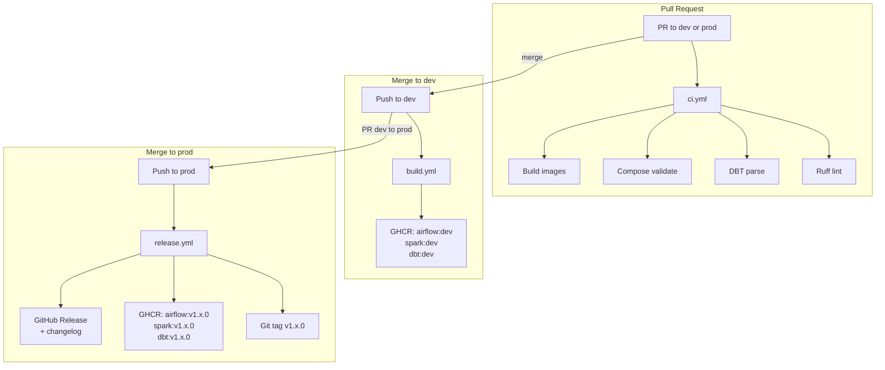

# Phase 5 — CI/CD (GitHub Actions + GHCR)

> **Status:** Complete / Verified on 2026-07-22
> **Phase gate:** `prod` and `dev` branches exist, `main` retired. Direct push to `prod` rejected. PR to `dev` triggers CI checks. Merge to `dev` pushes images to GHCR. Merge to `prod` creates git tag + GitHub Release.

## Summary

Three GitHub Actions workflows wrapping the existing pipeline in automated quality gates: CI checks on every PR (ruff lint, dbt parse, compose validate, Docker build), image build + push to GHCR on dev merge, and semantic version tagging + GitHub Release on prod merge. Branch protection on `prod` and `dev` enforces PR-based workflow. No changes to existing pipeline code — pure DevOps layer.

## Files Created/Modified

| File | Action | Purpose |
|---|---|---|
| `.github/workflows/ci.yml` | Created | PR checks — 4 parallel jobs: ruff lint, dbt parse, compose validate, build images |
| `.github/workflows/build.yml` | Created | Push to `dev` → build + push images to GHCR tagged `:dev` |
| `.github/workflows/release.yml` | Created | Push to `prod` → semantic version tag + GitHub Release + versioned GHCR images |
| `.github/ci/profiles.yml` | Created | CI-safe dbt profiles (dummy keyfile `/dev/null` — dbt parse never connects) |
| `pyproject.toml` | Modified | Added `[tool.ruff]` config (line-length 100, excludes `dbt/dbt_packages`) |
| `airflow/dags/crime_batch_dag.py` | Modified | Fixed f-string without placeholders (F541) |
| `airflow/dags/divvy_trip_history_dag.py` | Modified | Fixed f-string without placeholders (F541) |
| `spark/jobs/divvy_stream.py` | Modified | Fixed f-string without placeholders (F541) |
| `ingestion/load_divvy_trips.py` | Modified | Removed unused imports `sys` + `datetime` (F401) |

## Architecture — What Was Built



Three workflows, each triggered by a different GitHub event. CI runs on every PR, build runs on dev merge, release runs on prod merge. No secrets configured manually — `GITHUB_TOKEN` is auto-provided.

**For detailed architecture diagrams** (how files connect to containers, how images are built, how services depend on each other), see `docs/wiki/architecture.md`. That file is the permanent reference; this doc is the phase snapshot. Don't duplicate those diagrams here.

## Errors Hit

| # | Error | Root Cause | Fix |
|---|---|---|---|
| 1 | Plan's CI used `pip install dbt-postgres` but project uses dbt-bigquery | Phase 4.3 switched from Postgres to BigQuery — plan template was stale | Changed to `pip install dbt-bigquery==1.12.0` in ci.yml |
| 2 | `dbt parse` would fail in CI — `dbt/profiles.yml` is gitignored | profiles.yml contains the real GCP key path, can't be committed | Created `.github/ci/profiles.yml` with dummy keyfile (`/dev/null`). dbt parse never connects, just needs adapter type to match. |
| 3 | GHCR push would fail — `github.repository` has uppercase (`SagarMarthandan`) | GHCR requires lowercase image paths | Added `REPO_LC` env var that lowercases `github.repository` via `tr '[:upper:]' '[:lower:]'` |
| 4 | Release workflow: `git log v1.0.0..HEAD` fails — v1.0.0 doesn't exist as a real tag | Legacy tags (v1–v27) are non-semantic; resetting LATEST to v1.0.0 creates a non-existent range | Added `RANGE` variable: `HEAD` for legacy tags, `$LATEST..HEAD` for semantic tags |
| 5 | Plan's build.yml used `--build-arg BUILD_DATE/GIT_SHA/VERSION` | Dockerfiles have no corresponding `ARG` declarations | Removed build args — images build fine without them |
| 6 | Plan's build.yml tagged `chicago-data-pipeline-dbt-build` | Compose uses `image: chicago-data-pipeline-dbt:latest` (via `image:` key in dbt-build service) | Used correct image name `chicago-data-pipeline-dbt:latest` |
| 7 | ruff found 5 lint errors in existing code | F-strings without placeholders (F541) + unused imports (F401) | Fixed all 5: removed `f` prefix from 3 strings, removed `sys` + `datetime` imports |
| 8 | `softprops/action-gh-release@v1` is deprecated | v1 uses old Node 16 runtime | Upgraded to `@v2` |
| 9 | Branch protection: `prod` required 1 approval — solo dev can't self-approve | GitHub blocks PR authors from approving their own reviews | Set `prod` to 0 required approvals (same as `dev`). PR requirement still enforces CI + diff review. |

### Lessons

- **Plan templates go stale** — the Phase 5 plan was written before Phase 4.3's BigQuery switch. Always verify plan assumptions against current code before implementing.
- **dbt parse doesn't need real credentials** — it only parses SQL/Jinja, never opens a DB connection. A CI-safe profiles.yml with a dummy keyfile is sufficient.
- **GHCR requires lowercase** — `github.repository` preserves case from the GitHub URL. Always lowercase it for GHCR image paths.
- **Legacy tags break semantic versioning logic** — `git describe` returns the latest tag regardless of format. Non-semantic tags (v1, v27) need special handling in version bump logic.
- **Solo dev branch protection** — GitHub prevents self-approval of PRs. Set required approvals to 0 for both `prod` and `dev`. The PR requirement itself (CI gates, diff review, no direct push) is the real value.

## Decisions Made

| Decision | Choice | Why |
|---|---|---|
| dbt adapter in CI | `dbt-bigquery==1.12.0` (not dbt-postgres) | Project switched to BigQuery in Phase 4.3 |
| CI-safe profiles | `.github/ci/profiles.yml` with `/dev/null` keyfile | `dbt/profiles.yml` is gitignored; dbt parse never connects, just needs adapter type |
| GHCR image path | Lowercase `github.repository` via `tr` | GHCR rejects uppercase in image paths |
| Legacy tag handling | `RANGE="HEAD"` for non-semantic tags | `git log v1.0.0..HEAD` fails when v1.0.0 doesn't exist |
| Required approvals | 0 for both `prod` and `dev` | Solo dev — GitHub blocks self-approval of PRs |
| Release action version | `softprops/action-gh-release@v2` | v1 deprecated (Node 16 runtime) |
| Ruff config location | `pyproject.toml` `[tool.ruff]` | Standard location, no extra config file needed |
| dbt deps in CI | Not needed | `dbt/dbt_packages/` is committed to git (209 files) |

## Verification

```bash
# Local — same 3 checks CI runs
$ docker compose config -q
EXIT: 0

$ dbt parse --profiles-dir ../.github/ci
Registered adapter: bigquery=1.12.0
Performance info: /home/sagar/chicago-data-pipeline/dbt/target/perf_info.json
EXIT: 0

$ ruff check airflow/ spark/ kafka/ ingestion/
All checks passed!
EXIT: 0
```

**GitHub Actions — all verified end-to-end:**
- **CI checks (ci.yml):** PR to `dev` → 4/4 jobs passed (Ruff lint, DBT parse, Compose validate, Build Docker images) ✅
- **Build & push (build.yml):** Merge to `dev` → images built + pushed to GHCR (`:dev` tags) in 4m31s ✅
- **Release (release.yml):** Push to `prod` → git tags `v1.1.0` + `v1.2.0` created, GitHub Releases with auto-generated changelogs, versioned images pushed to GHCR ✅
- **Branch protection:** Direct push to `prod` → `GH006: Protected branch update failed for refs/heads/prod. Changes must be made through a pull request.` ✅
- **GHCR packages:** 3 packages (airflow, spark, dbt) with tags `:dev`, `:v1.1.0`, `:v1.2.0` ✅
- **Branches:** `prod` (default, protected) + `dev` (protected), `main` deleted ✅

## What's Next

**All phases are complete.** The pipeline is built end-to-end — batch, streaming, observability, cloud, and CI/CD.

Optional future work (not phase-gated):
- **Interview questions:** Generate 50–100 questions covering the full pipeline for interview prep
- **Documentation restructuring:** Reorganize all docs for portfolio readability
- **Confounding variable control:** Add population density, day of week, seasonality to correlation analysis


## Screenshots


---

**← Previous:** [Phase 4 — Cloud Migration](phase-4.md) | **Next:** None
