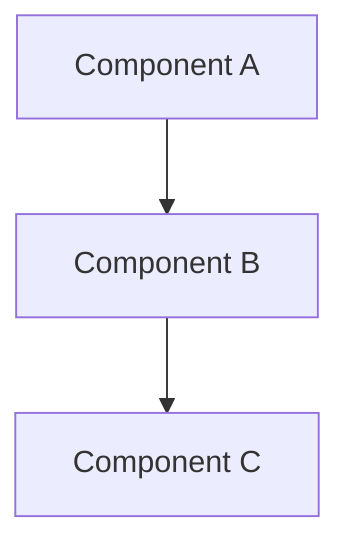

# Phase X.Y — <Short Name>

> **Status:** Complete / Verified on YYYY-MM-DD
> **Phase gate:** <copy the "Done when" criteria from AGENTS.md for this phase>

## Summary

<2-3 sentences. What was built in this sub-phase. What works end-to-end.>

## Files Created/Modified

| File | Action | Purpose |
|---|---|---|
| `<path>` | Created/Modified | <one-line purpose> |
| `<path>` | Created/Modified | <one-line purpose> |
| ... | ... | ... |

## Architecture — What Was Built

<One high-level mermaid diagram showing the components built in THIS phase and how they relate. This is a snapshot of what exists now, not a reference.>



<1-2 sentences explaining what the diagram shows.>

**For detailed architecture diagrams** (how files connect to containers, how images are built, how services depend on each other), see the **"How Everything Connects"** section in `docs/knowledge.md`. That section is the permanent reference; this doc is the phase snapshot. Don't duplicate those diagrams here.

## Errors Hit

<Copy from changelog.md entries for this date. Keep the table format.>

| # | Error | Root Cause | Fix |
|---|---|---|---|
| 1 | <error message> | <why it happened> | <what fixed it> |
| ... | ... | ... | ... |

### Lessons

- **<lesson 1>** — <explanation>
- **<lesson 2>** — <explanation>

## Decisions Made

| Decision | Choice | Why |
|---|---|---|
| <what was decided> | <what was chosen> | <reasoning> |
| ... | ... | ... |

## Verification

<Commands actually run and their output. Not "should work" — what you actually saw.>

```bash
$ <command>
<output that proves it works>
```

- **<thing verified 1>:** <result>
- **<thing verified 2>:** <result>

## What's Next

<Next sub-phase number and name. What it requires from this phase. What new files/concepts it introduces.>

- **Phase X.Y+1: <name>** — <one-line description>
  - Requires: <what this phase provides>
  - New: <what the next phase adds>
