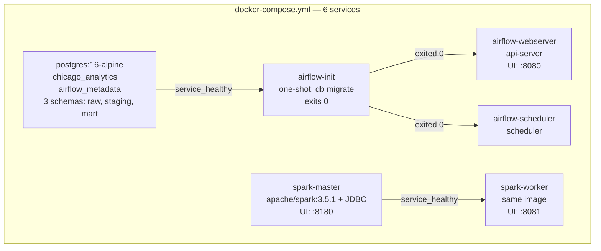

# Phase 1.1 — Docker Compose Services

> **Status:** Complete / Verified on 2026-07-09
> **Phase gate:** `docker compose up` → all services healthy → Postgres schemas queryable → Airflow UI loads → Spark UI loads

## Summary

Built the full Docker Compose stack: Postgres (warehouse + Airflow metadata), Spark (master + worker), and Airflow 3.0 (init + webserver + scheduler). All 6 services are running and verified healthy. Postgres has 3 schemas (raw, staging, mart). Airflow UI and Spark UI are accessible from the host.

## Files Created/Modified

| File | Action | Purpose |
|---|---|---|
| `.env.example` | Created | Environment variable template (Postgres creds, Airflow 3.0 config, Socrata token placeholder) |
| `init.sql` | Created | Postgres init script: creates 3 schemas + airflow user + airflow_metadata DB |
| `docker-compose.yml` | Created | 6 services with YAML anchors, healthchecks, depends_on conditions |
| `airflow/Dockerfile` | Created | Custom Airflow 3.0 image: Docker CLI + uv + providers |
| `airflow/requirements.txt` | Created | Airflow provider packages (postgres, docker) |
| `airflow/passwords.json` | Created | SimpleAuthManager passwords file: `{"admin": "admin"}` |
| `airflow/dags/.gitkeep` | Created | Ensures dags/ directory exists in git |
| `spark/Dockerfile` | Created | Custom Spark image: apache/spark:3.5.1 + PostgreSQL JDBC driver |
| `spark/jobs/.gitkeep` | Created | Ensures jobs/ directory exists in git |
| `pyproject.toml` | Created | uv project mode: host Python dependency declarations |
| `uv.lock` | Created | Exact versions + hashes for reproducible host installs |

## Architecture — What Was Built



**For detailed architecture diagrams** (how uv links to Docker, how Spark/Airflow images are built, how init.sql runs, how docker.sock connects Airflow to Spark, file-to-container mapping), see the **"How Everything Connects"** section in `docs/knowledge.md`. That section is the permanent reference; this doc is the phase snapshot.

## Errors Hit

| # | Error | Root Cause | Fix |
|---|---|---|---|
| 1 | `bitnami/spark:3.5: not found` | Bitnami moved images behind commercial subscription in 2026 | Switched to `apache/spark:3.5.1`, rewrote commands to use `spark-class` |
| 2 | Airflow Dockerfile: `Permission denied` during `uv pip install --system` | Running as airflow user (UID 50000) which can't write to `/usr/local/lib/python3.11/site-packages/` | Run `uv pip install` as root, then switch to `USER airflow` |
| 3 | Spark master healthcheck unhealthy | Healthcheck checked RPC port 7077 on 127.0.0.1, but Spark binds RPC to container's Docker network IP (172.18.0.x), not localhost | Changed healthcheck to check Web UI port 8080 (binds to 0.0.0.0) |
| 4 | Airflow webserver crashes: `airflow command error: arguments required` | Airflow 3.0 removed `airflow webserver` command | Changed to `command: api-server` |
| 5 | Airflow scheduler crashes: same error | Airflow 3.0 image has no default CMD — entrypoint runs `airflow` with no subcommand | Added explicit `command: scheduler` |
| 6 | Airflow webserver: `PermissionError: /opt/airflow/config/passwords.json` | SimpleAuthManager opens passwords.json with `a+` mode (read+write). File was root-owned, airflow user (UID 50000) couldn't write | `chmod 666 airflow/passwords.json` on host |
| 7 | Healthcheck 404 on `/health` | Airflow 3.0 moved health endpoint to `/api/v2/monitor/health` | Updated healthcheck URL |
| 8 | `AIRFLOW__WEBSERVER__WEB_SERVER_PORT` deprecated | Airflow 3.0 moved port config from `[webserver]` to `[api]` section | Changed env var to `AIRFLOW__API__PORT` |

### Lessons

- **Airflow 3.0 is NOT a drop-in upgrade from 2.x** — beyond auth, the webserver command, health endpoint, config sections, and default CMD all changed. Always test with `docker compose up` after upgrading, not just build.
- **Spark master binds RPC to Docker network IP, not localhost** — the Web UI binds to 0.0.0.0 but the RPC port binds to the container's specific IP. Healthchecks inside the container should check the Web UI port.
- **Bind-mounted files need permissions for the container user** — when mounting a file from host into a container, the file's host permissions carry over. `chmod 666` on host = readable/writable by any UID in container.
- **Bitnami images are no longer free as of 2026** — always check image availability before committing to a base image. `docker.io/bitnami/*` returns "not found" now.

## Decisions Made

| Decision | Choice | Why |
|---|---|---|
| Postgres schemas | `raw`, `staging`, `mart` (no `intermediate`) | Traditional DBT layering without extra complexity |
| Executor | LocalExecutor | Parallelism without Redis/RabbitMQ containers |
| Databases | Two in one Postgres: `chicago_analytics` + `airflow_metadata` | Avoids second container, simpler ops |
| Airflow version | 3.0.0 (not 3.3.0) | 3.0.0 has 15 months of production hardening. 3.3.0 released July 6, 2026 — too new |
| Spark image | `apache/spark:3.5.1` (not bitnami) | Bitnami moved behind commercial subscription in 2026 |
| JDBC driver | Baked into Spark image (not `--packages` at runtime) | Works offline, faster startup, no Maven dependency |
| Spark UI port | 8180 (remapped from 8080) | Port 8080 conflicts with Airflow |
| Auth manager | SimpleAuthManager (Airflow 3.0 default) | No CLI user creation needed; users via env vars + passwords.json |
| uv in Docker | `uv pip install --system` (not `uv sync`) | Host and containers need different packages; `uv sync` reads root lockfile |
| uv install as root | Run as root, then switch to airflow user | `--system` writes to root-owned site-packages; airflow user (UID 50000) can't write |

## Verification

```bash
$ docker compose ps -a
NAME                                        STATUS
chicago-data-pipeline-postgres-1            Up (healthy)
chicago-data-pipeline-spark-master-1        Up (healthy)
chicago-data-pipeline-spark-worker-1        Up
chicago-data-pipeline-airflow-init-1        Exited (0)
chicago-data-pipeline-airflow-webserver-1   Up (healthy)
chicago-data-pipeline-airflow-scheduler-1   Up

$ docker compose exec postgres psql -U chicago -d chicago_analytics -c "\dn"
   Name   |  Owner
----------+----------
 mart     | chicago
 raw      | chicago
 staging  | chicago

$ curl -s http://localhost:8080/api/v2/monitor/health
{"metadatabase":{"status":"healthy"},"scheduler":{"status":"healthy","latest_scheduler_heartbeat":"2026-07-09T11:26:07.445632+00:00"},...}
```

- **Postgres:** healthy, 3 schemas confirmed (raw, staging, mart)
- **Spark master:** healthy, UI on http://localhost:8180
- **Spark worker:** running, UI on http://localhost:8081
- **Airflow init:** exited (0) — migrations complete
- **Airflow webserver:** healthy, UI on http://localhost:8080 (admin/admin)
- **Airflow scheduler:** running, heartbeat active

## What's Next

- **Phase 1.2: Ingestion script** (`download_crime.py` using Socrata API)
  - Requires: Postgres `raw` schema (provided by this phase), `SOCRATA_APP_TOKEN` in `.env` (currently empty)
  - New: Python script using `sodapy` library, Chicago crime data from Socrata API, CSV/Parquet files or direct Postgres load
  - This is the first pipeline code — everything before this was infrastructure
