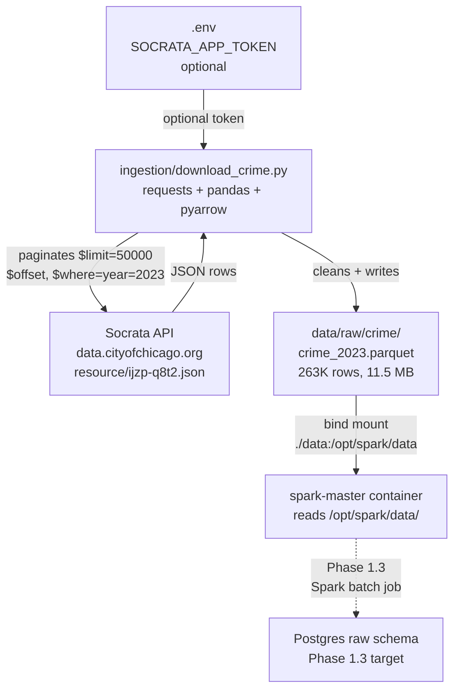

# Phase 1.2 — Ingestion Script

> **Status:** Complete / Verified on 2026-07-11
> **Phase gate:** Ingestion script downloads crime data from Socrata API → writes Parquet → Spark can read it

## Summary

Built a Python ingestion script that downloads Chicago crime data from the Socrata API, paginates through results, cleans API-level quirks, and writes to local Parquet. Successfully downloaded 263,393 rows of 2023 crime data (11.5 MB). Spark can read the Parquet file from inside the container.

## Files Created/Modified

| File | Action | Purpose |
|---|---|---|
| `ingestion/download_crime.py` | Created | Socrata API ingestion: paginate, clean, write Parquet |
| `ingestion/.gitkeep` | Created | Ensures directory exists in git |
| `data/raw/crime/` | Created | Output directory for Parquet files (gitignored) |
| `data/raw/crime/crime_2023.parquet` | Created | 263,393 rows of 2023 crime data (11.5 MB, gitignored) |
| `docker-compose.yml` | Modified | Added `./data` mount to spark-master, spark-worker, and airflow-common |

## Architecture — What Was Built



**For detailed architecture diagrams** (how files connect to containers, how the ingestion script fits into the pipeline), see the **"How Everything Connects"** section in `docs/knowledge.md`.

## Errors Hit

| # | Error | Root Cause | Fix |
|---|---|---|---|
| 1 | Socrata API 404: `dataset.missing` for `ijzp-q4t2` | Plan had a typo — correct resource ID is `ijzp-q8t2` | Queried Socrata catalog API, updated `SOCRATA_URL` |
| 2 | `NameError: name 'time' is not defined` | `import time` consumed during an edit | Re-added `import time` |
| 3 | Spark can't read Parquet — `data/` not mounted | docker-compose.yml only mounted `./spark/jobs` | Added `./data:/opt/spark/data` to Spark volumes |

### Lessons

- **Always verify API endpoints before writing code** — the plan's resource ID was a typo. The Socrata catalog API can confirm the correct ID.
- **Socrata returns nested `location` dict and `:@computed_region_*` columns** — both should be dropped during cleaning.
- **Data directory must be mounted into Spark containers** — Parquet files written by the host need to be accessible inside containers.

## Decisions Made

| Decision | Choice | Why |
|---|---|---|
| API library | `requests` (not `sodapy`) | Direct HTTP calls are simpler, more transparent, and easier to debug than the sodapy wrapper |
| Output format | Parquet (not CSV) | Columnar, preserves types, Spark-friendly, compressed (11.5 MB vs ~80 MB CSV) |
| Initial scope | Single year (2023) | Plan recommends starting small; 263K rows is enough to test the pipeline without waiting hours |
| App token | Optional — script works without it | 263K rows = 6 API requests, well under 1,000/hr anonymous limit |
| Cleaning scope | Light (API quirks only) | Full cleaning (type normalization, casing, null handling) happens in Spark (Phase 1.3) |
| Pagination | `$limit=50000` + `$offset` + `$order=id` | Max page size, stable sort for consistent pagination |

## Verification

```bash
$ python ingestion/download_crime.py --year 2023
  Page 1: fetched 50,000 rows (total: 50,000)
  Page 2: fetched 50,000 rows (total: 100,000)
  Page 3: fetched 50,000 rows (total: 150,000)
  Page 4: fetched 50,000 rows (total: 200,000)
  Page 5: fetched 50,000 rows (total: 250,000)
  Page 6: fetched 13,393 rows (total: 263,393)
  DONE — 263,393 rows written to data/raw/crime/crime_2023.parquet
```

**Parquet verification (Python):**
- Rows: 263,393
- Columns: 21 (after dropping `location` and `:@computed_region_*`)
- Data quality: 0.8% null lat/long, 0.6% null location_description, 31 unique primary_type values
- Dtypes: `arrest`/`domestic` as bool, `latitude`/`longitude`/`ward`/`community_area` as float, `district`/`year` as int

**Spark verification:**
- `spark.read.parquet("/opt/spark/data/raw/crime/crime_2023.parquet")` succeeded
- Schema matched, sample rows showed correct data (HOMICIDE incidents on 2023-01-01)

## What's Next

- **Phase 1.3: Spark batch job** (`spark/jobs/crime_batch.py`)
  - Requires: Parquet file at `data/raw/crime/crime_2023.parquet` (provided by this phase)
  - New: PySpark script that reads Parquet, cleans data (parse dates, normalize casing, handle nulls), writes to Postgres `raw.crime_events` via JDBC
  - This is where the real data engineering begins — Spark transformations and JDBC writes
