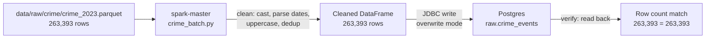

# Phase 1.3 — Spark Batch Job

> **Status:** Complete / Verified on 2026-07-13
> **Phase gate:** Phase 1 (Batch) — `docker compose up` → DAG runs → DBT marts queryable

## Summary

Built the Spark batch ETL job (`spark/jobs/crime_batch.py`) that reads Chicago crime data from Parquet, cleans it, and writes to Postgres `raw.crime_events` via JDBC. The job is idempotent (`overwrite` mode) and includes a built-in verification step. 263,393 rows successfully written and verified.

## Files Created/Modified

| File | Action | Purpose |
|---|---|---|
| `spark/jobs/crime_batch.py` | Created | Spark batch ETL: read Parquet → clean → write to Postgres `raw.crime_events` |
| `docker-compose.yml` | Modified | Added Postgres env vars to `spark-master` and `spark-worker` for JDBC credentials |

## Architecture — What Was Built



The Spark job runs inside the `spark-master` container, reads the Parquet file from the bind-mounted `./data` directory, and writes to Postgres over the Docker network using the `postgres` service name.

**For detailed architecture diagrams** (how files connect to containers, how images are built, how services depend on each other), see `docs/knowledge/architecture.md`. That file is the permanent reference; this doc is the phase snapshot. Don't duplicate those diagrams here.

## Errors Hit

| # | Error | Root Cause | Fix |
|---|---|---|---|
| 1 | `spark-submit: executable file not found in $PATH` | apache/spark image doesn't add `/opt/spark/bin` to PATH | Use full path: `/opt/spark/bin/spark-submit` |
| 2 | Duplicate `environment:` block for spark-worker | Edit tool left a stale duplicate | Deleted stale lines, merged under one `environment:` key |
| 3 | `spark-worker:` service key dropped during edit | SWAP operation consumed the service header | Re-inserted service header lines |
| 4 | `raw.crime_events` missing after WSL restart | Table is created by the job, not by `init.sql` | Re-ran the batch job (idempotent via `overwrite` mode) |

### Lessons

- **apache/spark PATH** — The official image doesn't put Spark binaries on PATH. Always use `/opt/spark/bin/spark-submit` when exec'ing into the container.
- **Idempotent batch jobs** — `mode("overwrite")` makes the job safe to re-run anytime. This is the Phase 1 pattern; Phase 2+ will use upserts.
- **Docker Compose env propagation** — Both `spark-master` and `spark-worker` need Postgres credentials for JDBC writes, since executors run on workers.
- **Data persistence** — Named volumes preserve `init.sql` output (schemas, users) but NOT Spark-written tables. Re-run the job if the volume is wiped.

## Decisions Made

| Decision | Choice | Why |
|---|---|---|
| JDBC credentials source | Environment variables (`POSTGRES_USER`, `POSTGRES_PASSWORD`) passed from `.env` via docker-compose | Never hardcode passwords in job scripts (convention: `docs/conventions/spark.md`) |
| Write mode | `overwrite` | Phase 1 simplicity — idempotent, replaces whole table each run. Switch to upsert in Phase 2+ |
| JDBC batch size | 10,000 | Default 1,000 is slow for 263K rows. 10K balances throughput vs memory |
| JDBC parallelism | `numPartitions=8` with `repartition(8)` | 8 parallel JDBC connections into Postgres — controlled parallelism |
| Cleaning approach | Casts as safety net, not primary conversion | Ingestion script already converts numeric/bool columns via pandas. Spark casts guarantee types downstream but don't assume string input |
| Null lat/long handling | Keep as null (don't drop) | Too many rows have null coordinates. Dropping would lose data. DBT/Spark can flag them later |
| AQE enabled | `spark.sql.adaptive.enabled=true` | Lets Spark auto-coalesce partitions — reduces manual tuning |

## Verification

```bash
# Run the batch job
$ docker compose exec spark-master /opt/spark/bin/spark-submit \
    --master local[*] /opt/spark/jobs/crime_batch.py

# Output (key lines):
#   Raw row count: 263,393
#   Cleaned row count: 263,393
#   Rows dropped (null id + duplicates): 0
#   Write complete.
#   Rows in Postgres raw.crime_events: 263,393
#   Row counts match.

# Verify table in Postgres
$ docker compose exec postgres psql -U chicago -d chicago_analytics \
    -c "SELECT count(*) FROM raw.crime_events;"
#  row_count
# -----------
#     263393

# Verify column types
$ docker compose exec postgres psql -U chicago -d chicago_analytics \
    -c "SELECT column_name, data_type FROM information_schema.columns
        WHERE table_schema='raw' AND table_name='crime_events'
        ORDER BY ordinal_position;"
#  id → bigint, date → timestamp, primary_type → text,
#  community_area → integer, latitude → double precision, etc.
```

- **Row count:** 263,393 in Parquet = 263,393 in Postgres (match)
- **Schema types:** `id` (bigint), `date` (timestamp), `community_area` (integer), `latitude`/`longitude` (double precision) — all casts correct
- **Idempotency:** Re-ran the job after WSL restart — same result, no errors

## What's Next

- **Phase 1.4: DBT models** — staging + mart transformations on top of `raw.crime_events`
  - Requires: `raw.crime_events` table (this phase provides it)
  - New: `dbt/` project structure, `stg_crime_events.sql`, `dim_date`, `dim_community_area`, `dim_crime_type`, `fact_crime_events`, `try_cast` macro, `schema.yml` tests
- **Phase 1.5: Airflow DAG** — orchestrate download → Spark batch → DBT run → DBT test
  - Requires: working Spark job (this phase) + DBT models (Phase 1.4)
