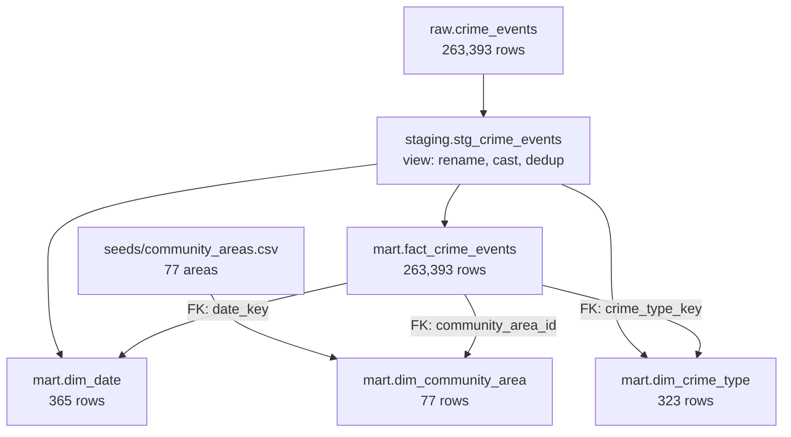

# Phase 1.4 — DBT Models

> **Status:** Complete / Verified on 2026-07-13
> **Phase gate:** Phase 1 (Batch) — `docker compose up` → DAG runs → DBT marts queryable

## Summary

Built the DBT transformation layer: staging view (`stg_crime_events`) on top of `raw.crime_events`, plus four mart tables (`dim_date`, `dim_community_area`, `dim_crime_type`, `fact_crime_events`). 20 data tests all pass. Analytical queries on the marts produce correct results (e.g. top community areas by crime count).

## Files Created/Modified

| File | Action | Purpose |
|---|---|---|
| `dbt/dbt_project.yml` | Created | DBT project config — model paths, materialization defaults, schema mapping |
| `dbt/profiles.yml` | Created | Postgres connection config (host, user, password, db) — not committed to git |
| `dbt/macros/try_cast.sql` | Created | Warehouse-portable cast macro (Postgres `::` vs BigQuery `SAFE_CAST`) |
| `dbt/macros/generate_schema_name.sql` | Created | Overrides DBT schema concatenation so models land in `staging`/`mart` directly |
| `dbt/models/staging/stg_crime_events.sql` | Created | Staging view — rename, cast, dedup on id |
| `dbt/models/staging/schema.yml` | Created | Source definition + staging model tests (unique, not_null, dbt-expectations range/bounds) |
| `dbt/models/marts/dim_date.sql` | Created | Date dimension (365 rows) |
| `dbt/models/marts/dim_community_area.sql` | Created | 77 community areas from seed |
| `dbt/models/marts/dim_crime_type.sql` | Created | 323 distinct crime types |
| `dbt/models/marts/fact_crime_events.sql` | Created | Main fact table (263,393 rows) with FKs |
| `dbt/models/marts/schema.yml` | Created | 20 standard + 11 dbt-expectations data tests (31 total) |
| `dbt/seeds/community_areas.csv` | Created | 77 community areas from Chicago Data Portal |
| `dbt/packages.yml` | Created | dbt-expectations package (metaplane/dbt_expectations 0.10.10) |
| `.vscode/settings.json` | Created | dbt Power User extension config (`dbt.allowListFolders: ["dbt"]`) |

## Architecture — What Was Built



DBT reads from `raw.crime_events` (written by Spark in Phase 1.3), creates a staging view, and builds four mart tables. The fact table joins to all three dimensions via foreign keys.

**For detailed architecture diagrams**, see `docs/knowledge/architecture.md`.

## Errors Hit

| # | Error | Root Cause | Fix |
|---|---|---|---|
| 1 | DBT created `staging_mart` and `staging_staging` schemas | Default `generate_schema_name` concatenates profile schema + custom schema | Created `generate_schema_name.sql` macro override |
| 2 | `where` config deprecation warning in DBT 1.11 | `where` as top-level property on tests is deprecated | Moved under `config:` |
| 3 | DBT not installed despite being in `pyproject.toml` | `uv sync` hadn't fully installed packages | Re-ran `uv sync` |
| 4 | `expect_column_values_to_be_in_set` on BOOLEAN fails: `boolean = text` | dbt-expectations generates text comparison; Postgres can't compare to boolean | Replaced with `not_null` — BOOLEAN can't hold values outside {true, false, null} |
| 5 | `expect_column_values_to_be_between` on longitude failed (801 rows) | Bounds `[-87.9, -87.5]` too tight; actual data is `[-87.94, -87.52]` | Widened to `[-87.95, -87.52]` based on actual `min()/max()` |
| 6 | dbt Power User "language server not running" | Extension couldn't find `dbt_project.yml` in `dbt/` subdirectory | Created `.vscode/settings.json` with `dbt.allowListFolders: ["dbt"]`, copied `profiles.yml` to `~/.dbt/` |

### Lessons

- **DBT schema naming** — The default `generate_schema_name` concatenates; override it when you want specific schema names.
- **DBT 1.11 test config** — `where` on generic tests must be under `config:`, not top-level.
- **Staging dedup** — `DISTINCT ON (id) ... ORDER BY id, updated_at DESC` keeps the most recently updated row per id.
- **Community area 0** — Sentinel for "unassigned"; excluded from relationships test via `where: "community_area_id != 0"`.
- **dbt-expectations on BOOLEAN** — `expect_column_values_to_be_in_set` fails on Postgres BOOLEAN due to type mismatch. Use `not_null` instead.
- **Data bounds** — Always check actual `min()/max()` before setting range test thresholds.
- **dbt Power User** — Needs `dbt.allowListFolders` in `.vscode/settings.json` for subdirectory projects and `profiles.yml` in `~/.dbt/`.

## Decisions Made

| Decision | Choice | Why |
|---|---|---|
| Schema mapping | `generate_schema_name` macro override | DBT's default concatenation produces `staging_mart` instead of `mart`. Override returns custom schema as-is. |
| Staging materialization | `view` | Cheap, always reflects latest raw data, no storage cost |
| Mart materialization | `table` | Query performance for dashboards and analytical queries |
| Deduplication method | `DISTINCT ON (id)` | Postgres-native, cleaner than `QUALIFY` (Snowflake syntax). Keeps most recently updated row. |
| Community area 0 handling | `where` filter on relationships test | 0 is a valid sentinel for "unassigned" — not a real FK violation. Excluding it from the test is cleaner than adding a fake dim row. |
| Seed data source | Chicago Data Portal API (`igwz-8jzy`) | Official source for community area names. 77 rows, static reference data. |
| `try_cast` macro | Plain cast on Postgres (fails loudly) | Bad data should fail at DBT, not silently null. Catches upstream bugs. BigQuery branch uses `SAFE_CAST` since BigQuery doesn't raise. |

## Verification

```bash
# Verify DBT connection
$ dbt debug --profiles-dir .
# All checks passed!

# Build everything (seed + models + tests)
$ dbt build --profiles-dir .
# PASS=37 WARN=0 ERROR=0 SKIP=0 NO-OP=0 TOTAL=37

# Verify tables in Postgres
$ docker compose exec postgres psql -U chicago -d chicago_analytics -c "
SELECT 'staging.stg_crime_events' AS table_name, count(*) FROM staging.stg_crime_events
UNION ALL SELECT 'mart.dim_date', count(*) FROM mart.dim_date
UNION ALL SELECT 'mart.dim_community_area', count(*) FROM mart.dim_community_area
UNION ALL SELECT 'mart.dim_crime_type', count(*) FROM mart.dim_crime_type
UNION ALL SELECT 'mart.fact_crime_events', count(*) FROM mart.fact_crime_events;"
#  staging.stg_crime_events | 263393
#  mart.dim_date            |    365
#  mart.dim_community_area  |     77
#  mart.dim_crime_type      |    323
#  mart.fact_crime_events   | 263393

# Analytical query (proves marts work end-to-end)
SELECT ca.community_area_name, count(*) AS crime_count
FROM mart.fact_crime_events f
JOIN mart.dim_community_area ca ON f.community_area_id = ca.community_area_id
GROUP BY ca.community_area_name ORDER BY crime_count DESC LIMIT 10;
#  AUSTIN           | 12700
#  NEAR NORTH SIDE  | 11196
#  NEAR WEST SIDE   | 10423
#  LOOP             |  8808
#  ...
```

- **dbt debug:** Connection to Postgres verified
- **dbt build:** 37/37 PASS (1 seed + 5 models + 31 tests — 20 standard + 11 dbt-expectations)
- **Row counts:** All tables match expected counts
- **Analytical query:** Top 10 community areas by crime count returns correct results

## What's Next

- **Phase 1.5: Airflow DAG** (`airflow/dags/crime_batch_dag.py`)
  - Orchestrate: download_crime → spark_crime_batch → dbt_run → dbt_test
  - Requires: working Spark job (Phase 1.3) + DBT models (this phase)
  - New: Airflow DAG with DockerOperator or BashOperator, schedule, retries
