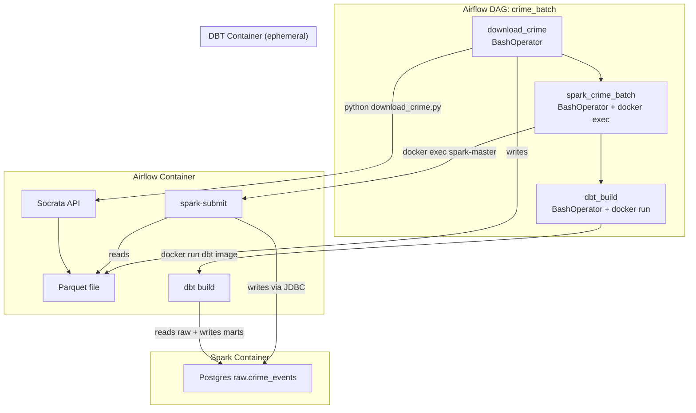

# Phase 1.5 — Airflow DAG

> **Status:** Complete / Verified on 2026-07-13
> **Phase gate:** `docker compose up` → DAG runs → DBT marts queryable

## Summary

Built the Airflow DAG that orchestrates the full batch pipeline: download crime data from Socrata → Spark batch job → DBT build (seed + staging + marts + tests). The DAG runs with `schedule=None` (manual trigger), `max_active_runs=1`, and `retries=1`. All 3 tasks succeeded end-to-end in 137s, producing queryable marts (263,394 fact rows).

## Files Created/Modified

| File | Action | Purpose |
|---|---|---|
| `airflow/dags/crime_batch_dag.py` | Created | DAG: download → spark → dbt_build |
| `dbt/Dockerfile` | Created | Separate dbt image (protobuf conflict with Airflow) |
| `airflow/dbt_profiles/profiles.yml` | Created | dbt profiles for Airflow container (host: postgres) |
| `docker-compose.yml` | Modified | Added mounts, env vars, secrets, dbt-build service |
| `airflow/Dockerfile` | Modified | Added docker group (GID 1001), ingestion deps |
| `airflow/requirements.txt` | Modified | Added ingestion deps, removed dbt (separate image) |
| `.env` / `.env.example` | Modified | Added internal API secret, JWT secret, webserver secret |
| `ingestion/download_crime.py` | Modified | Fixed docstring typo, increased API timeout 60s → 120s |

## Architecture — What Was Built



The DAG runs entirely via BashOperator — no DockerOperator needed. Spark runs via `docker exec` into the existing spark-master container. DBT runs via `docker run --rm` in a separate image (dbt-core 1.11's protobuf >=6.0 conflicts with Airflow 3.0's protobuf 4.x).

**For detailed architecture diagrams**, see `docs/knowledge/architecture.md`.

## Errors Hit

| # | Error | Root Cause | Fix |
|---|---|---|---|
| 1 | `@manual` schedule rejected: "Exactly 5, 6 or 7 columns" | Airflow 3.0 doesn't accept `@manual` as a cron expression | Changed to `schedule=None` |
| 2 | `not found in serialized_dag table` + `Connection refused` | Scheduler couldn't reach API server — `execution_api_server_url` defaulted to `localhost:8080` | Set `AIRFLOW__CORE__EXECUTION_API_SERVER_URL=http://airflow-webserver:8080/execution/` |
| 3 | `Invalid auth token: Signature verification failed` | Scheduler and webserver generated different JWT secrets at startup | Set shared `AIRFLOW__API_AUTH__JWT_SECRET` and `AIRFLOW__WEBSERVER__SECRET_KEY` |
| 4 | `protobuf 4.25.6` vs dbt-core 1.11 requires `>=6.0` | Airflow 3.0 pins protobuf 4.x; incompatible with dbt | Built separate dbt Docker image, run via `docker run --rm` |
| 5 | `Permission denied: docker.sock` | Airflow user (UID 50000) not in docker group | `groupdel docker; groupadd -g 1001 docker; usermod -aG docker airflow` in Dockerfile |
| 6 | `PermissionError: Failed to open crime_2023.parquet` | Parquet owned by host user, Airflow runs as UID 50000 | `chmod 666` on file + `chmod 777` on directory |
| 7 | `Env var required but not provided: POSTGRES_USER` | `docker run --volumes-from` doesn't inherit env vars | Added `-e POSTGRES_USER -e POSTGRES_PASSWORD -e POSTGRES_DB` |
| 8 | `ReadTimeoutError` on Socrata API (60s) | Downloading 50K rows takes >60s from container | Increased timeout to 120s |
| 9 | `./dbt` and `./ingestion` not mounted into Airflow | docker-compose.yml only mounted dags, spark/jobs, data | Added ingestion, dbt, dbt_profiles volume mounts |
| 10 | Airflow image missing ingestion deps | requirements.txt only had provider packages | Added pandas, pyarrow, requests, python-dotenv |
| 11 | DBT profiles `host: localhost` fails in container | Container needs Docker service name, not localhost | Created separate `airflow/dbt_profiles/profiles.yml` with `host: postgres` |
| 12 | `groupadd -f -g 1001 docker` silently failed | `-f` flag = "success if group exists" — GID not changed | `groupdel docker; groupadd -g 1001 docker` — delete first |
| 13 | Socrata resource ID typo in docstring | Docstring said `ijzp-q4t2`, code had correct `ijzp-q8t2` | Fixed docstring |

### Lessons

- **Airflow 3.0 `@manual` is gone:** Use `schedule=None` for manual-trigger DAGs.
- **Execution API URL:** Scheduler needs `AIRFLOW__CORE__EXECUTION_API_SERVER_URL` pointing to the webserver's Docker service name, not localhost.
- **Shared secrets mandatory:** `JWT_SECRET` and `SECRET_KEY` must be set as env vars in both webserver and scheduler — otherwise each generates its own and JWT verification fails.
- **dbt + Airflow protobuf conflict:** dbt-core 1.11 (protobuf >=6.0) and Airflow 3.0 (protobuf 4.x) can't coexist. Run dbt in a separate container.
- **docker.sock GID:** Must match host GID (1001 on WSL2). The `docker.io` package creates GID 102 — must `groupdel` and `groupadd -g 1001`.
- **`--volumes-from` doesn't pass env vars:** Pass them explicitly with `-e VAR_NAME`.
- **Missing mounts are silent killers:** Always verify mounts with `docker exec ... ls /path` before triggering the DAG.
- **`groupadd -f` is a silent no-op:** The `-f` flag makes it succeed without changing the GID. Must `groupdel` first.
- **Separate profiles for container vs host:** Create a separate profiles.yml with `host: postgres` (Docker service name) and `env_var()` for credentials.
- **`max_active_runs=1`:** Prevents overlapping DAG runs — critical for resource-heavy tasks.

## Decisions Made

| Decision | Choice | Why |
|---|---|---|
| Operator type | BashOperator for all tasks | Simpler than DockerOperator; docker CLI + docker.sock already in Airflow image |
| dbt execution | Separate Docker image via `docker run --rm` | dbt-core 1.11 protobuf >=6.0 conflicts with Airflow 3.0 protobuf 4.x |
| Schedule | `schedule=None` | Manual trigger while debugging; switch to `@daily` after Phase 1.6 |
| `max_active_runs` | 1 | Prevents overlapping runs — resource-heavy tasks (Spark, Socrata) |
| Retries | 1 | Deterministic failures (permissions, missing data) don't benefit from many retries |
| Spark container resolution | `docker ps -qf name=spark-master` at runtime | Avoids hardcoding project prefix; immune to COMPOSE_PROJECT_NAME changes |

## Verification

```bash
$ docker exec chicago-data-pipeline-airflow-scheduler-1 airflow dags list
dag_id      | fileloc                              | owners           | is_paused
============+======================================+==================+===========
crime_batch | /opt/airflow/dags/crime_batch_dag.py | chicago-pipeline | False

$ docker exec chicago-data-pipeline-airflow-scheduler-1 airflow dags trigger crime_batch
# DAG run: manual__2026-07-13T12:55:11...tnc7INKH — state: queued

# After 137s:
# download_crime: success (117s)
# spark_crime_batch: success (32s)
# dbt_build: success (11s)
# DagRun Finished: state=success

$ docker exec chicago-data-pipeline-postgres-1 psql -U chicago -d chicago_analytics -c "..."
       table        |  rows
--------------------+--------
 dim_date           |    365
 dim_community_area |     77
 dim_crime_type     |    323
 fact_crime_events  | 263394
```

- **DAG parses:** No import errors, `crime_batch` appears in `airflow dags list`
- **All 3 tasks succeed:** download (117s) → spark (32s) → dbt (11s)
- **Marts queryable:** dim_date=365, dim_community_area=77, dim_crime_type=323, fact_crime_events=263,394

## What's Next

- **Phase 1.6: Phase 1 verification** — formal end-to-end test and Phase 1 gate
  - Requires: working DAG (done), all services running (done)
  - New: formal verification document, Phase 1 completion checklist
  - This is the gate: Phase 2 (Streaming) unlocks when this passes
