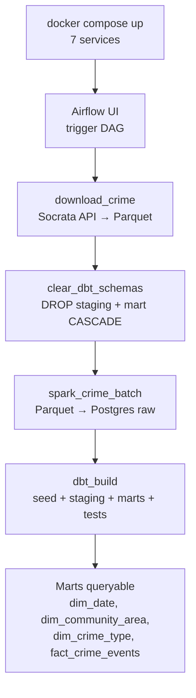

# Phase 1.6 — Phase 1 Verification

> **Status:** Complete / Verified on 2026-07-13
> **Phase gate:** `docker compose up` → DAG runs → DBT marts queryable

## Summary

Formal end-to-end verification of the Phase 1 batch pipeline. Cold-started all services from a clean state, triggered the `crime_batch` DAG, and confirmed all 4 tasks succeed and all mart tables are queryable with correct row counts. Two issues were discovered and fixed during verification: (1) DBT views from prior runs block Spark's `DROP TABLE` in overwrite mode, and (2) Airflow 3.0 requires a separate `dag-processor` service to serialize DAGs.

## Files Created/Modified

| File | Action | Purpose |
|---|---|---|
| `airflow/dags/crime_batch_dag.py` | Modified | Added `clear_dbt_schemas` task (drops staging + mart schemas before Spark runs) |
| `docker-compose.yml` | Modified | Added `airflow-dag-processor` service (Airflow 3.0 separates DAG processing from scheduler) |

## Architecture — What Was Built



The pipeline now has 4 tasks (was 3). The new `clear_dbt_schemas` task runs between download and Spark to drop DBT's derived schemas, preventing the `cannot drop table raw.crime_events because other objects depend on it` error on re-runs.

**For detailed architecture diagrams**, see `docs/knowledge/architecture.md`.

## Errors Hit

| # | Error | Root Cause | Fix |
|---|---|---|---|
| 1 | `ERROR: cannot drop table raw.crime_events because other objects depend on it` | Spark's `mode("overwrite")` does `DROP TABLE raw.crime_events`, but DBT's `staging.stg_crime_events` view depends on it. On re-runs with preserved volumes, the views survive and block the drop. | Added `clear_dbt_schemas` task: `DROP SCHEMA IF EXISTS staging CASCADE; DROP SCHEMA IF EXISTS mart CASCADE;` before Spark runs. DBT rebuilds them all in the next task. |
| 2 | `DAG 'crime_batch' not found in serialized_dag table` — scheduler can't find DAGs after restart | Airflow 3.0 split DAG processing into a separate `dag-processor` component. The scheduler no longer parses/serializes DAG files. Without a dag-processor service, the serialized_dag table stays empty. | Added `airflow-dag-processor` service to docker-compose.yml with `command: dag-processor`. |

### Lessons

- **DBT views block Spark overwrite:** When Spark uses `mode("overwrite")` on a table that DBT views depend on, Postgres blocks the drop. Drop the dependent schemas first (DBT rebuilds them idempotently).
- **Airflow 3.0 requires a separate dag-processor:** Unlike Airflow 2.x where the scheduler parsed DAGs inline, Airflow 3.0 separates DAG processing into its own component. Without `airflow dag-processor` running, DAGs are never serialized and the scheduler can't find them. This is a breaking change from 2.x — existing docker-compose setups need the new service.

### Operational Mistakes (AI Assistant)

Not technical errors — process mistakes during verification. Documented to prevent repeating (see AGENTS.md rule 15).

| # | Mistake | Impact | Lesson |
|---|---|---|---|
| 1 | Deleted working serialized_dag entry to "force" re-parse | Broke the DAG entirely — scheduler couldn't find it for 20+ minutes | Never delete working state. Diagnose first, touch second. |
| 2 | 4+ unnecessary `docker compose down/up` cycles | ~4 minutes of wasted time, no progress | Repeated restarts without new information is thrashing. |
| 3 | Manual Python scripts to mutate Airflow's internal tables | Failed multiple times — wrong API, wrong format, 0 tasks | Never manually mutate managed internal metadata tables. |

## Decisions Made

| Decision | Choice | Why |
|---|---|---|
| Where to drop DBT schemas | New Airflow task between download and Spark | Keeps the cleanup in the DAG (orchestrated, visible in UI, retried on failure). Alternative was a Spark pre-hook, but that mixes concerns. |
| `DROP SCHEMA CASCADE` | Yes | DBT schemas are fully derived (views + tables built from raw). Dropping them is safe — dbt_build rebuilds everything. CASCADE handles any nested dependencies. |
| dag-processor as separate service | Yes, in docker-compose.yml | Airflow 3.0 architecture requires it. The service uses the same image and config as scheduler/webserver (via `x-airflow-common` anchor). |

## Verification

```bash
$ docker compose down && docker compose up -d
# All 7 services up: postgres (healthy), spark-master (healthy), spark-worker,
# airflow-webserver (healthy), airflow-scheduler, airflow-dag-processor, airflow-init (exited 0)

$ airflow dags trigger crime_batch
# DAG run: manual__2026-07-13T14:11:11.347711+00:00_9MkcEDt7

$ airflow dags state crime_batch "manual__2026-07-13T14:11:11.347711+00:00_9MkcEDt7"
success

$ airflow tasks states-for-dag-run crime_batch "manual__2026-07-13T14:11:11.347711+00:00_9MkcEDt7"
clear_dbt_schemas | success (0.3s)
download_crime    | success (119s)
spark_crime_batch | success (34s)
dbt_build         | success (9s)

$ psql -U chicago -d chicago_analytics -t -c "SELECT 'dim_date', COUNT(*) FROM mart.dim_date UNION ALL ..."
 dim_community_area |     77
 dim_crime_type     |    323
 dim_date           |    365
 fact_crime_events  | 263394
 raw.crime_events   | 263394
```

- **Cold start verified:** All 7 services came up healthy from `docker compose down` + `up`.
- **DAG run verified:** All 4 tasks succeeded, DagRun state=success (~163s total).
- **Marts verified:** All 4 mart tables populated. `fact_crime_events` (263,394) matches `raw.crime_events` (263,394) — no data loss.
- **Idempotency verified:** The `clear_dbt_schemas` task allows re-runs without the dependency conflict.

## What's Next

- **Phase 2: Streaming** — Kafka + Spark Structured Streaming to pipe Divvy live data into Postgres.
  - Requires: Phase 1 batch pipeline working end-to-end (verified ✅)
  - New: Kafka broker, Spark Structured Streaming job, Divvy station status API, real-time ingestion DAG
