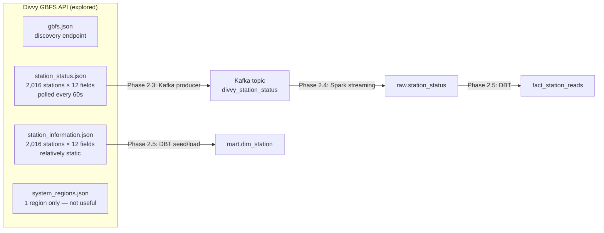

# Phase 2.1 — Divvy GBFS Data Source

> **Status:** Complete / Verified on 2026-07-15
> **Phase gate:** Phase 2 done when: `docker compose up` includes Kafka + Zookeeper, producer running, Spark streaming writes to `raw.station_status`, DBT builds `fact_station_reads`, queryable analytics. (2.1 is exploration only — no infrastructure built yet.)

## Summary

Explored and documented the Divvy GBFS (General Bikeshare Feed Specification) live API — the streaming data source for Phase 2. Fetched all relevant feeds, analyzed the schema of 2,016 stations, and identified 4 quirks that change the plan's downstream design (station_id must be string, is_* fields are integers not booleans, optional scooter fields, stale station filtering).

## Files Created/Modified

| File | Action | Purpose |
|---|---|---|
| `docs/knowledge/data-sources.md` | Modified | Expanded Divvy GBFS section from 7-line summary to full schema: 12 feeds, station_status fields (12 mandatory + 2 optional), station_information fields, pipeline implications |
| `changelog.md` | Modified | Added Phase 2.1 entry with 4 design-changing findings + lessons |
| `docs/operations-performed.md` | Modified | Added Phase 2.1 audit entry + fixed missing Phase 1.6 TOC entry |

## Architecture — What Was Built

No infrastructure built in this phase. This phase explored the data source that Phase 2.2–2.6 will pipe through the pipeline.



The diagram shows the planned data flow from the GBFS feeds explored in this phase through the pipeline components that Phase 2.2–2.6 will build.

**For detailed architecture diagrams**, see `docs/knowledge/architecture.md`.

## Errors Hit

No errors — this was a read-only exploration phase. However, 4 design-changing findings were discovered:

| # | Finding | Impact on Plan | Fix |
|---|---|---|---|
| 1 | `station_id` is mixed format: 667 UUIDs + 1,349 numeric strings | Plan's DBT model had `station_id::bigint` — will fail on UUID IDs | Keep `station_id` as string throughout the pipeline |
| 2 | `is_renting`/`is_returning`/`is_installed` are integers 0/1, not booleans | Plan assumed booleans; Spark/DBT needs explicit cast | `CAST(col AS BOOLEAN)` in Spark (0→false, 1→true) |
| 3 | `num_scooters_available`/`num_scooters_unavailable` are optional | Spark schema with strict mode will fail on missing fields | Use nullable schema fields, tolerate absence |
| 4 | One station had `last_reported: 86400` (Jan 2, 1970 — dead station) | Stale data pollutes fact table | Filter `last_reported` to recent threshold |

### Lessons

- **Always inspect live data before coding** — the plan assumed bigint station_id and boolean fields. Five minutes of API exploration saved hours of debugging downstream.
- **GBFS 1.1 uses integers for booleans** — `is_renting`, `is_returning`, `is_installed` are 0/1 integers, not JSON booleans. Always check actual API responses, not just spec docs.
- **Optional fields are common in GBFS** — not all stations report all fields. Spark's schema inference or strict schema will fail. Use nullable fields.

## Decisions Made

| Decision | Choice | Why |
|---|---|---|
| Which feeds to use | `station_status` (streaming) + `station_information` (dimension) | station_status has live bike/dock availability — the core signal. station_information has static metadata (name, lat/lon, capacity) — dimension table. Other feeds (free_bike_status, system_alerts, etc.) not needed for Phase 2. |
| station_id type | String (not bigint) | 667 UUIDs + 1,349 numeric strings — bigint cast would fail on UUIDs |
| Stale station handling | Filter by `last_reported` threshold | One station had epoch 86400 (1970) — clearly decommissioned. Will filter in Spark or DBT. |
| system_regions | Not used | Only 1 region (Evanston) — not useful for community area mapping. Will use spatial join on lat/lon instead. |

## Verification

Fetched all 4 GBFS endpoints live and analyzed response structure:

```
station_status: 2,016 stations
station_information: 2,016 stations
station_id formats: 667 UUIDs, 1,349 numeric strings
Fields in ALL stations: 12 (station_id, num_bikes_available, num_bikes_disabled,
  num_docks_available, num_docks_disabled, is_installed, is_renting, is_returning,
  last_reported, legacy_id, num_ebikes_available, eightd_has_available_keys)
Optional fields: num_scooters_available, num_scooters_unavailable
is_renting values: {0, 1}  (integers, not booleans)
is_returning values: {0, 1}
is_installed values: {0, 1}
last_reported range: 1970-01-02 to 2026-07-15 (one dead station at epoch 86400)
Status-only IDs (not in info): 0
Info-only IDs (not in status): 0
```

- **All feeds reachable:** 200 OK on all endpoints
- **Station count consistent:** 2,016 in both status and information (perfect 1:1)
- **Schema documented:** 12 mandatory + 2 optional fields identified for station_status
- **Quirks identified:** 4 design-changing findings documented in changelog + data-sources.md

## What's Next

- **Phase 2.2: Kafka + Zookeeper Docker services** — add Kafka and Zookeeper containers to `docker-compose.yml`
  - Requires: Nothing from 2.1 (infrastructure-only)
  - New: `confluentinc/cp-kafka` + `confluentinc/cp-zookeeper` images, Kafka topic configuration
  - Verification: `docker compose up` includes Kafka + Zookeeper, `kafka-console-consumer` can connect
