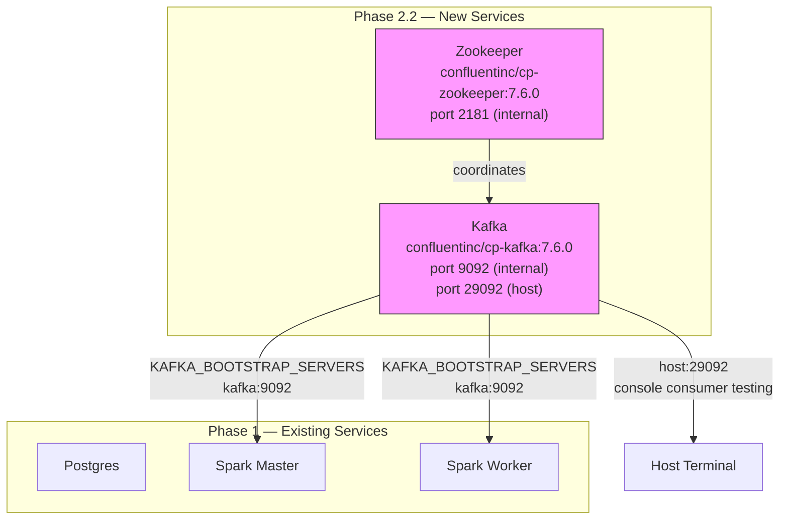

# Phase 2.2 — Kafka + Zookeeper Docker Services

> **Status:** Complete / Verified on 2026-07-15
> **Phase gate:** `docker compose up` includes Kafka + Zookeeper, `kafka-console-consumer` shows messages arriving.

## Summary

Added Kafka and Zookeeper to `docker-compose.yml` as the streaming backbone for Phase 2. Both services are running and healthy. Verified end-to-end: created the `divvy_station_status` topic, produced test JSON messages, consumed them back — round-trip works via both internal (Docker network) and external (host) listeners.

## Files Created/Modified

| File | Action | Purpose |
|---|---|---|
| `docker-compose.yml` | Modified | Added zookeeper + kafka services, 3 named volumes, KAFKA_BOOTSTRAP_SERVERS env var on Spark services, updated header comment |
| `docs/knowledge/kafka.md` | Modified | Expanded from 25-line stub to full reference: setup table, Confluent vs Bitnami rationale, single-broker overrides, all commands, key concepts |
| `changelog.md` | Modified | Phase 2.2 entry with 6 key decisions + 3 lessons |
| `docs/operations-performed.md` | Modified | Phase 2.2 audit entry + TOC |
| `docs/phases/phase-2.2-kafka.md` | Created | This phase completion doc |

## Architecture — What Was Built



Kafka + Zookeeper are new. Spark services now have `KAFKA_BOOTSTRAP_SERVERS` env var ready for the Phase 2.4 streaming job. No other Phase 1 services were modified.

**For detailed architecture diagrams**, see `docs/knowledge/architecture.md`.

## Errors Hit

No errors. All services started cleanly on first attempt.

### Lessons

- **Single-broker Kafka needs replication overrides** — defaults assume 3 brokers. Must set replication factor to 1 for `__consumer_offsets` and `__transaction_state` or Kafka silently fails.
- **Two listeners for dev Kafka** — internal (`kafka:9092`) for Docker services, external (`localhost:29092`) for host testing. Without the host listener, can't run console consumer from terminal.
- **Healthcheck needs `start_period: 20s`** — Kafka takes ~30-40s to fully start. Without the grace period, healthcheck fails before Kafka is ready.

## Decisions Made

| Decision | Choice | Why |
|---|---|---|
| Kafka image | `confluentinc/cp-kafka:7.6.0` | Bitnami no longer free. Confluent is free, stable, pinned for reproducibility. |
| Zookeeper vs KRaft | Zookeeper | More educational — most existing deployments still use ZK. |
| Listeners | Two (internal + host) | Internal for Spark/producer, host for console consumer testing. |
| Partitions | 3 for `divvy_station_status` | Parallelism for Spark streaming. `station_id` as key → same station to same partition. |
| Auto-create topics | Enabled | Dev convenience. Producer creates topic on first message. |
| Replication factor | 1 for all | Single broker — no redundancy. Production would use 3. |

## Verification

```bash
# YAML syntax valid
$ docker compose config --quiet
(no output = valid)

# Both services healthy
$ docker compose ps zookeeper kafka
chicago-data-pipeline-zookeeper-1   Up (healthy)
chicago-data-pipeline-kafka-1       Up (healthy)

# Created topic
$ docker compose exec kafka kafka-topics --create --topic divvy_station_status \
    --partitions 3 --replication-factor 1 --bootstrap-server localhost:9092
Created topic divvy_station_status.

# Produced test message
$ echo '{"station_id":"test-001","num_bikes_available":5,...}' | \
    docker compose exec -T kafka kafka-console-producer --topic divvy_station_status ...

# Consumed it back
$ docker compose exec kafka kafka-console-consumer --topic divvy_station_status \
    --from-beginning --max-messages 1 --bootstrap-server localhost:9092
{"station_id":"test-001","num_bikes_available":5,...}
Processed a total of 1 messages

# Host listener (port 29092) also works
$ echo '{"station_id":"test-002",...}' | \
    docker compose exec -T kafka kafka-console-producer --topic divvy_station_status \
    --bootstrap-server localhost:29092
# Consumed both messages successfully
```

- **Zookeeper healthy:** ~10s startup
- **Kafka healthy:** ~40s startup
- **Topic created:** 3 partitions, replication factor 1
- **Message round-trip:** produce → consume verified on both listeners
- **Test topic deleted:** clean slate for Phase 2.3 producer

## What's Next

- **Phase 2.3: Kafka producer (`kafka/producers/divvy_producer.py`)**
  - Requires: Kafka broker running (✅ verified)
  - New: Python script that polls Divvy `station_status.json` every 60s, publishes each station as JSON message to `divvy_station_status` topic. Message key = `station_id`.
  - Needs: `kafka-python` library in the producer's environment (Airflow container or standalone)
  - Verification: `kafka-console-consumer` shows real Divvy station data arriving every ~60s
