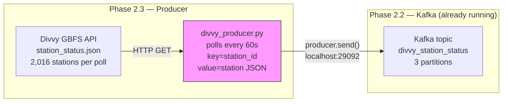

# Phase 2.3 — Kafka Producer

> **Status:** Complete / Verified on 2026-07-15
> **Phase gate:** Producer is running and `kafka-console-consumer` shows messages arriving.

## Summary

Created `kafka/producers/divvy_producer.py` — a Python script that polls the Divvy GBFS `station_status.json` feed every 60 seconds and publishes each station's status as a JSON message to the Kafka topic `divvy_station_status`. Verified end-to-end: 2,016 real station readings per poll, distributed across 3 partitions by station_id key, consumed back via console consumer.

## Files Created/Modified

| File | Action | Purpose |
|---|---|---|
| `kafka/producers/divvy_producer.py` | Created | GBFS → Kafka producer: polls every 60s, key=station_id, value=full station JSON. Graceful shutdown, retry on connect, consistent poll cadence |
| `pyproject.toml` / `uv.lock` | Modified | Added `kafka-python` 3.0.8 to host venv |
| `airflow/requirements.txt` | Modified | Added `kafka-python` for Phase 2.6 (DAG will run producer via Airflow) |
| `docker-compose.yml` | Modified | Added `./kafka:/opt/airflow/kafka` volume mount to Airflow common config |

## Architecture — What Was Built



The producer runs on the host (connecting to `localhost:29092`). In Phase 2.6, it will run inside the Airflow container (connecting to `kafka:9092`).

**For detailed architecture diagrams**, see `docs/knowledge/architecture.md`.

## Errors Hit

| # | Error | Root Cause | Fix |
|---|---|---|---|
| 1 | `ImportError: cannot import name 'NoBrokersAvailable'` | Removed in kafka-python 3.0.x | Catch `KafkaError` (base class) instead |
| 2 | Auto-created topic had 1 partition (not 3) | `KAFKA_NUM_PARTITIONS` env var not applied by Confluent image | Explicitly create topic with `kafka-topics --create --partitions 3` |

### Lessons

- **Auto-create uses broker defaults** — not your desired partition count. Explicit topic creation is the correct approach for custom configs.
- **kafka-python 3.0.x API changes** — `NoBrokersAvailable` removed. Always check installed version's API.
- **Key-based partitioning works** — 720/661/635 distribution across 3 partitions with station_id key.

## Decisions Made

| Decision | Choice | Why |
|---|---|---|
| Message key | `station_id` (string) | Same station → same partition → chronological order per station |
| Delivery guarantee | `acks="all"` | Safest — waits for all in-sync replicas |
| Shutdown | SIGINT/SIGTERM → flag → flush → close | Prevents message loss on shutdown |
| Poll cadence | `sleep = interval - elapsed` | Prevents drift — consistent intervals |
| Topic creation | Explicit (3 partitions) | Auto-create defaults to 1 partition; explicit creation controls partition count |
| `--once` flag | Single poll + exit | Testing without running infinite loop |

## Verification

```bash
# Single poll test
$ python kafka/producers/divvy_producer.py --once
Fetched 2016 stations (feed last_updated: 2026-07-15T15:46:58+00:00)
Poll #1: sent 2016 messages in 0.88s
Producer stopped after 1 polls.

# Topic with 3 partitions
$ docker compose exec kafka kafka-topics --describe --topic divvy_station_status
PartitionCount: 3  ReplicationFactor: 1
Partition: 0  Leader: 1001  Replicas: 1001  Isr: 1001
Partition: 1  Leader: 1001  Replicas: 1001  Isr: 1001
Partition: 2  Leader: 1001  Replicas: 1001  Isr: 1001

# Message distribution across partitions
$ docker compose exec kafka kafka-run-class kafka.tools.GetOffsetShell ...
divvy_station_status:0:720
divvy_station_status:1:661
divvy_station_status:2:635

# Real Divvy data verified
$ docker compose exec kafka kafka-console-consumer --topic divvy_station_status --from-beginning --max-messages 2
{"station_id": "a3afbe2e-...", "num_bikes_available": 7, "num_docks_available": 7, "is_renting": 1, ...}
{"station_id": "2136953562...", "num_bikes_available": 2, "num_docks_available": 8, "is_renting": 1, ...}

# Continuous mode (5s interval, 10s timeout)
$ timeout 10 python kafka/producers/divvy_producer.py --interval 5
Poll #1: sent 2016 messages in 0.56s
Poll #2: sent 2016 messages in 0.52s
# Graceful shutdown on SIGTERM
```

- **2,016 stations per poll** — matches GBFS feed count from Phase 2.1
- **3 partitions** — messages distributed 720/661/635 by station_id hash
- **Real data** — station_id, bikes, docks, is_renting, last_reported all present
- **Continuous mode** — 2 polls in 10s, graceful shutdown on SIGTERM
- **Total tested**: 6,048 messages across 3 polls, all consumed successfully

## What's Next

- **Phase 2.4: Spark Structured Streaming (`spark/jobs/divvy_stream.py`)**
  - Requires: Kafka topic with messages (✅ verified — 2,016 per poll)
  - New: Spark streaming job that reads from `divvy_station_status` topic, parses JSON, writes to `raw.station_status` in Postgres via `foreachBatch`
  - Key concepts: `readStream` from Kafka, `from_json` schema parsing, `foreachBatch` for JDBC sinks, checkpointing
  - Verification: `SELECT COUNT(*) FROM raw.station_status` grows over time
