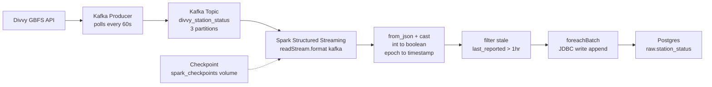

# Phase 2.4 — Spark Structured Streaming

> **Status:** Complete / Verified on 2026-07-15
> **Phase gate:** Phase 2 done when `docker compose up` includes Kafka, producer running, Spark streaming writes to Postgres, DBT builds `fact_station_reads`, can query "avg bikes available at station X over last hour"

## Summary

Built the Spark Structured Streaming consumer that reads Divvy station status messages from Kafka, parses JSON payloads with a typed schema, casts types (int→boolean, epoch→timestamp), filters stale stations, and writes each micro-batch to Postgres `raw.station_status` via `foreachBatch` + JDBC. Verified end-to-end: producer → Kafka → Spark streaming → Postgres with row count growing continuously (1,128 → 5,640 rows over 5 micro-batches).

## Files Created/Modified

| File | Action | Purpose |
|---|---|---|
| `spark/jobs/divvy_stream.py` | Created | Structured Streaming consumer: Kafka → from_json → cast/filter → foreachBatch → Postgres |
| `spark/Dockerfile` | Modified | Added 4 Kafka connector JARs + checkpoint directory with spark user ownership |
| `docker-compose.yml` | Modified | Added `spark_checkpoints` named volume + mounted to spark-master |
| `raw.station_status` (Postgres) | Created | 18-column table: 14 station fields + 3 Kafka metadata + 1 ingest timestamp |

## Architecture — What Was Built



Spark Structured Streaming consumes from Kafka, transforms each message, and writes micro-batches to Postgres via the `foreachBatch` JDBC bridge. The checkpoint volume stores Kafka offsets for fault recovery.

**For detailed architecture diagrams** (how files connect to containers, how images are built, how services depend on each other), see `docs/knowledge/architecture.md`. That file is the permanent reference; this doc is the phase snapshot. Don't duplicate those diagrams here.

## Errors Hit

| # | Error | Root Cause | Fix |
|---|---|---|---|
| 1 | `mkdir of file:/opt/spark/checkpoints/divvy_stream failed` | Named volume mounted as root:root, but Spark runs as user `spark` (UID 185) | `chown -R spark:spark /opt/spark/checkpoints` + added `RUN mkdir -p /opt/spark/checkpoints && chown spark:spark /opt/spark/checkpoints` to Dockerfile |
| 2 | `spark.sql.adaptive.enabled is not supported in streaming DataFrames` | AQE doesn't apply to streaming queries — only batch | Warning only, not an error. Spark automatically disables AQE for streaming. No action needed. |

### Lessons

- **apache/spark doesn't include Kafka connector** — the official image ships only core Spark JARs. Structured Streaming + Kafka needs 4 additional JARs. Baking them into the Dockerfile is the same pattern as the PostgreSQL JDBC driver.
- **Named volumes inherit ownership from the image directory** — when a named volume is first created, Docker copies permissions from the container's directory. Create the directory with correct ownership in the Dockerfile BEFORE the volume mounts.
- **foreachBatch is the bridge for streaming-to-JDBC** — JDBC has no native Structured Streaming sink. foreachBatch gives each micro-batch as a static DataFrame for the standard batch JDBC writer.
- **Stale data filtering matters** — 888 of 2016 stations (44%) had stale `last_reported` timestamps. Filter early in Spark, not late in DBT.

## Decisions Made

| Decision | Choice | Why |
|---|---|---|
| Kafka connector JARs | Baked into image (4 JARs) | Same approach as JDBC driver — reliable, offline, fast startup |
| foreachBatch for JDBC | Standard pattern | JDBC has no native streaming sink; foreachBatch bridges |
| Checkpoint location | Named volume `spark_checkpoints` | Persists Kafka offsets across container restarts |
| Stale station filter | `last_reported > now() - 1 hour` | Drops dead stations (one had `last_reported: 86400` = Jan 2 1970) |
| is_* fields | `CAST(int AS BOOLEAN)` in Spark | GBFS returns 0/1 integers, not booleans |
| station_id | StringType throughout | Mixed format (667 UUIDs + 1349 numeric strings) |
| Optional scooter fields | Nullable in schema | Not all stations have scooters; `from_json` returns null for missing |
| Trigger interval | 60 seconds | Matches producer poll interval |
| Kafka metadata columns | partition, offset, timestamp | Traceability — can trace any row back to its Kafka position |

## Verification

```bash
# Single batch test (--once mode)
$ python kafka/producers/divvy_producer.py --once --bootstrap localhost:29092
# → Fetched 2,016 stations, sent 2,016 messages

$ docker compose exec spark-master /opt/spark/bin/spark-submit --master local[*] /opt/spark/jobs/divvy_stream.py --once
# → [batch 0] writing 1128 rows to raw.station_status
# → [batch 0] write complete — 1128 rows inserted

# Row count after single batch
$ SELECT COUNT(*) FROM raw.station_status;
# → 1128

# Boolean cast verification
$ SELECT is_installed, is_renting, is_returning, COUNT(*) FROM raw.station_status GROUP BY 1,2,3;
# → t,t,t: 1127  |  t,f,f: 1  (correct — 0→false, 1→true)

# Optional scooter fields
$ SELECT COUNT(*), COUNT(num_scooters_available) FROM raw.station_status;
# → 1128 total, 1099 non-null (tolerated absence correctly)

# Continuous mode (producer + streaming both running)
# After 150s:
$ SELECT COUNT(*) FROM raw.station_status;
# → 5640 (grew from 1128 — 4 additional micro-batches)

# Multiple batches visible by ingest timestamp
$ SELECT DATE_TRUNC('minute', ingest_timestamp), COUNT(*) FROM raw.station_status GROUP BY 1 ORDER BY 1;
# → 5 rows, one per minute, ~1128 rows each
```

- **Single batch:** 2,016 Kafka messages → 1,128 rows inserted (888 stale stations filtered, 44%)
- **Boolean casts:** is_renting/is_returning/is_installed show true/false correctly (0→false, 1→true)
- **Optional scooter fields:** 1,099/1,128 non-null — missing fields handled as null
- **Continuous mode:** 5 micro-batches in 5 minutes, ~1,128 rows per batch, 5,640 total
- **Row count growth:** 1,128 → 5,640 over 150s — pipeline operates continuously

## What's Next

- **Phase 2.5: DBT models for stream** — `stg_station_status` (staging view) + `fact_station_reads` (one row per station poll)
  - Requires: `raw.station_status` table (this phase provides it)
  - New: DBT staging model for cleaning/renaming, DBT mart model for analytics-ready fact table
  - Will enable querying "avg bikes available at station X over last hour"
