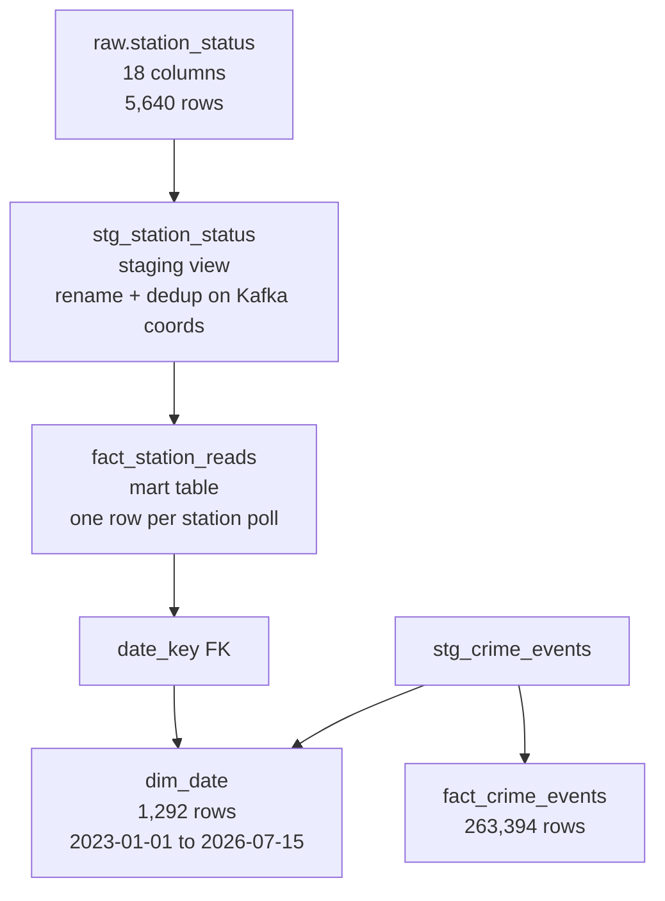

# Phase 2.5 — DBT Stream Models

> **Status:** Complete / Verified on 2026-07-16
> **Phase gate:** Phase 2 done when `docker compose up` includes Kafka, producer running, Spark streaming writes to Postgres, DBT builds `fact_station_reads`, can query "avg bikes available at station X over last hour"

## Summary

Built DBT staging and mart models for the Divvy station status streaming data. `stg_station_status` is a staging view on `raw.station_status` that renames columns and deduplicates on Kafka coordinates. `fact_station_reads` is a mart table with one row per station poll, a `date_key` FK to `dim_date`, and a derived `total_vehicles_available` column. Updated `dim_date` to span both crime (2023) and station read (2026) dates. All 59 DBT tests pass, and the analytics query ("avg bikes available at station X") returns correct results.

## Files Created/Modified

| File | Action | Purpose |
|---|---|---|
| `dbt/models/staging/stg_station_status.sql` | Created | Staging view on `raw.station_status`: renames columns, deduplicates on Kafka coordinates |
| `dbt/models/marts/fact_station_reads.sql` | Created | Mart table: one row per station poll, with `date_key` FK + derived `total_vehicles_available` |
| `dbt/models/marts/dim_date.sql` | Modified | Now spans both crime + station dates via UNION ALL of min/max from both sources |
| `dbt/models/staging/schema.yml` | Modified | Added `station_status` source + `stg_station_status` model with tests |
| `dbt/models/marts/schema.yml` | Modified | Updated `dim_date` description + year bounds, added `fact_station_reads` model with tests |

## Architecture — What Was Built



The streaming data flows from `raw.station_status` (written by Spark Structured Streaming in Phase 2.4) through `stg_station_status` (light cleaning + dedup) into `fact_station_reads` (analytics-ready mart). `dim_date` now spans both fact sources so FK relationships resolve for all fact tables.

**For detailed architecture diagrams** (how files connect to containers, how images are built, how services depend on each other), see `docs/knowledge/architecture.md`. That file is the permanent reference; this doc is the phase snapshot. Don't duplicate those diagrams here.

## Errors Hit

No errors encountered. All 59 DBT tests passed on first `dbt build` run.

### Lessons

- **dim_date must span all fact tables** — when adding a second fact table with different date ranges, the date dimension must cover both. Otherwise the FK relationship test fails. Use UNION ALL of min/max from all sources.
- **Streaming fact tables have different grain than batch** — crime facts are one row per event (unique ID). Station reads are one row per poll (repeating station_id). Don't blindly copy the unique test pattern from batch fact tables.
- **Deduplication keys differ by source** — crime deduplicates on `id` (business key). Streaming data deduplicates on Kafka coordinates (partition + offset) since those are the system-of-record unique identifiers.

## Decisions Made

| Decision | Choice | Why |
|---|---|---|
| Dedup key | Kafka partition + offset | Uniquely identifies each Kafka message. Same pattern as crime's `DISTINCT ON (id)` but adapted for streaming data. |
| Column renames | `last_reported`→`reported_at`, `ingest_timestamp`→`ingested_at` | Clearer naming: `reported_at` = when station reported, `ingested_at` = when pipeline received it. Matches `occurred_at`/`updated_at` pattern from crime staging. |
| Fact table grain | One row per station poll (Kafka message) | Most granular level — supports any aggregation. No pre-aggregation to avoid losing detail. |
| Derived column | `total_vehicles_available` = bikes + ebikes + COALESCE(scooters, 0) | Convenience for analytics. COALESCE on scooters since it's nullable. |
| dim_date expansion | UNION ALL of min/max from both sources | Single date dimension serves all fact tables. Without this, `fact_station_reads.date_key` FK test would fail. |
| No unique test on station_id | Not unique — multiple polls per station | Unlike `fact_crime_events.crime_id` (unique), station_id repeats across polls. Grain is station + reported_at, not station alone. |

## Verification

```bash
# Run dbt build (all models + tests)
$ docker run --rm --network chicago-data-pipeline_default \
    -v ./dbt:/opt/airflow/dbt \
    -v ./airflow/dbt_profiles:/opt/airflow/dbt_profiles \
    -e POSTGRES_USER=chicago -e POSTGRES_PASSWORD=chicago1234 -e POSTGRES_DB=chicago_analytics \
    chicago-data-pipeline-dbt:latest \
    dbt build --project-dir /opt/airflow/dbt --profiles-dir /opt/airflow/dbt_profiles

# Result:
# Finished running 1 seed, 5 table models, 51 data tests, 2 view models in 3.50s
# Completed successfully
# Done. PASS=59 WARN=0 ERROR=0 SKIP=0 TOTAL=59

# Fact table coverage
$ SELECT count(*), count(DISTINCT station_id), min(reported_at), max(reported_at)
  FROM mart.fact_station_reads;
# → 5640 rows, 1128 unique stations, 2026-07-15 15:55:07 to 2026-07-15 16:08:49

# dim_date now spans both sources
$ SELECT count(*), min(date_key), max(date_key) FROM mart.dim_date;
# → 1292 rows, 2023-01-01, 2026-07-15

# Analytics query — avg bikes available per station (Phase 2 gate query)
$ SELECT station_id, count(*) AS polls,
         round(avg(num_bikes_available), 2) AS avg_bikes_available,
         round(avg(total_vehicles_available), 2) AS avg_total_vehicles
  FROM mart.fact_station_reads
  GROUP BY station_id ORDER BY avg_bikes_available DESC LIMIT 5;
# → Top station: 42.0 avg bikes, 75.0 avg total vehicles, 5 polls
```

- **All 59 DBT tests pass:** 1 seed, 5 table models, 2 view models, 51 data tests — zero errors
- **fact_station_reads:** 5,640 rows, 1,128 unique stations, 5 polls per station
- **dim_date:** 1,292 rows spanning 2023-01-01 through 2026-07-15 (covers both crime + station data)
- **Analytics query verified:** "avg bikes available per station" returns correct results
- **FK relationship test passes:** `fact_station_reads.date_key → dim_date.date_key`

## What's Next

- **Phase 2.6: Airflow DAG for stream** — `divvy_stream_dag.py` (start/monitor producer + streaming job)
  - Requires: `raw.station_status` table (Phase 2.4) + DBT models (this phase provides `fact_station_reads`)
  - New: Airflow DAG that orchestrates the streaming pipeline — starts the Kafka producer, launches the Spark Structured Streaming job, monitors for failures, and runs DBT build on a schedule
  - Completes the Phase 2 gate: full end-to-end `docker compose up` → Kafka producer → Spark streaming → Postgres → DBT → queryable marts
