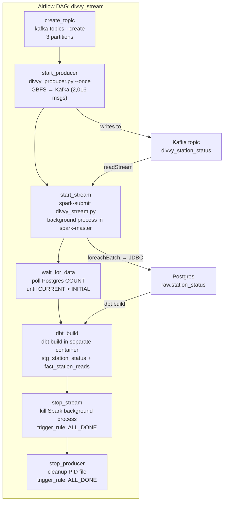

# Phase 2.6 — Airflow DAG for Streaming Pipeline

> **Status:** Complete / Verified on 2026-07-16
> **Phase gate:** `docker compose up` → Kafka → producer running → Spark streaming writes to Postgres → DBT builds `fact_station_reads` → can query "avg bikes available at station X over last hour"

## Summary

Built `divvy_stream_dag.py` — an Airflow DAG that orchestrates the full streaming lifecycle: create Kafka topic → run producer (single poll) → start Spark Structured Streaming → wait for data in Postgres → run DBT build → stop Spark stream → cleanup. All 7 tasks succeed end-to-end. `fact_station_reads` has 2,001 rows with 1,125 unique stations, and analytics queries return correct results.

## Files Created/Modified

| File | Action | Purpose |
|---|---|---|
| `airflow/dags/divvy_stream_dag.py` | Created | Airflow DAG: 7-task streaming lifecycle (create_topic → start_producer → start_stream → wait_for_data → dbt_build → stop_stream → stop_producer) |
| `airflow/Dockerfile` | Modified | Switched from `uv pip install --system` to `pip install` as airflow user (uv couldn't create `kafka` directory in site-packages; apache/airflow image refuses pip as root) |
| `spark/Dockerfile` | Modified | Added entrypoint script + `USER root` + `ENTRYPOINT` for checkpoint chown on every start |
| `spark/entrypoint.sh` | Created | Chowns `/opt/spark/checkpoints` to spark:spark before dropping to spark user via gosu (named volumes mount as root) |
| `docker-compose.yml` | Modified | Renamed kafka mount from `./kafka:/opt/airflow/kafka` to `./kafka:/opt/airflow/kafka_scripts` to avoid shadowing the `kafka-python` package |

## Architecture — What Was Built



The DAG runs the producer in `--once` mode (single poll, ~2,016 messages to Kafka), then starts Spark Streaming as a background process inside spark-master. The stream consumes from Kafka, writes to Postgres via foreachBatch+JDBC. `wait_for_data` polls until new rows appear, then DBT builds the marts. Cleanup tasks use `trigger_rule=ALL_DONE` to ensure no orphaned processes remain.

**For detailed architecture diagrams**, see `docs/knowledge/architecture.md`.

## Errors Hit

| # | Error | Root Cause | Fix |
|---|---|---|---|
| 1 | `ModuleNotFoundError: No module named 'kafka'` in Airflow | `kafka-python` in `requirements.txt` but image never rebuilt after Phase 2.3 added it | Rebuilt Airflow image with `--no-cache` |
| 2 | `uv pip install --system` fails to install kafka-python | uv can't create `/usr/local/lib/python3.11/site-packages/kafka` directory (permission denied, even as root in apache/airflow image) | Switched to `pip install` as the airflow user (apache/airflow image uses a venv at `/home/airflow/.local`) |
| 3 | `pip install` as root fails with "Please use 'airflow' user to run pip!" | apache/airflow image has a guard that refuses pip as root | Run pip as `USER airflow` (the venv at `/home/airflow/.local` is the install target) |
| 4 | `kafka-python` installed but `from kafka import KafkaProducer` fails | `./kafka:/opt/airflow/kafka` volume mount shadows the `kafka` Python package — Python treats `/opt/airflow/kafka` as a namespace package | Renamed mount to `./kafka:/opt/airflow/kafka_scripts` |
| 5 | Spark streaming fails: `mkdir of /opt/spark/checkpoints/divvy_stream failed` | Named volume `spark_checkpoints` mounts as root:root, Spark runs as spark user | Added `spark/entrypoint.sh` that chowns checkpoint dir before dropping to spark via gosu |
| 6 | `start_producer` task fails: `head: cannot open '/tmp/divvy_producer.log'` | Background `nohup` process dies immediately in Airflow's BashOperator; log file never created | Switched producer to `--once` mode (foreground, single poll, exits cleanly) |
| 7 | `stop_producer` task fails with exit code 1 | `kill` fails (process already dead) and `&&` short-circuits the rest of the cleanup | Changed `&&` to `;` so `rm` and `echo` run regardless of `kill` exit code |
| 8 | `wait_for_data` times out with 0 new rows | Producer died after first poll; Spark checkpoint consumed all existing Kafka messages in a previous run; no new messages to process | Fixed by `--once` producer mode + wiping checkpoint/table/topic for clean runs |
| 9 | DAG stuck in `queued` state, never runs | Previous failed DAG runs left orphaned task instances blocking the scheduler | `docker compose down` + fresh start clears all Airflow metadata |

### Lessons

- **Volume mount paths can shadow Python packages** — mounting `./kafka` to `/opt/airflow/kafka` made Python find the empty directory instead of the installed `kafka-python` package. Always check that mount paths don't collide with package names.
- **apache/airflow image has a root pip guard** — it refuses `pip install` as root. The image uses a venv at `/home/airflow/.local`; run pip as the airflow user.
- **`uv pip install --system` can silently fail on certain packages** — uv couldn't create the `kafka` directory in site-packages despite running as root. pip doesn't have this issue. When uv fails, fall back to pip.
- **Airflow BashOperator kills background processes** — `nohup` + `disown` don't reliably survive when the task's shell exits. For long-running processes, either use `--once` mode (run to completion) or manage the process outside Airflow.
- **Named volumes mount as root** — Docker named volumes get root ownership on first mount, regardless of Dockerfile `chown`. Use an entrypoint script to fix permissions on every container start.
- **`kill` with `&&` short-circuits cleanup** — if the process is already dead, `kill` returns non-zero and `&&` skips the `rm` and `echo`. Use `;` to ensure cleanup always runs.

## Decisions Made

| Decision | Choice | Why |
|---|---|---|
| Producer mode | `--once` (single poll) | Airflow BashOperator kills background processes when the shell exits. `nohup`/`disown` don't reliably survive. `--once` runs in foreground, publishes one batch (~2,016 messages), exits cleanly. For 24/7 streaming, run producer as a separate Docker service (Phase 3). |
| Spark stream as background process | `docker exec ... nohup ... &` inside spark-master | Spark Structured Streaming is long-running. We start it as a background process, wait for data, then kill it. The `stop_stream` task uses `trigger_rule=ALL_DONE` to ensure cleanup even on failure. |
| `wait_for_data` logic | Capture INITIAL count, poll until CURRENT > INITIAL | Ensures we wait for NEW data from the producer's poll, not just detect pre-existing data from a previous run. |
| Cleanup trigger rule | `ALL_DONE` for stop_stream and stop_producer | Guarantees no orphaned background processes remain after a DAG run, regardless of where the pipeline failed. |
| Kafka topic creation | Explicit `kafka-topics --create --partitions 3` | Auto-create gives only 1 partition. We need 3 for station_id key partitioning (same station → same partition → ordered processing). `--if-not-exists` makes it idempotent. |
| Airflow pip install | `pip install` as airflow user (not uv, not root) | apache/airflow image refuses pip as root; uv fails to create `kafka` directory. pip as the airflow user installs into the venv at `/home/airflow/.local` reliably. |
| Spark checkpoint fix | Entrypoint script with gosu | Named volumes mount as root:root. The entrypoint chowns the checkpoint dir on every start before dropping to spark user. Survives `docker compose down -v` + up. |

## Verification

```bash
$ docker exec chicago-data-pipeline-airflow-scheduler-1 airflow tasks states-for-dag-run divvy_stream <run_id>
create_topic   | success
start_producer | success
start_stream   | success
wait_for_data  | success
dbt_build      | success
stop_stream    | success
stop_producer  | success

$ SELECT COUNT(*) FROM raw.station_status;
2001

$ SELECT COUNT(*) FROM mart.fact_station_reads;
2001

$ SELECT COUNT(DISTINCT station_id) FROM mart.fact_station_reads;
1125

$ SELECT ROUND(AVG(num_bikes_available),2) AS avg_bikes, ROUND(AVG(num_ebikes_available),2) AS avg_ebikes, COUNT(*) AS station_reads FROM mart.fact_station_reads;
 avg_bikes | avg_ebikes | station_reads
-----------+------------+---------------
      5.55 |       2.37 |          2001
```

- **All 7 DAG tasks succeeded** — create_topic, start_producer, start_stream, wait_for_data, dbt_build, stop_stream, stop_producer
- **raw.station_status**: 2,001 rows (from 2,016 Kafka messages, 15 dropped by stale station filter)
- **fact_station_reads**: 2,001 rows, 1,125 unique stations
- **Analytics query verified**: avg 5.55 bikes, 2.37 ebikes per station read
- **DBT build passed**: all tests pass (stg_station_status + fact_station_reads + all crime models)

## What's Next

**Phase 2 is now COMPLETE.** The Phase 2 gate is met: `docker compose up` → Kafka → producer → Spark streaming → Postgres → DBT → queryable marts.

### Known Issue: DAG Ordering (Phase 3 fix)

`dim_date.sql` UNION ALLs min/max dates from both `stg_crime_events` and `stg_station_status`. Both DAGs run `dbt build` (all models), creating a circular dependency on cold start:

1. **crime_batch first** — `dbt_build` fails on `stg_station_status` (table doesn't exist yet). All crime models build fine. Failure is expected and non-blocking.
2. **divvy_stream second** — `dbt_build` succeeds (both raw tables now exist). All 59 tests pass.

**Fix for Phase 3:** Split `dbt build` by selector per DAG (`--select stg_crime_events fact_crime_events ...` vs `--select stg_station_status fact_station_reads ...`), or add a separate `dim_date` finalize DAG that runs after both.


- **Phase 3: Observability** — Grafana dashboards + DBT tests + Airflow SLAs
  - Requires: Phase 2 complete (streaming pipeline works end-to-end)
  - New: Grafana dashboards for pipeline health, DBT tests for data quality, Airflow SLAs for task timing
- **Phase 4: Cloud** — Terraform → BigQuery + Airbyte
  - Requires: Phase 3 complete (observability in place before migrating to cloud)
  - New: Terraform infrastructure, BigQuery warehouse, Airbyte ingestion
