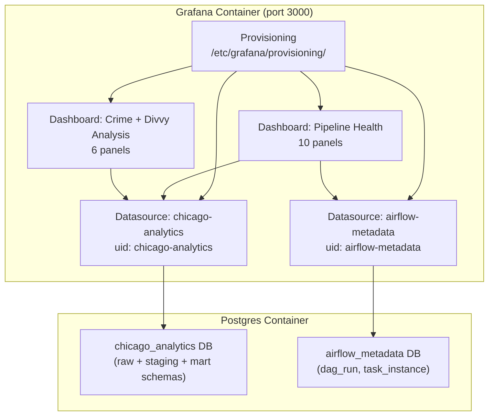

# Phase 3.1 — Grafana

> **Status:** Complete / Verified on 2026-07-18
> **Phase gate:** Grafana shows live row counts and stream freshness

## Summary

Added Grafana as the observability dashboarding layer. Two Postgres datasources (Chicago Analytics + Airflow Metadata) are provisioned file-based via YAML, and two dashboards (Pipeline Health + Crime + Divvy Analysis) are provisioned via JSON. All 16 panel queries verified against live data — 263,395 crime rows, 2,001 station reads, Airflow DAG run history.

## Files Created/Modified

| File | Action | Purpose |
|---|---|---|
| `docker-compose.yml` | Modified | Added `grafana` service (image, env, port 3000, volumes, healthcheck) + `grafana_data` named volume. Added `AIRFLOW_DB_USER`/`AIRFLOW_DB_PASSWORD` to grafana env. |
| `.env.example` | Modified | Added `GRAFANA_ADMIN_USER` / `GRAFANA_ADMIN_PASSWORD` section |
| `.env` | Modified | Appended Grafana admin creds |
| `grafana/provisioning/datasources/postgres.yml` | Created | Provisions two Postgres datasources: `chicago-analytics` (warehouse) + `airflow-metadata` (Airflow DB) |
| `grafana/provisioning/dashboards/dashboards.yml` | Created | Dashboard provider — scans `./grafana/dashboards/` every 30s, loads into "Chicago Pipeline" folder |
| `grafana/dashboards/pipeline_health.json` | Created | 10-panel pipeline health dashboard (row counts, stream freshness, DBT tests, Airflow DAG runs + task instances) |
| `grafana/dashboards/crime_divvy_analysis.json` | Created | 6-panel analysis dashboard (crime by area, crime types, station availability heatmap, crime-vs-ridership proxy) |
| `docs/knowledge/grafana.md` | Created | Grafana reference: provisioning, env var syntax gotcha, dashboard inventory, useful commands |

## Architecture — What Was Built



Grafana reads from two separate Postgres databases via two provisioned datasources. Dashboards are JSON files bind-mounted into the container; provisioning YAML auto-loads them on startup.

**For detailed architecture diagrams**, see `docs/knowledge/architecture.md`.

## Errors Hit

| # | Error | Root Cause | Fix |
|---|---|---|---|
| 1 | `Failed to provision data sources: yaml: unmarshal errors: line 25: cannot unmarshal !!map into string` | Used Go template syntax `{{.POSTGRES_USER}}` in datasource YAML. Grafana provisioning uses shell-style `$VAR`, not Go templates. | Changed to `user: $POSTGRES_USER` and `password: $POSTGRES_PASSWORD`. |
| 2 | `FATAL: no PostgreSQL user name specified in startup packet (SQLSTATE 28000)` on Airflow datasource | `AIRFLOW_DB_USER`/`AIRFLOW_DB_PASSWORD` env vars not in Grafana container. `docker compose restart` doesn't re-read env vars. | Added vars to docker-compose grafana env, then `docker compose up -d grafana` (recreates container). |
| 3 | `relation "airflow_metadata.dag_run" does not exist` | Tried to cross-database query (`airflow_metadata.dag_run`) from `chicago_analytics` datasource. Postgres can't query across databases without `postgres_fdw`. | Added second datasource `airflow-metadata` pointing at `airflow_metadata` DB. Updated Airflow panels to use it; dropped `airflow_metadata.` schema prefix from SQL. |
| 4 | Browser console: `You do not currently have a default database configured for this data source` — panels show "No data" despite API queries working | Grafana 12.4's Postgres plugin reads the database name from `jsonData.database`, NOT the top-level `database:` field. The top-level field works for the internal API but the browser plugin uses a different code path that requires `jsonData.database`. | Added `database:` inside the `jsonData:` block of each datasource in `postgres.yml`. Recreated Grafana container. |

### Lessons

- **Grafana env var syntax is `$VAR`, not `{{.VAR}}`** — the cryptic "cannot unmarshal !!map into string" error is the signature of this mistake. Grafana's provisioning parser uses shell-style interpolation, not Go templates.
- **`docker compose restart` ≠ `docker compose up -d` for env changes** — restart reuses the existing container (with old env). `up -d` recreates the container when config changes. This is a common Docker Compose gotcha.
- **Postgres databases are isolated** — unlike schemas (which share a database and can be cross-queried), databases are fully separate. Cross-DB queries need `postgres_fdw` or a second datasource. Our project has two databases (`chicago_analytics` + `airflow_metadata`), so Grafana needs two datasources.
- **Postgres datasource needs `jsonData.database`** — Grafana 12.4's Postgres plugin reads the DB name from `jsonData.database`, not the top-level `database:` field. The top-level field works for the internal API but the browser plugin requires `jsonData.database`. Without it, API queries succeed but browser panels show "No data". Set both for compatibility.

## Decisions Made

| Decision | Choice | Why |
|---|---|---|
| Grafana version | 12.4.0 (not 13.1.0) | 13.1.0 released 2026-06-23 — 25 days old. 12.4.0 is production-hardened. Matches "stable versions only" rule (same logic as Airflow 3.0.0 over 3.3.0). |
| Image | `grafana/grafana` (not `grafana/grafana-oss`) | `grafana-oss` repo deprecated since 12.4.0. `grafana/grafana` includes Enterprise features, free to use. |
| Two datasources | One per Postgres database | Postgres can't cross-query databases without `postgres_fdw`. Simpler to provision two datasources than set up FDW. |
| File-based provisioning | YAML + JSON, no UI config | Version-controlled, reproducible, no manual UI steps. Dashboards rebuild from files on any machine. |
| Anonymous Viewer access | Enabled for local dev | Dashboards viewable without login. Set `GF_AUTH_ANONYMOUS_ENABLED=false` in shared environments. |
| DBT tests panel (static) | Placeholder `SELECT 59` | Real DBT test results need artifact parsing — wired in Phase 3.2. Panel exists now so the dashboard is complete. |
| Crime-vs-ridership is a proxy | System-wide avg bikes, not per-area | GBFS doesn't include `community_area_id` on stations. Real join needs geospatial matching (station lat/long → community area polygon), deferred to Phase 4+. |

## Verification

```bash
# Start Grafana + Postgres
$ docker compose up -d postgres grafana
Container chicago-data-pipeline-postgres-1 Healthy
Container chicago-data-pipeline-grafana-1 Started

# Grafana health
$ curl -s -u admin:admin http://localhost:3000/api/health
{"database": "ok", "version": "12.4.0"}

# Datasources provisioned
$ curl -s -u admin:admin http://localhost:3000/api/datasources | python3 -m json.tool
[{"name": "Chicago Analytics", "uid": "chicago-analytics", "type": "postgres"},
 {"name": "Airflow Metadata", "uid": "airflow-metadata", "type": "postgres"}]

# Dashboards loaded
$ curl -s -u admin:admin http://localhost:3000/api/search
[{"title": "Chicago Pipeline", "type": "dash-folder"},
 {"title": "Crime + Divvy Analysis", "type": "dash-db", "uid": "crime-divvy-analysis"},
 {"title": "Pipeline Health", "type": "dash-db", "uid": "pipeline-health"}]

# Sample query — crime rows
$ curl -s -u admin:admin -X POST http://localhost:3000/api/ds/query ...
{"results":{"A":{"status":200,"frames":[{"data":{"values":[[263395]]}}]}}}

# Sample query — Airflow DAG runs
$ curl -s -u admin:admin -X POST http://localhost:3000/api/ds/query ... (airflow-metadata)
{"results":{"A":{"status":200,"frames":[{"data":{"values":[["failed","success"],[2,1]]}}]}}}
```

- **Grafana healthy:** version 12.4.0, database ok
- **Both datasources provisioned:** Chicago Analytics + Airflow Metadata
- **Both dashboards loaded:** Pipeline Health (10 panels) + Crime + Divvy Analysis (6 panels)
- **All 16 panel queries verified against live data:** 8 Chicago Analytics queries + 6 analysis queries + 2 Airflow queries all return status 200
- **Live data confirmed:** 263,395 crime rows, 2,001 station reads, Airflow DAG runs (2 failed + 1 success in last 7 days)
- **Top community area by crime:** Austin (12,700) — correct, Austin is historically Chicago's highest-crime area

## What's Next

- **Phase 3.2: DBT tests (expand)** — Add custom singular test `assert_crime_in_chicago_bounds.sql` + stream not_null tests. Wire the DBT tests panel to actual test results instead of the static placeholder.
  - Requires: Phase 3.1 (this phase — Grafana dashboard exists to surface test results)
  - New: `dbt/tests/assert_crime_in_chicago_bounds.sql`, expanded `schema.yml` tests
