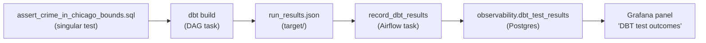

# Phase 3.2 — DBT Tests

> **Status:** Complete / Verified on 2026-07-20
> **Phase gate:** DBT tests catch a deliberately introduced data quality issue (Phase 3.4 verification); Grafana DBT panel shows live test outcomes.

## Summary

Added a custom singular DBT test (`assert_crime_in_chicago_bounds`) for geographic bounds checking, and built a recorder that parses dbt's `run_results.json` after every `dbt build` and writes test outcomes into `observability.dbt_test_results` in Postgres. The Grafana "DBT tests" panel (previously a static `SELECT 59` placeholder) now queries that table and shows live passing/failing/warnings counts for the latest dbt invocation. Both DAGs (`crime_batch`, `divvy_stream`) gained a `record_dbt_results` task that runs the recorder after `dbt_build`.

## Files Created/Modified

| File | Action | Purpose |
|---|---|---|
| `dbt/tests/assert_crime_in_chicago_bounds.sql` | Created | Singular test — flags crime events with lat/long outside Chicago's bounding box. |
| `airflow/scripts/record_dbt_results.py` | Created | Parses `run_results.json`, upserts test outcomes into `observability.dbt_test_results`. |
| `docs/phases/phase-3.2-dbt-tests.md` | Created | This phase doc. |
| `docker-compose.yml` | Modified | Added `./airflow/scripts:/opt/airflow/scripts` mount to `x-airflow-common`. |
| `airflow/dags/crime_batch_dag.py` | Modified | Added `record_dbt_results` task after `dbt_build`. |
| `airflow/dags/divvy_stream_dag.py` | Modified | Added `record_dbt_results` task between `dbt_build` and `stop_stream`. |
| `grafana/dashboards/pipeline_health.json` | Modified | Rewired DBT panel (id 8) from static placeholder to real query against `observability.dbt_test_results`. |

## Architecture — What Was Built



dbt build runs all tests (including the new singular bounds test) and writes `run_results.json`. The `record_dbt_results` Airflow task parses that file and upserts one row per test into `observability.dbt_test_results`. Grafana queries the latest invocation's rows and renders passing/failing/warnings counts.

**For detailed architecture diagrams** (how files connect to containers, how images are built, how services depend on each other), see `docs/knowledge/architecture.md`. That file is the permanent reference; this doc is the phase snapshot. Don't duplicate those diagrams here.

## Errors Hit

| # | Error | Root Cause | Fix |
|---|---|---|---|
| 1 | Recorder captured 0 tests despite `dbt build` reporting `TOTAL=60` | Filtered on `resource_type == "test"`, but dbt 1.11's `run_results.json` does not populate `resource_type` (None for every entry). `name` is also None. | Changed filter to `unique_id.startswith("test.")`. Extracted readable name from `unique_id` by stripping `test.chicago_crime.` prefix and trailing `.<hash>`. |
| 2 | Grafana dashboard JSON malformed after incremental panel edits | Multiple `edit` ops dropped the `"fieldConfig": {` wrapper and `"matcher": {` opener, leaving `defaults`/`overrides` at wrong nesting level. | Re-inserted missing wrappers; validated with `python3 -c "import json; json.load(open(...))"`. |

### Lessons

- **dbt 1.11 `run_results.json` has no `resource_type` field** — identify tests by `unique_id` prefix (`test.`). The `name` field is also null; the readable name lives inside `unique_id`.
- **dbt's `TOTAL=N` counts all resources, not just tests** — `TOTAL=60` = 1 seed + 7 models + 52 tests. Don't confuse the resource total with the test count.
- **Edit JSON panel objects wholesale, not field-by-field** — the edit tool's line-range semantics make it easy to drop a brace when patching nested Grafana JSON. Replace the entire panel object in one op and validate with `json.load`.

## Decisions Made

| Decision | Choice | Why |
|---|---|---|
| Custom recorder vs. dbt-artifacts package | Custom 40-line script | No new dbt dependency; project keeps `packages.yml` small. The artifact we need is tiny. |
| Observability schema | Dedicated `observability` schema | Pipeline metadata ≠ analytics data. Keeps `mart` clean for BI and `raw` clean for ingested data. Created idempotently by the recorder. |
| Recorder runs in Airflow container | Not in the dbt container | Airflow already has psycopg2 (via postgres provider). The dbt container has only dbt installed. |
| Panel shows latest invocation only | `WHERE generated_at = max(generated_at)` | The panel answers "is the latest dbt build healthy?" History is queryable directly from the table. |

## Verification

```bash
# dbt build summary (divvy_stream DAG run)
$ grep "Done." .../task_id=dbt_build/attempt=1.log
Done. PASS=60 WARN=0 ERROR=0 SKIP=0 NO-OP=0 TOTAL=60

# Recorder output
$ python /opt/airflow/scripts/record_dbt_results.py
Recorded 52 dbt test results for invocation d76f8967-... (pass=52) into observability.dbt_test_results

# Grafana panel query via API
$ curl -s -u admin:admin -X POST http://localhost:3000/api/ds/query ...
passing = [52], failing = [0], warnings = [0]

# Both DAGs — all tasks succeeded including record_dbt_results
$ airflow tasks states-for-dag-run divvy_stream ...
create_topic: success, start_producer: success, start_stream: success,
wait_for_data: success, dbt_build: success, record_dbt_results: success,
stop_stream: success, stop_producer: success
```

- **Singular bounds test:** `assert_crime_in_chicago_bounds` ran and passed (status='pass' in `observability.dbt_test_results`).
- **52 tests recorded:** all status='pass' for the latest invocation.
- **Grafana panel:** query returns passing=52, failing=0, warnings=0; dashboard loads with updated title "DBT test outcomes (latest run)".
- **Both DAGs:** `record_dbt_results` task succeeded in `crime_batch` (5 tasks) and `divvy_stream` (8 tasks).
- **3 dbt invocations recorded** total (manual + divvy_stream DAG + crime_batch DAG).

## What's Next

- **Phase 3.3: Airflow robustness** — Add retries, SLAs, freshness sensor, `on_failure_callback`. Also address the `crime_batch`/`divvy_stream` DAG race condition (separate batch/stream dbt models or add a sensor).
  - Requires: Phase 3.2 complete (test outcomes observable in Grafana) ✅ met
  - New: Airflow SLAs, `on_failure_callback`, sensor-based dependency, DAG race condition fix
- **Phase 3.4: Verification** — Break the pipeline and confirm observability catches it (stop producer → Grafana freshness alert; introduce bad data → DBT test failure shows red in Grafana panel; fail a task → Airflow retries + SLA miss alert).
  - Requires: Phase 3.3 complete
