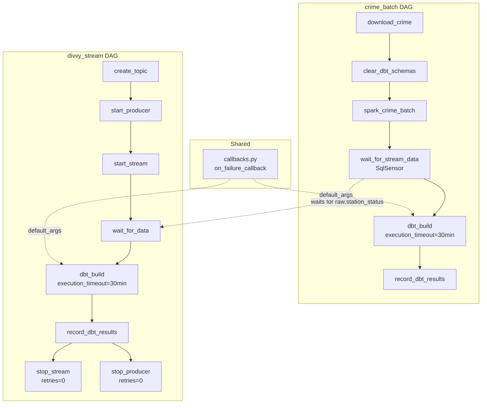

# Phase 3.3 — Airflow Robustness

> **Status:** Complete / Verified on 2026-07-20
> **Phase gate:** Airflow retries a deliberately failing task and alerts on SLA miss (Phase 3.4 verification).

## Summary

Added a `SqlSensor` to `crime_batch` that fixes the race condition with `divvy_stream` — `dbt_build` now waits for `raw.station_status` to exist before running, since `dim_date` spans both sources. Updated both DAGs with retries (3x, 5min delay), `on_failure_callback` (structured failure logging), and `execution_timeout` on `dbt_build` (30min). Added a "Failed tasks" panel to Grafana. Airflow 3.0 removed the SLA feature, so `execution_timeout` is used instead of `sla=`.

## Files Created/Modified

| File | Action | Purpose |
|---|---|---|
| `airflow/dags/callbacks.py` | Created | Shared `on_failure_callback` — logs dag_id, task_id, run_id, try_number, exception. |
| `docs/phases/phase-3.3-airflow-robustness.md` | Created | This phase doc. |
| `docker-compose.yml` | Modified | Added `AIRFLOW_CONN_POSTGRES_DEFAULT` env var for SqlSensor. |
| `airflow/dags/crime_batch_dag.py` | Modified | Added SqlSensor, retries, on_failure_callback, execution_timeout. |
| `airflow/dags/divvy_stream_dag.py` | Modified | Added retries, on_failure_callback, execution_timeout, retries=0 on cleanup. |
| `grafana/dashboards/pipeline_health.json` | Modified | Added "Failed tasks (last 7 days)" panel (id 11). |

## Architecture — What Was Built



The SqlSensor (`wait_for_stream_data`) creates an explicit dependency: `crime_batch` waits for `raw.station_status` to exist (created by `divvy_stream`) before running `dbt_build`. Both DAGs share the `on_failure_callback` and use `execution_timeout` on `dbt_build`.

**For detailed architecture diagrams**, see `docs/knowledge/architecture.md`.

## Errors Hit

| # | Error | Root Cause | Fix |
|---|---|---|---|
| 1 | SqlSensor failed: `'str' object has no attribute 'fetchone'` | Used `success=lambda result: result.fetchone()[0]` — assumed callback receives a cursor. Airflow 3.0's `SqlSensor.poke` passes `records[0]` (a row tuple) to the success callable. | Changed to `success=lambda row: row[0] is not None`. |
| 2 | `sla=` triggers deprecation warning, is a no-op | Airflow 3.0 removed the SLA feature entirely. `sla=` is accepted but does nothing. No SLA misses recorded in `dag_warning`. | Replaced with `execution_timeout=timedelta(minutes=30)`. Changed Grafana panel from "SLA misses" to "Failed tasks". |
| 3 | Stuck DAG run blocked new runs | Failed sensor task was `up_for_retry` (3 retries × 5min = 15min). DAG run stayed `running`, blocking new runs (`max_active_runs=1`). | Manually marked stuck run as `failed` in metadata DB. New run then started. |

### Lessons

- **Airflow 3.0 removed the SLA feature** — `sla=` is a no-op. Use `execution_timeout=` instead. SLA planned to return in 3.1+.
- **SqlSensor success callback receives a row, not a cursor** — `poke()` calls `hook.get_records(sql)` → list of rows, passes `records[0]` to the callable.
- **Sensors + `max_active_runs=1` can block new runs** — a sensor in `up_for_retry` keeps the DAG run `running`, blocking new triggers.

## Decisions Made

| Decision | Choice | Why |
|---|---|---|
| Race condition fix | SqlSensor (not split dbt models) | `dim_date` legitimately spans both sources. Splitting models would break the UNION ALL. Sensor makes the implicit dependency explicit. |
| `execution_timeout` vs `sla=` | `execution_timeout` | Airflow 3.0 removed SLA. `execution_timeout` actually fails the task on timeout. |
| `on_failure_callback` vs email | Callback (logging) | No email server in local dev. Callback logs to Airflow logs. Production would add Slack/email here. |
| `retries=0` on cleanup | Don't retry cleanup | `stop_stream`/`stop_producer` are best-effort. If `kill` fails, process is already gone. |
| `mode="reschedule"` on sensor | Not `mode="poke"` | Sensor may wait up to 1hr. `reschedule` releases worker slot between pokes. |

## Verification

```bash
# Both DAGs parse
$ airflow dags list | grep -E "crime_batch|divvy_stream"
crime_batch  | /opt/airflow/dags/crime_batch_dag.py  | chicago-pipeline | False
divvy_stream | /opt/airflow/dags/divvy_stream_dag.py | chicago-pipeline | False

# Connection created via env var
$ airflow connections get postgres_default
host=postgres, schema=chicago_analytics, login=chicago, port=5432

# crime_batch tasks (note wait_for_stream_data sensor)
$ airflow tasks list crime_batch
clear_dbt_schemas, dbt_build, download_crime, record_dbt_results, spark_crime_batch, wait_for_stream_data

# divvy_stream DAG run — all 8 tasks succeeded
$ airflow tasks states-for-dag-run divvy_stream ...
create_topic: success, start_producer: success, start_stream: success,
wait_for_data: success, dbt_build: success, record_dbt_results: success,
stop_stream: success, stop_producer: success

# crime_batch DAG run — all 6 tasks succeeded (sensor passed immediately)
$ airflow tasks states-for-dag-run crime_batch ...
download_crime: success, clear_dbt_schemas: success, spark_crime_batch: success,
wait_for_stream_data: success, dbt_build: success, record_dbt_results: success

# Grafana — 11 panels, failed tasks panel returns data
$ curl ... /api/dashboards/uid/pipeline-health
Total panels: 11 (was 10 — added "Failed tasks (last 7 days)")
failed_tasks = [1]
```

- **SqlSensor:** passed immediately (raw.station_status exists from prior divvy_stream run)
- **Both DAGs:** all tasks succeeded (crime_batch 6/6, divvy_stream 8/8)
- **Grafana:** 11 panels loaded, "Failed tasks" panel returns failed_tasks=1
- **on_failure_callback:** wired via default_args, fires when a task exhausts all 3 retries

## What's Next

- **Phase 3.4: Verification** — Break the pipeline and confirm observability catches it:
  - Stop the producer → Grafana stream freshness panel shows red
  - Introduce bad data → DBT test failure shows in Grafana DBT panel
  - Fail a task → Airflow retries (3x), on_failure_callback logs, Grafana failed tasks panel shows red
  - Requires: Phase 3.3 complete ✅ met
