# Phase 3.4 — Verification

> **Status:** Complete / Verified on 2026-07-20
> **Phase gate:** Phase 3 COMPLETE. Phase 4 (Cloud) unlocked.

## Summary

Broke the pipeline in 3 ways and confirmed all observability mechanisms catch the failures: (1) stopped producer → Grafana stream freshness panel went red, (2) injected bad crime data → 2 DBT tests failed + Grafana DBT panel went red, (3) failed a task → Airflow retried 3x + on_failure_callback logged + Grafana failed-tasks panel went red. Pipeline restored to working state after each test.

## Verification Scenarios

### Scenario 1: Stream freshness alert

| Aspect | Detail |
|---|---|
| **Break** | Producer stopped (divvy_stream DAG completed, no new data) |
| **Observability** | Grafana "Stream freshness" panel (id 6) — red at 900s threshold |
| **Result** | Freshness = 1195s (19.9min) > 900s → panel RED ✅ |
| **Query** | `SELECT EXTRACT(EPOCH FROM (NOW() - MAX(ingest_timestamp))) AS seconds_since_last_ingest FROM raw.station_status;` |

### Scenario 2: DBT test failure

| Aspect | Detail |
|---|---|
| **Break** | Injected bad crime row (id=99999999, lat=45.0, lon=-100.0 — South Dakota, outside Chicago bounds) |
| **Observability** | DBT bounds tests in `staging/schema.yml` + Grafana "DBT test outcomes" panel (id 8) |
| **Result** | 2 tests failed (latitude + longitude range), recorder captured fail=2, Grafana showed passing=30 failing=2 → RED ✅ |
| **Restore** | Deleted bad row, re-ran `dbt build` (PASS=60), ran recorder → Grafana back to passing=52 failing=0 → GREEN |

### Scenario 3: Task failure + retries + callback

| Aspect | Detail |
|---|---|
| **Break** | Throwaway DAG `verify_failure_handling` with `exit 1` task, retries=3, retry_delay=10s, on_failure_callback |
| **Observability** | Airflow retries + on_failure_callback (structured log) + Grafana "Failed tasks" panel (id 11) |
| **Result** | Task failed after 4 attempts (try_number=4), callback logged `dag=verify_failure_handling task=fail_on_purpose try=4`, Grafana showed failed_tasks=2 → RED ✅ |
| **Restore** | Deleted DAG file, ran `airflow dags delete verify_failure_handling` (removed 5 metadata records) |

## Architecture — How Observability Catches Failures

```mermaid
graph TB
    subgraph "Scenario 1: Stream Freshness"
        A["Producer stops"] --> B["No new rows in raw.station_status"]
        B --> C["MAX(ingest_timestamp) ages"]
        C --> D["Grafana panel id 6<br/>seconds_since_last_ingest > 900"]
        D --> E["Panel turns RED"]
    end

    subgraph "Scenario 2: DBT Test Failure"
        F["Bad row injected<br/>lat=45, lon=-100"] --> G["dbt build runs"]
        G --> H["Bounds tests fail<br/>latitude + longitude range"]
        H --> I["Recorder captures fail=2"]
        I --> J["Grafana panel id 8<br/>failing > 0"]
        J --> K["Panel turns RED"]
    end

    subgraph "Scenario 3: Task Failure"
        L["Task exits 1"] --> M["Airflow retries 3x"]
        M --> N["All 4 attempts fail"]
        N --> O["on_failure_callback fires<br/>logs structured context"]
        N --> P["task_instance.state = failed"]
        P --> Q["Grafana panel id 11<br/>failed_tasks > 0"]
        Q --> R["Panel turns RED"]
    end
```

## Errors Hit

| # | Error | Root Cause | Fix |
|---|---|---|---|
| 1 | `dbt build` manual run: image `chicago-crime-dbt:latest` not found | Wrong image name. DAGs use `chicago-data-pipeline-dbt:latest`. | Used correct name from `DBT_IMAGE` var. |
| 2 | `dbt build` manual run: `--project-dir /opt/dbt` does not exist | Wrong path. DAGs use `/opt/airflow/dbt`. | Used correct path from `DBT_DIR` var. |
| 3 | Throwaway DAG not found by `airflow dags trigger` | DAG bundle refresh interval is long (~30s+). | Ran `airflow dags reserialize` to force refresh. |
| 4 | `airflow dags delete` failed with `EOFError` | Delete prompts for `y/n` confirmation, no TTY in `docker compose exec -T`. | Piped `echo "y"` into the command. |

### Lessons

- **Panel thresholds are sufficient alerts for local dev** — Grafana unified alerting (contact points, policies, rules) is overkill for a learning project. Panel turning red IS the alert.
- **DBT column tests fire before singular tests** — column-range tests run on `stg_crime_events`, singular bounds test runs on `fact_crime_events`. Both caught the bad row; column tests fired first.
- **Airflow 3.0 `try_number` starts at 1** — retries=3 → try_numbers 1, 2, 3, 4 (1 initial + 3 retries). Final failure has try_number=4.
- **`on_failure_callback` fires only after all retries exhausted** — logged try=4 (final attempt), not on each retry. Correct behavior — alert once after retries.
- **Throwaway DAGs are the right way to test failure handling** — temporary `exit 1` DAG tests retries + callbacks without touching production DAGs.
- **Manual `dbt build` preserves test data** — triggering crime_batch DAG would re-run spark_crime_batch and overwrite the bad row. Manual dbt build (same image/paths) preserves it.

## Phase 3 Gate — MET

| Criterion | Status | How |
|---|---|---|
| Grafana shows live row counts and stream freshness | ✅ | Phase 3.1 — 11 panels on Pipeline Health dashboard |
| Breaking the pipeline (stop producer) shows as Grafana alert within minutes | ✅ | Scenario 1 — freshness panel red at 900s threshold |
| DBT tests catch a deliberately introduced data quality issue | ✅ | Scenario 2 — 2 tests failed on bad lat/lon |
| Airflow retries a deliberately failing task and alerts on SLA miss | ✅ | Scenario 3 — 4 attempts, callback fired, Grafana failed-tasks panel red. (Airflow 3.0 removed SLA; used execution_timeout + failed-tasks panel.) |

## What's Next

- **Phase 4: Cloud** — Terraform → BigQuery + Airbyte
  - Requires: Phase 3 complete ✅ met
  - New: Terraform infrastructure, BigQuery warehouse, Airbyte ingestion
  - Why now: WSL space constraint (~40GB used) + need for full crime history (8M rows) + Divvy trip history for the driving question
