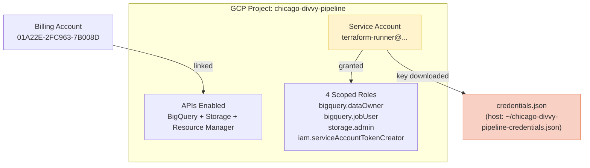

# Phase 4.1 — GCP Project Setup

> **Status:** Complete / Verified on 2026-07-21
> **Phase gate:** Cloud warehouse chosen, GCP project created, service account + key ready for Terraform

## Summary

Chose BigQuery as the cloud warehouse (free tier, serverless, DBT first-class). Created GCP project `chicago-divvy-pipeline`, linked billing, enabled APIs (BigQuery, Storage, Resource Manager), created a scoped service account (`terraform-runner`) with 4 roles (NOT owner), and downloaded its key to WSL. The key is gitignored + chmod 644 (for container access). This phase sets up the identity + auth layer that Terraform (4.2) and the pipeline (4.3) use.

## Files Created/Modified

| File | Action | Purpose |
|---|---|---|
| `docs/knowledge/gcp.md` | Created | GCP reference: auth model (two layers), setup process, WSL vs Windows pitfalls, useful commands |
| `docs/knowledge/index.md` | Modified | Added gcp.md to the sections table |
| `docs/operations-performed.md` | Modified | Added Phase 4.1 section (what was built, resources created, errors) |
| `changelog.md` | Modified | Added Phase 4.1 entry (3 errors + 6 lessons) |
| `.gitignore` | Modified | Added `*-credentials.json` pattern |
| `~/chicago-divvy-pipeline-credentials.json` | Created (host, gitignored) | Service account key — used by Terraform, Spark, Airflow, DBT |

## Architecture — What Was Built



A single GCP project with a scoped service account. The key file is the only credential Terraform/pipeline needs — no personal account credentials on disk.

**For detailed architecture diagrams**, see `docs/knowledge/architecture.md`.

## Errors Hit

| # | Error | Root Cause | Fix |
|---|---|---|---|
| 1 | `gcloud iam service-accounts keys create ~/file.json` → `No such file or directory: '~/file.json'` | gcloud is a Python tool; it does NOT expand `~`. It treats `~/file.json` as a literal filename. | Used explicit path: `C:\Users\sagar\file.json` on Windows, then `cp` to WSL. |
| 2 | `gcloud iam service-accounts create terraform-runner \` → `unrecognized arguments: \` | PowerShell uses backtick (`` ` ``) for line continuation, not backslash (`\`). Bash uses `\`. | Put command on one line (no continuation), or use backtick in PowerShell. |
| 3 | `gcloud beta billing accounts list` → `You do not currently have this command group installed` | `beta` gcloud components not installed by default. | Ran `gcloud components install beta`. |

### Lessons

- **GCP has two layers of identity** — personal Gmail (human, used once via browser for setup) vs service account (machine, used by Terraform via `credentials.json`). Confusing them is the #1 Terraform-on-GCP auth stumbling block.
- **Service account keys are passwords** — `chmod 600` (later `644` for container access), gitignore, never commit, never paste. Grant scoped roles, NOT `roles/owner`.
- **`~` is not expanded by gcloud** — it's a Python tool, not a shell. Always use explicit absolute paths for file output.
- **PowerShell ≠ bash for line continuation** — PowerShell uses backtick `` ` ``, bash uses backslash `\`.
- **Browser auth requires Windows, not WSL** — `gcloud auth login` opens a browser; WSL has no browser. Run gcloud auth on Windows PowerShell, then move artifacts to WSL.
- **Billing account is required even for free tier** — BigQuery free tier won't activate without a billing account linked. You won't be charged if you stay in limits.

## Decisions Made

| Decision | Choice | Why |
|---|---|---|
| Cloud warehouse | BigQuery (not Snowflake/Redshift) | Free tier (1 TB queries/mo + 10 GB storage/mo), serverless (no infra to manage), DBT first-class adapter. Snowflake/Redshift have higher free-tier friction. |
| Service account roles | 4 scoped roles (NOT owner) | Least privilege. SA can create BigQuery datasets + GCS buckets (its job) but can't delete the project or change billing. If the key leaks, blast radius is limited. |
| Key file location | `~/chicago-divvy-pipeline-credentials.json` (WSL ext4) | WSL filesystem for performance (not Windows `/mnt/c`). Gitignored. `chmod 644` (later changed from 600 for container access in 4.3). |
| gcloud auth method | Browser auth on Windows PowerShell (personal account) | WSL has no browser. Personal account used once for setup. SA key used for all automation after. |

## Verification

```bash
# Project created
$ gcloud projects describe chicago-divvy-pipeline
createTime: '2026-07-21T...'
lifecycleState: ACTIVE
name: chicago-divvy-pipeline
projectId: chicago-divvy-pipeline
projectNumber: '480666653891'

# APIs enabled
$ gcloud services list --enabled --filter="name:(bigquery storage cloudresourcemanager)"
NAME: bigquery-json.googleapis.com
NAME: storage.googleapis.com
NAME: cloudresourcemanager.googleapis.com

# Service account created
$ gcloud iam service-accounts list --filter="terraform-runner"
displayName: terraform-runner
email: terraform-runner@chicago-divvy-pipeline.iam.gserviceaccount.com

# Key file exists + gitignored
$ ls -la ~/chicago-divvy-pipeline-credentials.json
-rw-r--r-- 1 sagar sagar 2396 Jul 21 10:17 /home/sagar/chicago-divvy-pipeline-credentials.json
$ grep credentials .gitignore
*-credentials.json
```

- **GCP project active:** `chicago-divvy-pipeline` (ID `480666653891`)
- **3 APIs enabled:** BigQuery, Storage, Resource Manager
- **Service account created:** `terraform-runner@chicago-divvy-pipeline.iam.gserviceaccount.com` with 4 scoped roles
- **Key file downloaded:** `~/chicago-divvy-pipeline-credentials.json` (gitignored, chmod 644)
- **Billing linked:** `01A22E-2FC963-7B008D`

## What's Next

- **Phase 4.2: Terraform provisioning** — Use the service account key to provision BigQuery datasets + GCS bucket via Terraform.
  - Requires: Phase 4.1 (this phase — GCP project, APIs, SA key)
  - New: `terraform/` directory with providers.tf, variables.tf, main.tf
