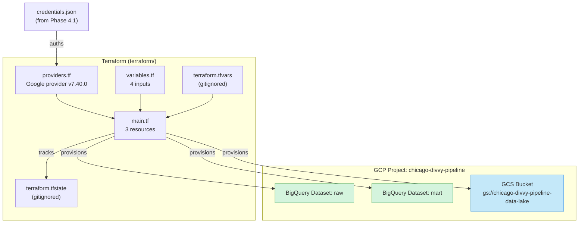

# Phase 4.2 — Terraform (BigQuery + GCS Provisioning)

> **Status:** Complete / Verified on 2026-07-21
> **Phase gate:** Terraform provisions cloud resources (BigQuery datasets + GCS bucket)

## Summary

Wrote Terraform config that provisions 3 GCP resources: 2 BigQuery datasets (`raw` + `mart`) and 1 GCS bucket (`chicago-divvy-pipeline-data-lake`). Auths via the service account key from Phase 4.1. Ran `terraform init`/`plan`/`apply` successfully. Verified all 3 resources exist via `bq ls` + `gsutil ls`.

## Files Created/Modified

| File | Action | Purpose |
|---|---|---|
| `terraform/providers.tf` | Created | Google provider v7.40.0, auths via SA key (`credentials` arg) |
| `terraform/variables.tf` | Created | 4 input variables (project_id, region, location, credentials_path) |
| `terraform/main.tf` | Created | 3 resources: `google_bigquery_dataset.raw`, `google_bigquery_dataset.mart`, `google_storage_bucket.data_lake` |
| `terraform/terraform.tfvars` | Created (gitignored) | Actual values for this project |
| `terraform/terraform.tfvars.example` | Created | Template for tfvars (committed) |
| `docs/knowledge/terraform.md` | Created | Terraform reference: concepts, workflow, file structure, errors, verification |
| `docs/knowledge/gcp.md` | Modified | Added Terraform section + pointer to terraform.md |
| `docs/knowledge/index.md` | Modified | Added terraform.md to the sections table |
| `.gitignore` | Modified | Added Terraform patterns (`.terraform/`, `*.tfstate`, `*.tfvars`) |
| `docs/operations-performed.md` | Modified | Added Phase 4.2 section |
| `changelog.md` | Modified | Added Phase 4.2 entry (3 errors + 6 lessons) |

## Architecture — What Was Built



Terraform reads the SA key, provisions 3 resources in GCP, and tracks their state in `terraform.tfstate` (gitignored). The `terraform.tfvars` file holds project-specific values (also gitignored — contains project ID + credentials path).

**For detailed architecture diagrams**, see `docs/knowledge/architecture.md` and `docs/knowledge/terraform.md`.

## Errors Hit

| # | Error | Root Cause | Fix |
|---|---|---|---|
| 1 | WSL `gcloud services list` → `AUTH_PERMISSION_DENIED` authenticated as `terraform-runner@dtc-de-course-497317...` (old course project) | WSL gcloud has separate config + auth state from Windows gcloud. Windows `gcloud auth login` + `config set project` didn't carry to WSL. | `gcloud auth activate-service-account terraform-runner@chicago-divvy-pipeline... --key-file=/home/sagar/chicago-divvy-pipeline-credentials.json` in WSL (non-interactive, key-based). |
| 2 | `gcloud auth activate-service-account --key-file=~/...` → `No such file or directory: '~/...'` | gcloud (Python) doesn't expand `~`. Treats it as literal path. (Same pitfall as Phase 4.1.) | Used explicit path: `/home/sagar/chicago-divvy-pipeline-credentials.json`. |
| 3 | `gcloud services list --enabled` → `AUTH_PERMISSION_DENIED` even after SA authed | Expected — SA's scoped roles deliberately exclude `serviceusage.services.list` (admin role). Least privilege working as designed. | Not a bug. Used `bq ls` + `gsutil ls` (permissions ARE in SA roles) for resource verification instead. |

### Lessons

- **WSL and Windows gcloud have separate state** — config (`~/.config/gcloud/`) and auth are per-environment. Setting project/account in PowerShell does NOT carry to WSL.
- **`gcloud auth activate-service-account` is the non-interactive auth path** — use it in WSL (no browser) and in CI/CD. It loads a SA key into gcloud's credential store.
- **Least privilege means some admin commands fail by design** — `gcloud services list` failing for the SA is correct. Verify with `bq ls` + `gsutil ls` instead.
- **Terraform `delete_contents_on_destroy = true` is a learning-project tradeoff** — lets `terraform destroy` wipe data so you can re-run from scratch. NEVER in production.
- **Pin Terraform provider versions with `~>`** — `~> 7.40` allows patch updates but blocks minor versions that could change behavior.
- **`terraform.tfstate` is the source of truth** — gitignored (contains resource IDs). Lose it and Terraform can't destroy cleanly. Local state is fine for one operator.

## Decisions Made

| Decision | Choice | Why |
|---|---|---|
| Google provider version | `~> 7.40.0` (pinned) | Stable, non-experimental. `~>` allows patch updates, blocks minor versions. |
| BigQuery datasets | 2: `raw` + `mart` (matching Postgres schemas) | Same 2-layer structure as local Postgres. `raw` for loaded data, `mart` for DBT outputs. No `staging` dataset — DBT uses schema config to create staging views in `mart` or a custom schema. |
| GCS bucket name | `chicago-divvy-pipeline-data-lake` | Matches project ID prefix. Globally unique (GCS bucket names are global). |
| `delete_contents_on_destroy` | `true` (BigQuery) + `force_destroy = true` (GCS) | Learning project — can re-run from scratch. NEVER in production (would delete warehouse on a typo). |
| Terraform state | Local (`terraform.tfstate`) | One operator. Migrate to GCS backend for team use later (plan says Phase 5). |
| Auth method | SA key in `credentials` arg (not `gcloud auth application-default login`) | Consistent with how CI/CD will auth. No dependency on gcloud CLI state. |

## Verification

```bash
# Terraform init — provider installed
$ terraform init
Terraform has been successfully initialized!

# Terraform plan — 3 to add, 0 change, 0 destroy
$ terraform plan
Plan: 3 to add, 0 to change, 0 to destroy.

# Terraform apply — resources created
$ terraform apply
Apply complete! Resources: 3 added, 0 changed, 0 destroyed.

# Verify BigQuery datasets
$ bq ls
   datasetId
  -----------
   mart
   raw

# Verify GCS bucket
$ gsutil ls
gs://chicago-divvy-pipeline-data-lake/
```

- **3 resources created:** `google_bigquery_dataset.raw`, `google_bigquery_dataset.mart`, `google_storage_bucket.data_lake`
- **BigQuery verified:** `bq ls` shows `raw` + `mart` datasets
- **GCS verified:** `gsutil ls` shows `gs://chicago-divvy-pipeline-data-lake/`
- **Terraform state clean:** `terraform plan` after apply shows 0 changes (state matches reality)

## What's Next

- **Phase 4.3: Architecture change (Postgres → GCS/BigQuery)** — Rewire the batch pipeline to use the cloud resources: Spark writes to GCS (Parquet), `bq load` loads into BigQuery, DBT switches to BigQuery adapter.
  - Requires: Phase 4.2 (this phase — BigQuery datasets + GCS bucket exist)
  - New: GCS connector in Spark, bq CLI in Airflow, dbt-bigquery adapter, BigQuery SQL dialect fixes
