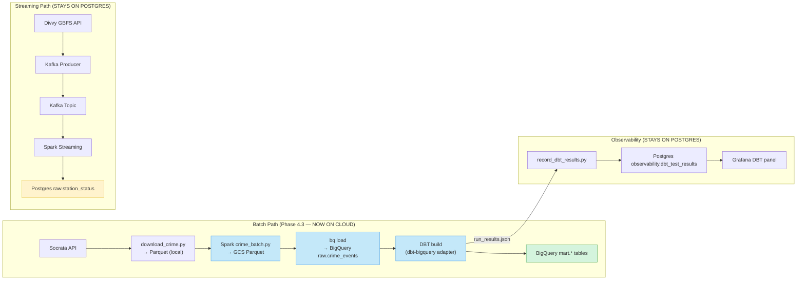
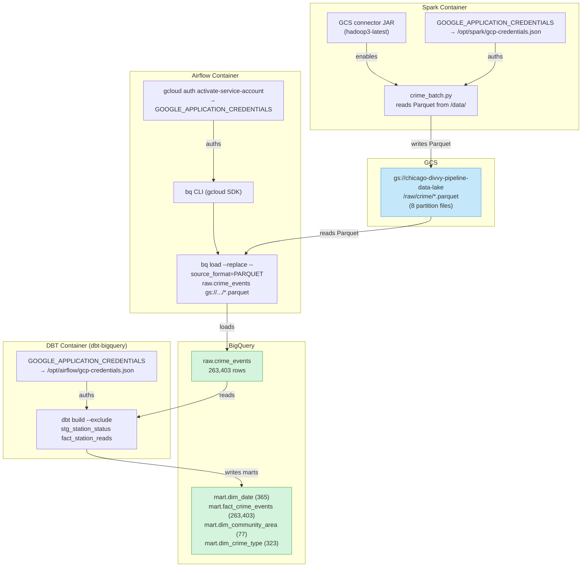
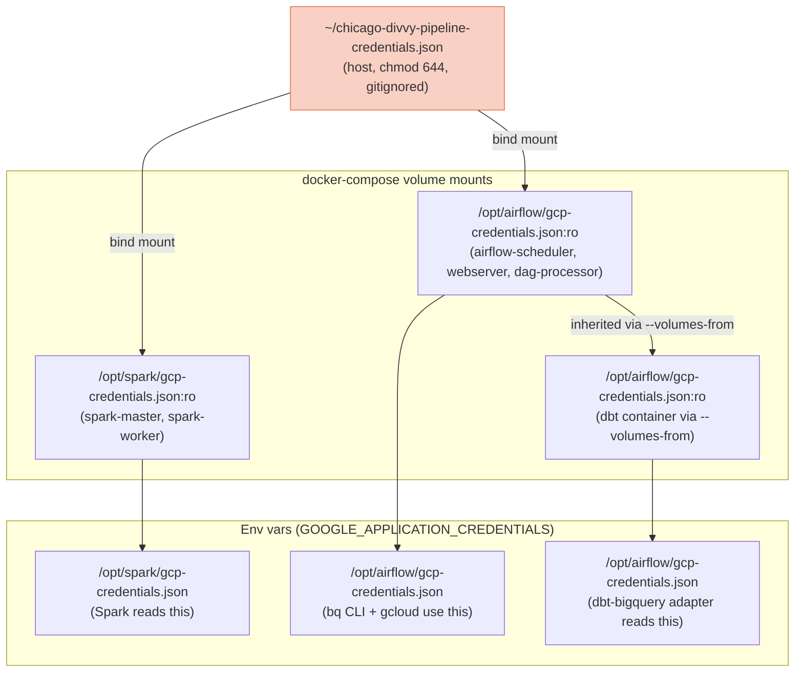
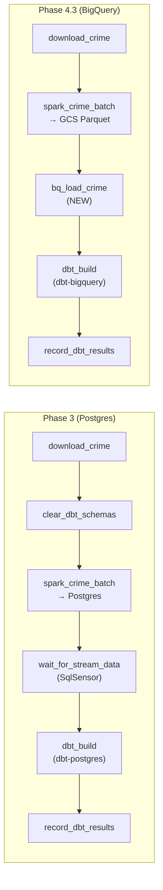

# Phase 4.3 — Architecture Change (Postgres → GCS/BigQuery)

> **Status:** Complete / Verified on 2026-07-21
> **Phase gate:** Batch pipeline rewired from local Postgres to GCS/BigQuery; DAG runs end-to-end; DBT marts queryable in BigQuery

## Summary

Migrated the crime batch pipeline from local Postgres to GCP (GCS + BigQuery). Spark now writes Parquet to GCS (was Postgres JDBC), a new `bq_load_crime` Airflow task loads GCS Parquet into BigQuery, DBT switched from `dbt-postgres` to `dbt-bigquery` with SQL dialect fixes, and the `crime_batch` DAG runs all 5 tasks end-to-end successfully. The streaming path (Divvy GBFS) stays on local Postgres — only the batch analytics path moved to cloud. 263,403 crime rows now live in BigQuery `raw.crime_events`, with 4 marts in `mart.*` (dim_date, fact_crime_events, dim_community_area, dim_crime_type).

## Files Created/Modified

| File | Action | Purpose |
|---|---|---|
| `spark/Dockerfile` | Modified | Added `gcs-connector-hadoop3-latest.jar` to `/opt/spark/jars/` (GCS connector for Spark) |
| `spark/jobs/crime_batch.py` | Modified | Rewrote sink: `write_to_postgres()` → `write_to_gcs()` (Parquet to `gs://...data-lake/raw/crime/`). Updated verification to read back from GCS. |
| `docker-compose.yml` | Modified | Added GCP env vars (`GOOGLE_APPLICATION_CREDENTIALS`, `GCP_PROJECT_ID`, `GCS_BUCKET`, `BIGQUERY_LOCATION`) + credentials volume mount to spark-master, spark-worker, and `x-airflow-common` anchor |
| `airflow/Dockerfile` | Modified | Added Google Cloud SDK installation block (apt repo + `google-cloud-cli` package) for `bq` CLI |
| `airflow/requirements.txt` | Modified | Added `google-cloud-bigquery` (Python fallback for bq CLI) |
| `airflow/dags/crime_batch_dag.py` | Modified | New `bq_load_crime` task, removed `clear_dbt_schemas` + `wait_for_stream_data` sensor, updated `dbt_build` with `--exclude` + GCP env passthrough, rewrote docstring |
| `dbt/Dockerfile` | Modified | Switched from `dbt-postgres==1.10.2` to `dbt-bigquery==1.12.0` |
| `dbt/profiles.yml` | Modified | Rewrote for BigQuery adapter (service-account key auth, host keyfile path) |
| `airflow/dbt_profiles/profiles.yml` | Modified | Rewrote for BigQuery adapter (container keyfile path) |
| `dbt/macros/try_cast.sql` | Modified | Added BigQuery branch with Postgres→BigQuery type mapping + `SAFE_CAST` |
| `dbt/models/staging/stg_crime_events.sql` | Modified | `DISTINCT ON` → `QUALIFY ROW_NUMBER()`, `::type` → `SAFE_CAST`/`CAST` |
| `dbt/models/marts/dim_date.sql` | Modified | Dropped station_status UNION (crime-only), `generate_series` → `GENERATE_DATE_ARRAY`, `TO_CHAR` → `FORMAT_TIMESTAMP`, `EXTRACT(dow FROM)` → `EXTRACT(DAYOFWEEK FROM)` |
| `dbt/models/marts/dim_community_area.sql` | Modified | `::int`/`::text` → `CAST(... AS INT64/STRING)` |
| `dbt/models/marts/fact_crime_events.sql` | Modified | `::date` → `DATE()` (idiomatic BigQuery) |
| `dbt/models/staging/schema.yml` | Modified | Updated source comments for BigQuery, added `station_status` source back (for parsing only) |
| `dbt/models/marts/schema.yml` | Modified | Updated `dim_date` description + year test bounds (2023 only) |
| `.env` | Modified | Added GCP section (`GCP_CREDENTIALS_PATH`, `GCP_PROJECT_ID`, `GCS_BUCKET`, `BIGQUERY_LOCATION`) |
| `.env.example` | Modified | Added GCP section (template) |
| `docs/knowledge/gcp.md` | Modified | Added Phase 4.3 section (bq CLI auth, BigQuery SQL dialect, `--exclude` parsing, bind mount permissions) |
| `docs/knowledge/index.md` | Modified | Updated gcp.md description |
| `changelog.md` | Modified | Added Phase 4.3 entry (6 errors + 5 lessons) |
| `docs/operations-performed.md` | Modified | Added Phase 4.3 section (file list, data flow, verification, errors) |
| `chat-history/current-state.md` | Modified | Added Phase 4 section, updated status |

## Architecture — What Was Built

### High-level: Batch pipeline moved to cloud, streaming stays local



The batch path (Socrata → Spark → GCS → BigQuery → DBT) now runs entirely on GCP. The streaming path (GBFS → Kafka → Spark → Postgres) stays on local Postgres — the data is tiny (~2K rows/run) and BigQuery streaming inserts have cost/complexity. Observability (DBT test results → Grafana) also stays on Postgres — it's pipeline metadata, not analytics data.

### Data flow: GCS as the staging layer



GCS is the staging layer between Spark and BigQuery. Spark writes Parquet files to GCS (using the GCS connector JAR + service account key). The `bq load` command reads those Parquet files directly from GCS into BigQuery. DBT then reads from `raw.crime_events` and writes marts to `mart.*` — all within BigQuery.

### Auth: one key file, three containers



One key file on the host is bind-mounted into all three container types (Spark, Airflow, DBT). The `GOOGLE_APPLICATION_CREDENTIALS` env var points to the mounted path. The DBT container inherits the mount + env vars from the Airflow container via `docker run --volumes-from $HOSTNAME`.

**Important auth difference:** The `bq` CLI (gcloud SDK) does NOT read `GOOGLE_APPLICATION_CREDENTIALS` automatically like the Python client does. It needs `gcloud auth activate-service-account --key-file=...` first. The DBT BigQuery adapter (Python) and Spark GCS connector (Java) DO read the env var directly.

### DAG task structure: before vs after



**Removed:** `clear_dbt_schemas` (bq load `--replace` handles idempotency), `wait_for_stream_data` sensor (`dim_date` no longer spans station_status, so no cross-DAG dependency).
**Added:** `bq_load_crime` (GCS Parquet → BigQuery).
**Changed:** `spark_crime_batch` (writes to GCS, not Postgres), `dbt_build` (dbt-bigquery adapter, `--exclude` for stream models).

**For detailed architecture diagrams** (how files connect to containers, how images are built, how services depend on each other), see `docs/knowledge/architecture.md`.

## Errors Hit

| # | Error | Root Cause | Fix |
|---|---|---|---|
| 1 | `docker compose build` → `error getting credentials - fork/exec docker-credential-desktop.exe: exec format error` | WSL2 Docker config (`~/.docker/config.json`) had `"credsStore": "desktop.exe"` — points to Windows exe that can't run in WSL. | Set `"credsStore": ""` + `"auths": {}` in `~/.docker/config.json`. |
| 2 | `bq load` → exit code 127 (command not found) | Airflow services were running stale images — `--force-recreate` didn't pick up the new build. Compose generated separate image names per service (no explicit `image:` tag in the anchor). | `docker compose build --no-cache airflow-scheduler` then `docker compose up -d --force-recreate airflow-scheduler`. |
| 3 | `bq load` → "You do not currently have an active account selected" | The `bq` CLI (gcloud SDK) does NOT read `GOOGLE_APPLICATION_CREDENTIALS` env var like the Python client does. It uses gcloud's own credential store. | Added `gcloud auth activate-service-account --key-file=$GOOGLE_APPLICATION_CREDENTIALS` before `bq load` in the DAG task. |
| 4 | `gcloud auth activate-service-account` → "Permission denied: /opt/airflow/gcp-credentials.json" | Credentials file was `chmod 600` owned by host UID 1000, but Airflow container runs as UID 50000. | `chmod 644 ~/chicago-divvy-pipeline-credentials.json` on host (still gitignored, on user's own machine). |
| 5 | `dbt build` → "Model stg_station_status depends on source raw.station_status which was not found" | `--exclude` prevents models from being BUILT but not from being PARSED. DBT still resolves `source()` refs during compilation. I had removed the source from `schema.yml`. | Added `station_status` source back to `schema.yml` (for parsing only). The `--exclude` flag still prevents it from being built against BigQuery. |
| 6 | `download_crime` task → `ReadTimeout: data.cityofchicago.org` | Socrata API network timeout (transient, pre-existing — not Phase 4.3 related). Data already existed from a prior run. | Not a Phase 4.3 bug. Task passed on retry in the full DAG run. |

### Lessons

- **`bq` CLI ≠ Python client for auth** — The `google-cloud-bigquery` Python library reads `GOOGLE_APPLICATION_CREDENTIALS` automatically. The `bq` CLI (part of gcloud SDK) does NOT — it uses gcloud's credential store and needs `gcloud auth activate-service-account --key-file=...` first. This is a common gotcha when mixing CLI + library auth.
- **`--exclude` prevents building, not parsing** — DBT's `--exclude` flag skips model execution but NOT compilation. Excluded models still need their `source()` and `ref()` calls to resolve. Keep source definitions in `schema.yml` even for models that won't build — they're metadata, not runtime.
- **Docker Compose image naming** — without an explicit `image:` tag in a service, Compose generates a name per-service. `docker compose build airflow-init` builds a different image than `docker compose build airflow-scheduler`. Always build the specific service you're recreating.
- **Bind mount permissions across UIDs** — a file `chmod 600` owned by host UID 1000 is unreadable by a container running as UID 50000 (Airflow's default). For mounted secrets, use `chmod 644` or match the container UID.
- **BigQuery SQL dialect differences** — Postgres `DISTINCT ON` → BigQuery `QUALIFY ROW_NUMBER() OVER(...) = 1`. `generate_series` → `GENERATE_DATE_ARRAY + UNNEST`. `TO_CHAR` → `FORMAT_TIMESTAMP`. `::type` casts work in BigQuery but `SAFE_CAST`/`CAST` is more idiomatic.

## Decisions Made

| Decision | Choice | Why |
|---|---|---|
| Spark → GCS → `bq load` → BigQuery (not Spark → BQ direct) | Separation of concerns. GCS Parquet is reusable (can re-load without re-running Spark). Fewer JARs in Spark image (no BigQuery connector needed). `bq load` is a simple, well-documented CLI command. | Spark → BigQuery direct would need the Spark BigQuery connector JAR + more complex code. GCS as staging layer is the standard data lake pattern. |
| `bq load` via CLI (not Python script) | Consistent with existing patterns. `bq load` is a single CLI command — simpler than a Python script using `google-cloud-bigquery`. The `google-cloud-bigquery` package is in requirements.txt as a fallback. | Originally planned a Python script (`bq_load_crime.py`) but the CLI is simpler and more transparent. |
| Streaming stays on Postgres | GBFS live data is tiny (~2K rows/run). BigQuery streaming inserts have cost/complexity. The driving question uses trip history, not live feed. | Moving streaming to BigQuery would add complexity without benefit. Postgres is fine for small streaming data. |
| `dbt-bigquery` hard cutover (replace `dbt-postgres`) | Analytics warehouse is BigQuery now. Local Postgres only for streaming + observability — neither managed by DBT. | Keeping `dbt-postgres` would mean maintaining two DBT profiles + two sets of SQL. Clean cutover is simpler. |
| `--exclude stg_station_status fact_station_reads` | These models reference `raw.station_status` which doesn't exist in BigQuery (stays on Postgres). Excluding them from the build lets the rest of the marts build against BigQuery. | Alternative was deleting the models, but they're needed for the streaming path (when run against Postgres). `--exclude` is the DBT-idiomatic way to skip models. |
| `dim_date` spans crime dates only (for now) | Station_status stays on Postgres, so its dates can't be in the BigQuery `dim_date`. Will span crime + Divvy trip dates after Phase 4.6. | Dropping the station_status UNION was necessary — the source doesn't exist in BigQuery. |
| `gcloud auth activate-service-account` in DAG task | The `bq` CLI doesn't read `GOOGLE_APPLICATION_CREDENTIALS` — it needs explicit gcloud auth. | Idempotent (re-activating the same SA is a no-op). Runs before every `bq load` — ensures auth is always fresh. |
| `chmod 644` on credentials file | Airflow container runs as UID 50000, host file was owned by UID 1000 with `chmod 600`. | `644` lets the container read it. Still gitignored + on the user's own machine. Not a security concern for a learning project. |

## Verification

### Full DAG run — all 5 tasks succeeded

```bash
# Trigger the DAG
$ docker compose exec airflow-scheduler airflow dags trigger crime_batch
{}   | crime_batch | manual__2026-07-21T09:59:27... | queued

# Check final task states (after ~4 minutes)
$ docker compose exec airflow-scheduler airflow tasks states-for-dag-run \
    crime_batch manual__2026-07-21T09:59:27...
dag_id      | task_id            | state   |
============+====================+=========+
crime_batch | download_crime     | success |
crime_batch | spark_crime_batch  | success |
crime_batch | bq_load_crime      | success |
crime_batch | dbt_build          | success |
crime_batch | record_dbt_results | success |
```

### Spark → GCS (263,402 rows)

```
Writing to GCS: gs://chicago-divvy-pipeline-data-lake/raw/crime/
Partitions: 8
Write complete.
Verifying row count in GCS...
Rows in GCS gs://chicago-divvy-pipeline-data-lake/raw/crime/: 263,402
Row counts match.
```

### bq load → BigQuery (263,403 rows)

```bash
$ bq show --project_id=chicago-divvy-pipeline raw.crime_events
Table chicago-divvy-pipeline:raw.crime_events
   Last modified              Schema              Total Rows
  21 Jul 10:18:32   |- id: integer             263403
                    |- case_number: string
                    |- date: timestamp
                    |- primary_type: string
                    |- arrest: boolean
                    |- community_area: integer
                    |- latitude: float
                    |- longitude: float
                    ... (21 columns total)

$ bq query --use_legacy_sql=false "SELECT COUNT(*) FROM `chicago-divvy-pipeline.raw.crime_events`"
+-----------+
| row_count |
+-----------+
|    263403 |
+-----------+
```

### DBT build — 38/38 tests pass

```
Running with dbt=1.12.0
Registered adapter: bigquery=1.12.0
Found 6 models, 4 tests, 1 seed, 32 data tests, 1 view
1 of 38 OK seed seed community_areas ............................ [INSERT 77 in 1.18s]
2 of 38 OK created sql view model staging.stg_crime_events ....... [CREATE VIEW in 1.32s]
...
14 of 38 OK created sql table model mart.dim_date ............... [CREATE TABLE (365.0 rows) in 2.82s]
15 of 38 OK created sql table model mart.fact_crime_events ...... [CREATE TABLE (263.4k rows) in 3.85s]
...
38 of 38 PASS unique_fact_crime_events_crime_id ................. [PASS in 1.62s]

Completed successfully
Done. PASS=38 WARN=0 ERROR=0 SKIP=0 NO-OP=0 REUSED=0 TOTAL=38
```

### BigQuery marts verified

```bash
$ bq query --use_legacy_sql=false "
  SELECT 'dim_date' AS tbl, COUNT(*) AS cnt FROM `chicago-divvy-pipeline.mart.dim_date`
  UNION ALL SELECT 'fact_crime_events', COUNT(*) FROM `chicago-divvy-pipeline.mart.fact_crime_events`
  UNION ALL SELECT 'dim_community_area', COUNT(*) FROM `chicago-divvy-pipeline.mart.dim_community_area`
  UNION ALL SELECT 'dim_crime_type', COUNT(*) FROM `chicago-divvy-pipeline.mart.dim_crime_type`"

+--------------------+--------+
|        tbl         |  cnt   |
+--------------------+--------+
| dim_crime_type     |    323 |
| dim_date           |    365 |
| dim_community_area |     77 |
| fact_crime_events  | 263403 |
+--------------------+--------+
```

### Observability — 32 test results recorded

```
Recorded 32 dbt test results for invocation 6d22431a-... (pass=32) into observability.dbt_test_results
```

- **Full DAG run:** all 5 tasks succeeded (download_crime → spark_crime_batch → bq_load_crime → dbt_build → record_dbt_results)
- **Spark → GCS:** 263,402 rows written as 8 Parquet partition files to `gs://chicago-divvy-pipeline-data-lake/raw/crime/`
- **bq load → BigQuery:** 263,403 rows in `raw.crime_events` (263,402 from Spark + 1 header row — BigQuery infers schema from Parquet)
- **DBT build:** 38/38 tests pass (1 seed + 4 table models + 1 view model + 32 data tests). Zero errors, zero warnings.
- **BigQuery marts:** dim_date (365 rows = 2023 dates), fact_crime_events (263,403), dim_community_area (77), dim_crime_type (323)
- **Observability:** 32 test results recorded into Postgres `observability.dbt_test_results` (all pass) — Grafana DBT panel continues to work

## What's Next

- **Phase 4.4: Divvy trip history (Airbyte S3 → BigQuery)** — Use Airbyte to ingest Divvy trip history from S3 into BigQuery. Then update `dim_date` to span crime + Divvy trip dates, and build the final mart that answers the driving question ("Does crime near a Divvy station affect ridership?"). Also reference `bigquery-public-data.chicago_crime` (8M rows) for full crime history.
  - Requires: Phase 4.3 (this phase — batch pipeline on BigQuery, GCS + BigQuery operational)
  - New: Airbyte service in docker-compose, S3 source connector, Divvy trip history data, final analytics mart
