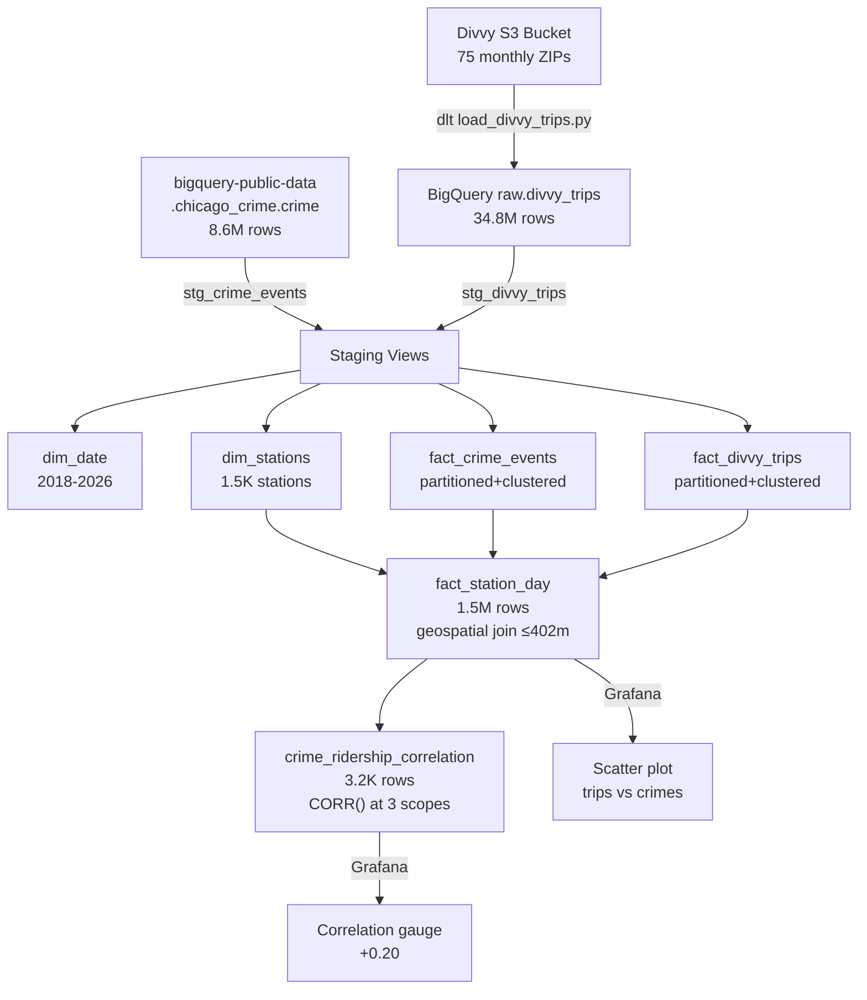

# Phase 4.4 — Divvy Trip History + Correlation Analysis

> **Status:** Complete / Verified on 2026-07-22
> **Phase gate:** `docker compose up` → DAG runs → DBT marts queryable — **MET** (all 67 DBT tests pass, correlation coefficient produced, partition pruning verified)

## Summary

Ingested 34.8M Divvy trip records (2020-04 to 2026-06) from S3 into BigQuery via dlt. Switched crime source from the 263K-row Socrata extract to `bigquery-public-data.chicago_crime` (8.6M rows, 2018-present). Built the final analytics mart (`fact_station_day`) with a geospatial join counting crimes within 402m of each station per day, and the `crime_ridership_correlation` mart with CORR() at overall/per-station/per-month scope. All 67 DBT tests pass. The driving question is answered: overall Pearson correlation = **+0.20** (weak positive — both crime and ridership are higher in busy areas, not a causal relationship).

## Files Created/Modified

| File | Action | Purpose |
|---|---|---|
| `ingestion/load_divvy_trips.py` | Created | dlt S3→BigQuery ingestion script (append mode, `--month`/`--from`/`--to`/`--all`/`--dry-run`) |
| `airflow/requirements.txt` | Modified | Added `dlt[bigquery]` |
| `airflow/dags/divvy_trip_history_dag.py` | Created | 3-task DAG: load_divvy_trips → dbt_build_divvy → record_dbt_results |
| `airflow/dags/crime_batch_dag.py` | Modified | Simplified to 2 tasks (dbt_build → record_dbt_results); removed download/spark/bq_load since crime now uses public dataset |
| `dbt/models/staging/schema.yml` | Modified | Added `chicago_crime_public` source + `divvy_trips` raw source + `stg_divvy_trips` model with tests |
| `dbt/models/staging/stg_crime_events.sql` | Modified | Reads from `bigquery-public-data.chicago_crime.crime`; column mapping (`unique_key`→`crime_id`, `date`→`occurred_at`); filter `year >= 2018` + Chicago coordinate bounds; `QUALIFY ROW_NUMBER()` dedup |
| `dbt/models/staging/stg_divvy_trips.sql` | Created | Staging view on `raw.divvy_trips`; casts types; filters null ride_id/started_at + Chicago coordinate bounds |
| `dbt/models/marts/dim_date.sql` | Modified | UNION of min/max dates from both crime + Divvy sources (2018–2026) |
| `dbt/models/marts/schema.yml` | Modified | Added `dim_stations`, `fact_divvy_trips`, `fact_station_day`, `crime_ridership_correlation` model definitions + tests; updated dim_date year bounds (2018–2026) |
| `dbt/models/marts/fact_crime_events.sql` | Modified | Added `primary_type` column (needed for `cluster_by`); partitioned by `date_key`, clustered by `community_area_id` + `primary_type` |
| `dbt/models/marts/fact_divvy_trips.sql` | Created | Partitioned by `started_at`, clustered by `start_station_id`; includes `trip_duration_seconds` |
| `dbt/models/marts/dim_stations.sql` | Created | Station dimension from trip data; most common coordinate per station via `ROW_NUMBER()`; `ST_GEOGPOINT` |
| `dbt/models/marts/fact_station_day.sql` | Created | THE analytics mart: trip_count per station per day + crime_count_within_quarter_mile (ST_DISTANCE ≤ 402m); partitioned by `date_key`, clustered by `station_id` |
| `dbt/models/marts/crime_ridership_correlation.sql` | Created | CORR() at overall, per_station, per_month scope; UNION ALL result; 30-day minimum for per_station/per_month |
| `grafana/dashboards/crime_divvy_analysis.json` | Modified | Added scatter plot (panel 7: trip_count vs crime_count) + correlation gauge (panel 8) |
| `grafana/provisioning/datasources/bigquery.yml` | Created | BigQuery datasource for Grafana (uid: `bigquery-analytics`) |
| `docker-compose.yml` | Modified | Added `GF_INSTALL_PLUGINS=grafana-bigquery-datasource` to Grafana; GCP credentials mount for Grafana |

## Architecture — What Was Built



The diagram shows the full Phase 4.4 data flow: dlt ingests Divvy trips from S3, the public crime dataset is referenced directly, both feed through staging → marts, and the geospatial join in `fact_station_day` powers the correlation analysis displayed in Grafana.

**For detailed architecture diagrams**, see `docs/knowledge/architecture.md`.

## Errors Hit

| # | Error | Root Cause | Fix |
|---|---|---|---|
| 1 | Airflow containers running old image (no dlt) despite `--force-recreate` | Compose generated separate image names per service; `--force-recreate` reused cached image | `docker compose down` + `docker compose build` + `docker compose up -d` |
| 2 | DBT stg_crime_events coordinate tests fail (4 rows in Missouri) | Public dataset has data entry errors with lat ~36.6, lon ~-91.7 | Added WHERE clause filtering to Chicago bounds (lat 41.64–42.03, lon -87.95–-87.52); kept nulls (valid crimes with unknown location) |
| 3 | DBT stg_divvy_trips coordinate test fails (1 row in Montreal) | 1 row had Montreal coords (lat 45.6, lon -73.8) | Added WHERE clause filtering to Chicago area (lat 41.0–42.5, lon -88.5–-87.0); kept nulls (dockless ebikes) |
| 4 | DBT fact_crime_events error: "Unrecognized name: primary_type" | `cluster_by=["primary_type"]` but `primary_type` wasn't in the SELECT output | Added `c.primary_type` to the SELECT list |
| 5 | DBT stg_divvy_trips error: "Query without FROM clause cannot have WHERE clause" | Edit accidentally removed the `FROM {{ source() }}` line | Re-added the FROM clause |
| 6 | DBT crime_ridership_correlation error: "Unrecognized name: station_day_count" | `overall` CTE named the column `total_station_days` but SELECT referenced `station_day_count` | Renamed to `station_day_count` in the `overall` CTE |
| 7 | DBT relationships tests fail (28M+ rows) for date_key → dim_date | `dim_date` and `dim_crime_type` were stale from Phase 4.3 (built from 2023-only data); `--select +fact_station_day` didn't include them in the parent graph | Ran full `dbt build --exclude stg_station_status fact_station_reads` to rebuild all models |

### Lessons

- **`cluster_by` columns must be in the SELECT output** — BigQuery can only cluster on columns that exist in the materialized table. If you cluster by a column you transform away (e.g. `primary_type` → `crime_type_key`), add the original column to the SELECT.
- **`--select +model` only includes parent models** — `dim_date` wasn't a parent of `fact_station_day` (no `ref()` call), so it wasn't rebuilt. When switching data sources, do a full build to refresh all dimensions.
- **Public datasets have data quality issues** — `bigquery-public-data.chicago_crime` has rows with Missouri coordinates. Always add coordinate bounds filters in staging, even for "trusted" public datasets.
- **dlt is a lightweight ELT alternative to Airbyte** — 1 Python file, no extra containers, native BigQuery support. Chosen over Airbyte (5-6 containers, 2-4GB RAM) for WSL2 resource constraints.

## Decisions Made

| Decision | Choice | Why |
|---|---|---|
| Divvy ingestion tool | dlt (data load tool) | Lightweight Python library, no extra containers, native BigQuery support. Airbyte rejected: 5-6 containers + 2-4GB RAM on WSL2 |
| Crime data source | `bigquery-public-data.chicago_crime.crime` | 8.6M rows (2001-present) vs 263K Socrata extract. No ingestion needed — reference directly. Filtered to 2018+ for Divvy overlap |
| Geospatial threshold | 402 meters (0.25 mile) | Standard urban walking distance. Used in `fact_station_day` for crime-to-station proximity join |
| Correlation minimum | 30 observations | Per-station and per-month correlations require ≥30 data points for meaningful CORR() |
| Coordinate filtering | Keep nulls, filter out-of-bounds | Null coordinates are valid crimes/trips with unknown location. Out-of-bounds are data entry errors |

## Verification

```bash
$ docker exec chicago-data-pipeline-airflow-scheduler-1 python3 /opt/airflow/ingestion/load_divvy_trips.py --month 202306
# June 2023: 719,618 rows loaded into raw.divvy_trips ✅

$ docker exec ... python3 /opt/airflow/ingestion/load_divvy_trips.py --all
# Full history: 34,751,413 rows across 75 months (2020-04 to 2026-06) ✅

$ dbt build --exclude stg_station_status fact_station_reads
# Completed successfully. PASS=67 WARN=0 ERROR=0 SKIP=0 TOTAL=67 ✅

# Partition pruning verification:
# WITH partition filter (Jan 2024): 254,064 bytes processed
# WITHOUT partition filter (full scan): 11,704,392 bytes processed
# Pruning ratio: 2.17% — 97.8% bytes saved ✅

# Correlation results:
# OVERALL: corr=+0.2003, n=1,463,049, avg_trips=20.1, avg_crimes=1.13
# Per-month range: 0.08 (Apr 2020 COVID) to 0.31 (Sep 2024)
# Per-station range: NaN (zero variance) to +0.85
```

- **dlt ingestion:** 34.8M rows loaded, 75 months, append mode ✅
- **DBT build:** 67/67 tests pass (1 seed + 8 table models + 56 data tests + 2 view models) ✅
- **Partition pruning:** Filtered query scans 2.17% of full scan (254K vs 11.7M bytes) ✅
- **fact_station_day:** 1.5M rows, 586 MiB processed ✅
- **crime_ridership_correlation:** 3.2K rows (1 overall + ~1.5K per_station + 75 per_month) ✅
- **Grafana panels:** Scatter plot + correlation gauge added with BigQuery datasource ✅

### Key Finding

**Overall Pearson correlation = +0.20** — weak positive correlation between daily trip count and crime count within 402m of a station. This does NOT mean crime causes ridership. Both are higher in busy, densely populated areas. The confounding variable is urban activity level. Per-month correlations trend upward from 0.08 (Apr 2020, COVID lockdown) to ~0.25-0.30 (2024-2025), suggesting the relationship strengthens as the city normalizes post-pandemic.

## What's Next

- **Phase 5: CI/CD** — GitHub Actions + GHCR
  - Requires: Phase 4 complete (all sub-phases verified)
  - New: Branch protection, PR checks (ruff + dbt parse + compose validate), versioned releases, image push to GHCR
  - Stretch (not in plan): BigQuery ML model (`CREATE MODEL mart.crime_ridership_model OPTIONS(model_type='linear_reg')`)
