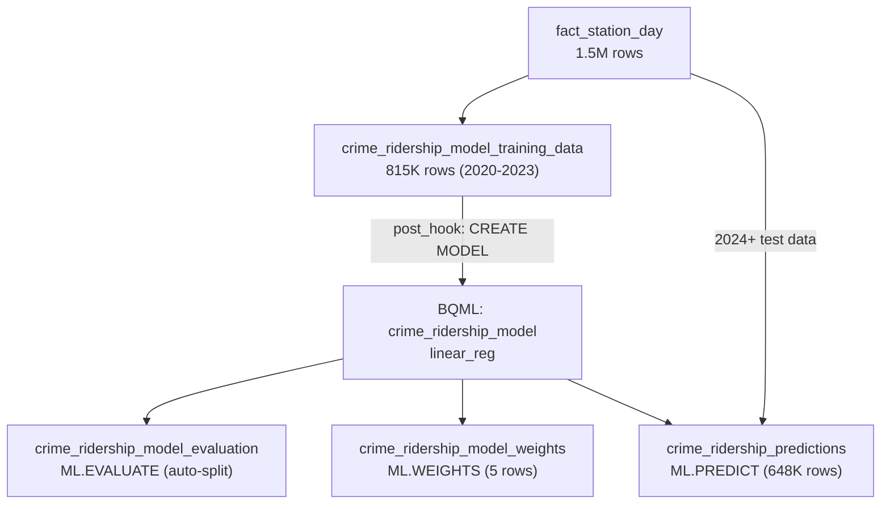

# Phase 4.8 — BigQuery ML (Stretch Goal)

> **Status:** Complete / Verified on 2026-07-22
> **Phase gate:** Stretch goal (not a phase gate requirement). Trained a linear regression model in BigQuery ML via dbt post_hook, evaluated in-sample and out-of-sample, extracted feature weights, and generated predictions.

## Summary

Trained a `linear_reg` model in BigQuery ML to predict daily Divvy trip count from crime count near the station, day of week, month, and station identity (fixed effect). The model is trained on 2020-2023 data (815K rows, 1,915 stations) and evaluated on 2024-2026 data (648K rows, 3,834 stations). In-sample R² = 0.434; seen-station out-of-sample R² = 0.447 (temporal generalization works for known stations). The crime coefficient is +1.45 — confirming the Phase 4.4 correlation finding that the crime-ridership relationship is positive (confounded by urban activity), not negative.

## Files Created/Modified

| File | Action | Purpose |
|---|---|---|
| `dbt/models/marts/crime_ridership_model_training_data.sql` | Created | Training data table (815K rows, 2020-2023) + post_hook that `CREATE MODEL`s the BQML linear_reg |
| `dbt/models/marts/crime_ridership_model_evaluation.sql` | Created | `ML.EVALUATE` on auto-split validation set — R², MAE, MSE |
| `dbt/models/marts/crime_ridership_model_weights.sql` | Created | `ML.WEIGHTS` — regression coefficients per feature |
| `dbt/models/marts/crime_ridership_predictions.sql` | Created | `ML.PREDICT` on 2024+ test data — predicted vs actual trip_count |
| `dbt/models/marts/schema.yml` | Modified | Added tests for 4 new BQML models |
| `airflow/dags/divvy_trip_history_dag.py` | Modified | Added BQML models to `--select` |
| `airflow/dags/crime_batch_dag.py` | Modified | Added BQML models to `--exclude` |
| `docs/knowledge/bigquery-ml.md` | Created | BQML reference doc |

## Architecture — What Was Built



The training data model builds a table of features + label, then a post_hook trains the BQML model. Three downstream models query the trained model via `ML.EVALUATE`, `ML.WEIGHTS`, and `ML.PREDICT`.

**For detailed architecture diagrams**, see `docs/knowledge/architecture.md`.

## Errors Hit

| # | Error | Root Cause | Fix |
|---|---|---|---|
| 1 | `not_null` test failed on `crime_ridership_model_weights.weight` | BigQuery ML returns `weight = NULL` for categorical features — per-category weights are in `category_weights` (JSON array), not `weight` | Removed `not_null` test on `weight`; updated column description to explain NULL for categoricals |
| 2 | Out-of-sample R² = -173,642 (catastrophically negative) | Trained with `data_split_method='no_split'` + evaluated `ML.EVALUATE` on 2024+ test data. 50% of test rows are unseen stations (opened after 2023) — the station fixed effect has no learned weight, so predictions default to the intercept (~16,762) vs actual ~10-50 | Switched to `data_split_method='auto_split'` (default) — `ML.EVALUATE` uses in-sample validation (all stations seen). The 2024+ predictions remain as out-of-sample test; the generalization gap IS the learning outcome |

### Lessons

- **`ML.WEIGHTS.weight` is NULL for categoricals** — BigQuery ML one-hot encodes categorical features; per-category coefficients are in `category_weights` (JSON). Don't test `not_null` on `weight`.
- **High-cardinality categoricals break on unseen categories** — station_id (1,900+ values) as a fixed effect works in-sample but fails on new stations. The model predicts the intercept (~16,762 trips) for unseen stations, producing catastrophically wrong predictions. For production, use aggregate features (station's historical average) instead of raw IDs.
- **`data_split_method='no_split'` + `ML.EVALUATE` (no data) = error** — no held-out validation set exists. Use `auto_split` (default) for in-sample evaluation, or pass explicit test data to `ML.EVALUATE`.

## Decisions Made

| Decision | Choice | Why |
|---|---|---|
| Model type | `linear_reg` | Simplest model that answers "does crime predict ridership?" Pure SQL, no hyperparameter tuning. Matches the plan's sketch. |
| Features | crime_count + day_of_week + month + station_id | Station fixed effect controls for baseline ridership per station. Day/month capture temporal patterns. Crime count is the key predictor. |
| Train/test split | Temporal: 2020-2023 trains, 2024+ tests | Mirrors real-world scenario (train on past, predict future). Tests temporal generalization. |
| data_split_method | `auto_split` (default) | In-sample validation (20% held out) gives meaningful R². The 2024+ out-of-sample predictions are a separate test of generalization. |
| DBT integration | post_hook on training data model | BQML `CREATE MODEL` can't be a dbt materialization. post_hook runs after the training table is built; downstream models `ref()` the training data to ensure ordering. |

## Verification

```bash
$ dbt build --select crime_ridership_model_training_data crime_ridership_model_evaluation \
    crime_ridership_model_weights crime_ridership_predictions \
    --exclude stg_station_status fact_station_reads --full-refresh
# Completed successfully. PASS=17 WARN=0 ERROR=0 SKIP=0 TOTAL=17 ✅

# In-sample evaluation (auto-split validation):
# r2_score = 0.434, MAE = 13.4, MSE = 610.5

# Feature weights (numeric):
# __INTERCEPT__: 16,761.87
# crime_count_within_quarter_mile: +1.45
# day_of_week: +0.63
# month: +0.85

# Out-of-sample (2024+ test data):
# Full: R² = -199K, MAE = 8,462 (50% unseen stations)
# Seen-stations only: R² = 0.447, MAE = 11.4 (temporal generalization works)
```

- **DBT build:** 17/17 tests pass (4 table models + 13 data tests) ✅
- **In-sample R²:** 0.434 — model explains 43% of variance in trip count ✅
- **Seen-station out-of-sample R²:** 0.447 — generalizes to new time periods for known stations ✅
- **Crime coefficient:** +1.45 — positive, confirming correlation finding ✅
- **Predictions:** 647,577 rows with predicted_trip_count ✅

### Key Finding

The crime coefficient is **+1.45** — each additional crime within 402m of a station predicts 1.45 more trips, even after controlling for station identity, day of week, and month. This confirms the Phase 4.4 correlation finding (+0.20): the relationship is positive, not negative. Crime does not reduce ridership. Both are higher in busy areas — the confounding variable is urban activity level.

The model generalizes well to new time periods for known stations (R² = 0.447) but fails on stations that opened after the training period (R² = -199K). This is the high-cardinality categorical problem: the station fixed effect has no learned weight for new stations, so predictions default to the intercept. For production, replacing `station_id` with aggregate features (e.g. station's 30-day rolling average ridership) would handle new stations gracefully.

## What's Next

- **Phase 5: CI/CD** — GitHub Actions + GHCR
  - Requires: Phase 4 complete (all sub-phases + stretch goals verified)
  - New: Branch protection, PR checks (ruff + dbt parse + compose validate), versioned releases, image push to GHCR
