# Grafana

## What Is Grafana?

Grafana is an **observability and visualization platform**. It connects to data sources (databases, metrics stores, logs) and renders queries into dashboards — stat panels, time series, bar charts, heatmaps, tables, pie charts. It does NOT store data itself; it queries your existing databases at render time and refreshes on a schedule.

In our pipeline, Grafana is the observability layer (Phase 3.1). It reads from the Postgres warehouse to visualize two things:

1. **Pipeline health** — row counts, stream freshness, Airflow DAG run states, DBT test status
2. **Crime + Divvy analysis** — the driving question ("does crime near a Divvy station affect ridership?")

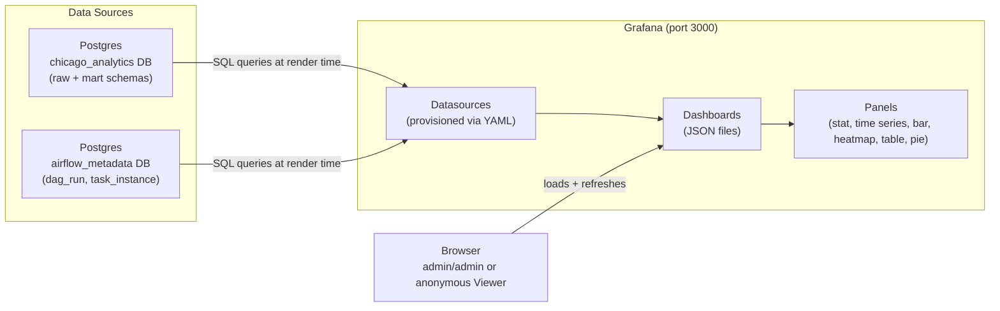

**Why Grafana instead of just querying Postgres directly?**
- **Live dashboards** — auto-refresh every 30s/1m, no manual SQL
- **Visual patterns** — heatmaps show temporal crime patterns, time series show stream ingestion rate, pie charts show DAG run state distribution
- **Single pane of glass** — pipeline health + business analysis in one place
- **Non-technical access** — anonymous Viewer role lets anyone see dashboards without SQL knowledge
- **Alerting via panel thresholds** — Phase 3.4 verified that panel thresholds turning red (e.g., stream freshness > 900s) IS sufficient alerting for local dev. Full Grafana unified alerting (contact points, notification policies, alert rules) is optional — see "Phase 3.2–3.4" section below.

---

## Core Concepts

### Data Source

A **data source** is a connection to an external system Grafana can query. Each data source has a type (Postgres, Prometheus, MySQL, etc.) and connection details (host, database, credentials).

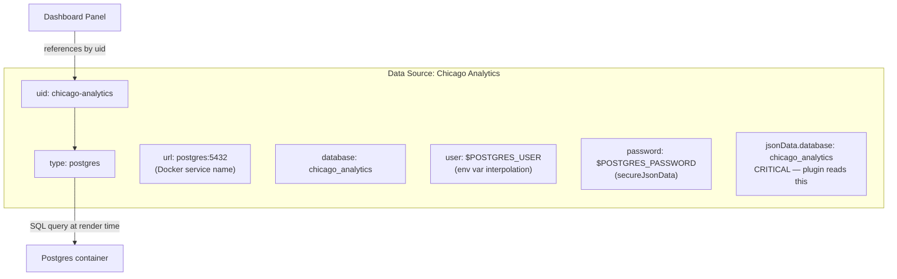

**Key fields in provisioning YAML:**

| Field | Location | Purpose |
|---|---|---|
| `uid` | top-level | Stable identifier panels reference. NEVER changes after creation. |
| `type` | top-level | Plugin type (`postgres`, `prometheus`, etc.) |
| `url` | top-level | Host:port. Docker service name (`postgres:5432`), not localhost. |
| `database` | top-level | Legacy field — works for internal API, NOT for browser plugin. |
| `user` | top-level | Username. Supports `$ENV_VAR` interpolation. |
| `secureJsonData.password` | top-level | Password. Encrypted at rest. Supports `$ENV_VAR`. |
| `jsonData.database` | **jsonData** | **CRITICAL** — Grafana 12.4's Postgres plugin reads the DB name from here, not the top-level `database:` field. |
| `jsonData.sslmode` | jsonData | `disable` for local, `require` for production. |
| `jsonData.postgresVersion` | jsonData | Major version × 100 (e.g., 1600 for Postgres 16). Optimizes query handling. |

> **The #1 gotcha:** Setting `database:` at the top level only works for Grafana's internal API. The browser plugin (what renders panels in the UI) reads `jsonData.database`. Without it, API queries succeed but browser panels show "No data" with console error: `You do not currently have a default database configured for this data source`. **Set BOTH for compatibility.**

### Dashboard

A **dashboard** is a collection of panels arranged on a grid. Each dashboard has:
- A **uid** (stable identifier for URL linking)
- A **title** (human-readable)
- A **time range** (e.g., "last 24h", "last 30d")
- A **refresh interval** (e.g., 30s, 1m)
- **Panels** (the individual visualizations)
- **Templating variables** (optional dropdowns for filtering)

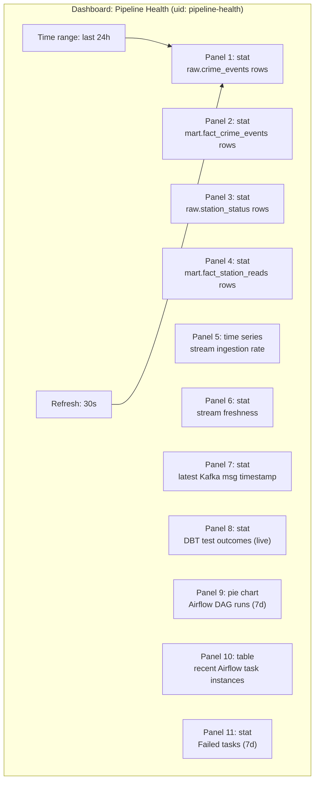

Dashboards are stored as JSON files. Grafana's dashboard provider scans a directory and auto-imports them. This means dashboards are **version-controlled** — no manual UI configuration, fully reproducible from files.

### Panel

A **panel** is a single visualization on a dashboard. Each panel has:
- A **datasource** (referenced by uid)
- A **query** (SQL for Postgres)
- A **visualization type** (stat, time series, bar chart, heatmap, table, pie chart)
- A **title** and **description**
- **Field overrides** (optional — format numbers, rename columns, set units)

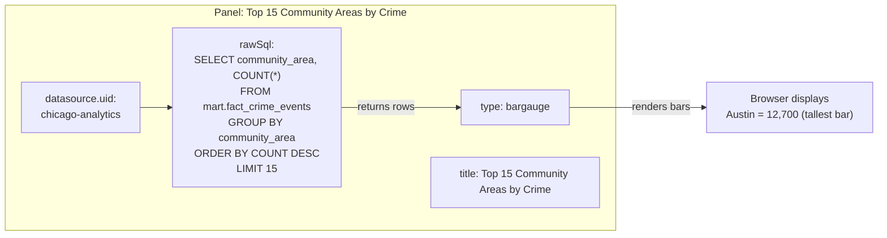

**Panel types we use:**

| Type | What it shows | Example panel |
|---|---|---|
| **stat** | A single big number (with optional sparkline) | `raw.crime_events rows: 263,401` |
| **time series** | Values over time (line chart) | Stream ingestion rate (rows/hour) |
| **bar chart / bargauge** | Horizontal bars comparing categories | Top 15 community areas by crime count |
| **pie chart** | Proportions of a whole | Airflow DAG run states (success/failed/running) |
| **heatmap** | Grid colored by value intensity | Crime heatmap (day × hour), station availability (station × hour) |
| **table** | Rows and columns | Recent Airflow task instances |

### Query

A **query** is the SQL (for Postgres data sources) that fetches data for a panel. Grafana sends the query to the data source at render time and displays the result.

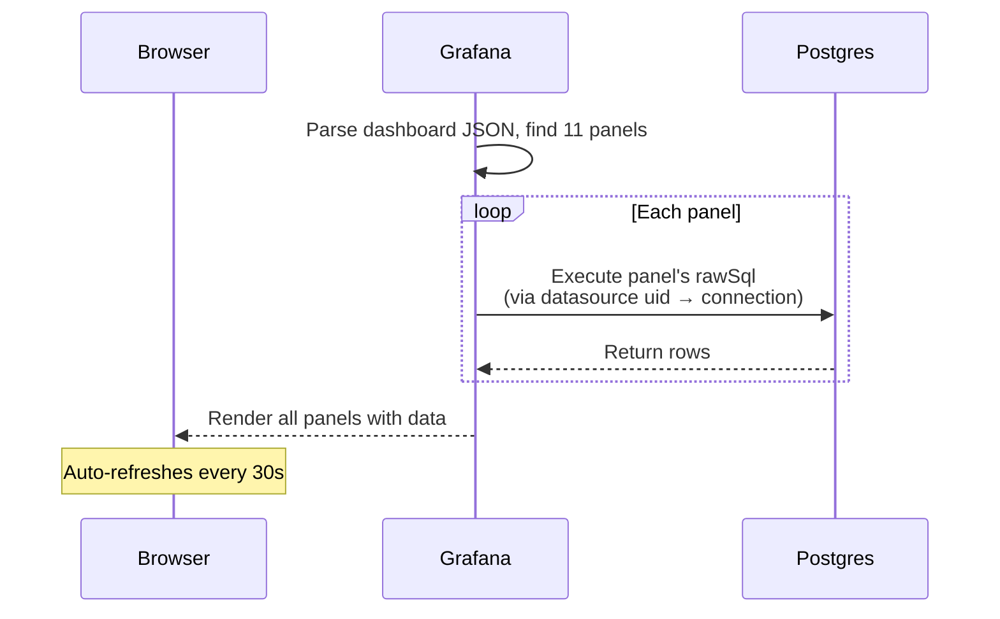

**Postgres query format options:**
- `format: table` — returns rows as a table (good for stat panels with `COUNT(*)`, or table panels)
- `format: time_series` — Grafana expects columns `time` (timestamp) and one or more value columns (good for time series panels)

**Time range filtering:**
Grafana injects `$__timeFilter(column)` macros for time-series queries. Our panels mostly use explicit `WHERE` clauses or no time filter (stat panels with `COUNT(*)` don't need time range).

### Provisioning

**Provisioning** is Grafana's mechanism for loading configuration from files on startup. Instead of manually configuring datasources and dashboards through the UI, you define them in YAML/JSON files that Grafana auto-imports.

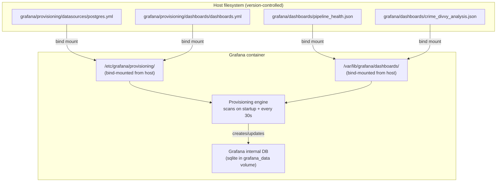

**Why file-based provisioning (not UI config):**
- **Version-controlled** — datasource creds (via env vars) and dashboard layouts are in git
- **Reproducible** — `docker compose up -d` on any machine produces identical dashboards
- **No manual steps** — no clicking through UI to set up datasources
- **Declarative** — the files ARE the source of truth; UI changes get overwritten on restart (by design)

**Two provisioning directories:**

| Directory | Purpose | Our file |
|---|---|---|
| `provisioning/datasources/` | Auto-creates data source connections | `postgres.yml` (2 Postgres datasources) |
| `provisioning/dashboards/` | Tells Grafana where to find dashboard JSONs | `dashboards.yml` (scans `/var/lib/grafana/dashboards/` every 30s) |

> **Gotcha:** Provisioned datasources have `editable: true` in our config (so you can explore in the UI), but changes made in the UI are overwritten on Grafana restart. To make a permanent change, edit the YAML file and recreate the container.

---

## Our Setup

| Component | Value | Why |
|---|---|---|
| Image | `grafana/grafana:12.4.0` | Stable, production-hardened. 13.1.0 is 25 days old (as of 2026-07-18) — too new per "stable versions only" rule. |
| Port | 3000 | Grafana default. No conflict with Airflow (8080) or Spark (8180). |
| Admin creds | `admin` / `admin` (from `.env`) | Dev only. Change in any shared environment. |
| Anonymous access | Enabled, Viewer role | Local dev convenience — dashboards viewable without login. Set `GF_AUTH_ANONYMOUS_ENABLED=false` in shared env. |
| Data persistence | `grafana_data` named volume | Survives container rebuilds. Stores Grafana's internal SQLite DB (users, dashboard versions, preferences). |
| Provisioning | File-based (no UI config) | Datasources + dashboards defined in YAML/JSON, version-controlled. |
| Datasources | 2 (chicago-analytics + airflow-metadata) | One per Postgres database — Postgres can't cross-query databases without `postgres_fdw`. |
| Dashboards | 2 (Pipeline Health + Crime + Divvy Analysis) | One for ops, one for analysis. |

**Why `grafana/grafana` (not `grafana/grafana-oss`)?**
The `grafana-oss` Docker repo was deprecated since Grafana 12.4.0. The `grafana/grafana` image includes Enterprise features (free to use, no license needed for our use case). Using the deprecated image would break on future pulls.

---

## Provisioning — File-Based Config

Grafana auto-loads config from `/etc/grafana/provisioning/` on startup. Two subdirectories:

```
grafana/provisioning/
├── datasources/
│   └── postgres.yml          ← auto-creates Postgres datasources
└── dashboards/
    └── dashboards.yml        ← tells Grafana where to find dashboard JSONs
```

### Datasource Provisioning (`postgres.yml`)

Defines two datasources — one per Postgres database:

| Datasource | uid | Database | Used by |
|---|---|---|---|
| Chicago Analytics | `chicago-analytics` | `chicago_analytics` | Pipeline health + analysis panels (raw + mart schemas) |
| Airflow Metadata | `airflow-metadata` | `airflow_metadata` | Airflow DAG run + task instance panels |

**Why two datasources:** Postgres has *databases* (separate namespaces, no cross-DB queries without `postgres_fdw`). Airflow's metadata lives in `airflow_metadata`, our warehouse in `chicago_analytics`. A single datasource can only point at one database. Grafana panels reference datasources by `uid`, so each panel queries the right DB.

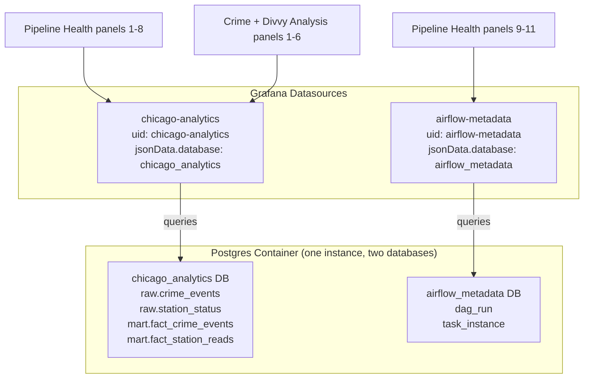

**Critical YAML structure (Grafana 12.4):**

```yaml
datasources:
  - name: Chicago Analytics
    uid: chicago-analytics
    type: postgres
    access: proxy
    url: postgres:5432
    database: chicago_analytics          # legacy field — works for API only
    user: $POSTGRES_USER                 # shell-style env var interpolation
    secureJsonData:
      password: $POSTGRES_PASSWORD
    jsonData:
      sslmode: disable
      database: chicago_analytics        # CRITICAL — plugin reads this
      postgresVersion: 1600
      showDatabase: true
    isDefault: true
    editable: true
```

### Dashboard Provisioning (`dashboards.yml`)

Tells Grafana to scan `/var/lib/grafana/dashboards/` (bind-mounted from `./grafana/dashboards/`) every 30s and auto-import any `*.json` files. Dashboards load into a folder named "Chicago Pipeline".

```yaml
apiVersion: 1
providers:
  - name: "Chicago Pipeline"
    orgId: 1
    folder: "Chicago Pipeline"
    type: file
    disableDeletion: false
    updateIntervalSeconds: 30
    allowUiUpdates: true
    options:
      path: /var/lib/grafana/dashboards
```

- `updateIntervalSeconds: 30` — re-scans the directory every 30s. Edit a JSON file on the host → Grafana picks it up within 30s without restart.
- `folder: "Chicago Pipeline"` — dashboards grouped under this folder in the UI (not scattered in "General").
- `allowUiUpdates: true` — lets you tweak dashboards in the UI for exploration. Changes are saved back to the JSON file. But for permanent changes, edit the file directly.

---

## Environment Variable Interpolation — CRITICAL GOTCHA

Grafana provisioning uses **shell-style** env var syntax: `$VAR` or `${VAR}`.

```yaml
user: $POSTGRES_USER
secureJsonData:
  password: $POSTGRES_PASSWORD
```

**NOT Go templates** (`{{.VAR}}`). Using `{{.POSTGRES_USER}}` causes:

```
Failed to provision data sources: yaml: unmarshal errors:
  line 25: cannot unmarshal !!map into string
```

This is the #1 Grafana provisioning mistake. The error is cryptic — it looks like a YAML syntax error, but the YAML is valid; Grafana's provisioning parser chokes on the `{{}}` syntax.

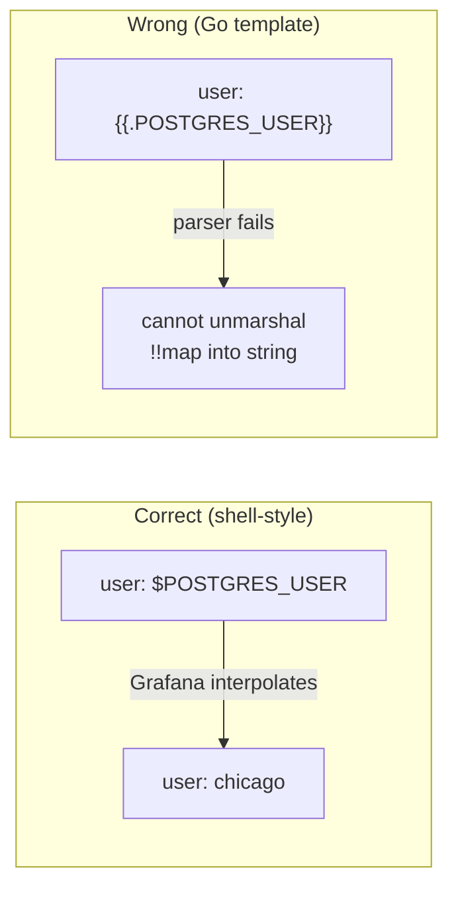

### Env Vars Must Be in the Container

`docker-compose.yml` passes env vars to the Grafana container:

```yaml
grafana:
  environment:
    POSTGRES_USER: ${POSTGRES_USER}
    POSTGRES_PASSWORD: ${POSTGRES_PASSWORD}
    AIRFLOW_DB_USER: ${AIRFLOW_DB_USER}
    AIRFLOW_DB_PASSWORD: ${AIRFLOW_DB_PASSWORD}
```

The provisioning YAML's `$POSTGRES_USER` reads from the *container's* environment, not the host. If the var isn't in the container, the datasource gets `user=` (empty) and fails with:

```
FATAL: no PostgreSQL user name specified in startup packet (SQLSTATE 28000)
```

**Gotcha:** `docker compose restart` does NOT re-read env vars. You must `docker compose up -d grafana` (recreates the container) for new env vars to take effect.

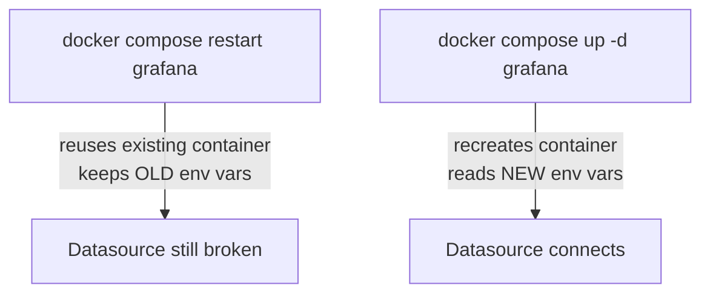

---

## The jsonData.database Gotcha — Deep Dive

This was the hardest bug in Phase 3.1. Here's the full picture:

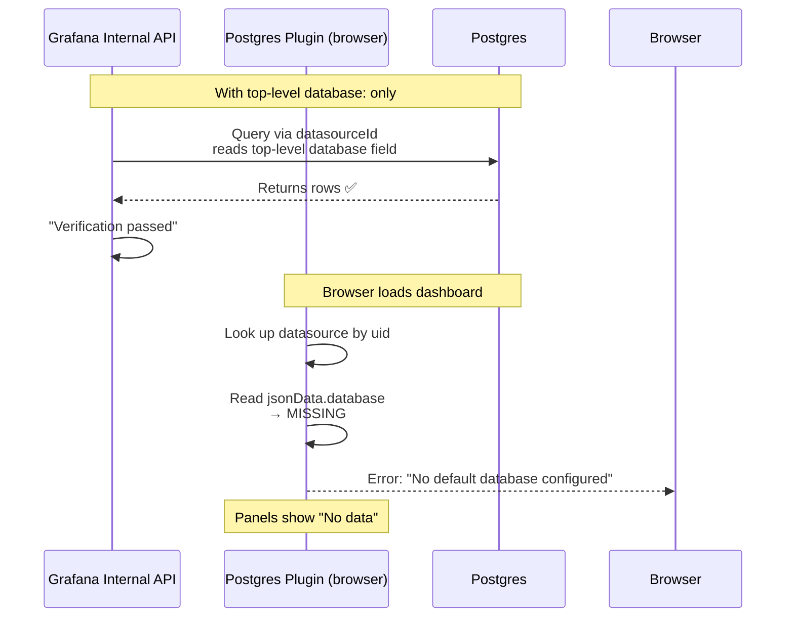

**Why this happens:** Grafana 12.4's Postgres plugin has two code paths:
1. **Internal API** (`/api/ds/query` with `datasourceId`) — reads the top-level `database:` field. Used by `curl` verification scripts.
2. **Browser plugin** (renders panels in the UI) — reads `jsonData.database`. Used by actual dashboard rendering.

**The trap:** You verify with `curl` (path 1) → it works → you think the datasource is fine. Then you open the dashboard in a browser (path 2) → panels show "No data" with a console error. The API verification gave a false positive.

**Fix:** Set `database` in BOTH places:

```yaml
datasources:
  - name: Chicago Analytics
    database: chicago_analytics          # top-level (for internal API)
    jsonData:
      database: chicago_analytics        # jsonData (for browser plugin)
```

**How to verify the browser path works (not just the API):**
```bash
# This query omits datasourceId, forcing the browser plugin path
curl -s -u admin:admin -X POST http://localhost:3000/api/ds/query \
  -H 'Content-Type: application/json' \
  -d '{"queries":[{"refId":"A","datasource":{"uid":"chicago-analytics","type":"postgres"},"format":"table","rawSql":"SELECT COUNT(*) FROM raw.crime_events;"}],"from":"now-1h","to":"now"}'
```

If this returns data, the browser panels will render. If it returns an error, `jsonData.database` is missing.

---

## Dashboards

### Pipeline Health (`pipeline_health.json`, uid: `pipeline-health`)

11 panels monitoring pipeline health:

| # | Panel | Type | Query |
|---|---|---|---|
| 1 | raw.crime_events rows | stat | `SELECT COUNT(*) FROM raw.crime_events` |
| 2 | mart.fact_crime_events rows | stat | `SELECT COUNT(*) FROM mart.fact_crime_events` |
| 3 | raw.station_status rows | stat | `SELECT COUNT(*) FROM raw.station_status` |
| 4 | mart.fact_station_reads rows | stat | `SELECT COUNT(*) FROM mart.fact_station_reads` |
| 5 | Stream ingestion rate (rows/hour) | time series | `date_trunc('hour', ingest_timestamp)` |
| 6 | Stream freshness (seconds since last ingest) | stat | `EXTRACT(EPOCH FROM NOW() - MAX(ingest_timestamp))` — red at 900s |
| 7 | Latest Kafka message timestamp | stat | `MAX(kafka_timestamp)` |
| 8 | DBT test outcomes (latest run) | stat | Live query against `observability.dbt_test_results` (Phase 3.2) — passing/failing/warnings |
| 9 | Airflow DAG runs (last 7 days) | pie chart | `SELECT state, COUNT(*) FROM dag_run` (airflow-metadata datasource) |
| 10 | Recent Airflow task instances | table | `SELECT dag_id, task_id, state, ... FROM task_instance` (airflow-metadata datasource) |
| 11 | Failed tasks (last 7 days) | stat | `SELECT count(*) FROM task_instance WHERE state IN ('failed','upstream_failed')` (Phase 3.3) |

Refresh: 30s. Time range: last 24h.

**What this dashboard tells you at a glance:**
- Are the row counts growing? (panels 1-4) → pipeline is ingesting
- Is the stream live? (panels 5-7) → stream freshness < 60s means live; > 300s means stale
- Are DBT tests passing? (panel 8) → data quality (live — wired to `observability.dbt_test_results` in Phase 3.2)
- Are tasks failing? (panel 11) → Airflow task failures including execution_timeout (Phase 3.3)
- Are DAGs succeeding? (panels 9-10) → orchestration health

### Crime + Divvy Analysis (`crime_divvy_analysis.json`, uid: `crime-divvy-analysis`)

6 panels answering the driving question:

| # | Panel | Type | What it shows |
|---|---|---|---|
| 1 | Top 15 community areas by crime count | bar chart | Where crime concentrates |
| 2 | Top 10 crime types | pie chart | Crime category distribution |
| 3 | Avg vehicles available per station (hourly) | time series | System-wide availability trends |
| 4 | Station availability heatmap | heatmap | Top 20 stations × hour of day, color = avg bikes |
| 5 | Crime vs Divvy ridership proxy (monthly) | time series | THE DRIVING QUESTION — monthly crime count vs avg bikes (proxy; real join needs geospatial matching in Phase 4+) |
| 6 | Crime heatmap (day × hour) | heatmap | Temporal crime patterns |

Refresh: 1m. Time range: last 30d.

**Why "Crime vs Divvy ridership" is a proxy:** GBFS station status doesn't include `community_area_id`. To truly answer "does crime near a station affect ridership?", we need to geospatially match each station's lat/long to a community area polygon, then join crime by area. That's deferred to Phase 4+ (needs PostGIS or BigQuery GIS). For now, we show system-wide avg bikes vs monthly crime count — a correlation proxy, not a causal link.

---

## DAG Run Order — Sensor Handles It (Phase 3.3+)

**Either DAG can be triggered first.** The `crime_batch` DAG has a `SqlSensor` (`wait_for_stream_data`) that gates `dbt_build` on `raw.station_status` existing. If `divvy_stream` hasn't run yet, the sensor waits (up to 1hr, poking every 60s in `reschedule` mode) until the stream table appears.

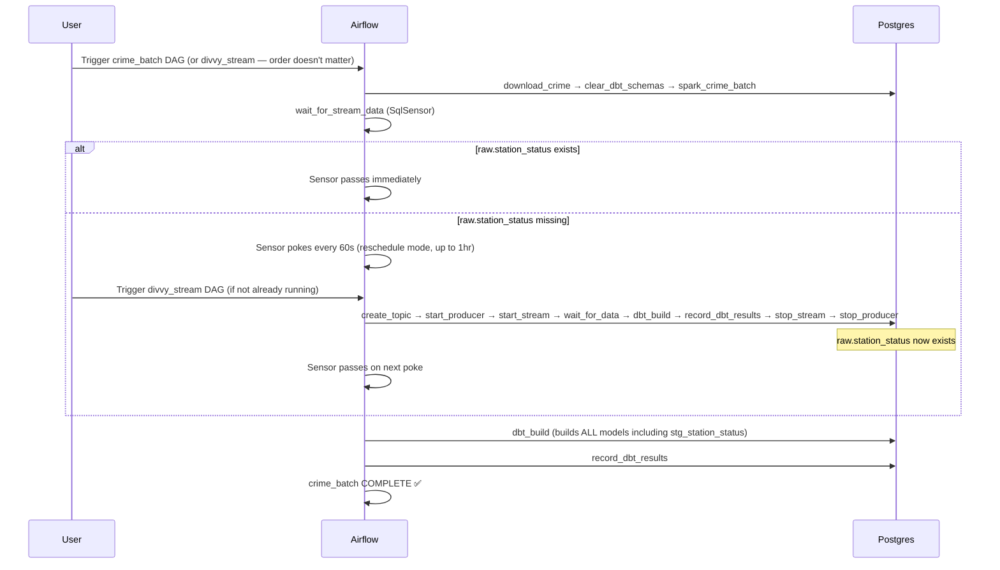

**Why the sensor exists:** `dim_date` spans both crime (2023) + station (2026) sources via UNION ALL. `crime_batch`'s `dbt_build` builds ALL models including `stg_station_status` (depends on `raw.station_status` from `divvy_stream`). Before Phase 3.3, this was a race condition — `dbt_build` would fail on try 1 if `divvy_stream` hadn't run, then succeed on retry. The sensor makes the implicit cross-DAG dependency explicit.

**Task counts (Phase 3.3+):**
- `divvy_stream`: 8 tasks — create_topic → start_producer → start_stream → wait_for_data → dbt_build → record_dbt_results → stop_stream → stop_producer
- `crime_batch`: 6 tasks — download_crime → clear_dbt_schemas → spark_crime_batch → wait_for_stream_data (sensor) → dbt_build → record_dbt_results

**Tip:** To avoid the sensor wait (~1min minimum), trigger `divvy_stream` first. But it's not required — the sensor handles the ordering.

---

## Useful Commands

```bash
# Start Grafana + Postgres only (minimal verification)
docker compose up -d postgres grafana

# Check Grafana health
curl -u admin:admin http://localhost:3000/api/health

# List datasources (verify provisioning worked)
curl -u admin:admin http://localhost:3000/api/datasources | python3 -m json.tool

# List loaded dashboards
curl -u admin:admin http://localhost:3000/api/search | python3 -m json.tool

# Test a datasource query via INTERNAL API (uses top-level database field)
curl -u admin:admin -X POST http://localhost:3000/api/ds/query \
  -H 'Content-Type: application/json' \
  -d '{"queries":[{"refId":"A","datasource":{"uid":"chicago-analytics","type":"postgres"},"format":"table","rawSql":"SELECT COUNT(*) FROM raw.crime_events;","datasourceId":1}],"from":"now-1h","to":"now"}'

# Test a datasource query via BROWSER PLUGIN PATH (uses jsonData.database)
# Omit datasourceId to force the plugin path — this is what the browser does
curl -u admin:admin -X POST http://localhost:3000/api/ds/query \
  -H 'Content-Type: application/json' \
  -d '{"queries":[{"refId":"A","datasource":{"uid":"chicago-analytics","type":"postgres"},"format":"table","rawSql":"SELECT COUNT(*) FROM raw.crime_events;"}],"from":"now-1h","to":"now"}'

# View Grafana logs
docker compose logs grafana --tail 50

# Recreate container after env var or provisioning changes (restart is NOT enough)
docker compose down grafana && docker compose up -d grafana

# Verify jsonData.database is set (the critical field)
curl -u admin:admin http://localhost:3000/api/datasources | python3 -c "import sys,json; d=json.load(sys.stdin); [print(x['name'], '| jsonData.database:', x.get('jsonData',{}).get('database','MISSING')) for x in d]"

# Validate dashboard JSON before loading
python3 -c "import json; json.load(open('grafana/dashboards/pipeline_health.json')); print('valid')"

# Query Airflow metadata directly (for debugging DAG states)
docker compose exec -T postgres psql -U airflow -d airflow_metadata -c "SELECT dag_id, state, start_date, end_date FROM dag_run ORDER BY start_date DESC LIMIT 10;"
```

---

## Common Mistakes to Expect

1. **`{{.VAR}}` instead of `$VAR`** → provisioning fails with "cannot unmarshal !!map into string". Grafana provisioning uses **shell-style** env var interpolation, not Go templates. The error looks like a YAML syntax error but isn't.

2. **Env var not in container** → datasource connects with empty user. Check `docker compose exec grafana printenv | grep POSTGRES`. The provisioning YAML reads from the container's environment, not the host.

3. **`docker compose restart` after env change** → env vars don't update. `restart` reuses the existing container (with old env). Use `docker compose up -d grafana` (or `down` + `up -d`) to recreate the container.

4. **Cross-database queries** → Postgres can't query `other_db.table` without `postgres_fdw`. Provision a **second datasource** per database. Our project needs two: `chicago-analytics` (warehouse) + `airflow-metadata` (Airflow DB).

5. **Dashboard JSON not loading** → check `dashboards.yml` path matches the bind mount (`/var/lib/grafana/dashboards/`), and the JSON is valid (`python3 -c "import json; json.load(open('file.json'))"`).

6. **`grafana/grafana-oss` image** → deprecated since 12.4.0. Use `grafana/grafana` (includes Enterprise features, free to use).

7. **`database:` only at top level, not in `jsonData`** → Grafana 12.4's Postgres plugin reads the DB name from `jsonData.database`. The top-level `database:` field works for the internal API but the browser plugin requires `jsonData.database`. **Symptom:** API queries succeed (curl returns data) but browser panels show "No data" with console error: `You do not currently have a default database configured for this data source`. **Fix:** Set `database` in BOTH the top-level and `jsonData:` blocks.

8. **Verifying with curl only (false positive)** → The internal API (`/api/ds/query` with `datasourceId`) uses the top-level `database:` field and will succeed even when `jsonData.database` is missing. To verify the browser path, omit `datasourceId` from the query (see Useful Commands above). Always verify in the browser too.

9. **Running crime_batch before divvy_stream** → ~~`crime_batch`'s `dbt_build` fails on try 1 because `stg_station_status` depends on `raw.station_status` (created by `divvy_stream`). Run `divvy_stream` first, then `crime_batch`.~~ **FIXED in Phase 3.3** — `crime_batch` now has a `SqlSensor` (`wait_for_stream_data`) that gates `dbt_build` on `raw.station_status` existing. You can trigger either DAG first; the sensor waits (up to 1hr) for the stream table. See "DAG Run Order" section above.

10. **Stale browser cache after Grafana version change** → after recreating the Grafana container, hard-refresh the browser (`Ctrl + Shift + R`) to clear cached assets. Otherwise panels may show old errors or fail to render.

---

## How Grafana Fits in the Pipeline

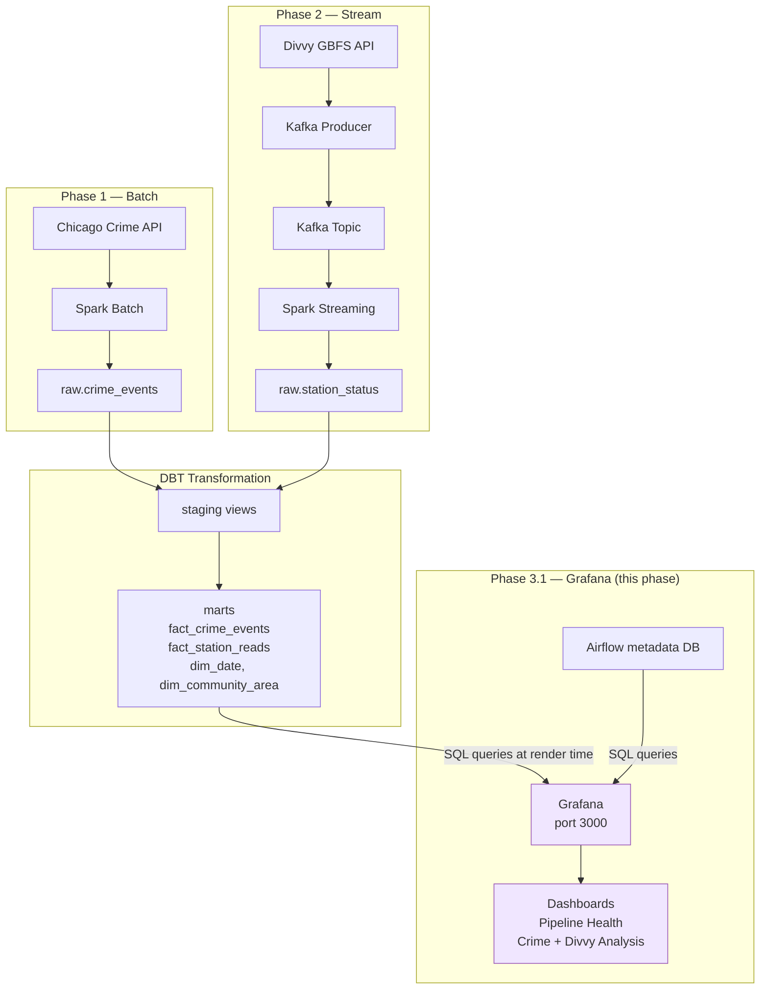

Grafana is the **read layer** — it sits at the end of the pipeline and queries the marts (and Airflow's metadata DB) to visualize results. It doesn't transform or store data; it only reads. This makes it safe to experiment with — adding or removing dashboards never affects the pipeline itself.

---

## Phase 3.2–3.4 — DBT Test Panel + Failed Tasks Panel + Verification

### DBT test outcomes panel (id 8) — Phase 3.2

Rewired from static `SELECT 59 AS dbt_tests_passing` to a live query against `observability.dbt_test_results`:

```sql
WITH latest AS (
  SELECT invocation_id FROM observability.dbt_test_results
  ORDER BY recorded_at DESC LIMIT 1
)
SELECT
  SUM(CASE WHEN status='pass' THEN 1 ELSE 0 END) AS passing,
  SUM(CASE WHEN status='fail' THEN 1 ELSE 0 END) AS failing,
  SUM(CASE WHEN status='warn' THEN 1 ELSE 0 END) AS warnings
FROM observability.dbt_test_results
WHERE invocation_id = (SELECT invocation_id FROM latest);
```

Field overrides: Passing=green, Failing=red (≥1), Warnings=neutral. The `observability` schema is a dedicated schema for pipeline metadata (separate from `raw`/`staging`/`mart`), created idempotently by `airflow/scripts/record_dbt_results.py`.

### Failed tasks panel (id 11) — Phase 3.3

Queries the Airflow metadata DB for failed/upstream_failed tasks:

```sql
SELECT count(*) AS failed_tasks
FROM task_instance
WHERE state IN ('failed', 'upstream_failed')
  AND start_date > NOW() - INTERVAL '7 days';
```

Originally planned as an "SLA misses" panel (querying `dag_warning` for `warning_type='sla_miss'`), but Airflow 3.0 removed the SLA feature entirely — `sla=` is a no-op, no SLA misses are recorded. Switched to failed tasks, which includes `execution_timeout` failures.

### Panel thresholds as alerts — Phase 3.4

For a local dev learning project, **panel thresholds turning red IS the alert**. Grafana's unified alerting system (contact points, notification policies, alert rules via `provisioning/alerting/`) is overkill — it adds files and complexity without teaching anything new at this stage. The panel threshold (e.g., stream freshness > 900s → red) provides the same observable signal.

Full unified alerting would be a bonus feature if you want to learn Grafana's alerting pipeline specifically. The provisioning directory would be `grafana/provisioning/alerting/` with `contactpoints.yml`, `policies.yml`, and alert rules defined in the dashboard JSON or separate rule files.

### Verification approach — Phase 3.4

Three scenarios to verify observability catches failures:

| Scenario | Break | Panel that catches it | Threshold |
|---|---|---|---|
| Stream freshness | Stop the producer | id 6 "Stream freshness" | > 900s (15min) → red |
| DBT test failure | Inject bad data (out-of-bounds lat/lon) | id 8 "DBT test outcomes" | failing > 0 → red |
| Task failure | Throwaway DAG with `exit 1` | id 11 "Failed tasks" | failed_tasks > 0 → red |

Key: break the pipeline, confirm the panel turns red, restore the pipeline, confirm it turns green. The Grafana API (`/api/ds/query`) can verify panel queries return the expected values without needing the browser.

---

**← Previous:** [dbt](dbt.md) | **Next:** [gcp](gcp.md) →
