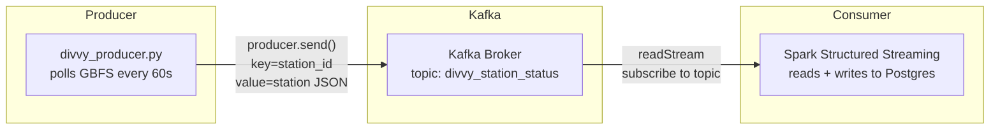
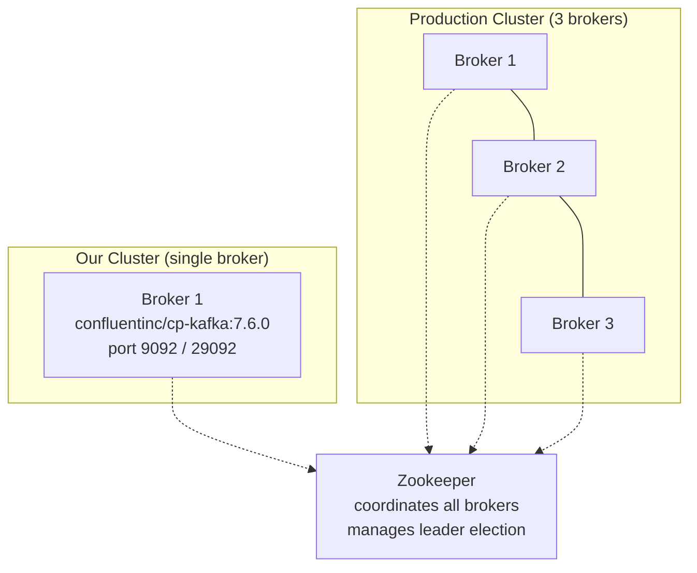
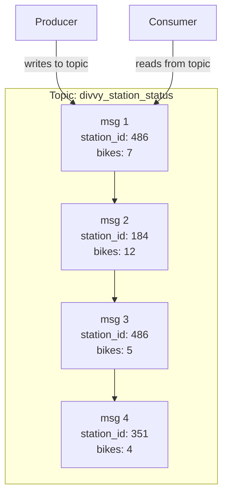
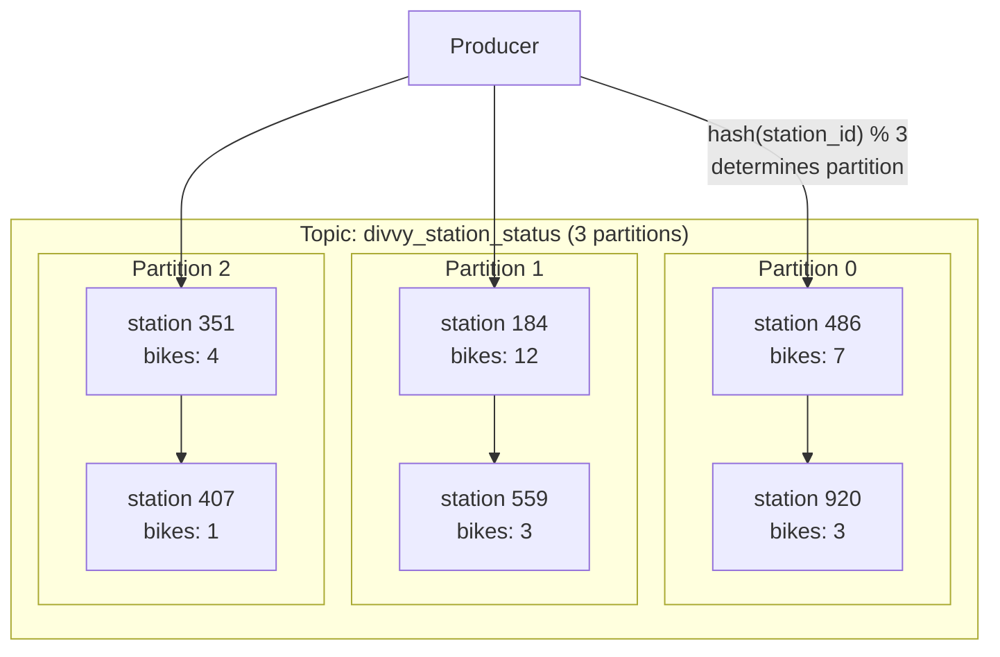
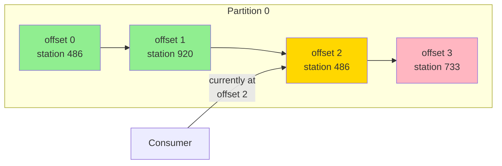
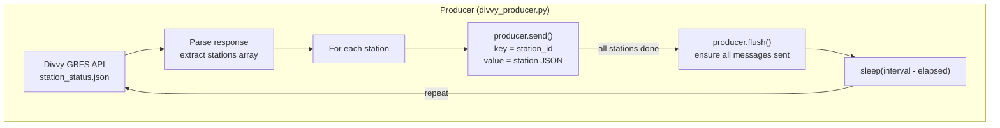
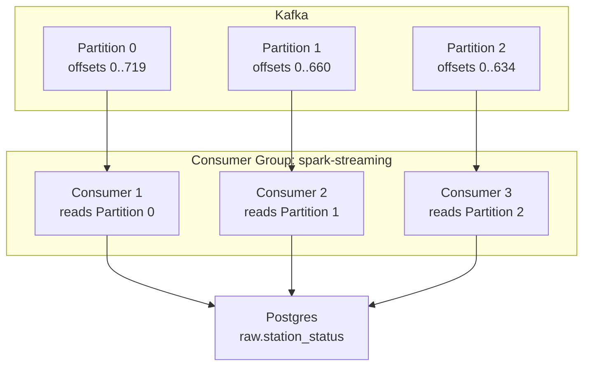
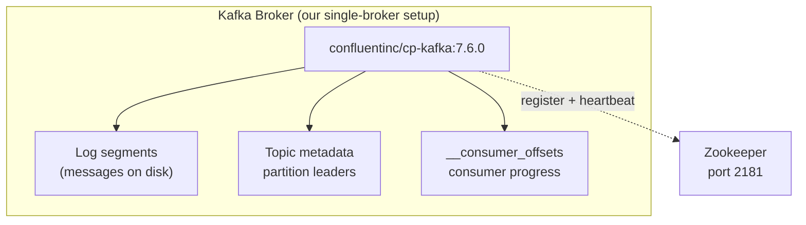
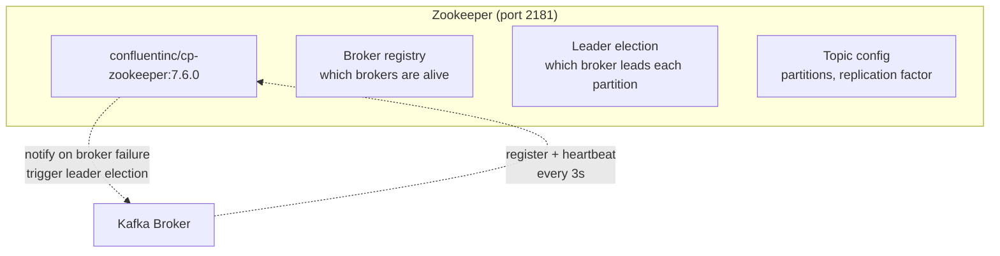
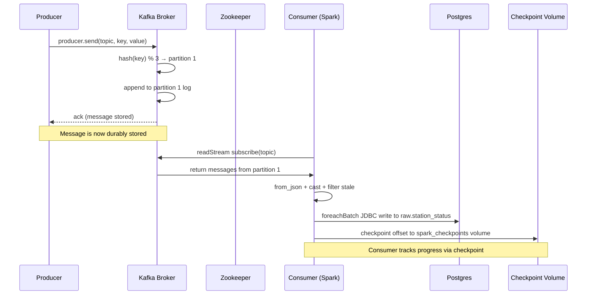

# Kafka

## What Is Kafka?

Kafka is a **distributed event streaming platform**. Think of it as a message bus that sits between data producers and data consumers. Producers write messages to Kafka; consumers read them. Kafka stores messages durably (on disk) and replays them on demand.

In our pipeline, Kafka sits between the Divvy GBFS API (producer) and Spark Structured Streaming (consumer):



**Why Kafka instead of direct API → Postgres?**
- **Decoupling** — producer and consumer run independently at their own pace
- **Buffer** — if Spark is down, Kafka stores messages; Spark catches up when it restarts
- **Replay** — Kafka stores messages for days; you can re-process old data if your logic changes
- **Multiple consumers** — different services can read the same stream independently (e.g., Spark for Postgres, a separate consumer for alerts)

---

## Core Concepts

### Cluster

A Kafka **cluster** is a group of Kafka servers (brokers) working together. Our setup has a single broker — fine for learning. Production clusters typically have 3+ brokers for fault tolerance.



**Zookeeper's role in the cluster:**
- Tracks which brokers are alive (heartbeat)
- Elects a "controller" broker (manages partition leader election)
- Stores topic configuration (partitions, replication factor)
- If a broker dies, Zookeeper triggers leader election for its partitions

> **KRaft mode** (Kafka 3.x+) eliminates Zookeeper by embedding metadata management directly in Kafka. We use Zookeeper because it's the traditional setup and most existing deployments still use it.

### Topic

A **topic** is a named category/stream of messages. Think of it like a table in a database, but instead of rows, it holds an append-only log of messages.



**Key properties:**
- **Append-only** — messages are added at the end, never modified or deleted (until retention expires)
- **Ordered within partition** — messages in the same partition arrive in the order they were written
- **Retained** — messages persist on disk for a configurable period (default 7 days), even after consumption
- **Multiple producers, multiple consumers** — many producers can write to the same topic; many consumers can read from it

Our topic: `divvy_station_status` — one message per station per poll cycle (~2,016 messages every 60 seconds).

### Partition

A **partition** is a unit of parallelism within a topic. Each partition is an ordered, append-only log. A topic with 3 partitions can be read by 3 consumers in parallel.



**How partitioning works:**
1. Producer sends a message with a **key** (e.g., `station_id = "486"`)
2. Kafka computes `hash(key) % num_partitions` to determine the partition
3. Same key → same partition → **messages for a given station are always in order**

**Why partitioning matters:**
- **Parallelism** — each partition can be read by a separate consumer thread
- **Ordering** — messages within a partition are ordered; across partitions, no ordering guarantee
- **Throughput** — 3 partitions = 3x read parallelism for Spark Streaming

**Our setup:** 3 partitions. The `station_id` key ensures all readings for a station go to the same partition, preserving chronological order. Verified distribution: 720/661/635 messages across partitions 0/1/2.

### Offset

An **offset** is a sequential ID assigned to each message within a partition. It's the consumer's bookmark — "I've read up to offset 720."



**Key points:**
- Offsets are **per-partition** — partition 0 and partition 1 have independent offset sequences
- Offstarts at 0 and increments by 1
- Consumers **commit** offsets to Kafka (stored in `__consumer_offsets` topic) — this is how they track progress
- If a consumer restarts, it resumes from its last committed offset
- Spark Structured Streaming uses **checkpointing** (stored on disk) instead of offset commits — more robust for streaming

### Producer

A **producer** sends messages to Kafka topics. Our producer is `kafka/producers/divvy_producer.py`.



**Producer configuration choices:**
| Setting | Our value | What it does |
|---|---|---|
| `acks` | `"all"` | Wait for all in-sync replicas to acknowledge. Safest delivery guarantee. |
| `key_serializer` | UTF-8 encode | Converts string key to bytes |
| `value_serializer` | JSON → UTF-8 | Converts dict to JSON string to bytes |
| `retries` | 3 | Retry on transient failures |
| `retry_backoff_ms` | 500 | Wait 0.5s between retries |

**Message key vs value:**
- **Key** (`station_id`) — determines partition assignment. Same key → same partition → ordered.
- **Value** (full station JSON) — the actual data payload.

### Consumer

A **consumer** reads messages from Kafka topics. Our consumer is Spark Structured Streaming (`spark/jobs/divvy_stream.py`, built in Phase 2.4).



**Consumer groups:**
- Consumers in the **same group** split partitions among themselves — each partition is read by exactly one consumer in the group
- Consumers in **different groups** each get all messages independently
- Our Spark Streaming job is its own consumer group — it gets all messages from all 3 partitions

**Consumer offset management — two approaches:**

| Approach | How it works | Who uses it | Pros | Cons |
|---|---|---|---|---|
| **Kafka-committed offsets** | Consumer commits "I've read up to offset N" to `__consumer_offsets` topic | Standard Kafka consumers | Standard, lightweight | Only stores offset, not query state |
| **Spark checkpointing** | Spark stores offsets + query state in a checkpoint directory on disk | Spark Structured Streaming | More robust — stores full query state (not just offsets). Survives consumer restarts | Requires a persistent volume; checkpoint dir must be owned by the Spark user |

**How Spark Structured Streaming consumes from Kafka (Phase 2.4):**

1. `readStream.format("kafka")` — subscribes to the topic, reads new messages as they arrive
2. Each message arrives as a row with: `key` (binary), `value` (binary), `partition`, `offset`, `timestamp`
3. Spark converts `value` from binary to string, then `from_json()` parses it into typed columns
4. Transformations (cast, filter) are applied to the parsed DataFrame
5. `foreachBatch` writes each micro-batch to Postgres via JDBC
6. After each batch, Spark checkpoints its progress (offsets per partition) to the `spark_checkpoints` volume
7. If the stream restarts, it resumes from the last checkpointed offset — no duplicates, no data loss

**Key Spark-Kafka configuration options:**

| Option | Our value | What it does |
|---|---|---|
| `kafka.bootstrap.servers` | `kafka:9092` | Docker network address of the Kafka broker |
| `subscribe` | `divvy_station_status` | Topic to subscribe to |
| `startingOffsets` | `earliest` | Start reading from the beginning of the topic (first run). On restart, checkpoint overrides this. |
| `failOnDataLoss` | `false` | Don't crash if messages are missing (e.g., topic retention expired). Log a warning instead. |
| `checkpointLocation` | `/opt/spark/checkpoints/divvy_stream` | Directory storing offsets + query state for fault recovery |

**Why checkpointing matters:**
Without checkpoints, a Spark Streaming restart re-reads ALL messages from `earliest` — causing massive duplicates in Postgres. The checkpoint stores the last consumed offset per partition, so the stream resumes exactly where it left off.

**Checkpoint volume ownership gotcha:**
Spark runs as user `spark` (UID 185), but Docker named volumes inherit ownership from the image directory on first creation. If the directory is root-owned, the volume will be root-owned too, and Spark can't create the checkpoint subdirectory. Fix: create the directory with correct ownership in the Dockerfile BEFORE the volume mounts:
```dockerfile
RUN mkdir -p /opt/spark/checkpoints && chown spark:spark /opt/spark/checkpoints
```

### Broker

A **broker** is a single Kafka server. It stores partitions, serves producer and consumer requests, and replicates data to other brokers.



**What the broker stores:**
- **Log segments** — the actual messages, stored as append-only files on disk (`/var/lib/kafka/data`)
- **Topic metadata** — which partitions exist, who is the leader for each
- **`__consumer_offsets`** — internal topic tracking consumer group positions
- **`__transaction_state`** — internal topic for transactional producers

**Our broker config highlights:**
- `KAFKA_AUTO_CREATE_TOPICS_ENABLE: "true"` — topics created on first message (dev convenience)
- `KAFKA_OFFSETS_TOPIC_REPLICATION_FACTOR: 1` — single broker, can't replicate
- Two listeners: `kafka:9092` (Docker network) + `localhost:29092` (host)

### Zookeeper

**Zookeeper** is a coordination service that Kafka uses for broker management, leader election, and topic configuration.



**What Zookeeper does:**
1. **Broker registry** — brokers register with ZK on startup and send heartbeats every 3 seconds
2. **Leader election** — if a broker dies, ZK detects the missing heartbeat and elects a new partition leader
3. **Topic configuration** — stores how many partitions each topic has, replication factor, etc.
4. **Controller election** — one broker is the "controller" (manages partition leadership changes); ZK elects it

**Why not KRaft?**
Kafka 3.x+ can run without Zookeeper (KRaft mode stores metadata in a Kafka topic instead). We use Zookeeper because:
- More educational — understanding ZK helps when debugging production Kafka
- Most existing deployments still use ZK
- KRaft is newer and less battle-tested in production

---

## How a Message Flows Through Kafka

End-to-end journey of a single station status message:



**Step by step:**
1. Producer fetches GBFS data, serializes station as JSON
2. Producer calls `producer.send("divvy_station_status", key=station_id, value=station_json)`
3. Kafka computes `hash(station_id) % 3` → picks a partition (e.g., partition 1)
4. Kafka appends the message to partition 1's log on disk
5. Kafka sends an ack back to the producer (`acks="all"` → waits for all replicas)
6. Consumer (Spark `divvy_stream.py`) reads from the partition via `readStream.format("kafka")`
7. Spark parses JSON (`from_json`), casts types (int→boolean, epoch→timestamp), filters stale stations
8. Spark writes the micro-batch to Postgres `raw.station_status` via `foreachBatch` + JDBC
9. Spark checkpoints its offset to `/opt/spark/checkpoints/divvy_stream` — if it restarts, it resumes from here

---

## Our Setup (Phase 2.2 + 2.3 + 2.4)

| Component | Image | Version | Purpose |
|---|---|---|---|
| Zookeeper | `confluentinc/cp-zookeeper:7.6.0` | Confluent 7.6.0 | Kafka coordination (broker metadata, leader election) |
| Kafka | `confluentinc/cp-kafka:7.6.0` | Confluent 7.6.0 | Broker — producers write, consumers read |
| Producer | `kafka/producers/divvy_producer.py` | Host Python | Polls GBFS every 60s, publishes to topic |
| Consumer | `spark/jobs/divvy_stream.py` | `apache/spark:3.5.1` + Kafka connector | Structured Streaming: reads topic → parses JSON → writes to Postgres |
| Checkpoint | `spark_checkpoints` named volume | Docker volume | Persists Kafka offsets for Spark fault recovery |

- **Topic:** `divvy_station_status` (3 partitions, replication factor 1)
- **Auto-create topics:** enabled (but we create explicitly for custom partition count)
- **Listeners:**
  - `PLAINTEXT://kafka:9092` — internal Docker network (Spark, producer in Docker)
  - `PLAINTEXT_HOST://localhost:29092` — host machine (producer on host, console consumer testing)
- **Zookeeper port:** 2181 (internal only, not exposed to host)
- **Data volumes:** `kafka_data`, `zookeeper_data`, `zookeeper_log` (named volumes, persist across restarts)
- **Message rate:** ~2,016 messages per 60s poll (one per station)

### Why Confluent images (not Bitnami)?
Bitnami moved behind a commercial subscription in 2026. Confluent Platform images (`confluentinc/cp-*`) are free, stable, and production-hardened. Version 7.6.0 is pinned (not `latest`) for reproducibility.

### Why Zookeeper (not KRaft)?
Kafka 3.x+ can run without Zookeeper using KRaft mode. But learning Zookeeper first is more educational — most existing Kafka deployments still use it, and understanding ZK helps when debugging broker coordination issues.

### Single-broker overrides
Three Kafka settings MUST be overridden for a single-broker setup (defaults assume 3 brokers):
```yaml
KAFKA_OFFSETS_TOPIC_REPLICATION_FACTOR: 1          # default 3
KAFKA_TRANSACTION_STATE_LOG_REPLICATION_FACTOR: 1   # default 3
KAFKA_TRANSACTION_STATE_LOG_MIN_ISR: 1              # default 2
```
Without these, Kafka fails to create internal topics (`__consumer_offsets`, `__transaction_state`) and consumers can't commit offsets.

### Topic creation: explicit vs auto-create
- **Auto-create** (`KAFKA_AUTO_CREATE_TOPICS_ENABLE: "true"`) — Kafka creates a topic on first message, but uses broker defaults (1 partition, replication factor 1)
- **Explicit creation** — `kafka-topics --create --partitions 3` gives you control over partition count
- `KAFKA_NUM_PARTITIONS` env var does NOT work with Confluent images (confirmed in Phase 2.3 — `server.properties` still showed `num.partitions=1`)
- **Lesson:** Always create topics explicitly when you need custom partition counts. Auto-create is a fallback, not a configuration mechanism.

---

## Useful Commands

```bash
# All commands run inside the kafka container:
# docker compose exec kafka <command>

# List topics
kafka-topics --list --bootstrap-server localhost:9092

# Create a topic (3 partitions, replication factor 1)
kafka-topics --create --topic divvy_station_status \
  --partitions 3 --replication-factor 1 \
  --bootstrap-server localhost:9092

# Describe a topic (see partitions, leaders, replicas)
kafka-topics --describe --topic divvy_station_status \
  --bootstrap-server localhost:9092

# Delete a topic
kafka-topics --delete --topic divvy_station_status \
  --bootstrap-server localhost:9092

# Check message counts per partition (offsets = latest offset = message count)
kafka-run-class kafka.tools.GetOffsetShell --topic divvy_station_status \
  --bootstrap-server localhost:9092

# Consume from a topic (terminal, from beginning)
kafka-console-consumer --bootstrap-server localhost:9092 \
  --topic divvy_station_status --from-beginning

# Consume with a max message count (useful for testing)
kafka-console-consumer --bootstrap-server localhost:9092 \
  --topic divvy_station_status --from-beginning --max-messages 5

# Consume with key displayed
kafka-console-consumer --bootstrap-server localhost:9092 \
  --topic divvy_station_status --from-beginning \
  --property print.key=true --property key.separator=" : "

# Produce to a topic (terminal, type messages + Ctrl-D)
kafka-console-producer --bootstrap-server localhost:9092 \
  --topic divvy_station_status

# Pipe a single JSON message (non-interactive)
echo '{"key":"value"}' | kafka-console-producer \
  --bootstrap-server localhost:9092 --topic divvy_station_status

# Run the Divvy producer (from host, not inside container)
python kafka/producers/divvy_producer.py --once           # single poll (test)
python kafka/producers/divvy_producer.py --interval 30    # poll every 30s
python kafka/producers/divvy_producer.py --bootstrap kafka:9092  # inside Docker

# Run the Spark Structured Streaming consumer (from host via docker compose)
docker compose exec spark-master /opt/spark/bin/spark-submit \
    --master local[*] /opt/spark/jobs/divvy_stream.py --once   # single batch (test)
docker compose exec spark-master /opt/spark/bin/spark-submit \
    --master local[*] /opt/spark/jobs/divvy_stream.py          # continuous (60s batches)

# Verify data is flowing into Postgres
docker compose exec postgres psql -U chicago -d chicago_analytics \
    -c "SELECT COUNT(*) FROM raw.station_status;"              # should grow over time

---

---

**← Previous:** [spark](spark.md) | **Next:** [airflow](airflow.md) →
